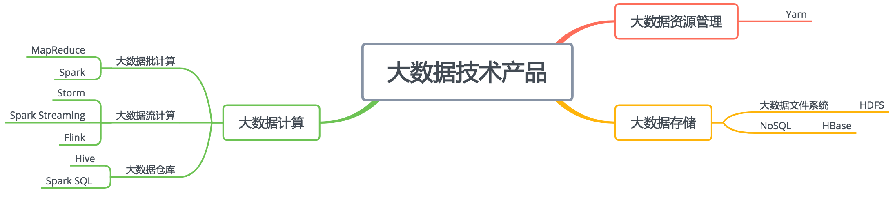
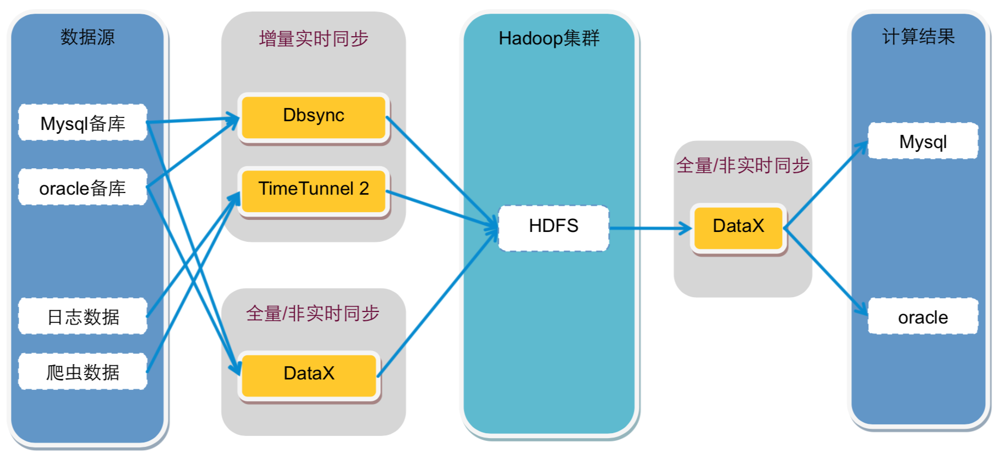
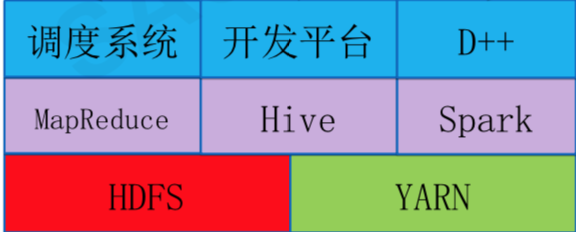

# 从0开始学大数据 #

开篇词

## 开篇词 | 为什么说每个软件工程师都应该懂大数据技术？ ##

软件编程技术出现已经半个多世纪了，核心价值就是**把现实世界的业务操作搬到计算机上，通过计算机软件和网络进行业务和数据处理**。

1. 大数据技术和机器学习技术
2. 人工智能 AI 技术

预习模块

## 预习01 | 大数据技术发展史：大数据的前世今生 ##

我们常说的大数据技术，其实起源于 Google 在 2004 年前后发表的三篇论文，也就是我们经常听到的“三驾马车”，分别是分布式文件系统 GFS、大数据分布式计算框架 MapReduce 和 NoSQL 数据库系统 BigTable。

搜索引擎主要就做两件事情，一个是网页抓取，一个是索引构建，而在这个过程中，有大量的数据需要存储和计算。这“三驾马车”其实就是用来解决这个问题的，你从介绍中也能看出来，一个文件系统、一个计算框架、一个数据库系统。

1. 使用 Hadoop 进行大数据存储与计算
2. 可以用 Pig 脚本描述要对大数据集上进行的操作，Pig 经过编译后会生成 MapReduce 程序，然后在 Hadoop 上运行；编写 Pig 脚本虽然比直接 MapReduce 编程容易，但是依然需要学习新的脚本语法。
3. Hive 支持使用 SQL 语法来进行大数据计算

**大数据生态体系**逐渐形成，其中包括：

* 专门将关系数据库中的数据导入导出到 Hadoop 平台的 Sqoop；
* 针对大规模日志进行分布式收集、聚合和传输的 Flume；
* MapReduce 工作流调度引擎 Oozie 等。
* 在 Hadoop 早期，MapReduce 既是一个执行引擎，又是一个资源调度框架，服务器集群的资源调度管理由 MapReduce 自己完成。但是这样不利于资源复用，也使得 MapReduce 非常臃肿。于是一个新项目启动了，将 MapReduce 执行引擎和资源调度分离开来，这就是 Yarn。2012 年，Yarn 成为一个独立的项目开始运营，随后被各类大数据产品支持，成为大数据平台上最主流的资源调度系统。
* MapReduce 每执行一次 Map 和 Reduce 计算都需要重新启动一次作业，带来大量的无谓消耗。还有一点就是 MapReduce 主要使用磁盘作为存储介质。Spark。
	* MapReduce、Spark 这类计算框架处理的业务场景都被称作**批处理计算**，
	* 历史数据，所以这类计算也被称为**大数据离线计算**
	* 大数据流计算，需要对实时产生的大量数据进行即时计算，比如对于遍布城市的监控摄像头进行人脸识别和嫌犯追踪。
	* 大数据实时计算，流式计算要处理的数据是实时在线产生的数据。

**大数据处理的主要应用场景包括数据分析、数据挖掘与机器学习**。数据分析主要使用 Hive、Spark SQL 等 SQL 引擎完成；数据挖掘与机器学习则有专门的机器学习框架 TensorFlow、Mahout 以及 MLlib 等，内置了主要的机器学习和数据挖掘算法。

大数据要存入分布式文件系统（HDFS），要有序调度 MapReduce 和 Spark 作业执行，并能把执行结果写入到各个应用系统的数据库中，还需要有一个**大数据平台**整合所有这些大数据组件和企业应用系统。

图中的所有这些框架、平台以及相关的算法共同构成了大数据的技术体系，对大数据技术原理和应用算法构建起完整的知识体系，进可以专职从事大数据开发，退可以在自己的应用开发中更好地和大数据集成，掌控自己的项目。

### 思考题 ###

你从大数据生态的发展史中，能得出什么样的结论？又有怎样的思考？

### 精选留言 ###

**1**

通过从数据库，日志等获取的数据，sqoop,flume导入到大数据产品HDFS储存。Mapreduce,spark对储存的数据进行批计算处理，flink,storm等进行实时处理。Yarn负责对数据的资源调度。

计算框架将处理好的数据储存在数据库中，用Hive和Tensorflow等对数据进行分析和机器学习，最后将得到的结果展示在应用产品中或供他人参考。在整个平台过程中，资源调度管理系统对过程的执行先后进行管理。

回到老师的问题，我通过阅读认为，知识技术的发展离不开数据本身的飞速扩大，正是因为有了海量的数据需要google进行储存和索引排名，还会有分布式文件存储系统和计算框架，进一步在此基础上完善了大数据产品，形成大数据技术体系。对我的思考是既然大数据平台已经完成，接下来机器学习会飞速发展，因为数据量的巨大，里面的价值会是巨大的。我们要做的也许是跟上这个时代的节奏，有一点点嗅觉的发现，然后不放弃的做自身认为是对的事吧。

## 预习02 | 大数据应用发展史：从搜索引擎到人工只能 ##

### 大数据应用的搜索引擎时代 ###

将数千台服务器上的数万块磁盘统一管理起来，然后当作一个文件系统，统一存储所有这些网页文件。

### 大数据应用的数据仓库时代 ###

Hive 可以在 Hadoop 上进行 SQL 操作，实现数据统计与分析。也就是说，**我们可以用更低廉的价格获得比以往多得多的数据存储与计算能力**。把运行日志、应用采集数据、数据库数据放到一起进行计算分析，获得以前无法得到的数据结果，企业的数据仓库也随之呈指数级膨胀。

### 大数据应用的数据挖掘时代 ###

在商业环境中，如何解读这种关系并不重要，重要的是它们之间只要存在关联，就可以进行**关联分析**，最终目的是让用户尽可能看到想购买的商品。

除了商品和商品有关系，还可以利用人和人之间的关系推荐商品。如果两个人购买的商品有很多都是类似甚至相同的，不管这两个人天南海北相隔多远，他们一定有某种关系，比如可能有差不多的教育背景、经济收入、兴趣爱好。根据这种关系，可以进行关联推荐，让他们看到自己感兴趣的商品。

### 大数据应用的机器学习时代 ###

在过去，我们受数据采集、存储、计算能力的限制，只能通过抽样的方式获取小部分数据，无法得到完整的、全局的、细节的规律。**而现在有了大数据，可以把全部的历史数据都收集起来，统计其规律，进而预测正在发生的事情**。

### 小结 ###

**大数据从搜索引擎到机器学习，发展思路其实是一脉相承的，就是想发现数据中的规律并为我们所用**。

数据中蕴藏着价值已经是众所周知的事情了，那么如何从这些庞大的数据中发掘出我们想要的知识价值，这正是大数据技术目前正在解决的事情，包括大数据存储与计算，也包括大数据分析、挖掘、机器学习等应用。

### 思考题 ###

通过统计历史数据的规律进行机器学习，这样的例子还有很多，比如统计人的驾驶行为进行机器学习，就是无人驾驶；统计股票的历史交易数据进行机器学习，就得到量化交易系统。你还能想到哪些可以进行机器学习的例子？

## 预习03 | 大数据应用领域：数据驱动一切 ##

大数据典型的应用场景分析

### 大数据在医疗健康领域的应用 ###

**医疗健康领域里很多工作依赖人的经验，而这正是机器学习的强项**。

#### 1. 医学影像智能识别 ####

图像识别是机器学习获得的重大突破之一，使用大量的图片数据进行深度机器学习训练，机器可以识别出特定的图像元素，比如猫或者人脸，当然也可以识别出病理特征。

#### 2. 病历大数据智能诊疗 ####

病历，特别是专家写的病历，本身就是一笔巨大的知识财富，利用大数据技术将这些知识进行处理、分析、统计、 挖掘，可以构成一个病历知识库，可以分享给更多人，即构成一个智能辅助诊疗系统。

针对同类疾病和其他上下文信息（化验结果、病史、年龄性别、病人回访信息等）可以挖掘出针对同样的疾病情况，哪种治疗手段可以用更低的治疗成本、更少的病人痛苦，获得更好的治疗效果。

### 大数据在教育领域的应用 ###

大数据在线教育利用大数据技术进行分析统计，完全可以做到根据学生能力和学习节奏，及时调整学习大纲和学习进度，提供个性化和自适应的学习体验。

#### 1. AI 外语老师 ####

得益于语音识别和语音合成技术的成熟（语音识别与合成技术同样是利用大数据技术进行机器学习与训练），一些在线教育网站尝试用人工智能外语老师进行外语教学。

#### 2. 智能解题 ####

1. 比较简单的智能解题系统其实是利用搜索引擎技术，在收集大量的试题以及答案的基础上，进行试题匹配，将匹配成功的答案返回。
2. 进阶一点的智能解题系统，通过图像识别与自然语言处理（这两项技术依然使用大数据技术实现），进行相似性匹配。更改试题的部分数字、文字表述，但是不影响实质性解答思路，依然可以解答。
3. 高阶的智能解题系统，利用神经网络机器学习技术，将试题的自然语言描述转化成形式语言，然后分析知识点和解题策略，进行自动推导，从而完成实质性的解题。

### 大数据在社交媒体领域的应用 ###

应用领域是**舆情监控与分析**。

编写数据爬虫，实时爬取各个社交新媒体上的各种用户内容和媒体信息，然后通过自然语言处理，就可以进行情感分析、热点事件追踪等。舆情实时监控可用于商业领域，引导智能广告投放；可用于金融领域，辅助执行自动化股票、期权、数字货币交易；可用于社会管理，及时发现可能引发社会问题的舆论倾向。

### 大数据在金融领域的应用 ###

### 大数据在新零售领域的应用 ###

### 大数据在交通领域的应用 ###

### 小结 ###

大数据主要来自企业自身所产生，还有一些数据来自互联网，通过网络爬虫可以获取；再有就是公共数据，比如气象数据等。所有这些数据汇聚在一起，计算其内在的关系，可以发现很多肉眼和思维无法得到的知识。然后进一步计算其内在的模型，可以使系统获得智能的特性。

这些数据通常非常巨大，存储、计算、应用都需要一套不同以往的技术方案。

### 思考题 ###

除了我今天聊的这几个领域应用了大数据技术，你还能举出其他典型的大数据应用吗？你知道它实现的原理吗？

模块一 Hadoop大数据原理与架构

## 04 | 移动计算比移动数据更划算 ##

* 传统的软件计算处理模型，都是“输入 -> 计算 -> 输出”——模型，一个程序给它传入一些数据也好，自己从某个地方读取一些数据也好，总是先有一些输入数据，然后对这些数据进行计算处理，最后得到输出结果。
* 在互联网大数据时代，需要计算处理的数据量急速膨胀。
	* 一来是因为互联网用户数远远超过传统企业的用户，相应产生了更大量的数据；
	* 二来很多以往被忽视的数据重新被发掘利用，比如用户在一个页面的停留时长、鼠标在屏幕移动的轨迹都会被记录下来进行分析。在稍微大一点的互联网企业，需要计算处理的数据量常常以 PB 计（1015 Byte）。

### 那么如何解决PB级数据进行计算的问题？ ###

这个问题的解决思路其实跟大型网站的分布式架构思路是一样的，采用分布式集群的解决方案，用数千台甚至上万台计算机构建一个大数据计算处理集群，利用更多的网络带宽、内存空间、磁盘容量、CPU 核心数去进行计算处理。

1. 大数据计算处理通常针对的是网站的存量数据，网站大数据系统要做的就是将这些统计规律和关联关系计算出来，并由此进一步改善网站的用户体验和运营决策。
2. 为了解决这种计算场景的问题，技术专家们设计了一套相应的技术架构方案。最早的时候由 Google 实现并通过论文的方式发表出来，随后根据这些论文，开源社区开发出对应的开源产品，并得到业界的普遍支持和应用。
3. 这套方案的核心思路是，既然数据是庞大的，而程序要比数据小得多，将数据输入给程序是不划算的，那么就反其道而行之，将程序分发到数据所在的地方进行计算，也就是所谓的移动计算比移动数据更划算。

两台计算机要想合作构成一个系统，必须要在技术上重新架构。这就是现在互联网企业广泛使用的负载均衡、分布式缓存、分布式数据库、分布式服务等种种分布式系统。

这些分布式技术满足互联网的日常业务需求时，对离线数据和存量数据的处理就被提了出来，当时这些分布式技术并不能满足要求，于是大数据技术就出现了。

移动计算程序到数据所在位置进行计算是如何实现的呢？

1. 将待处理的大规模数据存储在服务器集群的所有服务器上，主要使用 HDFS 分布式文件存储系统，将文件分成很多块（Block），以块为单位存储在集群的服务器上。
2. 大数据引擎根据集群里不同服务器的计算能力，在每台服务器上启动若干分布式任务执行进程，这些进程会等待给它们分配执行任务。
3. 使用大数据计算框架支持的编程模型进行编程，比如 Hadoop 的 MapReduce 编程模型，或者 Spark 的 RDD 编程模型。应用程序编写好以后，将其打包，MapReduce 和 Spark 都是在 JVM 环境中运行，所以打包出来的是一个 Java 的 JAR 包。
4. 用 Hadoop 或者 Spark 的启动命令执行这个应用程序的 JAR 包，首先执行引擎会解析程序要处理的数据输入路径，根据输入数据量的大小，将数据分成若干片（Split），每一个数据片都分配给一个任务执行进程去处理。
5. 任务执行进程收到分配的任务后，检查自己是否有任务对应的程序包，如果没有就去下载程序包，下载以后通过反射的方式加载程序。走到这里，最重要的一步，也就是移动计算就完成了。
6. 加载程序后，任务执行进程根据分配的数据片的文件地址和数据在文件内的偏移量读取数据，并把数据输入给应用程序相应的方法去执行，从而实现在分布式服务器集群中移动计算程序，对大规模数据进行并行处理的计算目标。

### 小结 ###

移动程序到数据所在的地方去执行，这种技术方案其实我们并不陌生。从事 Java 开发的同学可能有过用反射的方式热加载代码执行的经验，如果这个代码是从网络其他地方传输过来的，那就是在移动计算。杀毒软件从服务器更新病毒库，然后在 Windows 内查杀病毒，也是一种移动计算（病毒库）比移动数据（Windows 可能感染病毒的程序）更划算的例子。

大数据技术将移动计算这一编程技巧上升到编程模型的高度，并开发了相应的编程框架，使得开发人员只需要关注大数据的算法实现，而不必关注如何将这个算法在分布式的环境中执行，这极大地简化了大数据的开发难度，并统一了大数据的开发方式，从而使大数据从原来的高高在上，变成了今天的人人参与。

### 思考题 ###

互联网应用系统架构中有一种重要架构原则是尽量使用无状态的服务，不同服务实例之间不共享状态，也就是不持有数据，用户请求交给任何一个服务实例计算，处理的结果都是一样的，为什么要这样设计？这种架构有什么好处？

### 精选留言 ###

**1. **

无状态服务的主要好处是服务间无需同步状态或者数据，便于扩缩容。

## 05 | 从RAID看垂直伸缩到水平伸缩的演化 ##

1. 数据存储容量的问题，既然大数据要解决的是数以 PB 计的数据计算问题，而一般的服务器磁盘容量通常 1～2TB，那么如何存储这么大规模的数据呢？
2. 数据读写速度的问题，一般磁盘的连续读写速度为几十 MB，以这样的速度，几十 PB 的数据恐怕要读写到天荒地老。
3. 数据可靠性的问题，磁盘大约是计算机设备中最易损坏的硬件了，通常情况一块磁盘使用寿命大概是一年，如果磁盘损坏了，数据怎么办？

在大数据技术出现之前，需要面对这些关于存储的问题，对应的解决方案就是 RAID 技术。今天我们就先从 RAID 开始，一起看看大规模数据存储方式的演化过程。

## 06 | 新技术层出不穷，HDFS依然是存储的王者 ##

Google 大数据“三驾马车”的第一驾是 GFS（Google 文件系统），而 Hadoop 的第一个产品是 HDFS，可以说分布式文件存储是分布式计算的基础，也可见分布式文件存储的重要性。

大数据存储的王者依然是 HDFS

为什么 HDFS 的地位如此稳固呢？在整个大数据体系里面，最宝贵、最难以代替的资产就是数据，大数据所有的一切都要围绕数据展开。HDFS 作为最早的大数据存储系统，存储着宝贵的数据资产，各种新的算法、框架要想得到人们的广泛使用，必须支持 HDFS 才能获取已经存储在里面的数据。所以大数据技术越发展，新技术越多，HDFS 得到的支持越多，我们越离不开 HDFS。**HDFS 也许不是最好的大数据存储技术，但依然最重要的大数据存储技术**。

HDFS 的原理说起，HDFS 是如何实现大数据高速、可靠的存储和访问的。

Hadoop 分布式文件系统 HDFS 的设计目标是管理数以千计的服务器、数以万计的磁盘，将这么大规模的服务器计算资源当作一个单一的存储系统进行管理，对应用程序提供数以 PB 计的存储容量，让应用程序像使用普通文件系统一样存储大规模的文件数据。

HDFS 是在一个大规模分布式服务器集群上，对数据分片后进行并行读写及冗余存储。因为 HDFS 可以部署在一个比较大的服务器集群上，集群中所有服务器的磁盘都可供 HDFS 使用，所以整个 HDFS 的存储空间可以达到 PB 级容量。

一个是 DataNode，一个是 NameNode：

1. **DataNode 负责文件数据的存储和读写操作，HDFS 将文件数据分割成若干数据块（Block），每个 DataNode 存储一部分数据块，这样文件就分布存储在整个 HDFS 服务器集群中**。应用程序客户端（Client）可以并行对这些数据块进行访问，从而使得 HDFS 可以在服务器集群规模上实现数据并行访问，极大地提高了访问速度。
	*. 在实践中，HDFS 集群的 DataNode 服务器会有很多台，一般在几百台到几千台这样的规模，每台服务器配有数块磁盘，整个集群的存储容量大概在几 PB 到数百 PB。 
2. **NameNode 负责整个分布式文件系统的元数据（MetaData）管理，也就是文件路径名、数据块的 ID 以及存储位置等信息，相当于操作系统中文件分配表（FAT）的角色**。
	* HDFS 为了保证数据的高可用，会将一个数据块复制为多份（缺省情况为 3 份），并将多份相同的数据块存储在不同的服务器上，甚至不同的机架上。这样当有磁盘损坏，或者某个 DataNode 服务器宕机，甚至某个交换机宕机，导致其存储的数据块不能访问的时候，客户端会查找其备份的数据块进行访问。。

尝试从不同层面来讨论一下 HDFS 的高可用设计。

1. 数据存储故障容错
	* 磁盘介质在存储过程中受环境或者老化影响，其存储的数据可能会出现错乱。HDFS 的应对措施是，对于存储在 DataNode 上的数据块，计算并存储校验和（CheckSum）。在读取数据的时候，重新计算读取出来的数据的校验和，如果校验不正确就抛出异常，应用程序捕获异常后就到其他 DataNode 上读取备份数据。
2. 磁盘故障容错
	* 如果 DataNode 监测到本机的某块磁盘损坏，就将该块磁盘上存储的所有 BlockID 报告给 NameNode，NameNode 检查这些数据块还在哪些 DataNode 上有备份，通知相应的 DataNode 服务器将对应的数据块复制到其他服务器上，以保证数据块的备份数满足要求。
3. DataNode 故障容错
	* DataNode 会通过心跳和 NameNode 保持通信，如果 DataNode 超时未发送心跳，NameNode 就会认为这个 DataNode 已经宕机失效，立即查找这个 DataNode 上存储的数据块有哪些，以及这些数据块还存储在哪些服务器上，随后通知这些服务器再复制一份数据块到其他服务器上，保证 HDFS 存储的数据块备份数符合用户设置的数目，即使再出现服务器宕机，也不会丢失数据。
4. NameNode 故障容错
	* NameNode 是整个 HDFS 的核心，记录着 HDFS 文件分配表信息，所有的文件路径和数据块存储信息都保存在 NameNode，如果 NameNode 故障，整个 HDFS 系统集群都无法使用；如果 NameNode 上记录的数据丢失，整个集群所有 DataNode 存储的数据也就没用了。
	
NameNode 高可用容错能力非常重要。NameNode 采用主从热备的方式提供高可用服务

集群部署两台 NameNode 服务器，一台作为主服务器提供服务，一台作为从服务器进行热备，两台服务器通过 ZooKeeper 选举，主要是通过争夺 znode 锁资源，决定谁是主服务器。而 DataNode 则会向两个 NameNode 同时发送心跳数据，但是只有主 NameNode 才能向 DataNode 返回控制信息。

正常运行期间，主从 NameNode 之间通过一个共享存储系统 shared edits 来同步文件系统的元数据信息。当主 NameNode 服务器宕机，从 NameNode 会通过 ZooKeeper 升级成为主服务器，并保证 HDFS 集群的元数据信息，也就是文件分配表信息完整一致。

常用的保证系统可用性的策略有冗余备份、失效转移和降级限流。

* 冗余备份，任何程序、任何数据，都至少要有一个备份，也就是说程序至少要部署到两台服务器，数据至少要备份到另一台服务器上。此外，稍有规模的互联网企业都会建设多个数据中心，数据中心之间互相进行备份，用户请求可能会被分发到任何一个数据中心，即所谓的异地多活，在遭遇地域性的重大故障和自然灾害的时候，依然保证应用的高可用。
* 失效转移，要访问的程序或者数据无法访问时，需要将访问请求转移到备份的程序或者数据所在的服务器上。失效转移你应该注意的是失效的鉴定，像 NameNode 这样主从服务器管理同一份数据的场景，如果从服务器错误地以为主服务器宕机而接管集群管理，会出现主从服务器一起对 DataNode 发送指令，进而导致集群混乱，也就是所谓的“脑裂”。这也是这类场景选举主服务器时，引入 ZooKeeper 的原因。
* 限流，当大量的用户请求或者数据处理请求到达的时候，由于计算资源有限，可能无法处理如此大量的请求，进而导致资源耗尽，系统崩溃。这种情况下，可以拒绝部分请求。限流是互联网应用的常备功能，因为超出负载能力的访问流量在何时会突然到来，你根本无法预料，所以必须提前做好准备，当遇到突发高峰流量时，就可以立即启动限流。
* 降级，关闭部分功能，降低资源消耗。为可预知的场景准备的，比如电商的“双十一”促销，为了保障促销活动期间应用的核心功能能够正常运行，比如下单功能，可以对系统进行降级处理，关闭部分非重要功能，比如商品评价功能。

### 小结 ###

HDFS 是如何通过大规模分布式服务器集群实现数据的大容量、高速、可靠存储、访问的。

1. 文件数据以数据块的方式进行切分，数据块可以存储在集群任意 DataNode 服务器上，所以 HDFS 存储的文件可以非常大，一个文件理论上可以占据整个 HDFS 服务器集群上的所有磁盘，实现了大容量存储。
2. HDFS 一般的访问模式是通过 MapReduce 程序在计算时读取，MapReduce 对输入数据进行分片读取，通常一个分片就是一个数据块，每个数据块分配一个计算进程，这样就可以同时启动很多进程对一个 HDFS 文件的多个数据块进行并发访问，从而实现数据的高速访问。
3. DataNode 存储的数据块会进行复制，使每个数据块在集群里有多个备份，保证了数据的可靠性，并通过一系列的故障容错手段实现 HDFS 系统中主要组件的高可用，进而保证数据和整个系统的高可用。

### 思考题 ###

## 07 | 为什么说MapReduce既是编程模型又是计算框架？ ##

大数据计算的核心思路是移动计算比移动数据更划算

MapReduce既是一个编程模型，又是一个计算框架。开发人员必须基于MapReduce编程模型开发，然后将程序通过MapReduce计算框架到Hadoop中运行。

**Hadoop 解决大规模数据分布式计算的方案——MapReduce**

**MapReduce 既是一个编程模型，又是一个计算框架**。开发人员必须基于 MapReduce 编程模型进行编程开发，然后将程序通过 MapReduce 计算框架分发到 Hadoop 集群中运行。我们先看一下作为编程模型的 MapReduce。

简单在于其编程模型只包含 Map 和 Reduce 两个过程，map 的主要输入是一对 <Key, Value> 值，经过 map 计算后输出一对 <Key, Value> 值；然后将相同 Key 合并，形成 <Key, Value 集合 >；再将这个 <Key, Value 集合 > 输入 reduce，经过计算输出零个或多个 <Key, Value> 对。

同时，MapReduce 又是非常强大的，不管是关系代数运算（SQL 计算），还是矩阵运算（图计算），大数据领域几乎所有的计算需求都可以通过 MapReduce 编程来实现。

以WordCount程序为例：

WordCount 主要解决的是文本处理中词频统计的问题，就是统计文本中每一个单词出现的次数。如果只是统计一篇文章的词频，几十 KB 到几 MB 的数据，只需要写一个程序，将数据读入内存，建一个 Hash 表记录每个词出现的次数就可以了。这个统计过程你可以看下面这张图。

建一个 Hash 表，然后将字符串里的每个词放到这个 Hash 表里。如果这个词第一次放到 Hash 表，就新建一个 Key、Value 对，Key 是这个词，Value 是 1。如果 Hash 表里已经有这个词了，那么就给这个词的 Value  +  1。

小数据量用单机统计词频很简单，但是如果想统计全世界互联网所有网页（数万亿计）的词频数（而这正是 Google 这样的搜索引擎的典型需求），不可能写一个程序把全世界的网页都读入内存，这时候就需要用 MapReduce 编程来解决。

MapReduce 版本 WordCount 程序的核心是一个 map 函数和一个 reduce 函数。

* map 函数的输入主要是一个 <Key, Value> 对，在这个例子里，Value 是要统计的所有文本中的一行数据，Key 在一般计算中都不会用到。
* reduce函数的计算过程是，将这个集合里的 1 求和，再将单词（word）和这个和（sum）组成一个 <Key, Value>，也就是 <word, sum> 输出。每一个输出就是一个单词和它的词频统计总和。
* 一个map函数可以针对一部分数据进行运算，这样就可以将一个大数据切分成很多块（这也正是 HDFS 所做的），MapReduce 计算框架为每个数据块分配一个 map 函数去计算，从而实现大数据的分布式计算。
* 一个 MapReduce 程序要想在分布式环境中执行，并处理海量的大规模数据，还需要一个计算框架，能够调度执行这个 MapReduce 程序，使它在分布式的集群中并行运行，而这个计算框架也叫 MapReduce。

### 小结 ###

只包含 Map 和 Reduce 两个过程，强大之处又在于它可以实现大数据领域几乎所有的计算需求。

模型是人们对一类事物的概括与抽象，可以帮助我们更好地理解事物的本质，更方便地解决问题。比如，数学公式是我们对物理与数学规律的抽象，地图和沙盘是我们对地理空间的抽象，软件架构图是软件工程师对软件系统的抽象。

。他们能够穿透事物的层层迷雾，直指问题的核心和要害，不会犹豫和迷茫，轻松出手就搞定了其他人看起来无比艰难的事情。有时候光是看他们做事就能感受到一种美感，让人意醉神迷。

### 思考题 ###

对于这样一张数据表，如果存储在 HDFS 中，每一行记录在 HDFS 对应一行文本，文本格式是

	1,25
	2,25
	1,32
	2,25

根据上面 WordCount 的示例，请你写一个 MapReduce 程序，得到下面这条 SQL 的计算结果。

	SELECT pageid, age, count(1) FROM pv_users GROUP BY pageid, age;

TIPS：如何用 MapReduce 实现 SQL 计算

## 09 | 为什么我们管Yarn叫做资源调度框架 ##

Hadoop 主要是由三部分组成

1. 分布式文件系统 HDFS
2. 分布式计算框架 MapReduce
3. 分布式集群资源调度框架 Yarn。

---

在 Hadoop  1 中，这个过程主要是通过 TaskTracker 和 JobTracker 通信来完成。这种架构方案的主要缺点是，服务器集群资源调度管理和 MapReduce 执行过程耦合在一起，如果想在当前集群中运行其他计算任务，比如 Spark 或者 Storm，就无法统一使用集群中的资源了。

Yarn 包括两个部分：一个是资源管理器（Resource Manager），一个是节点管理器（Node Manager）。这也是 Yarn 的两种主要进程：ResourceManager 进程负责整个集群的资源调度管理，通常部署在独立的服务器上；NodeManager 进程负责具体服务器上的资源和任务管理，在集群的每一台计算服务器上都会启动，基本上跟 HDFS 的 DataNode 进程一起出现。

实现 MapReduce 编程接口、遵循 MapReduce 编程规范就可以被 MapReduce 框架调用，在分布式集群中计算大规模数据；实现了 Yarn 的接口规范，比如 Hadoop  2 的 MapReduce，就可以被 Yarn 调度管理，统一安排服务器资源。所以说，MapReduce 和 Yarn 都是框架。

相反地，HDFS 就不是框架，使用 HDFS 就是直接调用 HDFS 提供的 API 接口，HDFS 作为底层模块被直接依赖。

### 小结 ###

Yarn 作为一个大数据资源调度框架，调度的是大数据计算引擎本身。

我认为理解 Yarn 的工作原理和架构，对于正确使用大数据技术，理解大数据的工作原理，是非常重要的。在云计算的时代，一切资源都是动态管理的，理解这种动态管理的原理对于理解云计算也非常重要。Yarn 作为一个大数据平台的资源管理框架，简化了应用场景，对于帮助我们理解云计算的资源管理很有帮助。

## 10 | 模块答疑：我们能从Hadoop学到什么？ ##

### 今天的主题是：我们能从 Hadoop 学到什么？ ###

我们能从 Hadoop 中学到的第一个经验就是识别机会、把握机会。

虽然大数据技术已经成熟，但是和各种应用场景的结合正方兴未艾，如果你能看到大数据和你所在领域结合的机会，也许你就找到了一次出人头地的机会。

HDFS，一个 NameNode，多个 DataNode；MapReduce  1，一个 JobTracker，多个 TaskTracker；Yarn，一个 ResourceManager，多个 NodeManager。

很多大数据产品都是这样的架构方案：Storm，一个 Nimbus，多个 Supervisor；Spark，一个 Master，多个 Slave。

我们从 Hadoop 中可以学到大数据领域的一个架构模式，也就是集中管理，分布存储与计算。

使用 Hadoop，要先了解 Hadoop、学习 Hadoop、掌握 Hadoop，要做工具的主人，而不是工具的奴隶，不能每天被工具的各种问题牵着走。最终的目标是要超越 Hadoop，打造适合自己业务场景的大数据解决方案。

### 我是如何设置思考题的 ###

不要纠结在仅仅学习一些新的技术和知识点上了，构建起你的知识和思维体系，不管任何新技术出现，都能够快速容纳到你的知识和思维体系里面。这样你非但不会惧怕新技术、新知识，反而会更加渴望，因为你需要这些新知识让你的知识和思维体系更加完善。

学习新知识的时候会遵循一个 5-20-2 法则，用 5 分钟的时间了解这个新知识的特点、应用场景、要解决的问题；用 20 分钟理解它的主要设计原理、核心思想和思路；再花 2 个小时看关键的设计细节，尝试使用或者做一个 demo。

### 精选留言 ###

#### 1 ####

我的判断是是大数据与业务的结合，在每个垂直领域、每个垂直领域的细分领域，将大数据和业务场景结合起来，利用大数据发现新的业务增长点。对技术人员而言，其实挑战更高了，一方面要掌握大数据的知识，这正是专栏想要输出的；另一方面，要掌握业务知识，甚至得成为业务领域的专家，能发现业务中可以和大数据结合的点，利用大数据和业务结合构建起技术驱动业务的增长点，这需要你在业务中有敏锐的观察力和领悟力。

#### 2 ####

实时计算的结果，存储在哪

1. 写入到数据库里，和离线计算的结果组成全量数据供业务使用
2. 通过 Kafka 之类的实时队列给业务，比如你提到的监控展示

#### 3 ####

HDFS水平伸缩的文件读写比起垂直伸缩的速度理论上会慢很多，如何保证速度

事实上并不会慢，影响文件读写速度的是磁盘的速度。同样的数据量、同样类型的磁盘，HDFS 可以将数据分布在更多的服务器和磁盘上，肯定比单机上的的几块磁盘速度更快。

HDFS 常用的使用方式是结合 MapReduce 或者 Spark 这样的大数据计算框架进行计算，这些计算框架会在集群中启动很多的分布式计算进程同时对 HDFS 上的数据进行读写操作，数据读写的速度是非常快的，甚至能支撑起 Impala 这样的准实时计算引擎。

### 思考题 ###

互联网应用中，用户从手机或者PC上发起一个请求，请问这个请求数据经历了怎样的旅程？完成了哪些计算处理后响应给用户？

模块二 大数据生态体系主要产品原理与架构

## 11 | Hive是如何让MapReduce实现SQL操作的？ ##

### MapReduce 实现 SQL 的原理 ###

	SELECT pageid, age, count(1) FROM pv_users GROUP BY pageid, age;

## 13 | 同样的本质，为何Spark可以更高效？ ##

和 MapReduce 一样，Spark 也遵循移动计算比移动数据更划算这一大数据计算基本原则。但是和 MapReduce 僵化的 Map 与 Reduce 分阶段计算相比，Spark 的计算框架更加富有弹性和灵活性，进而有更好的运行性能。

### Spark 的计算阶段 ###

## 14 | BigTable的开源实现：HBase ##

BigTable 对应的 NoSQL 系统 HBase

在计算机数据存储领域，一直是关系数据库（RDBMS）的天下，以至于在传统企业的应用领域，许多应用系统设计都是面向数据库设计，也就是先设计数据库然后设计程序，从而导致**关系模型绑架对象模型**，并由此引申出旷日持久的业务对象贫血模型与充血模型之争

NoSQL 数据库则简单暴力地认为，数据库就是存储数据的，业务逻辑应该由应用程序去处理

### HBase 可伸缩架构 ###

HBase 为可伸缩海量数据储存而设计，实现面向在线业务的实时数据访问延迟。HBase 的伸缩性主要依赖其可分裂的 HRegion 及可伸缩的分布式文件系统 HDFS 实现。

HRegion 是 HBase 负责数据存储的主要进程，应用程序对数据的读写操作都是通过和 HRegion 通信完成。上面是 HBase 架构图，我们可以看到在 HBase 中，数据以 HRegion 为单位进行管理，也就是说应用程序如果想要访问一个数据，必须先找到 HRegion，然后将数据读写操作提交给 HRegion，由 HRegion 完成存储层面的数据操作。

HRegionServer 是物理服务器，每个 HRegionServer 上可以启动多个 HRegion 实例。当一个 HRegion 中写入的数据太多，达到配置的阈值时，一个 HRegion 会分裂成两个 HRegion，并将 HRegion 在整个集群中进行迁移，以使 HRegionServer 的负载均衡。

每个 HRegion 中存储一段 Key 值区间[key1, key2) 的数据，所有 HRegion 的信息，包括存储的 Key 值区间、所在 HRegionServer 地址、访问端口号等，都记录在 HMaster 服务器上。为了保证 HMaster 的高可用，HBase 会启动多个 HMaster，并通过 ZooKeeper 选举出一个主服务器。

HBase 的核心设计目标是解决海量数据的分布式存储，和 Memcached 这类分布式缓存的路由算法不同，HBase 的做法是按 Key 的区域进行分片，这个分片也就是 HRegion。应用程序通过 HMaster 查找分片，得到 HRegion 所在的服务器 HRegionServer，然后和该服务器通信，就得到了需要访问的数据。

### HBase 可扩展数据模型 ###

传统的关系数据库为了保证关系运算（通过 SQL 语句）的正确性，在设计数据库表结构的时候，需要指定表的 schema 也就是字段名称、数据类型等，并要遵循特定的设计范式。

而使用支持列族结构的 NoSQL 数据库，在创建表的时候，只需要指定列族的名字，无需指定字段（Column）。那什么时候指定字段呢？可以在数据写入时再指定。通过这种方式，数据表可以包含数百万的字段，这样就可以随意扩展应用程序的数据结构了。并且这种数据库在查询时也很方便，可以通过指定任意字段名称和值进行查询。

HBase 这种列族的数据结构设计，实际上是把字段的名称和字段的值，以 Key-Value 的方式一起存储在 HBase 中。实际写入的时候，可以随意指定字段名称，即使有几百万个字段也能轻松应对。

### HBase 的高性能存储 ###

传统的机械式磁盘的访问特性是**连续读写很快，随机读写很慢**。这是因为机械磁盘靠电机驱动访问磁盘上的数据，电机要将磁头落到数据所在的磁道上，这个过程需要较长的寻址时间。如果数据不连续存储，磁头就要不停的移动，浪费了大量的时间。

为了提高数据写入速度，HBase 使用了一种叫作 **LSM 树**的数据结构进行数据存储。LSM 树的全名是 Log Structed Merge Tree，翻译过来就是 Log 结构合并树。数据写入的时候以 Log 方式连续写入，然后异步对磁盘上的多个 LSM 树进行合并。

LSM 树可以看作是一个 N 阶合并树。数据写操作（包括插入、修改、删除）都在内存中进行，并且都会创建一个新记录（修改会记录新的数据值，而删除会记录一个删除标志）。这些数据在内存中仍然还是一棵排序树，当数据量超过设定的内存阈值后，会将这棵排序树和磁盘上最新的排序树合并。当这棵排序树的数据量也超过设定阈值后，会和磁盘上下一级的排序树合并。合并过程中，会用最新更新的数据覆盖旧的数据（或者记录为不同版本）。

在需要进行读操作时，总是从内存中的排序树开始搜索，如果没有找到，就从磁盘 上的排序树顺序查找。

在 LSM 树上进行一次数据更新不需要磁盘访问，在内存即可完成。当数据访问以写操作为主，而读操作则集中在最近写入的数据上时，使用 LSM 树可以极大程度地减少磁盘的访问次数，加快访问速度。

### 小结 ###

HBase 作为 Google BigTable 的开源实现，完整地继承了 BigTable 的优良设计。架构上通过数据分片的设计配合 HDFS，实现了数据的分布式海量存储；数据结构上通过列族的设计，实现了数据表结构可以在运行期自定义；存储上通过 LSM 树的方式，使数据可以通过连续写磁盘的方式保存数据，极大地提高了数据写入性能。

### 思考题 ###

HBase 的列族数据结构虽然有灵活的优势，但是也有缺点。请你思考一下，列族结构的缺点有哪些？如何在应用开发的时候克服这些缺点？哪些场景最好还是使用 MySQL 这类关系数据库呢？

## 16 | ZooKeeper是如何保证数据一致性的？ ##

CAP 原理认为，一个提供数据服务的分布式系统无法同时满足数据一致性（Consistency）、可用性（Availibility）、分区耐受性（Patition Tolerance）这三个条件。

## 17 | 模块答疑：这么多技术，到底都能用在什么场景里？ ##

大数据技术的分类，我们可以分为存储、计算、资源管理三大类

最基本的存储技术是 HDFS。

HBase 作为 NoSQL 类非关系数据库的代表性产品，从分类上可以划分到存储类别，它的底层存储也用到了 HDFS。HBase 的主要用途是在某些场景下，代替 MySQL 之类的关系数据库的数据存储访问，利用自己可伸缩的特性，存储比 MySQL 多得多的数据量。

大数据计算框架最早是 MapReduce，目前看来，用的最多的是 Spark。但从应用角度讲，我们直接编写 MapReduce 或者 Spark 程序的机会并不多，通常我们会用 Hive 或者 Spark SQL 这样的大数据仓库工具进行大数据分析和计算。

模块三 大数据开发实践

## 18 | 如何自己开发一个大数据SQL引擎？ ##

## 21 | 从阿里内部产品看海量数据处理系统的设计（上）：Doris的立项 ##

Doris，

## 22 | 从阿里内部产品看海量数据处理系统的设计（下）：架构与创新 ##

## 25 | 模块答疑：我能从大厂的大数据开发实践中学到什么？ ##

软件编程大体上可以分成两种，一种是编写的程序直接供最终用户使用，针对用户需求进行开发，可以说绝大多数工程师开发的绝大多数程序都属于这一种；还有一种是编写的程序供其他工程师使用，大到全球通用的各种编程语言、编程框架、虚拟机、大数据系统，小到公司内部，甚至团队内部自己开发的各种工具、框架，以及应用系统内的非业务模块，都是属于这一种。

# 模块四 大数据平台与系统集成 #

## 26 | 互联网产品 + 大数据产品 = 大数据平台 ##

大数据平台由上到下，可分为三个部分：数据采集、数据处理、数据输出与展示。

### 数据采集 ###

将应用程序产生的数据和日志等同步到大数据系统中，由于数据源不同，这里的数据同步系统实际上是多个相关系统的组合。数据库同步通常用 Sqoop，日志同步可以选择 Flume，打点采集的数据经过格式化转换后通过 Kafka 等消息队列进行传递。

不同的数据源产生的数据质量可能差别很大，数据库中的数据也许可以直接导入大数据系统就可以使用了，而日志和爬虫产生的数据就需要进行大量的清洗、转化处理才能有效使用。

### 数据处理 ###

这部分是大数据存储与计算的核心，数据同步系统导入的数据存储在 HDFS。MapReduce、Hive、Spark 等计算任务读取 HDFS 上的数据进行计算，再将计算结果写入 HDFS。

* MapReduce、Hive、Spark 等进行的计算处理被称作是离线计算，HDFS 存储的数据被称为离线数据。在大数据系统上进行的离线计算通常针对（某一方面的）全体数据，比如针对历史上所有订单进行商品的关联性挖掘，这时候数据规模非常大，需要较长的运行时间，这类计算就是离线计算。
* 除了离线计算，还有一些场景，数据规模也比较大，但是要求处理的时间却比较短。比如淘宝要统计每秒产生的订单数，以便进行监控和宣传。这种场景被称为大数据流式计算，通常用 Storm、Spark Steaming 等流式大数据引擎来完成，可以在秒级甚至毫秒级时间内完成计算。

### 数据输出与展示 ###

大数据计算产生的数据还是写入到 HDFS 中，但应用程序不可能到 HDFS 中读取数据，所以必须要将 HDFS 中的数据导出到数据库中。

简单的大数据平台任务调度管理系统其实就是一个类似 Crontab 的定时任务系统，按预设时间启动不同的大数据作业脚本。复杂的大数据平台任务调度还要考虑不同作业之间的依赖关系，根据依赖关系的 DAG 图进行作业调度，形成一种类似工作流的调度方式。

开源的大数据调度系统有 Oozie。

Lambda架构：

1. 数据（new data）同时写入到批处理大数据层（batch layer）和流处理大数据层（speed layer）。
2. 批处理大数据层是数据主要存储与计算的地方，所有的数据最终都会存储到批处理大数据层，并在这里被定期计算处理。
3. 批处理大数据层的计算结果输出到服务层（serving layer），供应用使用者查询访问。
4. 由于批处理的计算速度比较慢，数据只能被定期处理计算（比如每天），因此延迟也比较长（只能查询到截止前一天的数据，即数据输出需要 T+1）。所以对于实时性要求比较高的查询，会交给流处理大数据层（speed layer），在这里进行即时计算，快速得到结果。
5. 流处理计算速度快，但是得到的只是最近一段时间的数据计算结果（比如当天的）；批处理会有延迟，但是有全部的数据计算结果。所以查询访问会将批处理计算的结果和流处理计算的结果合并起来，作为最终的数据视图呈现。

### 小结 ###

大数据平台听起来高大上，事实上它充当的是一个粘合剂的作用，将互联网线上产生的数据和大数据产品打通，它的主要组成就是数据导入、作业调度、数据导出三个部分，因此开发一个大数据平台的技术难度并不高。

### 思考题 ###

如果你所在的公司安排你去领导开发公司的大数据平台，你该如何开展工作？建议从资源申请、团队组织、跨部门协调、架构设计、开发进度、推广实施多个维度思考。

### 精选留言 ###

#### 1 ####

在工业上，很多大数据计算的结果，要应用到互联网产品中。然而前者的计算时长难以保证实时性，后者又有很高的响应及时性要求。于是需要找到一个途径，整合前后两端的差异，这就是大数据平台的使命。它从前端应用程序获取数据，倒入后台的大数据系统计算，再将结果返还给应用程序。由此大数据平台自上而下分为数据采集、数据处理、数据展示三个部分。

数据采集。数据采集的来源可能有数据库、日志、网络爬虫，不同来源的数据质量各异，日志与爬虫数据在导入前需要预处理（清洗、转化）。

数据处理。倒入大数据系统的数据被存储在分布式文件系统中（如HDFS），大数据批处理和产品离线计算保存在分布式文件系统中的被倒入数据，并将结果也写入分布式文件系统。大数据流处理产品计算输入数据并直接输出。

数据展示。大数据离线处理的计算结果存储在分布式文件系统中，无法被应用程序直接调用，需要同步后导出到数据库。

当然还需要一个任务调度系统将上述三部分组织起来。简单的调度策略按先后次序，复杂的要依据依赖关系（DAG图）。

#### 2 ####

如何定义或者区别所谓在线业务，离线业务，实时业务

用户请求需要即时响应的：在线业务，实时业务
不需要即时响应的：离线业务

#### 3 ####

我昨天看了腾讯TEG团队的一篇文章，他们做了一个流计算平台，其中提到了在Web页面通过画板构建一个流计算应用，想请教一下这样的功能实现的思路是什么

苏宁易购大数据平台也有类似的实现，其实平台开发分为基础平台和工具平台，前者负责各组件源码修改与功能定制开发、集群建设等，后者依然很像传统java后端开发，负责用户图形界面和任务管理系统等前后端工具的建设。
这个画布建设实际上也是一个前后端系统，用户在前端网页上新建任务和配置前后顺序依赖，后端会根据对应逻辑去连接更底层的hadoop集群来提交与调度任务，网页上任务的状态其实用的也是yarn的状态机。

## 27 | 大数据从哪儿来？ ##

大数据就是存储、计算、应用大数据的技术。

## 28 | 知名大厂如何搭建大数据平台 ##

这种架构方案是基于大数据平台 Lamda 架构进行设计的。事实上，业界也基本是按照这种架构模型搭建自己的大数据平台。

### 淘宝大数据平台 ###

淘宝的大数据平台基本也是分成三个部分，上面是数据源与数据同步；中间是云梯 1，也就是淘宝的 Hadoop 大数据集群；下面是大数据的应用，使用大数据集群的计算结果。

1. 数据源主要来自 Oracle 和 MySQL 的备库，以及日志系统和爬虫系统，这些数据通过数据同步网关服务器导入到 Hadoop 集群中。
	1. DataExchange 非实时全量同步数据库数据
	2. DBSync 实时同步数据库增量数据
	3. TimeTunnel 实时同步日志和爬虫数据。数据全部写入到 HDFS 中

在 Hadoop 中的计算任务会通过天网调度系统，根据集群资源和作业优先级，调度作业的提交和执行。计算结果写入到 HDFS，再经过 DataExchange 同步到 MySQL 和 Oracle 数据库。处于平台下方的数据魔方、推荐系统等从数据库中读取数据，就可以实时响应用户的操作请求。

淘宝大数据平台的核心是位于架构图左侧的天网调度系统，提交到 Hadoop 集群上的任务需要按序按优先级调度执行，Hadoop 集群上已经定义好的任务也需要调度执行，何时从数据库、日志、爬虫系统导入数据也需要调度执行，何时将 Hadoop 执行结果导出到应用系统的数据库，也需要调度执行。可以说，整个大数据平台都是在天网调度系统的统一规划和安排下进行运作的。

DBSync、TimeTunnel、DataExchange 这些数据同步组件也是淘宝内部开发的，可以针对不同的数据源和同步需求进行数据导入导出。这些组件淘宝大都已经开源，我们可以参考使用。

### 美团大数据平台 ###

美团大数据平台的数据源来自 MySQL 数据库和日志，数据库通过 Canal 获得 MySQL 的 binlog，输出给消息队列 Kafka，日志通过 Flume 也输出到 Kafka。

Kafka 的数据会被流式计算和批处理计算两个引擎分别消费。流处理使用 Storm 进行计算，结果输出到 HBase 或者数据库。批处理计算使用 Hive 进行分析计算，结果输出到查询系统和 BI（商业智能）平台。

数据分析师可以通过 BI 产品平台进行交互式的数据查询访问，也可以通过可视化的报表工具查看已经处理好的常用分析指标。公司高管也是通过这个平台上的天机系统查看公司主要业务指标和报表。

美团大数据平台的整个过程管理通过调度平台进行管理。公司内部开发者使用数据开发平台访问大数据平台，进行 ETL（数据提取、转换、装载）开发，提交任务作业并进行数据管理。

### 滴滴大数据平台 ###

滴滴大数据平台分为实时计算平台（流式计算平台）和离线计算平台（批处理计算平台）两个部分。

实时计算平台架构如下。数据采集以后输出到 Kafka 消息队列，消费通道有两个：
	1. 一个是数据 ETL，使用 Spark Streaming 或者 Flink 将数据进行清洗、转换、处理后记录到 HDFS 中，供后续批处理计算。
	2. 另一个通道是 Druid，计算实时监控指标，将结果输出到报警系统和实时图表系统 DashBoard。

离线计算平台架构如下。滴滴的离线大数据平台是基于 Hadoo  2（HDFS、Yarn、MapReduce）和 Spark 以及 Hive 构建，在此基础上开发了自己的调度系统和开发系统。调度系统和前面其他系统一样，调度大数据作业的优先级和执行顺序。开发平台是一个可视化的 SQL 编辑器，可以方便地查询表结构、开发 SQL，并发布到大数据集群上。

滴滴还对 HBase 重度使用，并对相关产品（HBase、Phoenix）做了一些自定义的开发，维护着一个和实时、离线两个大数据平台同级别的 HBase 平台。

来自于实时计算平台和离线计算平台的计算结果被保存到 HBase 中，然后应用程序通过 Phoenix 访问 HBase。而 Phoenix 是一个构建在 HBase 上的 SQL 引擎，可以通过 SQL 方式访问 HBase 上的数据。

### 小结 ###

对于有志于成为架构师的工程师来说，
	1. 一方面当然是提高自己的编程水平
	2. 另一方面也可以多看看各种架构设计文档，多去参加一些架构师技术大会。

在我看来，编程需要天分；而架构设计，真的是孰能生巧。

### 思考题 ###

下图是腾讯的大数据平台架构，请你尝试对这个架构图的主要组件和运行机制进行分析。

### 精选留言 ###

#### 1 ####

可否推荐几款好的任务调度开源工具

阿里开源 EasyScheduler

#### 2 ####

Apache Airflow是一个的编排，调度和监控工作流的开源工具。它的工作流设计是基于DAG，而且是用Python来编写，可以说是workflow as code。我目前正在学习使用。

#### 3 ####

我们公司是做互联网金融的，流处理需求很少，大多都是批处理之后生成的报表
每天基本上就是用sqoop增量的把MySQL中前一天的业务数据导入到hive。然后做一些业务上的报表计算，另外还有我负责的风控中请求的几个第三方数据，每天大概有五六十GB的样子，还有用户的通讯录数据等，以及一些相关报表的计算，数据量的话多的也就二三十亿条，离线计算都是Spark on yarn，调度系统是azkaban。
因为现在没有业务需求会用到hbase，
有很少的埋点数据，用kafka，Sparkstreaming处理一下。
感觉现在的那些批处理的东西都用的差不多了，天天觉得没啥有挑战的事情做，觉得心里挺空的，想过了年换工作，但是目前，各大公司也都在裁员，很是纠结。希望老师给点建议

作者回复: 多了解业务，了解哪些业务的问题可以用大数据解决，走出去而不是等需求，多学习大数据的知识，扩展知识面，思考哪些大数据技术可以用到自己的工作中，会有很多机会的

## 29 | 盘点可供中小企业参考的商业大数据平台 ##

### 大数据解决方案提供商 ###

