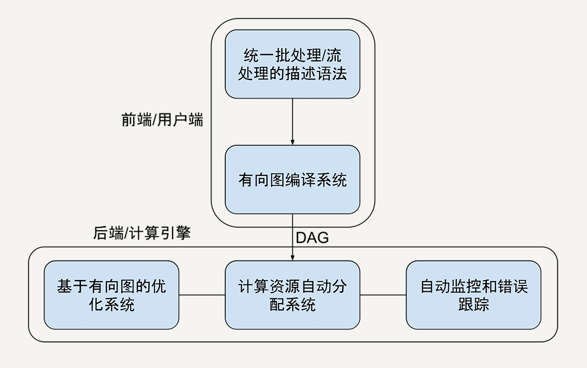
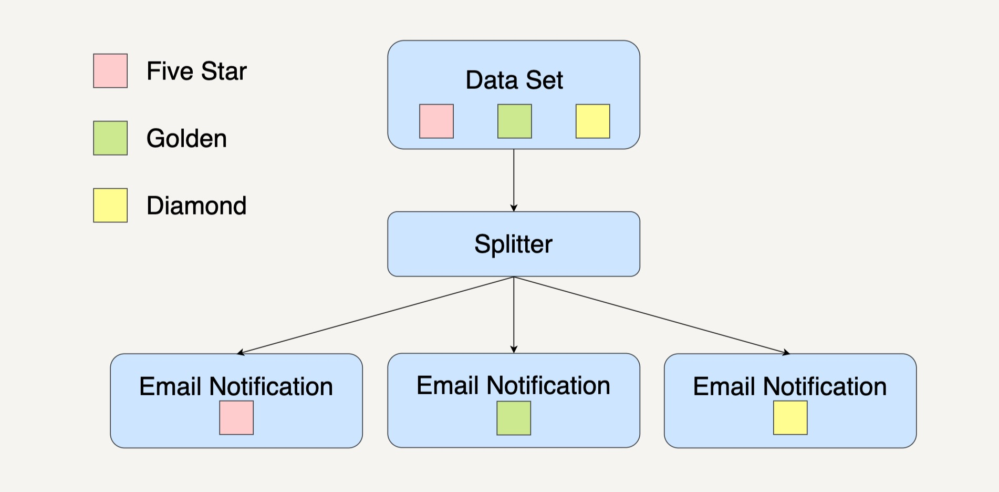
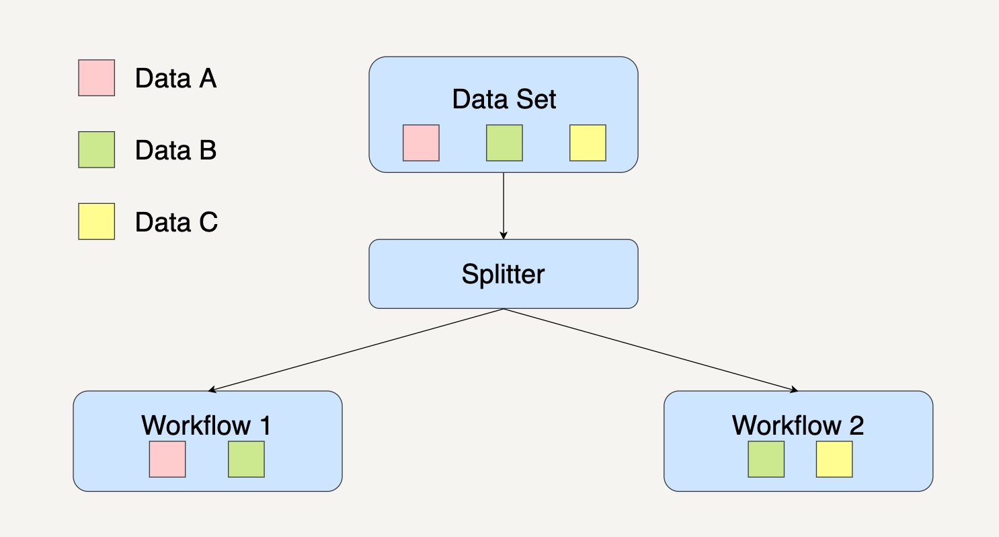

# 大规模数据处理实战 #

# 开篇词 #

## 开篇词 | 从这里开始，带你走上硅谷一线系统架构师之路 ##

* 这个技术解决了哪些痛点？
* 别的技术为什么不能解决？
* 这个技术用怎样的方法解决问题？
* 采用这个技术真的是最好的方法吗？
* 如果不用这个技术，你会怎样独立解决这类方法？

如果没有这些深层次的思考，你就永远只是在赶技术的时髦而已，不会拥有影响他人的技术领导力。

### 为什么写大规模数据处理？ ###

1. 低估了数据处理的重要性。
2. 低估了数据处理工程师在组织架构上的重要性。
3. 低估了数据处理规模变大带来的复杂度。 
4. 高估了上手数据处理的难度。

# 模块一|直通硅谷大规模数据处理技术 #

## 01 | 为什么MapReduce会被硅谷一线公司淘汰 ##

### 石器时代 ###

### 青铜时代 ###

MapReduce: Simplified Data Processing on Large Clusters

* Map
* Reduce

### 蒸汽机时代 ###

MapReduce->FlumeJava

### 高昂的维护成本 ###

1. 使用MapReduce，需要严格遵循分步的Map和Reduce步骤。构建复杂的处理架构时，需要协调多个Map和多个Reduce任务。
2. 但是因为每一步的MapReduce都有可能出错
3. 为了处理这些异常，开始设计自己的协调系统（orchestration）

#### 1. 搜集每日的外卖电动车图片 ####

数据搜集部分

1. 数据导入（data ingestion）：用来把散落的照片（比如众包公司上传到网盘的照片）下载到你的存储系统。
2. 数据统一化（data normalization）：用来把不同外包公司提供过来的各式各样的照片进行格式统一。
3. 数据压缩（compression）：你需要在质量可接受的范围内保持最小的存储资源消耗 。
4. 数据备份（backup）：大规模的数据处理系统我们都需要一定的数据冗余来降低风险。

#### 2. 需要一部分数据质量控制（quality control）流程 ####

1. 数据时间有效性验证 （date validation）：检测上传的图片是否是你想要的日期的。
2. 照片对焦检测（focus detection）：你需要筛选掉那些因对焦不准而无法使用的照片。

#### 3. 找到这些图片里的外卖电动车（困难），人工的介入是最难控制时间的，需要做4步： ####

1. 数据标注问题上传（question uploading）：上传你的标注工具，让你的标注者开始工作。
2. 标注结果下载（answer downloading）：抓取标注完的数据。
3. 标注异议整合（adjudication）：标注异议经常发生，比如一个标注者认为是美团外卖电动车，另一个标注者认为是京东快递电动车。
4. 标注结果结构化（structuralization）: 要让标注结果可用，你需要把可能非结构化的标注结果转化成你的存储系统接受的结构。

真实的商业 MapReduce 场景极端复杂，像上面这样 10 个子任务的 MapReduce 系统在硅谷一线公司司空见惯。在应用过程中，每一个MapReduce任务都有可能出错，都需要重试和异常处理的机制。所以，协调这些子 MapReduce 的任务往往需要和业务逻辑紧密耦合的状态机。

维护过于复杂

### 时间性能“达不到”用户的期待 ###

MapReduce的性能配置：

1. 缓冲大小（buffer size）
2. 分片多少（number of shards）
3. 预抓取策略（prefetch）
4. 缓存大小（cache size）

所谓的分片，是指把大规模的的数据分配给不同的机器 / 工人：

因为 MapReduce 的分片配置异常复杂，在 2008 年以后，Google 改进了 MapReduce 的分片功能，引进了动态分片技术 (dynamic sharding），大大简化了使用者对于分片的手工调整。

### 小结 ###

两个Mapreduce之所以被硅谷一线公司淘汰的“致命伤”：高昂的维护成本和达不到用户期待的时间性能。

FlumeJava：更好的可测试性；更好的可监控性；从1条数据到1亿条数据无缝扩展，不需要修改一行代码，等等。

### 思考题 ###

如果你在 Facebook 负责处理例子中的用户数据，你会选择什么分片函数，来保证均匀分布的数据分片?

#### 精选留言 ####

#### 1 ####

把年龄倒过来比如 28 岁 变成 82 来分片

我觉得光从年龄这个问题上来讲，你的思路是可以把20多岁变成12、22、32、42等等。希望你能在以后遇到问题时也能保持这样创新思维，也希望你继续留言，我们一起学习进步！

#### 2 ####

我们最早采用的是哈希算法，后来发现增删节点泰麻烦，改为带虚拟节点的一致性哈希环开处理，稍微复杂点，但是性能还好

使用Consistent hashing是可以很好地解决平均分配和当机器增减后重新hashing的问题。

#### 3 ####

你好！我工作中遇到这样的场景：会员在我们平台注册，信息会保存在对应商家的商家库中，现在需要将商家库中的信息实时的同步到另一台服务的会员库中，商家库是按照商家编号分库，而且商家库和会员库没在同一台服务器部署。想请教一下，像这种我们如何做到实时同步？

作者回复: 你好王伟！首先感谢你的提问！

我不确定你所说的实时同步是想表达Eventual Consistency还是Strong Consistency，那我就争对两个都说说自己的愚见吧。

因为会员信息都会保存在商家库中，所以这里我假设商家库的信息可以作为source of truth。

如果你指的是Eventual Consistency的话，可以在会员更新商家库的同时将会员信息利用Pub/Sub发送给会员库去更新。考虑到Pub/Sub中间有可能会丢包，我们可以再建立一个定时任务每隔一段时间将全部商家库中的信息扫描一遍再更新到会员库中。当然具体的实现可以再作优化，因为商家库是按商家编号分库的，我们可以记录下哪些商家编号的表最近有更新我们就只扫描那些表，而不用扫描全局的表。

如果你指的是Strong Consistency的话，我们可以在中间再创建一个State Machine，记录是否两个库都同时更新了。在读取会员信息的时候，我们需要查询这个State Machine，只有当两个库同时都更新的时候才将会员信息返回。根据第九讲的CAP理论，这样的做法其实会牺牲掉Availability，也就是你的服务可用性。

当然具体的需求你会比我更了解，所以相信你能够从中做出设计上的取舍。也欢迎你继续留言提问，我们可以一起讨论学习进步！

#### 4 ####

## 02 | MapReduce后谁主沉浮：怎样设计下一代数据处理技术 ##

FlumeJava

1. 经受了众多产品线，超大规模数据量例如亿级用户的经验；
2. 自发地被众多内部开发者采用，简单易用而受开发者欢迎；
3. 能通过内部领域内专家的评审；
4. 比上一代技术仅仅提高 10% 是不够的，必须要有显著的比如 70% 的提高，才能够说服整个公司付出技术迁移的高昂代价。

#### 我们需要一种技术抽象让多步骤数据处理变得易于维护 ####

维护协调多个步骤的数据处理在业务中非常常见

为了解决这个问题，作为架构师的我们或许可以用有向无环图（DAG）来抽象表达。因为有向图能为多个步骤的数据处理依赖关系，建立很好的模型。(数据结构与算法之美)

* 如果用 MapReduce 来实现的话，在这个图里面，每一个箭头都会是一个独立的 Map 或 Reduce。如果我们用有向图建模，图中的每一个节点都可以被抽象地表达成一种通用的数据集，每一条边都被表达成一种通用的数据变换。，你就可以用数据集和数据变换描述极为宏大复杂的数据处理流程。（我们不想要复杂的配置，需要能自动进行性能优化）
* MapReduce 的另一个问题是，配置太复杂了。以至于错误的配置最终导致数据处理任务效率低下。（人容易犯错，让人少做一点，让机器多做一点）

---
* 把两条数据处理过程进行合并
* 自动的优化是计算资源的自动弹性分配。

在数据处理开始前，我们需要有一个自动优化的步骤和能力，而不是按部就班地就把每一个步骤就直接扔给机器去执行了。

#### 我们要能把数据处理的描述语言，与背后的运行引擎解耦合开来 ####

有向图

用有向图进行数据处理描述的话，实际上**数据处理描述语言**部分完全可以和后面的**运算引擎**分离了。有向图可以作为**数据处理描述语言**和**运算引擎**的前后端分离协议。

* 比如一个网站的架构中，服务器和网页通过 HTTP 协议通信。服务器<——HTTP——>网页
* 比如在 TensorFlow 的设计中，客户端可以用任何语言（比如 Python 或者 C++）描述计算图，运行时引擎（runtime) 理论上却可以在任何地方具体运行，比如在本地，在 CPU，或者在 TPU。Runtime<——DAG——>Client
* 我的数据描述可以用 Python 描述，由业务团队使用；计算引擎用 C++ 实现，可以由数据底层架构团队维护并且高度优化；或者我的数据描述在本地写，计算引擎在云端执行。Data Engine<——DAG——>Client

有向图表达需要**数据处理描述语言**和**运算引擎**协商一致，其他的实现都是灵活可拓展的。

#### 我们要统一批处理和流处理的编程模型 ####

* 批处理处理的是有界离散的数据，比如处理一个文本文件；
* 流处理处理的是无界连续的数据，比如每时每刻的支付宝交易数据。

MapReduce的一个局限为了批处理而设计的，应对流处理的时候不再那么得心应手。（Apache Storm、Apache Flink也有类似问题，Flink里的批处理数据结构用DataSet，但是流处理用DataStream）。

真正的业务系统，批处理和流处理是常常混合共生，或者频繁变换的。

比如临时出现将批处理的数据更改成流处理，所以需要在设计的数据处理框架里，就得有更高级层的数据抽象。——>统一数据结构，无论业务需求什么样，开发者只需要学习一套API。

#### 我们要在架构层面提供异常处理和数据监控的能力 ####

对数据漏损的敏感性

### 小结 ###

Apache Spark 和 Apache Beam

### 思考题 ###

你现在在使用的数据处理技术有什么问题，你有怎样的改进设计？

### 精选留言 ###

#### 1 ####

Unify platform和批流统一已经是主要趋势了，而我个人目前只对spark、flink有一定的了解。对于spark来说，无疑是很优秀的一个引擎，包括它的all in one的组件栈，structured streaming出来后的批流api的统一，目前在做的continues Mode。而flink，的确因为阿里的运营，在国内火了。但也展现了它的独有优势，更加贴近dataflow model的思想。同时，基于社区以及阿里、华为小伙伴的努力，flink的table/sql 的api也得到的很大的增强，提供了流批统一的api。虽然底层然后需要分化为dataset和datastream以及runtime层的batchTask和StreamTask，但是现在也在rethink the stack，这个point在2019 SF 的大会也几乎吸引了所有人。但就现状而言，flink的确有着理念上的优势（流是批的超集），同时也有迅猛上升的趋势。

Spark的话虽然原生Spark Streaming Model和Dataflow Model不一样，但是Cloudera Labs也有根据Dataflow Model的原理实现了Spark Dataflow使得Beam可以跑Spark runner。

而对于Flink来说的话，在0.10版本以后它的DataStream API就已经是根据Dataflow Model的思想来重写了。现在Flink也支持两套API，分别是DataStream版本的和Beam版本的。其实data Artisans一直都有和Google保持交流，希望未来两套Beam和Flink的API能达到统一。

#### 2 ####

## 03 | 大规模数据处理初体验：怎样实现大型电商热销榜 ##

从1万用户到一亿用户，从GB数据到PB数据系统。

假设你的电商网站销售 10 亿件商品，已经跟踪了网站的销售记录：商品 id 和购买时间 {product_id, timestamp}，整个交易记录是 1000 亿行数据，TB 级。作为技术负责人，你会怎样设计一个系统，根据销售记录统计去年销量前 10 的商品呢？

个例子，假设我们的数据是：

|product_id|timestamp|
|--|--|
|1|1553721167|
|2|1553721199|
|3|1553721220|
|1|1553721241|

### 小规模的经典算法 ###

统计每个商品的销量——>找出销量前10

1. 统计每个商品的销量。可以用哈希表（hashtable）数据结构来解决，是一个 O(n) 的算法，这里 n 是 1000 亿。
2. 找出销量前十，可以用经典的 Top K 算法，也是 O(n) 的算法。

但在一切系统中，随着尺度的变大，很多方法就不再适用。具体在问题中，同样的Top K算法当数据规模变大会遇到什么问题呢？

1. 内存占用。对于 TB 级的交易记录数据，很难找到单台计算机容纳那么大的哈希表了。我把销量计数放在磁盘里完成好了。就用一个 1000 亿行的文件或者表，然后再把销量统计结果一行一行读进后面的堆树 / 优先级队列。
2. 磁盘I/O等延时问题。当数据规模变大，我们难以避免地需要把一些中间结果存进磁盘，以应对单步任务出错等问题。一次磁盘读取大概需要 10ms 的时间。如果按照上一点提到的文件替代方法，因为我们是一个 O(n * log k) 的算法，就需要 10ms * 10^9 = 10 ^ 7 s = 115 天的时间。

### 大规模分布式解决方案 ###

需要把每一步从简单的函数算法，升级为计算集群的分布式算法。

#### 统计每个商品的销量 ####

1000 台机器，每台机器一次可以处理 1 万条销售记录。对于每台机器而言，它的单次处理又回归到了我们熟悉的传统算法，数据规模大大缩小。

#### 找出销量前K ####

在上一个统计销量集群得到的数据输出，将会是我们这个处理流程的输入。所以这里需要把分布在各个机器分散的产品销量汇总出来。

#### 汇总最终结果 ####

到了最后一步，你需要把在“销量前 K 集群”中的结果汇总出来。也就是说，从所有排名前 K=1 的商品候选者中找出真正的销量前 K=1 的商品。

### 大规模数据处理框架的功能要求 ###

两个最基本的需求是：

1. 高度抽象的数据处理流程描述语言。作为用户，肯定不想配置分布式系统的每台机器了。作为框架使用者，我希望框架是非常简单的，能够用几行代码把业务逻辑描述清楚。
2. 根据描述的数据处理流程，自动化的任务分配优化。这个框架背后的引擎需要足够智能，简单地说，要把那些本来手动配置的系统，进行自动任务分配。

### 小结 ###

从 GB 数据到 TB 数据，我们从小规模算法升级到了分布式处理的设计方案；从单一 TB 数据场景到 1000 个应用场景，我们探索了大规模数据处理框架的设计。

### 思考题 ###

在你的工作中，有没有随着数据规模变大，系统出问题的情况，你又是怎么解决的？

### 精选留言 ###

# 模块二|实战学习大规模数据处理基本功 #

## 04 | 分布式系统（上）：学会用服务等级协议SLA来评估你的系统 ##

SLA（Service-Level Agreement），也就是服务等级协议，指的是系统服务提供者（Provider）对客户（Customer）的一个服务承若。这是衡量一个大型分布式系统是否“健康”的常见方法。

四个 SLA 指标，可用性、准确性、系统容量和延迟。

#### 1. 可用性（Avaiabity） ####

可用性指的是系统服务能正常运行所占的时间百分比。

对于许多系统而言，四个 9 的可用性（99.99％ Availability，或每年约 50 分钟的系统中断时间）即可以被认为是高可用性（High availability）。

#### 2. 准确性（Accracy） ####

错误率 = 导致系统产生内部错误的有效请求数 / 期间的有效请求总数

* 性能测试（Performance Test）
* 查看系统日志（Log）

#### 3. 系统容量（Capacity） ####

在数据处理中，系统容量通常指的是系统能够支持的预期负载量是多少，一般会以每秒的请求数为单位来表示。

1. 限流（Throtling）：Java 语言进行编程的，就可以使用 Google Guava 库中的 RateLimiter 类来定义每秒最多发送多少请求到后台处理，内存溢出（Out-Of-Memory）的异常
2. 性能测试：有的开发者可能使用同一类型的请求参数，导致后台服务器在多数情况下命中缓存（Cache Hit）。这个时候得到的 QPS 可能并不是真实的 QPS。
3. 日志：分析系统在实际使用时产生，系统上线使用后，我们可以得到日志文件。一般的日志文件会记录每个时刻产生的请求。我们可以通过系统每天在最繁忙时刻所接收到的请求数，来计算出系统可以承载的 QPS。
4. 延迟（Latency）：延迟指的是系统在收到用户的请求到响应这个请求之间的时间间隔。系统的SLA会有p95或者是p99的延迟声明。这里的 p 指的是 percentile，也就是百分位的意思。如果说一个系统的 p95 延迟是 1 秒的话，那就表示在 100 个请求里面有 95 个请求的响应时间会少于 1 秒，而剩下的 5 个请求响应时间会大于 1 秒。

改进缓存策略从而提高缓存命中率，通过优化数据库的Schema或者索引（Index）来降低p95或p99延迟。

### 小结 ###

当系统架构在不停迭代的时候，有了一个明确的 SLA，我们可以知道下一代系统架构的改进目标以及优化好的系统架构是否比上一代的系统 SLA 更加优秀。

### 思考题 ###

在自己所在的开发项目中，系统的 SLA 是什么呢？又有什么方面可以优化的呢？

### 精选留言 ###

#### 1 ####

在实际应用SLA的时候，有两点不解：
1. 在设计系统之初，大家拍脑袋来定义SLA。这个时期，SLA对应需要付出的成本还不明确，这样大家都会趋于订出很高标准。这种情况有好的解决办法吗？
2. 虽然定义了SLA，但在架构设计的时候，如何评估架构是否能满足SLA呢？等到软件实现了再来测试，似乎有点太晚了……请教老师一般是如何处理这两个问题的呢？

可以SLA 与 所需的人力资源挂钩起来，让大家了解越高的SLA意味着越高的成本。比如99.9%的SLA，需要20人3个月的工作量，但是99.99%的SLA，就需要50人3年的工作量。让同事能够了解高SLA的成本，这样大家做选择的时候就会趋于理性。

#### 2  ####

我觉得这一节超赞。基础概念很重要，很重要，很重要。
实战这种事情，有的是时间去practice，而SLA这几个关键概念，会成为很多人理解的迷雾。
当我发现我的lead，拉着一大堆自己也还没理解清楚SLA指标去拉KPI，扛大旗的时候，我才进一步，深刻体会到这一节内容的重要性^ ^

## 05 | 分布式系统（下）：架构师不得不知的三大指标 ##

### 可扩展性 ###

分布式系统的核心是可扩展性（Scalability）

增加系统容量的模型有两种：水平扩展（Horizontal Scaling）和垂直扩展（Vertical Scaling）。

1. 水平扩展，在现有的系统中增加新的机器节点。
2. 垂直扩展，就是在不改变系统中机器数量的情况下，“升级”现有机器的性能。

* 无节制地增加机器数量也会带来一些问题，比如机器的管理、调度、通信会变得更加复杂，出错的可能性会更高，更难保证数据的一致性等等。
* 垂直扩展虽然并没有让整个系统变得更加复杂，控制系统的代码也不需要做任何调整，但是受到的限制比较多（多数情况下，单个机器的性能提升有限的。）

### 一致性 ###

* 强一致性：系统中的某个数据被成功更新后，后续任何怼该数据的读取操作都将得到更新后的值。所以在任意时刻，同一系统所有节点的数据是一样的。
* 弱一致性：系统中的某个数据被更新后，后续对该数据的读取操作可能得到更新后的值，也可能是更改前的值，但经过“不一致时间窗口”这段时间后，后续怼该数据的读取都是更新后的值。
* 最终一致性：是弱一致性的特殊形式。存储系统保证，在没有新的更新的条件下，最终所有的访问都是最后更新的值。

* 在强一致性系统中，只要某个数据的值有更新，这个数据的副本都要进行同步，以保证这个更新被传播到所有备份数据库中。在这个同步进程结束之后，才允许服务器来读取这个数据。所以，强一致性一般会牺牲一部分延迟性，而且对于全局时钟的要求很高。举个例子，Google Cloud 的 Cloud Spanner 就是一款具备强一致性的全球分布式企业级数据库服务。
* 在最终一致性系统中，我们无需等到数据更新被所有节点同步就可以读取。尽管不同的进程读同一数据可能会读到不同的结果，但是最终所有的更新会被按时间顺序同步到所有节点。所以，最终一致性系统支持异步读取，它的延迟比较小。比如亚马逊云服务的 DynamoDB 就支持最终一致的数据读取。

分布式系统理论还有别的一致性模型，如顺序一致性（Sequential Consistency），因果一致性（Casual COnsistency）。

强一致性式很难实现的，应用最广的式最终一致性

### 持久性 ###

数据持久性（Data Durability）意味着数据一旦被成功存储就可以一直继续使用，即使系统中的节点下线、宕机或数据损坏也是如此。

在分布式数据处理系统中，还有一个持久性概念是消息持久性。在分布式系统中，节点之间需要经常相互发送消息去同步以保证一致性。

分布式系统中的消息通讯通常由分布式消息服务完成，比如RabiitMQ、Kafka。这些消息服务能支持（或配置后支持）不同级别的消息达可靠性。消息持久性包含两个方面：

1. 当消息服务的节点发生了错误，已经发送的消息仍然会在错误解决之后被处理；
2. 如果一个消息队列声明了持久性，那么即使队列在消息发送之后掉线，仍然会在重新上线之后收到这条消息。

### 小结 ###

扩展性，一致性和持久性。

学会具体情况具体分析，找到最适合自己系统的指标，适当做出取舍。

### 思考题 ###

对于微信朋友圈的评论功能，你觉得哪种一致性模型更适用？为什么？

### 精选留言 ###

#### 1. ####

微信朋友圈评论主要由评论和后续回复组成：
首先，对于评论，评论内容对评论者而言应该要保证读写一致性（read-your-writes consistency），即评论一旦发出，那么对于该评论者无论在手机、网页还是其它城市应该都能看到其之前写的评论。而对于朋友圈可见的其它人来说，只要保证最终一致性（eventual consistency）就可以了（可能有时间要求），不同人的评论读取顺序无需和真实发生的顺序保持一致；
其次，对于评论的后续回复。回复内容对于回复者而言应该要保证读写一致性（read-your-writes consistency），而其它朋友圈可见的人一样，评论和回复内容应该按顺序被读取到，即需要保证一致前缀读（Consisten Prefix Reads）

#### 2. ####

弱一致性是个很宽泛的概念，它是区别于强一致性而定义的。广义上讲，任何不是强一致的，而又有某种同步性的分布式系统，我们都可以说它是弱一致的。而最终一致性是弱一致性的一个特例，而且是最常被各种分布式系统用到的一个特例。其他的比如因果一致性、FIFO一致性等都可以看作是弱一致性的特例，不同弱一致性只是对数据不同步的容忍程度不同，但是经过一段时间，所有节点的数据都要求要一致。

#### 3. ####

朋友圈保证最终一致性即可，消息发布后，先保证“端”是可见的，等待网络请求后会确认最终有无发布成功，成功后最终其他人的timeline会收到

但是有的场景下最终一致性还不够。试想这个场景，A发布了一张图片，B问他这是哪里，然后C回答B这里是北京。这个例子中，C的评论一定要在B之后，因为他俩有逻辑上的因果关系。所以微信朋友圈的评论要满足这样的因果一致性。因果一致性也是弱一致性的一个特例

#### 4. ####

消息队列的持久性第二点不是太能理解，意思是说消息发送者发完消息后，接收者下线了，然后接收者上线仍能收到吗？

这里的持久性指的就是消息队列在接收到发送者发送的消息后，只要没有收到接收者的回应，就会一直尝试发送消息给接收者，直到收到回应为止。所以接收者下线了再上线仍是能收到消息队列发送的消息。当然中间如果超过了消息保留期限或者一定的重发次数也会消息队列也会停止发送。

## 06 | 如何区分批处理还是流处理 ##

批处理（Batching Processing）和流处理（Stream Processing）

### 无边界数据和有边界数据 ###

* 无边界数据（Unbounded Data）和有边界数据（Bounded Data）
* 无边界数据式一种不断增长，可以说是无限的数据集
* 有边界数据式一种有限的数据集
* 有边界数据其实可以看作式无边界数据的一个子集

### 事件世间和处理世间 ###

在处理大规模数据的时候，还需要关心时域（Time Domain）问题。要处理的任意数据都会有两种时域，分别是事件世间（Event Time）和处理时间（Precessing Time）。

* 事件世间指的式是一个数据实际产生的时间点
* 处理世间指的是处理数据的系统架构实际收到这个数据的时间点

### 批处理 ###

数据的批处理，可以理解为一系列相关联的任务按顺序（或并行）一个接一个地执行。批处理的输入是在一段时间内已经收集保存好的数据。每次批处理所产生的输出也可以作为下一次批处理的输入。

绝大部分情况下，批处理的输入数据都是有边界数据，同样的，输出结果也一样式有边界数据。所以在批处理中，

* 日志分析：日志系统是在一定时间段（日，周或年）内收集的，而日志的数据处理分析是在不同的时间内执行，以得出有关系统的一些关键性指标。
* 计费应用程序：计费应用程序会计算出一段世间内一项服务的使用程度，并生成计费信息，例如银行在每个月未生成的信用卡还款单。
* 数据仓库：数据仓库的主要是根据收集的数据事件世间，将数据信息合并为静态快照（static snapshot），并将它们聚合为每周、每月、每季度的报告等。

Apache Hadoop或者Apache Spark支持这种大数据批处理架构，由于完成批处理任务具有高延迟性，如果要快速响应用户的世间需求，则需要使用流处理/实时处理来处理大数据。

### 流处理 ###

数据的流处理可以理解为系统需要接收并处理一系列不断变化的数据。（旅行预订系统，处理社交媒体更新信息的有关系统等等）

流处理的输入数据基本上都是**无边界数据**。而流处理系统中是关心数据的事件时间还是处理时间，将视具体的应用场景而定。

当流处理架构拥有在一定时间间隔（毫秒）内产生逻辑上正确的结果时，这种架构可以被定义为**实时处理**（Real-time Processing）。

而如果一个系统架构可以接受以分钟为单位的数据处理时间延时，我们也可以把它定义为**准实时处理**（Near real-time Processing）。

流处理架构拥有高吞度量和低延迟等特点，通常都会被设计在以下这些应用场景中：

* 实时捕获：捕获和分析各种来源发发布的数据，如传感器，新闻源，点击网页等。
* 实时商业智能：智能汽车，智能家具，智能病人护理等。
* 销售终端（POS）系统：像是股票价格的更新，允许用户实时完成付款的系统等。

Apache Kafka、Apache Flink、Apache Storm、Apache Samza等，都是流行的流处理架构平台。

### 小结 ###

批处理模式在不需要实时分析结果的情况下是一种很好的选择。尤其当业务逻辑需要处理大量的数据以挖掘更为深层次数据信息的时候。

而在应用需求需要对数据进行实时分析处理时，或者说当有些数据是永无止境的事件流时（例如传感器发送回来的数据时），我们就可以选择用流处理模式。

### 思考题 ###

你会对批处理模式和流处理模式有着清晰的认识。今天的思考题是，在你的日常开发中，所面临的数据处理模式又是哪一种模式呢？

我们使用的是批处理模式，将无限数据分割成按条件，按时分割的数据集

### 精选留言 ###

#### 1.  ####

用户画像本质还是批处理，还不能做到实时更新每个人的 profile，但对用户的每次电机有一个实时的劣化推荐版本，就是根据session中点的几个item的click，找到它们的simiiar item，这个是通过cache 和API实现的，并不是实时数据处理

#### 2.  ####

既有批处理也有流处理，生产环境利用elasticsearch来存储监控数据、日志数据等。为了降低成本和查询速度，会按照小时、天粒度对历史数据做预聚合，这应该属于批处理。其次，es作为搜索引擎，用户也有实时查询的需求，这块应该属于流处理。 

#### 3. ####

上面说流数据是在没到达磁盘之前就处理了，所以速度很快，但是如果那处软件挂了，那部分流数据不是丢失了吗？是不是不能处理重要的数据？
如果我的数据很重要，但是又想像流那样处理的快速怎办？像redis那样，使用持久化，边处理写延迟写及磁盘这种处理思想吗？还是其它？

作者回复: 谢谢你的提问！数据如果没有保存到磁盘的话，确实整个软件挂了所有数据就丢失了。不过流处理一样可以处理重要数据的。一般即使数据存在内存中，有的软件会定时将数据的snapshot保存到磁盘中，以防软件全部挂掉。而很多软件都会有data replica，而且会有N+1或者N+2的policy，以此来保证如果有其中一台机器上的软件挂了，另外一台机器可以顶替它。

一般全部机器都挂的情况非常少见，这就如同存在磁盘上的数据被人运行“rm -fR /”一样，所以在采用流处理的时候不必过于担心。

#### 4.  ####

看到网上说flink实现的流处理和spark streaming不一样，是因为spark使用了微批处理模拟流处理，可是我觉得flink实现的原理也像是用批处理模拟流处理，将一段一段数据包裹在时间窗口里来实现，这个时间窗口的数据处理，可不可以也理解成为是批处理？

#### 5.  ####

有限流是无限流的一个特例，所以一直在想是不是未来不再需要批处理，所有的都可以流处理，从而达到真正的流批一体。

从现在的情况看，批处理主要用于分析，用 sql 较多，且会对多个表进行处理，是不是意味着流上的 sql 也是刚需。

线下批处理能够不停重算的特性，应该可以让流处理不停做 checkpoint 来支持，这样是不是就和 db 的 backup 就有点像了，那是不是最后流处理，批处理，数据库也会统一起来呢？

我很认同你的观点，关于流处理和批处理未来应该会统一起来。数据库作为存储系统的话还是会单独存在的吧。

#### 6.  ####

一般业务中都会涉及到实时处理和批处理的需求，现在采取的类似于Kappa的架构。

Kappa Architecture: http://milinda.pathirage.org/kappa-architecture.com/
Samba Architecture: http://lambda-architecture.net/ 

#### 7.  ####

在实际工作中数据仓库的数据处理使用的是批处理，根据需要大多数据是日处理，个别数据是一天处理几次，但都是批处理。在做核心业务系统时使用的是流数据处理，通常用消息中间件来传递事件，接收到事件时即开始处理。一直想尝试的是通过日志信息抽取业务信息，实现对业务信息的实时分析，例如当日的实时交易笔数，交易额等，无需侵入核心业务系统，通过日志即可以流数据的形式实时传递给数据平台。了解过splunk,elasticsearch都可以做，但是不清楚哪个更好，或者有其他更好的选择。

#### 8.  ####

我个人也是比较赞同 DataFlow 模型的思想的，认为批是流的一个特例，未来的计算不会再明显区分到底是流还是批，但不能排除除一些特殊情况（毕竟当前的批计算引擎针对批的场景做了大量的优化，通用系统的性能肯定是赶不上专用系统的），但计算不仅仅是批和流两种形态，还有复杂计算场景，比如现在的 TensorFlow（AI 框架的本质也是计算）、RAY 等，计算引擎最后会不会完全融合到一起呢？或者换个思路，一个引擎可以兼容所有的引擎（有点类似 Beam），在一个计算框架里，可以跑多个 runner（这个 runner 可以是不同的引擎），未来会不会是这样的呢？

#### 9. ####

Flink的本质就是流处理，而里面的批处理api底层是将时间或者个数设定在某个区域里面，可以认为在这个架构中批处理是流处理的一个特例，我看有的评论说反了。说明还没好好掌握flink

## 07 | Workflow设计模式：让你在大规模数据世界中君临天下 ##

批处理和流处理

有向无环图

### 复制模式（Copier Pattern） ###

复制模式通常是将单个数据处理模块中的数据，完整地复制到两个或更多的数据处理模块中，然后再由不同的数据处理模块进行处理。

当我们在处理大规模数据时，需要对同一个数据集采取多种不同的数据处理转换，我们就可以优先考虑采用**复制模式**。

在平台的背后，一个视频的数据集可能被自然语言理解（NLP）的数据处理模块分析，用以自动生成视频字幕；还有可能被视频分析的数据处理模块分析，用以产生更好的内容推荐系统。

在这个工作流系统中，每个数据处理模块的输入是相同的，而下面的 5 个数据处理模块都可以单独并且同步地运行处理。

### 过滤模式（Filter Pattern） ###

过滤模式的作用是过滤掉不符合特定条件的数据。在数据集通过这个数据处理模块后，数据集会缩减到只剩下符合条件的数据。

需要针对一个数据集中某些特定的数据采取数据处理时，可以优先考虑采用**过滤模式**。

这个工作流系统中，一个数据处理模块会将输入的数据集过滤成符合条件的数据，然后传输到下一个数据处理模块进行单独处理。

### 分离模式（Splitter Pattern） ###

如果你在处理数据集时并不想丢弃里面的任何数据，而是想把数据分类为不同的类别来进行处理时，你就需要用到分离模式来处理数据。

需要注意的是，分离模式并不会过滤任何数据，只是将原来的数据集分组了。系统现在打算通过邮件，针对**全部的会员**用户发出与身份相符的**不同活动**的邀请。通过**分离模式**将用户按照会员等级分组，然后发送相应的活动内容。在分离模式下，同样的数据其实是可以被划分到不同的数据处理模块的。

### 合并模式（Joiner Pattern） ###

合并模式会将多个不同的数据集转换集中到一起，成为一个总数据集，然后将这个总的数据集放在一个工作流中进行处理。

### 小结 ###

在大规模数据处理中用到的四种设计模式，分别是复制模式、过滤模式、分离模式和合并模式。

在设计大规模数据处理系统的时候，我们都希望能事先设计好一个工作流系统图出来作为参考。

### 思考题 ###

在一个航空预定系统中，我们需要处理用户注册、购买机票和出行前 24 小时的提醒等功能。在这整个过程中，系统的数据处理运用了哪几个设计模式呢？

用户注册，入库，合并模式

购买机票，分为查询机票和购买

查询机票，读取特定机票，过滤模式

购买机票，将所有渠道的票和合并起来，合并模式

24小时提醒，过滤出这班航班的机票，过滤模式
发送短信和电子邮箱，复制模式之后，进行分类模式发送

### 精选留言 ###

#### 1. ####

这几个模式就是sql的几个operator吗？
复制 → subquery
过滤 → where
分离 → group by
合并 → join

#### 2. ####

感觉合并模式可能会有问题，如果两个流有差速怎么办？

作者回复: 谢谢你的提问，这个问题问得很好！对于有边界数据来说，也就是批处理，如果是读取两个流有速度上的误差是没有关系。如果你问的是无边界数据，那种有无止境数据的流处理的话，这里需要要求你在数据完整性和结果的延时上作出取舍了。具体的内容我会在介绍Beam的时候讲到。

#### 3. ####

workflow是否只适用于批处理？

作者回复: 谢谢你的提问！Workflow作为一种数据处理设计思想是既适用于批处理也适用于流处理的。

## 08 | 发布/订阅模式：流处理架构中的瑞士军刀 ##

处理大规模数据中十分流行的一种设计模式：发布 / 订阅模式（Publish/Subscribe Pattern），有些地方也称它为 Pub/Sub。

消息（Message）和消息队列（Message Queue）

### 消息 ###

在分布式架构里，架构中的各个组件（Component）需要相互联系沟通。组件可以是后台的数据库，可以是前端的浏览器，也可以是公司内部不同的服务终端（Service Endpoint）。

而各个组件间就是以靠通过发送消息互相通讯的。

Component A ——(Send Message)——> Component B

消息可以是任意格式的（JSON、XML或自定义的格式）。

### 消息队列 ###

消息队列在发布/订阅模式中起的是一个持久化缓冲（Durable Buffer）的作用。

消息的发送方可以发送任意消息至这个消息队列中，消息队列在接收到消息之后会将消息保存好，直到消息的接收方确认已经从这个队列拿到了这个消息，才会将这条消息从消息队列中删除。

Component A ——(Send Message)——> Message Queue  ——(Receive Message)——> Component B

### 发布/订阅模式 ###

*发布 / 订阅模式指的是消息的发送方可以将消息异步地发送给一个系统中不同组件，而无需知道接收方是谁。*在发布 / 订阅模式中，发送方被称为发布者（Publisher），接收方则被称作订阅者（Subscriber）。

发布者将消息发送到消息队列中，订阅者可以从消息队列里取出自己感兴趣的消息。在发布 / 订阅模式里，可以有任意多个发布者发送消息，也可以有任意多个订阅者接收消息。

从概念上看，发布/订阅模式只是简单地在消息发送方和消息接收方中间多加了一个消息队列。

### 发布/订阅模式的优缺点 ###

发布 / 订阅模式会有以下几个优点：

* 松耦合（Loose Coupling）：消息的发布者和消息的订阅者在开发的时候完全不需要事先知道对方的存在，可以独立地进行开发。
* 高伸缩性（High Scalability）：发布 / 订阅模式中的消息队列可以独立的作为一个数据存储中心存在。在分布式环境中，更是消息队列更是可以扩展至上千个服务器中。
* 系统组件间通信更加简洁：因为不需要为每一个消息的订阅者准备专门的消息格式，只要知道了消息队列中保存消息的格式，发布者就可以按照这个格式发送消息，订阅者也只需要按照这个格式接收消息。

但是还是存在着自身的缺点的:

* 不能保证发布者发送的数据一定会送达订阅者

在 Apache Kafka 中，消息的发送方被称为 Producer，消息的接收方被称为 Consumer，而消息队列被称为 Topic。

Apache Kafka 在判断消息是否被接收方接收是利用了 Log offset 机制。

### 发布/订阅模式的适用场景 ###

如果你在处理数据的时候碰到以下场景，那么就可以考虑使用发布 / 订阅的数据处理模式。

* 系统的发送方需要向大量的接收方广播消息。
* 系统中某一个组件需要与多个独立开发的组件或服务进行通信，而这些独立开发的组件或服务可以使用不同的编程语言和通信协议。
* 系统的发送方在向接收方发送消息之后无需接收方进行实时响应。
* 系统的发送方在向接收方发送消息之后无需接收方进行实时响应。
* 系统中对数据一致性的要求只需要支持数据的最终一致性（Eventual Consistency）模型。

PS.如果系统的发送方在向接收方发送消息之后，需要接收方进行实时响应的话，那么绝大多数情况下，都不要考虑使用发布 / 订阅的数据处理模式。

### 小结 ###

发布 / 订阅模式：解耦（Decouple）系统中不同的组件，许多实时的流处理架构就是利用了这个数据处理的设计模式搭建起来的。因为发布 / 订阅模式同时具有很好的伸缩性。

### 思考题 ###

微信的朋友圈功能适合使用发布 / 订阅模式吗？为什么？

适合，如果微信的朋友圈是个大集合的话，那么发布一条朋友圈信息就相当于在这个大集合中发布一条信息，看到这个信息的人都在这个大集合中订阅一条信息。

### 精选留言 ###

#### 1.  ####

盆友圈适合使用pub/sub模式
原因1：消息发送方需要向多个接收方（n个可以看自己盆友圈的好友）广播消息
原因2：多消费者组（微信朋友圈数据应该不仅仅只是用于社交，可能还有其他作用吧，所以可能会有多个模块需要用到这份数据）
原因3：发送方发送消息之后是不需要接收方立即进行响应的（异步），所以用消息队列可以有效起到解耦的作用
原因4：微信朋友圈对于数据而言，满足最终一致性的

#### 2.  ####

1. 微博粉丝订阅机制
由于存在流量明星，针对不同情况的用户，系统可以区别对待，在线用户采用“推”模式，尽量及时更新订阅者的timeline；不在线的用户采用“拉”模式，在该用户上线后更新timeline。

2. 微信朋友圈机制
由于不太可能存在微博这种超级发布者，因此可仅采用“推”模式。

3. 两款产品的共同点
a) 发布者必须实时同步处理，因为发布成功后需要直接看到自己生产的消息。
b) 订阅者可以异步处理，只要保证系统满足最终一致性即可。

#### 3. ####

老师好，有一点模糊的地方，请问观察者模式和发布/订阅模式的区别从消息的传递上来看就是是否通过消息队列传递数据么？另外消息队列是对接收者push消息还是接收者主动从消息队列中pull消息出来呢？谢谢老师

作者回复: 你好呀，感谢你的提问！

其实在观察者模式下，你也可以通过消息队列去传递消息。但是更本质的区别是在观察者模式下，观察者必须知道被监听者的存在。就像例子所示，观察者必须调用被监听者的接口。而发布/订阅模式下，两者是解耦的，互相都不用知道对方的存在。

消息队列中既可以使用push模式也可以使用pull模式，关键在于应用场景的考虑。例如如果消息跟新发布频繁，而下游的接收者能够处理的qps不高，那可能会更加倾向于采取pull模式。

#### 4. ####

log offset类似tcp的滑动窗口机制，有个问题：如例子讲的10003，在第一次由于某种原因未被消费者消费，生产者又发了一次10003，然后第一次发送的10003又到了消费者，那么10003会被消费者消费两次，这种情况kafka会有什么处理机制吗？

作者回复: 谢谢你的留言提问！一般来说，这种发送机制叫做at least once delivery，这种情况需要消费者自身具备Idempotency，也就是幂等性。消费者需要自己知道哪些消息是duplicate的，从而知道怎么处理这些重复消息。

#### 5.  ####

微信朋友圈适合用消息发布－订阅模式
1.系统的发送方需要向大量的接收方广播消息。一个人打朋友圈，需要向有好友关系的多方发消息

2.朋友圈的数据会被多个独立的业务方使用，比如做数据分析用于投放朋友圈广告，进行用户行为分析，构建用户画像

3.系统的发送方在向接收方发送消息之后无需接收方进行实时响应。因为朋友圈这种业务应该使用pull模式，当A发朋友圈时，A的好友B C D，只有当B C D进行刷新朋友圈时，会去pull数据

4.朋友圈对数据一致性只会要求最终一致性

所以朋友圈很适合消息发布－订阅模式

#### 6. ####

請問老師 如果想把Oracle的數據實時同步到其他的地方比如MongoDB 要求幾秒鐘以內的latency 有沒有辦法使用pubsub的概念做到呢 又該如何做呢 謝謝

作者回复: 谢谢你的提问！这个问题挺常见的，PubSub肯定是可以做到的。具体的做法还是看你的架构吧。如果你是own整一套系统的话，一种做法是你的service直接对这两个数据库进行dual write。如果你只是own这两个database的话，我相信Oracle应该是有一些database change notification的机制，这个时候你可以将这个data change publish到一个service中，然后再做同步。

#### 7. ####

如果接收方读取数据之后回应消息队列它接收的 Log offset 是 10000、10001 和 10003，那么消息队列就会认为接收方最多只接收了消息 10000 和 10001，剩下的消息 10002、10003 和 10004 则会继续发送给接收方，直到接收方回应接收了消息 10002、10003 和 10004。
第一句接收的log offset有10003吗？

作者回复: 谢谢你的提问！如果我没理解错你的问题的话，你是想问接收方是否回复了10000、10001和10003这三个Log offset对吧？是的，接收的log offset有10003。因为消息队列需要接收到连续的log offset才会判定接收方接收到消息，这里因为log offset从10002断开了，所以消息队列会认为接收方从10002开始往后的消息都没有接收到。

#### 8 ####

老师好，对于消息队列中的消息存储有一个问题。在一个发布订阅模式下的消息队列中消息会被保存多久呢?具体情景是如果有五个接收方订阅了一个队列的消息，其中四个成功接收了，第五个总也无法接收，这条消息会一直保存在队列中，并且不断尝试发给第五个订阅者吗？还是会设置最多重复次数?另一个情景，在发布者发送消息至队列后，新增加了一个订阅者，这时新的订阅者可以收到队列里已放入的消息吗？谢谢。

第一个问题，一般不同的系统有不同的机制去确定消息队列中消息会被保存多久。像Apache Kafka中可以通过设定Retention Period来确定消息被保存多久，甚至可以设置Retention Period为Forever来永久保存。

第二个问题，只要没有超过保留期，消息会一直保存在队列并且一直尝试发送给第五个订阅者。当然订阅者也可以自己设定retry times，如果第五个订阅者告诉消息队列只需要重试一次，那这条消息就不会再发送给第五个订阅者了。如果你要保证操作一定成功，就要考虑用RPC来调用了。

第三个问题还是要看系统设计了，设计上收到与不收到都可以做到，像Apache Kafka可以通过重设Log Offset的位置去实现新的订阅者收取队列里面旧的消息。如果你使用开源项目的话，文档里应该会有说明的。

#### 9 ####

老师您好，个人理解，观察者模式本质上是消息推出，订阅该消息的对象获取消息并进行处理；所以我认为，发布/订阅模式其实是一种特殊的观察者模式，或者是观察者模式的实现方式。

作者回复: 谢谢你的留言！我觉得本质上还是有所不同的，毕竟在观察者模式中观察者需要知道被监听的对象，而发布/订阅模式通过消息队列解耦了这一层关系。

#### 10 ####

谢谢老师的答复，我的问题没表述完整，kafka后面接关系数据库可以重做这些日志以落地数据，并进一步用sql处理数据，但是如果Kafka后面接流处理引擎比如Flink等，Kafka里面存的redo日志，传给流引擎，在流引擎里面如何处理这些日志？比如分别针对一个表执行了insert update delete，流引擎会去重做类似关系数据库对这些DML日志的操作，再基于结果数据做分析么，还是直接操作这些增量日志。

我没有流计算的实战经验，问题可能比较菜，请老师见谅

作者回复: 谢谢你的提问！

我的理解是两者都会有。作为底层实现的话，流处理的数据是无限的，流引擎也不可能无止境地等待数据到来，所以一般处理这种无限流数据的话都需要定义window和trigger。所谓window就是你希望处理数据的时间窗口多大，trigger定义了什么时候你想处理时间窗口内的数据。就如你所举的例子，如果Kafka后面接的是Flink的话，Flink会将这些数据抽象成DataStream，一个时间窗口内的数据你可以把它看作就是传统数据库中已有的数据，可以做类似关系数据库的操作。Flink会监听Kafka新传来的数据，等到下一个trigger开始了，Flink又会像之前一样计算这些新传来的在一定时间窗口内的数据。

希望这能帮助你理解到你所问的问题。

## 09 | CAP定理：三选二，架构师必须学会的取舍 ##

## 10 | Lambda架构：Twitter亿级实时数据分析架构背后的倚天剑 ##

### Lambda架构 ###

Lambda 架构使开发人员能够构建大规模分布式数据处理系统。它具有很好的灵活性和可扩展性，也对硬件故障和人为失误有很好的容错性。

Lambda 架构总共由三层系统组成：*批处理层*（Batch Layer），*速度处理层*（Speed Layer），以及用于响应查询的*服务层*（Serving Layer）。

批处理层存储管理主数据集（不可变的数据集）和预先批处理计算好的视图。

批处理层使用可处理大量数据的分布式处理系统预先计算结果。它通过处理所有的已有历史数据来实现数据的准确性。这意味着它是基于完整的数据集来重新计算的，能够修复任何错误，然后更新现有的数据视图。输出通常存储在只读数据库中，更新则完全取代现有的预先计算好的视图。

速度处理层会实时处理新来的大数据。

速度层通过提供最新数据的实时视图来最小化延迟。速度层所生成的数据视图可能不如批处理层最终生成的视图那样准确或完整，但它们几乎在收到数据后立即可用。而当同样的数据在批处理层处理完成后，在速度层的数据就可以被替代掉了。

本质上，速度层弥补了批处理层所导致的数据视图滞后。比如说，批处理层的每个任务都需要 1 个小时才能完成，而在这 1 个小时里，我们是无法获取批处理层中最新任务给出的数据视图的。而速度层因为能够实时处理数据给出结果，就弥补了这 1 个小时的滞后。

所有在批处理层和速度层处理完的结果都输出存储在服务层中，服务层通过返回预先计算的数据视图或从速度层处理构建好数据视图来响应查询。

所有的新用户行为数据都可以同时流入批处理层和速度层。批处理层会永久保存数据并且对数据进行预处理，得到我们想要的用户行为模型并写入服务层。而速度层也同时对新用户行为数据进行处理，得到实时的用户行为模型。

一个查询即通过批处理层兼顾了数据的完整性，也可以通过速度层弥补批处理层的高延时性，让整个查询具有实时性。

### Twitter的数据分析案例 ###

因为 Apache Spark 平台中既有批处理架构也兼容了流处理架构，所以我们选择在批处理层和速度层都采用 Apache Spark 来读取来自 Apache Kafka 的数据。

批处理层和速度层在分析处理好数据后会将数据视图输出存储在服务层中，我们将使用 Apache Cassandra 平台来存储他们的数据视图。Apache Cassandra 将批处理层的视图数据和速度层的实时视图数据结合起来，就可以得到一系列有趣的数据。

### Smart Parking案例分析 ###

那速度层的数据呢？我们可以将所有用户的 GPS 数据聚集起来，这些需要每秒收集的 GPS 数据刚好又是速度层所擅长的实时流处理数据。从这些用户的实时 GPS 数据中，我们可以再建立一套预测模型来预测附近停车场位置的拥挤程度。

服务层将从批处理层和速度层得到的分数结合后将得到最高分数的停车场推荐给用户。这样利用了历史数据（停车场数据）和实时数据（用户 GPS 数据）能大大提升推荐的准确率。

### 小结 ###

### 思考题 ###

## 11 | Kappa架构：利用Kafka锻造的屠龙刀 ##

同样身为大规模数据处理架构，Kappa架构利用Kafka锻造的“屠龙刀”。

Lambda架构结合了批处理和流处理的架构思想，将进入系统的大规模数据同时送入这两套架构层中，分别是批处理层（Batch Layer）和速度层（Speed Layer），同时产生两套数据结构并存入服务层。

批处理层有着很好的容错性，同时爷因为保存着所有的历史记录，使产生的数据集具有很好的准确性。速度层可以及时地处理流入的数据，因此具有低延迟性。最终服务层将这两套数据结合，并生成一个完整的数据视图提供给用户。

### Lambda架构的不足 ###

* 使用起来十分灵活，并且可以适用于很多的应用场景
* 存在着一些不足，主要表现在它的维护很复杂。

维护 Lambda 架构的复杂性在于我们要同时维护两套系统架构：批处理层和速度层。

### Kappa架构 ###

在前面 Publish–Subscribe 模式那一讲中，我讲到过像 Apache Kafka 这样的流处理平台是具有永久保存数据日志的功能的。通过平台的这一特性，我们可以重新处理部署于速度层架构中的历史数据。

Apache Kafka 为例来讲述整个全新架构的过程

1. 部署 Apache Kafka，并设置数据日志的保留期（Retention Period）。这里的保留期指的是你希望能够重新处理的历史数据的时间区间。
2. 需要改进现有的逻辑算法，那就表示我们需要对历史数据进行重新处理。
3. 当这个新的数据视图处理过的数据进度赶上了旧的数据视图时，我们的应用便可以切换到从新的数据视图中读取。
4. 停止旧版本的作业实例，并删除旧的数据视图。

#### 《纽约时报》内容管理系统架构实例 ####

### 小结 ###

学习到了 Lambda 架构和 Kappa 架构这两种大规模数据处理架构，它们都各自有着自身的优缺点。我们需要按照实际情况来权衡利弊，看看我们在业务中到底需要使用到哪种架构。

* 如果你所面对的业务逻辑是设计一种稳健的机器学习模型来预测即将发生的事情，那么你应该优先考虑使用 Lambda 架构，因为它拥有批处理层和速度层来确保更少的错误。
* 如果你所面对的业务逻辑是希望实时性比较高，而且客户端又是根据运行时发生的实时事件来做出回应的，那么你就应该优先考虑使用 Kappa 架构。

### 思考题 ###

在学习完 Lambda 架构和 Kappa 架构之后，你能说出 Kappa 架构相对 Lambda 架构的优势吗？

# 模块三|抽丝剥茧剖析 #

## 12 | 我们为什么需要Spark？ ##

### Spark的优势 ###

Spark最基本的数据抽象叫做弹性分布式数据集（Resilient Distributed Dataset，RDD），它代表一个可以被分区（partition）的只读数据集，
## 13 | 弹性分布式数据集：Spark大厦的地基（上） ##

### 为什么需要新的数据抽象模型？ ###

### RDD的定义 ###

#### RDD表示已被分区、不可变的，并能够被并行操作的数据集合 ####

#### 分区 ####

## 14 | 弹性分布式数据集：Spark大厦的地基（下） ##

### RDD的结构 ###

检查点（Checkpoint）、存储级别（Storage Level）和迭代函数（Iterator）

* MEMORY_ONLY
* MEMORY_AND_DISK
* DISK_ONLY
* MEMORY_ONLY_2

## 15 | Spark SQL:Spark数据查询的利器 ##

## 16 | Spark Streaming：Spark的实时流计算API ##

通过Spark SQL API像查询关系型数据库一样查询Spark的数据

### Spark Streaming的原理 ###

Spark Streaming 的原理与微积分的思想很类似。Spark Streaming 用时间片拆分了无限的数据流，然后对每一个数据片用类似于批处理的方法进行处理，输出的数据也是一块一块的。

SparK Streaming提供一个对于流数据的抽象DStream。DStream可以由Apache Kafka、Flume或者HDFS的流数据生成，也可以由别的DStream经过各种转换操作得来。

底层

对DStream的转换操作，意味着对它包含的每一个RDD进行同样的转换操作。

### DStream ###

DStream的内部形式，即一个连续的RDD序列，每一个RDD代表一个时间窗口的输入数据流。

## 17 | Structured Streaming：如何用DataFrame API进行实时数据分析 ##

## 18 | Word Count：从零开始运行你的第一个Spark应用 ##

1. 浅入深地学习了 Spark 的基本数据结构 RDD，了解了它这样设计的原因，以及它所支持的 API。
2. 学习了 Spark SQL 的 DataSet/DataFrame API，了解到它不仅提供类似于 SQL query 的接口，大大提高了开发者的工作效率，还集成了 Catalyst 优化器，可以提升程序的性能。
3. Spark Streaming 和 Structured Streaming。两者都是基于微批处理（Micro batch processing）的思想，将流数据按时间间隔分割成小的数据块进行批处理，实时更新计算结果。

### 安装Spark ###

#### 判断java版本 ####

java -version

#### 安装python3 ####

yum install python3

#### 安装scala ####

	$ tar -xzf ~/Dowmloads/scala-2.13.1.tgz
	$ mv scala-2.13.1 /usr/local/scala
	
	vim ~/.bash_profile
	
	export SCALA_HOME=/usr/local/scala
	export PATH=$PATH:$SCALA_HOME/bin
	
	source ~/.bash_profile

#### 安装spark ####

	$ tar -xzf ~/Dowmloads/spark-2.4.3-bin-hadoop2.7.tg
	$ mv spark-2.4.3-bin-hadoop2.7.tgz /usr/local/spark
	
	vim ~/.bash_profile
	
	export SPARK_HOME=/usr/local/spark
	export PATH=$PATH:$SPARK_HOME/bin
	
	source ~/.bash_profile

### 基于RDD API的Word Count程序 ###

对中间的先map再reduce的处理。

* Spark2.0之前
	* SparkContext 是所有 Spark 任务的入口，包含了 Spark 程序的基本设置，比如程序的名字、内存大小、并行处理的粒度等，Spark 的驱动程序需要利用它来连接到集群。
	* 无论Spark集群有多少个节点做并行处理，每个程序只可以有唯一的SparkContext，它可以被SparkConf对象初始化。
	* 
			conf = SparkConf().setAppName(appName).setMaster(master)
			sc = SparkContext(conf=conf)
* Spark2.0之后，随着新的DataFrame/DataSet API的普及化，Spark引入了新的SparkSession对象作为Spark任务的入口。
	* SparkSession不仅有SparkContext的所有功能，集成了所有Spark提供的API，比如 DataFrame、Spark Streaming 和 Structured Streaming。

--

SparkSession不仅有SparkContext的所有功能，集成了所有Spark提供的API，比如DataFrame、Spark Streaming和Structured Streaming，我们再也不用为不同的功能分别定义 Context。 

	spark = SparkSession
	       .builder
	       .appName(appName)
	       .getOrCreate()
	text_file = spark.read.text("file://….").rdd.map(lambda r: r[0])
--	

在创建好代表每一行文本的RDD之后，接下来需要两个步骤

1. 把每行的文本拆分成一个个词语；（使用flatMap去行转换成词语）
2. 统计每个词语的频率（把每个词语转换成（word, 1）的形式，然后用reduceByKey去相同词语的次数相加起来）

	counts = lines.flatMap(lambda x: x.split(' '))
		.map(lambda x: (x, 1))
        .reduceByKey(add)

### 基于DataFrame Api的Word Count程序 ###

在 DataFrame 的世界中，我们可以把所有的词语放入一张表，表中的每一行代表一个词语，当然这个表只有一列。我们可以对这个表用一个 groupBy() 操作把所有相同的词语聚合起来，然后用 count() 来统计出每个 group 的数量。

	from pyspark.sql import SparkSession
	from pyspark.sql.functions import *
	
	if __name__ == "__main__":
	   spark = SparkSession
	       .builder
	       .appName(‘WordCount’)
	       .getOrCreate()
	   lines = spark.read.text("sample.txt")
	   wordCounts = lines
	       .select(explode(split(lines.value, " "))
	       .alias("word"))
	       .groupBy("word")
	       .count()
	   wordCounts.show()
	   
	   spark.stop()

### 小结 ###

如何从零开始创建一个简单的 Spark 的应用程序，包括如何安装 Spark、如何配置环境、Spark 程序的基本结构等等。

## 19 | 综合案例实战：处理加州房屋信息，构建线性回归模型 ##

对 Spark 各种 API 的基本用法有了一定的了解，还通过统计词频的实例掌握了如何从零开始写一个 Spark 程序。让我们从一个真实的数据集出发，看看如何用 Spark 解决实际问题。

### 数据集介绍 ###

用已有的数据，构建一个**线性回归模型**。

类似 A=bB+cC+dD+…+iI 的公式，A代表房价，B到I分别代表另外八个属性。

### 进一步了解数据集 ###

每当我们需要对某个数据集进行处理时，了解它的特性，并尝试对它做一些简单的预处理，让数据的可读性更好。这些工作我们最好在 Spark 的交互式 Shell 上完成，而不是创建 python 的源文件并执行。

1. 让我们把数据集读入 Spark

	from pyspark.sql import SparkSession	

2. 把房屋信息数据和每个属性的定义读入了Spark，并创建了两个相应的RDD。RDD是有一个惰性求值的特性的，所以，可以用collect()函数来把数据输出到Shell上。

	header.collect()

	[u'longitude: continuous.', u'latitude: continuous.', u'housingMedianAge: continuous. ', u'totalRooms: continuous. ', u'totalBedrooms: continuous. ', u'population: continuous. ', u'households: continuous. ', u'medianIncome: continuous. ', u'medianHouseValue: continuous. ']

### 预处理 ###

### 创建模型 ###

### 模型评估 ###

### 小结 ###

这一讲我们通过一个真实的数据集，通过以下步骤解决了一个实际的数据处理问题：

1. 观察并了解数据集
2. 数据清洗
3. 数据的预处理
4. 训练模型
5. 评估模型

-- 
1. 熟悉与使用 Spark 各类 API
2. 了解数据处理的一般思路，并强化了对RDD、DataFrame和机器学习API的使用。

### 实践与思考题 ###

## 20 | 流处理案例实战：分析纽约市出租车载客信息 ##

批处理，处理的数据是静态的而有边界的。

Spark用于流处理的组件——Spark Streaming和Structured Streaming。

* Spark Streaming：Spark 2.0 版本前的的流处理库
* Structured Streaming：在 Spark 2.0 之后，集成了 DataFrame/DataSet API 的 Structured Streaming 成为 Spark 流处理的主力

### 数据集介绍 ###

数据集，

### 流数据输入 ###

### 数据清洗 ###

## 21 | 深入对比Spark与Flink：帮你系统设计两开花 ##

1. 从MapReduce框架存在的问题入手，知道了Spark的主要优点，比如用内存运算来提高性能；提供很多High-level API；开发者无需用map和reduce两个操作实现复杂逻辑；支持流处理等等。
2. Spark的数据抽象——RDD。RDD是整个Spark的核心概念，所有的新API在底层都是基于RDD实现的。很底层，不方便开发者使用，而且用RDD API写的应用程序需要大量的人工调优来提高性能。
3. Spark SQL提供的DataFrame/DataSetAPI解决，使用类似SQL的查询接口，把数据看成关系型数据库的表，提升了熟悉关系型数据库的
4. Spark Streaming和Structured Streaming，这是Spark的流处理组件，其中Structured Streaming也可以使用DataSet/DataFrame API，这就实现了 Spark 批流处理的统一。

这是因为 Spark 的流处理是基于所谓微批处理（Micro-batch processing）的思想，即它把流处理看作是批处理的一种特殊形式，每次接收到一个时间间隔的数据才会去处理，所以天生很难在实时性上有所提升。

虽然在 Spark 2.3 中提出了连续处理模型（Continuous Processing Model），但是现在只支持很有限的功能，并不能在大的项目中使用。Spark 还需要做出很大的努力才能改进现有的流处理模型。

Apache Flink 就是其中的翘楚。它采用了基于操作符（Operator）的连续流模型，可以做到微秒级别的延迟。今天我就带你一起了解一下这个流行的数据处理平台，并将 Flink 与 Spark 做深入对比，方便你在今后的实际项目中做出选择。

### Flink 核心模型简介 ###

# 模块四 | Apache Beam为何能一统江湖 #

## 22 | Apache Beam的前世今生 ##

Google是如何从处理框架上的一无所有，一直发展到推动、制定批流统一的标准。

### MapReduce ###

* 提供一套简洁的API来表达工程师数据处理的逻辑
* 在这一套API底层嵌套一套扩展性很强的容错系统

在MapReduce的计算模型里，将数据的处理抽象成以下这样的计算步骤：

1. Map：计算模型从输入源（Input Source）中读取数据集合，这些数据在经过了用户所写的逻辑后生成出一个临时的键值对数据集（Key/Value Set）。MapReduce 计算模型会将拥有相同键（Key）的数据集集中起来然后发送到下一阶段。这一步也被称为 Shuffle 阶段
2. Reduce：接收从 Shuffle 阶段发送过来的数据集，在经过了用户所写的逻辑后生成出零个或多个结果

这是因为 Map 和 Reduce 这两种抽象其实可以适用于非常多的应用场景，而 MapReduce 论文里面所阐述的容错系统，可以让我们所写出来的数据处理逻辑在分布式环境下有着很好的可扩展性（Scalability）。

每次使用MapReduce来解决一个工程难题往往会涉及到非常多的步骤，而每次使用MapReduce的时候我们都需要在分布式环境中启动机器来完成Map和Reduce步骤，以及启动Master机器来协调这两个步骤的中间结果（Intermediate Result）。

* 运用MapReduce来解决，是否可以在一个机器上的内存中解决
* MapReduce项目是否已经是最优解，每个Map和Reduce步骤这些中间结果都需要写在磁盘上，会十分耗时。

### FlumeJava ###

FlumeJava的思想是将所有的数据都抽象成名为PCollection的数据结构，无论从内存中读取的数据，还是在分布式环境中所读取的文件。

FlumeJava只支持批处理。

### Dataflow Model ###

### Apache Beam ###

Beam 提供了一套统一的 API 来处理这两种数据处理模式，让我们只需要将注意力专注于在数据处理的算法上，而不用再花时间去对两种数据处理模式上的差异进行维护。

### 小结 ###

### 思考题 ###

## 23 | 站在Google的肩膀上学习Beam编程模型 ##

### 为什么要先学习Bean编程模型？ ###

1. Apache Beam 和其他开源项目不太一样，它并不是一个数据处理平台，本身也无法对数据进行处理。Beam 所提供的是一个统一的编程模型思想，而我们可以通过这个统一出来的接口来编写符合自己需求的处理逻辑，这个处理逻辑将会被转化成为底层运行引擎相应的 API 去运行。
2. 学习 Apache Beam 的时候，如果只学习 SDK 的使用，可能你不一定能明白这些统一出来的 SDK 设计背后的含义，而这些设计的思想又恰恰是涵盖了解决数据处理世界中我们所能遇见的问题。（我认为将所有的 SDK 都介绍一遍是不现实的。SDK 会变，但它背后的原理却却不会改变，只有当我们深入了解了整个设计原理）

### Beam的编程模型 ###

Beam的编程模型需要根据“WWWH”这四个问题来进行数据处理逻辑的编写。需要先介绍一下根据Beam编程模型所建立起来的Beam生态圈。

1. 第一层，是现在已有的各种大数据处理平台（例如 Apache Spark 或者 Apache Flink），在 Beam 中它们也被称为 Runner。
2. 第二层，是可移植的统一模型层，各个 Runners 将会依据中间抽象出来的这个模型思想，提供一套符合这个模型的 APIs 出来，以供上层转换。
3. 第三层，是 SDK 层。SDK 层将会给工程师提供不同语言版本的 API 来编写数据处理逻辑，这些逻辑就会被转化成 Runner 中相应的 API 来运行。
4. 第四层，是可扩展库层。工程师可以根据已有的 Beam SDK，贡献分享出更多的新开发者 SDK、IO 连接器、转换操作库等等。
5. 第五层，我们可以看作是应用层，各种应用将会通过下层的 Beam SDK 或工程师贡献的开发者 SDK 来实现。
6. 最上面的第六层，也就是社区一层。在这里，全世界的工程师可以提出问题，解决问题，实现解决问题的思路。

数据可以分成有边界数据和无边界数据，而有边界数据又是无边界数据的一种特例。

每一个数据都是有两种时域的，分别是事件时间和处理时间。我们在处理无边界数据的时候，因为在现实世界中，数据会有延时、丢失等等的状况发生，我们无法保证现在到底是否接收完了所有发生在某一时刻之前的数据。流处理必须在数据的完整性和数据处理的延时性上作出取舍。Beam 编程模型就是在这样的基础上提出的。

Beam 编程模型会涉及到的 4 个概念，窗口、水印、触发器和累加模式

* 窗口（Window）：窗口将无边界数据根据事件时间分成了一个个有限的数据集。可以看看批处理这个特例。在批处理中，我们其实是把一个无穷小到无穷大的时间窗口赋予了数据集。
* 水印（Watermark）：水印是用来表示与数据事件时间相关联的输入完整性的概念。对于事件时间为 X 的水印是指：数据处理逻辑已经得到了所有事件时间小于 X 的无边界数据。在数据处理中，水印是用来测量数据进度的。
* 触发器（Triggers）：触发器指的是表示在具体什么时候，数据处理逻辑会真正地触发窗口中的数据被计算。触发器能让我们可以在有需要时对数据进行多次运算，例如某时间窗口内的数据有更新，这一窗口内的数据结果需要重算。
* 累加模式（Accumulation）：累加模式指的是如果我们在同一窗口中得到多个运算结果，我们应该如何处理这些运算结果。这些结果之间可能完全不相关，例如与时间先后无关的结果，直接覆盖以前的运算结果即可。这些结果也可能会重叠在一起。

### What results are being calculated? ###

Beam SDK 中各种 transform 操作就是用来回答这个问题的

举个例子，我们每次学习大规模数据处理时所用到的经典例子 WordCount 里，我们想要得到在一篇文章里每个单词出现的次数，那我们所要做的计算就是通过 Transform 操作将一个单词集合转换成以单词为 Key，单词出现次数为 Value 的集合。

### Where in event time they are being computed? ###

这里的时间指的是数据的事件时间。通过窗口概念来回答。

### When in processing time they are materialized? ###

触发器指的就是何时触发一个窗口中的数据被计算出最终结果。在 Beam 中，我们可以有多种多样的触发器信号，例如根据处理时间的信号来触发，也就是说每隔了一段时间 Beam 就会重新计算一遍窗口中的数据；也可以根据元素的计数来触发，意思就是在一个窗口中的数据只要达到一定的数据，这个窗口的数据就会被拿来计算结果。

### How earlier results relate to later refinements? ###

通过累加模式来解决，常见的累加模式：丢弃（结果之间是独立且不同的）、累积（后来的结果建立在先前的结果上）等等。

Beam 的编程模型将所有的数据处理逻辑都分割成了这四个纬度，统一成了 Beam SDK。基于 Beam SDK 构建数据处理业务逻辑时，只需要根据业务需求，按照这四个维度调用具体的 API，即可生成符合自己要求的数据处理逻辑。Beam 会自动转化数据处理逻辑，并提交到具体的 Runner 上去执行。

### 小结 ###

### 思考题 ###

### 精选留言 ###

Streaming 101/102 中有更多讲解，可以作为reference
https://www.oreilly.com/ideas/the-world-beyond-batch-streaming-102

kylin 

## 24 | PCollection：为什么Beam要如何抽象封装数据？ ##

# 模块五 | 决战Apache Beam真实硅谷案例 #

模块六 | 大规模数据处理的挑战与未来

## 37 | 5G时代，如何处理超大规模物联网数据 ##

贯穿整个课程的两大场景就是**批处理**和**流处理**。

Spark 在 MapReduce 的基础上不断改进，在批处理这方面有良好的性能，在流处理上也在不断提高。Apache Beam 更是一个统一批处理和流处理的框架。

正如我在开篇词中写到的，我理想中的专栏是一份与你一同成长的计划。虽然我们已经对当下流行的技术有了深入的了解，但是作为一名架构师，你的目光一定要放长远，要时刻对未来 5～10 年，乃至 20 年的新问题和技术发展方向保持了解，不能固步自封，只满足于现状。毕竟，我们的征途是星辰大海。

### 什么是物联网？ ###

### 小结 ###

专栏加餐 | 特别福利

## FAQ第一期 | 学习大规模数据处理需要什么基础 ##

#### 问题一：学习大规模数据处理需要有什么基础？ ####

#### 问题二：小型公司程序员学习大规模数据处理的意义？ ####

1. 对于公司来讲，小型互联网公司或者传统企业，并不是不需要数据处理技能，而是他们还没有从数据中挖掘 business insight 的意识，没有数据驱动决策的意识，甚至没有收集数据的意识。
2. 对于个人来讲，你就一定要看长期的职业发展，公司会从小变大，职位会从低变高。当你需要影响决策的时候，当你面临的数据量变多的时候，当你准备跳槽的时候，数据的处理能力都是至关重要的。 

“第一讲”问题精选

“第二讲”问题精选

“第五讲”问题精选

## FAQ第三期 | Apache Beam基础答疑 ##

## 结束语 | 世间所有的相遇，都是久别重逢 ##

### 专栏成功的指标 = 所有读者收获之和 ###

### 万物皆数据 ###

### 我的下一步 ###

