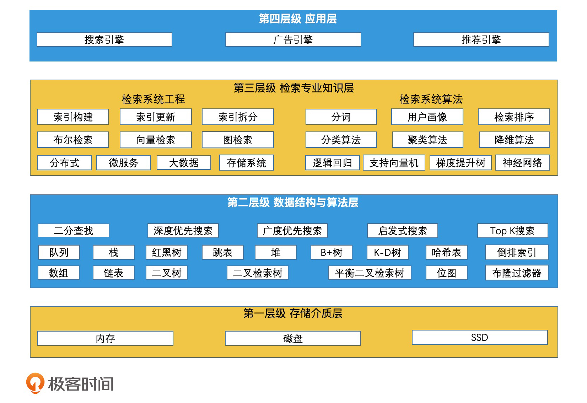

# 检索技术核心20讲 #

## 开篇词 | 学会检索，快人一步！ ##

### 为什么要学习检索技术？ ###

检索：本质其实都是在海量的信息中，快速筛选出我们需要的内容或服务，而这都和检索技术紧密相关。

* 检索技术：它是更底层的通用技术，它研究的是如何将我们所需的数据高效地取出来。
* 了解和使用合适的检索技术，往往能有效提升整个程序的执行效率

### 为什么检索技术难学？ ###

1. 经典教材太过理论化，《现代信息检索》和《信息检索导论》
2. 和实际工作结合的教材，往往都是从某一行业的视角出发，全面介绍这个行业方方面面的所有技术，而不是专注于某一个基础技术。

比如说，数据库方面的教材，一般会介绍关系模型、SQL 语句、事务处理等内容；搜索引擎方面的教材会介绍爬虫系统、文本挖掘、自然语言处理、网页链接分析等内容，真正涉及检索技术的篇幅并不多。

### 专栏是如何设计的？ ###

核心分为三个部分：

* 基础技术篇，核心的数据结构和检索算法作为入门，开启整个专栏的讲解。
* 进阶实战篇，结合工业界的实际应用场景，更深入地介绍一些高级检索技术，总结一些架构设计的思想，让你能学习到许多工业界的实用且有技术深度的解决方案。
* 系统案例篇，对当前热门的各个方向进行系统分析，比如，存储系统、搜索引擎、广告系统、推荐系统等。

检索技术是什么->利用检索技术解决实际问题->为什么这么用

### 精选留言 ###

#### 1 ####

**Q**

如何搭建公司的搜索引擎系统，希望做到业务数据不受到搜索引擎服务的影响，同时搜索引擎能比较实时提供查询统计功能。

**A**

看你们的“实时查询统计”的需求到底是怎么样的。如果是简单的一些固定统计，那么elastic search就可以提供；但如果是偏OLAP的灵活分析查询需求，那其实Druid和clickhouse是更合适的选择。
ps:Druid和clickhouse都是基于lsm树实现的。lsm树在进阶实战篇和系统案例篇中我都会介绍。

#### 2 ####

**Q**

想咨询下 我用es7 做检索 比如有mysql 的测站数据 测站相关属性数据（根据测站类型不同 属性字段不同） 测站相关监测数据（根据测站类型不同监测数据字段也不同）。如何建立数据模型，建完模型有的能根据logtash 直接通过sql语句导入，有的没法导入 如何导入到es中呢，是不是要手动编码从mysql 写入到es中

**A**

作者回复: 自己动手写代码和脚本导入肯定更灵活。
不过logstash已经是常见工具了，一般来说可以根据错误提示排查问题解决的。常见问题往往都是字段定义冲突这类问题，你可以看一下提示，然后检查一下你们数据库的字段设计，看看能否统一处理？

**Q**

我们现在已经建了数据库 不可能更改mysql 字段 ，现在就是要做检索，是不是必须得包mysql数据都导入到es中才能进行检索的开发

**Q**

检索是否与数据的存储是息息相关的呢？

**A**

是的。检索效率和存储的数据结构，甚至存储的介质息息相关。
因此想写出高效的程序，搭建高效的系统，需要有这些知识基础。
我在导读里有梳理出这些知识结构和学习路径，你可以参考。

## 导读 | 三步走策略，轻松搞定检索！ ##

梳理了和我们的工作有较强相关性的检索知识

从基础到实际应用，将需要学习的检索技术分为了四个层级，从上到下：

1. 第一层是**存储介质层**，存储介质的特性是我们需要学习的基础知识。
2. 第二层是**数据结构与算法层**，要知道如何利用每个数据结构和算法的特点，来提高检索效率。
3. 第三层是**检索专业知识层**，想实现工业界中的检索引擎，需要掌握这些检索技术。我把它们划分为两部分，分别是**工程架构和算法策略**。这些内容是我们解决常见业务问题的必备知识。
4. 第四层是检索技术的**应用层**，其中最常见的，有搜索引擎、广告引擎、以及推荐引擎。这些业务系统有相似的工程架构和算法部分，也分别有自己独特的业务处理环节。

三步走策略：

#### 第一步：夯实基础 ####

#### 第二步：在实践中将技术落地 ####

## 结束语 | 成长和进化，技术如此，我们亦如此 ##

### 精选留言 ###

**A**

现在我们对于数据库的使用也是混合的机制，从关系数据库，kv数据库到时序数据库都有(MySQL+TiDB+Redis+aerospike+opentsdb)。

