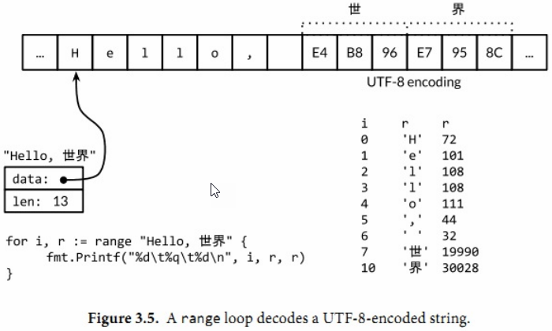

# Go圣经 #

## 前言 ##

## 第1章 入门 ##

### 1.1. Hello，World ###

Go语言的代码通过包（package）组织，包类似于其他语言里的库（libraries）或者模块（modules）。一个包由位于单个目录下的一个或多个.go源代码文件组成，目录定义包的作用。

每个源文件都以一条`package`声明语句开始，这个例子里就是package main，表示该文件属于哪个包，紧跟着一系列导入（import）的包，折后是存储在这个文件里的程序语句。

main包定义了一个独立可执行的程序，而不是一个库。在`main`里`main`函数也很特殊，它是整个程序执行的入口。

`import`声明必须跟在文件的`package`声明之后。则是组成程序的函数、变量、常量、类型的声明语句（分别由关键字func，var，const，type定义）。

一个函数䣌声明由`func`关键字、函数名、参数列表、返回值列表以及包含在大括号里的函数体组成。

### 1.2. 命令行参数 ###

os包以跨平台的方式，提供了一些与操作系统交互的函数和变量。程序的命令行参数可从os包的Args变量获取；os包外部使用os.Args访问该变量。

os.Args变量是一个字符串（string）的切片（slice）

os.Args的第一个元素，os.Args[0]，是命令本身	的名字；其他的元素则是程序启动时传给它的参数。s[m:n]形式的切片表达式，产生从第m个元素到第n-1个元素的切片。

#### 练习 1.3 ####

等1.6回来再看

### 1.3. 查找重复的行 ###

灵感来自unix的`uniq`命令

map存储了键/值（key/value）的集合，`Go`的`map`类似于`Java`语言中的`HashMap`，Python语言中的`dict`，`Lua`语言中的 `table`，通常使用`hash`实现。

	%d 十进制整数
	%x, %o, %b 十六进制，八进制，二进制这个农户
	%f，%g，%e 浮点数：3.141593 3.141592653589793 3.141593e+00
	%t 布尔：true或false
	%c 字符（rune）(Unicode码点)
	%s 字符串
	%q 带双引号的字符串“abc”或带单引号的字符'c'
	%v 变量的自然形式（natural format）
	%T 变量的类型
	%% 字面上的百分号标志（无操作数）

### 1.4. GIF动画 ###

image package

### 1.5. 获取URL ###

net/http和io/ioutil包

http.Get函数是创建HTTP请求的函数，如果获取过程没有出错，那么会在resp这个结构体中得到访问的请求结果。resp的Body字段包括一个可读的的服务器响应流。

ioutil.ReadAll函数从response中读取全部内容。

练习 1.7 1.8 1.9

### 1.7 Web服务

Go语言的内置库使得写一个类似fetch的web服务器变得异常地简单。

## 第2章 程序结构 ##

### 2.1 命名 ###

Go语言中的函数名、变量名、常量名、类型名、语句标号和包名等所有的命名，都遵循一个简单的命名规则：一个名字必须以一个字母（Unicode字母）或下划线开头，后面可以跟任意数量的字母、数字或下划线。大写字母和小写字母是不同的：heapSort和Heapsort是两个不同的名字。

Go语言中类似if和switch的关键字有25个：关键字不能用于自定义名字，只能在特定语法结构中使用。

	s := "" //只能用在函数内部，而不能用于包变量
	var s string //依赖于字符串的默认初始化零值机制，被初始化为""
	var s = "" //用的极少，除非同时声明多个变量
	var s string = "" 显式地标明变量的类型，当变量类型与初值类型相同时，类型冗余，但如果两者类型不同，变量类型就必须了。

### 2.2 声明 ###

* var 变量
* const 常量
* type 类型
* func 函数

### 2.3 变量 ###

var声明语句可以创建一个特定类型的变量，然后给变量附加一个名字，并且设置变量的初始值。

	var 变量名字 类型 = 表达式

#### 2.3.1 简短变量声明 ####

#### 2.3.2 指针 ####

一个变量对应一个保存了变量对应类型值的内存空间。普通比那辆在声明语句创建时被绑定到一个变量名，比如叫x的变量。

	x := 1
	p := &x	// p, of type * int, points to x
	fmt.Println(*p) // "1"
	*p = 2	// equivalent to x =2
	fmt.Println(x) // "2"

### 2.4 赋值 ###

使用赋值语句可以更新一个变量的值，最简单的赋值语句是将要被赋值的变量放在=的左边，新值的表达式放在=的右边。

	x = 1 // 命名变量的赋值
	*p = true // 通过指针间接赋值
	person.name = "bob" // 结构体字段赋值
	count[x] = count[x] * scale // 数组、slice或map的元素赋值

----

	count[x] *= scale

#### 2.4.1 元祖赋值 ####

元祖赋值是另一种形式的赋值语句，它允许同时更新多个变量的值。

	x, y = y, x
	a[i], a[j] = a[j], a[i]
	
	f, err = os.Open("foo.txt") // function call return s two values

#### 2.4.2 可赋值性 ####

赋值语句是显式的赋值形式，但是程序中没有很多地方会发生隐式的赋值行为。

### 2.5 类型 ###

### 2.6 包和文件 ###

### 2.7 作用域 ###

一个声明语句将程序中的实体和一个名字关联。

## 第3章 基础数据类型 ##

Go语言数据类型分为四类：基础类型、符合类型、引用类型和接口类型。

* 基础类型：
  * 数字
  * 字符串
  * 布尔型
* 复合数据类型：
  * 数组
  * 结构体
* 引用类型包括指针、切片、字典、函数、通道
* 接口类型

### 3.1 整型 ###

Go语言的数值类型包括几种不同大小的整形数、浮点数和复数。每种数值类型都决定了对应的大小范围和是否支持正负符号。

Go语言同时提供了有符号和无符号类型的整数运算。

* int8、int16、int32和int64四种截然不同大小的有符号整数类型分别对应8、16、32、64bit大小的有符号整数
* 与此对应的是uint8、uint16、uint32和uint64四种无符号整数类型
* 无符号的整数类型uintptr，没有指定具体的bit大小但是足以容纳指针。uintptr类型只有在底层编程时才需要

### 3.2 浮点数 ###

Go语言提供了两种精度的浮点数，float32和float64。

常量math.MaxFloat32标识float32能标识的最大数值，大约是3.4e38;对应的math.MaxFloat64常量大约是1.8e308。

### 3.3 复数 ###

complex64和complex128分别对应float32和float64

	var x complex128 = complex(1, 2) // 1+2i
	var y complex128 = complex(3, 4) // 1+2i
	fmt.Println(x*y) // "(-5+10i)"
	fmt.Println(real(x*y)) // "-5"
	fmt.Println(imag(x*y)) // "10"

### 3.4 布尔型 ###

### 3.5 字符型 ###

一个字符串是一个不可改变的字节序列。字符串可以包含任意的数据，包括byte值0。

	s := "hello, world"
	fmt.Println(len(s))
	fmt.Println(s[0], s[7])
	c := s[len(s)] // pansic: index out of range
	fmt.Println(s[0:5]) // "hello"
	fmt.Println(s[:5]) // "hello"
	fmt.Println(s[7:]) // "world"
	fmt.Println(s[:]) // "hello,world"
	fmt.Println("goodbye" + s[5:]) // "goodbye, world"

字符串的值是不可变的

	s[0] = 'L' // compile error: cannot assign to s[0]

#### 3.5.1 字符串面值 ####

	\a 响铃
	\b 退格
	\f 换页
	\n 换行
	\r 回车
	\t 制表符
	\v 垂直制表符
	\' 单引号
	\" 双引号
	\\ 反斜杠

#### 3.5.2. Unicode ####

#### 3.5.3. UTF-8 ####

字符串包含13个字节，以UTF8形式编码，但是只对应9个Unicode字符：

	import "unicode/utf8"
	s := "Hello, 世界"
	fmt.Println(len(s)) // "13"
	fmt.Println(utf8.RuneCountInString(s)) // "9"

----

	for i, r := range "Hello, 世界" {
		fmt.Printf("%d\t%q\t%d\n", i, r, r)
	}
	
	n := 0
	for _, _ = range s {
		n++
	}

### 3.6 常量 ###

常量表达式的值在编译期计算，而不是在运行期。每种常量的潜在类型都是基础类型：boolean、string或数字。

一个常量的声明语句定义了常量的名字，和变量的声明语法类似，常量的值不可修改。

	const pi = 3.14159 // approximately; math.Pi is a better approximation

和变量声明一样，可以批量的声明多个常量；

	const (
		e = 
		pi
	)

所有常量的运算都可以在编译期完成，这样可以减少运行时的工作，也方便其他编译优化。（当操作数是常量时，一些运行时的错误也可以在编译时被发现，例如整数除零、字符串索引越界、任何导致无效浮点数的操作等。）

常量间的所有算术运算、逻辑运算和比较运算的结果也是常量，对常量的类型转换操作以下函数调用都是返回常量结果：len、cap、real、imag、complex和unsafe.Sizeof()

因为它们的值是在编译期就确定的，因此常量可以是构成类型的一部分，例如用于指定数组类型的长度：

	const IPv4Len = 4
	
	// parseIPv4 parses an IPv4 address (d.d.d.d).
	func parseIPv4(s string) IP {
		var p [IPv4Len]byte
		// ...
	}

一个常量的声明也可以包含一个类型和一个值，但是如果没有显式指明类型，那么将从右边的表达式推断类型。

#### 3.6.1. iota常量生成器 ####

常量声明可以使用iota常量生成器初始化，它用于生成一组以相似规则初始化的常量，但是不用每行都写一遍初始化表达式。在一个const声明语句中，在第一个声明的常量所在的行，iota将会被置为0，然后在每一个有常量声明的行加一。

	type Weekday int
	
	const (
		Sunday Weekday = iota
		Monday 
		Tuesday
		Wednesday
		Thursday
		Friday
		Saturday
	)

周日将对应0，周一为1，如此等等。

#### 3.6.2. 无类型常量

## 第4章 复合数据 ##

数组、slice、map和结构体

数组和结构体是聚合类型；它们的值由许多元素或成员字段的值组成。数组是由同构的元素组成——每个数组元素都是完全相同的类型——结构体则是由异构的元素组成的。数组和结构体都是有固定内存大小的数据结构。相比之下，slice和map则是动态的数据结构，它们将根据需要动态增长。

### 4.1 数组 ###

数组是一个由固定长度的特定类型元素组成的序列，一个数组可以由零个或多个元素组成。

数组的每个元素可以通过索引下标来访问，索引下标的范围是从0开始到数组长度减1的位置。内置的len函数将返回数组中元素的个数。

	var a [3]int // array of 3 integers
	fmt.Println(a[0]) // print the first element
	fmt.Println(a[len(a)-1]) // print the last element, a[2]
	
	// Print the indices and elements.
	for i, v := range a {
		fmt.Printf("%d %d\n", i, v)
	}
	// Print the elements only.
	for _, v := range a {
		fmt.Printf("%d\n", v)
	}

默认情况下，数组的每个元素都被初始化为元素类型对应的零值，对于数字类型来说就是0。

	var q [3]int = [3]int{1, 2, 3}
	var r [3]int = [3]int{1, 2}
	fmt.Println(r[2]) // "0"

在数组字面值中，如果在数组的长度位置出现的是“...”省略号，则表示数组的长度是根据初始化值的个数来计算。

	q := [...]int{1, 2, 3}
	fmt.Printf("%T\n", q) // "[3]int"

数组的长度是数组类型的一个组成部分，因此[3]int和[4]int是两种不同的数组类型。数组的长度必须是常量表达式，因为数组的长度需要在编译阶段确定。

	q := [3]int{1, 2, 3}
	q = [4]int{1, 2, 3, 4} // compile error: cannot assign [4]int to [3]int

### 4.2 Slice ###

Slice（切片）代表变长的序列，序列中每个元素都有相同的类型。一个slice类型一般写作[]T，其中T代表slice中元素的类型；slice的语法和数组最像，只是没有固定长度而已。

数组和slice，一个slice是一个轻量级的数量结构，提供了访问数组子序列（或者全部）元素的功能，而且slice的底层确实引用一个数组对象。

## 第5章 函数 ##

### 5.1 函数声明 ###

函数声明包含函数名、形式参数列表、返回值列表以及函数体。

	func add(x int, y int) int {return x + y}
	func sub(x ,y int) (z int) {z = x - y; return}
	func first(x int, _ int) int {return x}
	func zero(int, int) int {return 0}
	fmt.Printf("%T\n", add)
	fmt.Printf("%T\n", sub)
	fmt.Printf("%T\n", first)
	fmt.Printf("%T\n", zero)

函数的类型被称为函数的标识符。如果两个函数形式参数列表和返回值列表中的变量类型一一对应，那么这两个函数被认为有相同的类型和标识符。

	package math
	
	func Sin(x float64) float // implemented in assembly language

### 5.2 递归 ###

## 第七章 接口

接口类型是对其它类型行为的抽象和概括；因为接口类型不会和特定的实现细节绑定在一起，通过这种抽象的方式我们可以让我们的函数更加灵活和更具有适应能力。

### 7.1 接口约定

使用两个相似的函数来进行字符串的格式化：fmt.Printf，它会把结果写到标准输出，和fmt.Sprintf，它会把结果以字符串的形式返回。

## 第十章 包和工具

Go语言有超过100个的标准包（译注：可以用`go list std | wc -l`命令查看标准包的具体数目），标准库为大多数的程序提供了必要的基础构件。

### 10.1. 包简介

1. 

## 第十二章 反射

Go语言提供了一种机制，能够在运行时更新变量和检查它们的值、调用它们的方法和它们支持的内在操作，而不需要在编译时就知道这些变量的具体类型。

Go语言的反射特性：

* 一个是fmt包提供的字符串格式化功能
* 另一个是类似encoding/json和encoding/xml提供的针对特定协议的编解码功能

### 12.1 为何需要反射?

## 第十三章 底层编程

unsafe包是一个采用特殊方式实现的包。

### 13.1 unsafe.Sizeof, Alignof 和 Offsetof

