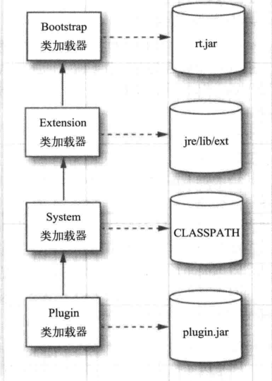

# Java核心技术 卷2 高级特性 #

## 第1章 流与文件 ##

### 1.1 流 ###

在Java API中，可以从其中读入一个字节序列的对象称作*输入流*，而可以向其中写入一个字节序列的对象称作*输出流*。抽象类InputStream和OutputStream构成了输入/输出（I/O）类层次结构的基础。

#### 1.1.1 读写字节 ####

InputStream类有一个抽象方法：

	abstract int read()
读入一个字节，并返回读入的字节，或者在遇到输入源结尾时返回-1.

	abstract void write(int b)
它可以向某个输出位置写出一个字节。

read和write方法在执行时都将*阻塞*，直至字节确实被读入或写出。这就意味着如果流不能被立即访问（通常是因为网络连接忙），那么当前的线程将被阻塞。这使得在这两个方法等待指定流变为可用的这段时间里，其他的线程就有机会去执行游泳的工作。

available方法使我们可以去检查当前可读入的字节数量，这意味这下面这样的代码片段就不可能被阻塞：

**java.io.InputStream 1.0**

* abstract int read() 从数据中读入一个字节，并返回该字节。这个read方法在碰到流的结尾时返回-1.
* int read(byte[] b) 读入一个字节数组，并返回实际读入的字节数，或者在碰到流的结尾时返回-1.这个read方法最多读入b.length个字节。
* int read(byte[] b, int off, int len)读入一个字节数组。这个read方法返回实际读入的字节数，或者碰到流的结尾时返回 -1。

|参数||
|--|--|
|b|数据读入的数组|
|off|第一个读入字节应该被放置的位置在b中的偏移量|
|len|读入字节的最大数量|

* long skip(long n) 在输入流中跳过n个字节，返回实际跳过的字节数（如果碰到流的结尾，则可能小于n）。
* int available() 
* void close() 关闭这个输入流
* void mark(int readlimit)  
* void reset() 返回到最后一个标记，随后对read的调用将
* boolean markSupported() 如果这个流支持打标记，则返回true

**Java.io.OutputStream**

* abstract void write(int n) 写出一个字节的数据
* void write(byte[] b)
* void write(byte[] b, int off, int len) 写出所有字节或者某个范围的字节到数组b中。

|参数|说明|
* void close() 冲刷并关闭输出流
* void flush() 冲刷输出流，也就是将所有缓冲的数据发送到目的地

#### 1.1.2 完整的流家族 ####

与C语言只有单一类型 FILE*包打天下不同，Java拥有一个流家族，包含各种流类型，其数量超过60个！

让我们把流家族中的成员按照它们的使用方法来进行划分，这样就形成了处理字节和字符的两个单独的层次结构。InputStream和OutputStream类可以读写单个字节或字节数组。

	abstract int read()
	abstract void write(int c)
read方法将返回一个Unicode码元（一个在0~65535之间的整数），或者在碰到文件结尾时返回-1.write方法在被调用时，需要传递一个Unicode码元。

**java.io.Closeable 5.0**

* void close() 关闭这个Closeable，这个方法可能会抛出IOException

**java.io.Flushable 5.0**

* void flush() 冲刷这个Flushable。

**java.io.Flushable 5.0**

* void flush() 冲刷这个Flushable。

**java.io.Readable 5.0**

* int read(CharBuffer cb) 尝试着向cb读入其可持有数量的char值。返回读入的char值的数量，或者当从这个Radable中无法再获得更多的值返回-1。

**java.io.Appendable 5.0**

* Appendable append(char c)
* Appendable append(charSequence cs)

向这个Appendable中追加给定的码元或者给定的序列中的所有码元，返回this。

**java.io.CharSequence 1.4**

* char charAt(int index) 返回给定索引处的码元。
* int length() 返回在这个序列中的码元的数量。
* CharSequence subSequence(int startIndex, int endIndex) 返回由存储在startIndex到endIndex-1处的所有码元构成的CharSequence。
* String toString() 返回这个序列中所有码元构成的字符串。

#### 1.1.3 组合流过滤器 ####

FileInputStream和FileOutputStream可以提供附着在一个磁盘文件上的输入流和输出流，而只需向其构造器提供文件名或文件的完整路径名。

	FileInputStream fin = new FileInputStream("employee.dat")

所有再java.io中的类都将相对路径名解释为以用户工作目录开始，可以通过调用System.getProperty("user.dir")来获得这个信息。

与抽象类InputStream和OutputStream一样，这些类只支持在字节级别上的读写，也就是说，我们只能从fin对象中读入字节和字节数组。
	
	byte b = (byte)fin.read();

DataInputStream，只能读入数值类型：

	DataInputStream din = ...;
	double s = din.readDouble();

某些流（例如FileInputStream和由URL类的openStream方法返回的输入流）可以从文件和其他更外部的位置上获取字节，而其他的流（例如DataInputStream和PrintWriter）可以从法国字节组装到更有用的数据类型中。

	FileInputStream fin = new FileInputStream("employee.dat");
	DataInputStream din = new DataInputStream(fin);
	double s = din.readDouble();

FilterInputStream和FileterOutputStream类的子类可以向原生字节流添加额外的功能。

	DataInputStream din = new DataInputStream(new BufferedInputStream(new FileInputStream("employee.dat")));

**java.io.FileInputStream 1.0**

* FileOutputStream(String name)
* FileOutputStream(String name, boolean append) 
* FileOutputStream(File file)
* FileOutputStream(File file, boolean append)  
使用由name字符串或file对象指定路径名的文件创建一个新的文件输出流。如果append参数为true，那么数据将被添加到文件尾，而具有相同名字的已有文件不会被删除；否则，这个方法会删除所有具有相同的已有文件。

**java.io.BufferedInputStream 1.0**

* BufferedInputStream(InputStream in) 创建一个带缓冲区的流。带缓冲区的输入流在从流中读入字符时，不会每次都对设备访问。当缓冲区为空时，会向缓冲区读入一个新的数据块。

**java.io.BufferedOutputStream 1.0**

* BufferedOutputStream(OutputStream out) 创建一个带缓冲区的流。带缓冲区的输出流在收集要写出的字符时，不会每次都对设备访问。当缓冲区填满或当流被冲刷时，数据就被写出。

**java.io.PushbackInputStream 1.0**

* PushbackInputStream(InputStream in)
* PushbackInputStream(InputStream in, int size) 构建一个可以预览一个字节或者具有指定尺寸的回推缓冲区的流。
* void unread(int b) 回推一个字节，它可以在下次调用read时被再次获取。 参数： b 要再次读入的字节。

## 1.2 文本输入与输出 ##

在保存数据时，可以选择二进制格式或文本格式。

在存储文本字符串时，需要考虑字符编码（cuaracter encoding）方式。在UTF-16编码方式中，字符串“1234”编码为 00 31 00 32 00 33 00 34 十六进制）。但是，许多程序都希望文本文件按照其他的编码方式编码。在ISO 8859-1中，字符串将写出31 32 33 34，其中没有任何0字节。

OutputStreamWriter类将使用选定的字符编码方式，把Unicode字符流转换为字节流。而InputStreamReader类将包含字节（用某种字符编码方式表示的字符）的输入流转换为可以产生Unicode码元的读入器。

	InputStreamReader in = new InputStreamReader(System.in);

假定使用主机系统所使用的默认字符。

	InputStreamReader in = new InputStreamReader(new FileInputStream("kremlin.dat"), "ISO8859_5")

### 1.2.1 如何写出文本输出 ###

文本输出，可以使用PrintWriter。这个类拥有以文本格式打印字符串和数字的方法，还有一个将PrintWriter链接到FileWriter的便捷方法。

	PrintWriter out = new PrintWriter("employee.txt");
	等价： PrintWriter out = new PrintWriter(new FileWriter("employee.txt"));

通过使用PrintWriter(Writer out, Boolean autoFlush)来启用或禁用自动冲刷机制：

	PrintWriter out = new PrintWriter(new FileWriter("employee.txt"), true); //autoflush

**java.io.Printer 1.1**

* PrintWriter(Writer out) 
* PrintWriter(Writer out, boolean autoFlush) 创建一个新的PrintWriter。 参数： out 一个用于字符输出的写出器。 autoflush 如果为true， 则println方法将冲刷输出缓冲区（默认值：false）
* PrintWriter(OutputStream out)
* PrintWriter(OutputStream out, boolean autoflush) 通过创建必须的中介OutputStreamWriter，从已有的OutputStream中创建一个新的PrintWriter。
* PrintWriter(String filename)
* PrintWriter(File file) 通过创建必须的中介FileWriter，创建一个向给定的文件写出的新的PrintWriter。
* void print(Object obj) 通过打印从toString产生的字符串来打印一个对象。 参数：obj 要打印的对象。
* void print(String s) 打印一个包含Unicode码元的字符串。
* void println(String s) 打印一个字符串，后面紧跟一个行终止符。如果这个流处于自动冲刷模式，那么就会冲刷这个流。
* void print(char[] s) 打印在给定的字符串中的所有Unicode码元。
* void print(char c) 打印一个Unicode码元。
* void print(int i)
* void print(long l)
* void print(float f)
* void print(double d)
* void print(boolean b) 以文本格式打印给定的值
* void printf(String format, Object ... args) 按照格式字符串指定的方式打印给定的值。
* boolean checkError() 如果产生格式化或输出错误，则返回true。一旦这个流碰到了错误，它就收到了忽然，并且所有对checkError的调用都将返回true。

#### 1.2.2 如何读入文本输入 ####

* 以二进制格式写出数据，需要使用DataOutputStream。
* 以文本格式写出数据，需要使用PrintWriter。

#### 1.2.3 以文本格式存储对象 ####

#### 1.2.4 字符集 ####

在Java SE1.4中引入的java.nio包用Charset类统一了对字符集的转换。
字符集建立了两字节Unicode码元序列与使用本地字符编码方式的字节序列之间的映射。

Charset类使用的是由IANA字符集注册中心标准化的字符集名字。

aliases方法可以返回由别名构成的Set对象。下面是迭代遍历这些别名的代码：

	Set<String> aliases = cset.aliases();
	for (String alias : aliases)
		System.out.porintln(alias);

字符集名字是大小写不敏感的。

为了确定在某个特定实现中哪些字符集是可用的，可以调用静态的availableCharsets方法。使用下面的代码可以确定所在可用字符集的名字。

一旦有了字符集，就可以使用它在包含Unicode码元的Java字符串和编码而成的字节序列之间进行转换。

	String str = ...;
	ByteBuff buff = cset.encode(str);
	byte[] bytes = buffer.array()

与之相反，要想解码字节序列，需要有字节缓冲区。使用ByteBuffer数组的静态方法wrap可以将一个字节数组转换成一个字节缓冲区。decode方法的结果是一个CharBuffer，调用它的toString方法可以获得一个字符串。

	byte[] bytes = ...;
	ByteBuffer bbuf = ByteBuffer.wrap(bytes, offset, length);
	CharBuffer cbuf = cset.decode(bbuf);
	String str = cbuf.toSgtring();

java.nio.charset.Charset 1.4

#### 1.2.3 以文本格式存储对象 ####

## 1.4 ZIP文档 ##

ZIP文档（通常）以压缩格式存储了一个或多个文件，每个ZIP文档都由一个头，包含诸如每个文件名字和所使用的压缩方法等消息。

在Java中，可以使用ZipInputStream来读入ZIP文档。你可能需要浏览文档中每个单独的项，getNextEntry方法就可以返回一个描述这些项的ZipEntry类型的对象。ZipInputStream的read方法被修改为在碰到当前项的结尾时返回-1（而不是碰到ZIP文件的末尾），然后你必须调用closeEntry来读入下一项。

**java.util.zip.ZipInputStream 1.1**

* ZipInputStream(InputStream in) 创建一个ZipInputStream，使得我们可以从给定的InputStream向其中填充数据。 
* ZipEntry getNextEntry() 为下一项返回ZipEntry对象，或者在没有更多的项时返回null。
* void closeEntry() 关闭这个ZIP文件中当前打开的项。之后可以通过使用getNextEntry()读入下一项。

**java.util.zip.ZipOutStream 1.1**

* ZipOutputStream(OutputStream out) 创建一个将压缩数据写出到指定的OutputStream的ZipOutputStream。
* void putNextEntry(ZipEntry ze) 将给定的ZipEntry中的信息写出到流中，并定位用于写出数据的流，然后这些数据可以通过write写出到这个流中。
* void closeEntry()
* void setLEevel(int level) 设置后续的各个DEFLATED项的默认压缩级别。这里默认值是Deflater.DEFAULT_COMPRESSION。如果级别无效，则抛出IllegalArgumentException。
* void setMethod(int method) 设置用于这个ZipOutputStream的默认压缩方法，这个压缩方法会作用于所有没有指定压缩方法的顶上。 参数：method 压缩方法， DELATED或STORED

**java.util.zip.ZipEntry 1.1**

* ZipEntry(String name) 用给定的名字构建一个Zip项。 参数：name
* long getCrc() 返回用于这个ZipEntry的CRC32校验和的值。 

**java.util.zip.ZipFile 1.1**

* ZipFile(String name)
* ZipFile(File file) 创建一个ZipFile，用于从给定的字符串或File对象中读入数据
* Enumeration entries()
* ZipEntry getEntry

### 1.5 对象流与序列化 ###

### 1.6 操作文件 ###

Path和Files类封装了在用户机器上处理文件系统所需的所有功能。Path和Files是在Java SE7中新添加进来的类，它们用起来比JDK 1.0依赖就一直使用的File类要方便得多。

#### 1.6.1 Path ####

Path表示的是一个目录名序列，气候还可以跟着文件名

**java.nio.file.Paths 7**

* static Path get(String first, String ...more)

**java.nio.file.Path 7**

* Path resolve(Path other)

* Path resolve(String other)

* Path resolveSibling(Path other)

* Path resolveSibling(String other)

#### java.io.File.1.0 ####

#### 1.6.2 读写文件 ####

Files类可以使得普通文件变得快捷。

	byte[] bytes = Files.readAllBytes(path)
	如果想将文件当作字符串读入，那么可以在调用readAllBytes之后执行
	String content = new String(bytes, charset);
	List<String> lines = Files.readAllLines(path, charset);
	Files.write(path, content.getBytes(charset)); 向指定文件追加内容
	Files.write(path, content.getBytes(charset), StandardOpenOption.APPEND);

**java.nio.file.Files 7**

* static byte[] readAllBytes(Path path)
* static List<String> readAllLines(Path path, Charset charset) 读入文件的内容
* static Path write(Path path, byte[] contents, OpenOption...options)
* static Path write(Path path, Iterable<? extends CharSequence> contents, OpenOption options) 将给定内容写出倒文件中，并返回path
* static InputStream newInputStream(Path path, Open)

#### 1.6.3 复制、移动和删除文件 ####

将文件从一个位置复制倒另一个位置可以直接调用

	Files.copy(fromPath, toPath);

移动文件（即复制并删除原文件）可以调用

	Files.move(fromPath, toPath);

如果 目标路径已经存在，那么复制

	Files.copy(fromPath, toPath, StandardCopyOption.REPLACE_EXISTING, )

**java.nio.file.Files 7**

* static Path copy(Path from, Path to, CopyOption... options)
* static Path move(Path from, Path to, CopyOption... options); 将from复制或移动到给定位置，并返回to
* static void delete(Path path)
* static boolean deleteIfExists(Path path)
删除给定文件或空目录。第一个方法在文件或目录不存在情况下抛出异常，而第二个方法在这种情况下会返回false。

#### 1.6.4 创建文件和目录 ####

创建新目录可以调用

	Files.createDirectory(path);

要创建路径中的中间目录，应该使用

	Files.createDirectories(path)

创建一个空的文件：

	Files.createFile(path);

**java.nio.file.Files 7**

* static Path createDirectory(Path path, FileAttribute<?>... attrs)
* static Path createDirectory(Path path, FileAttribute<?>... attrs)

#### 1.6.5 获取文件信息 ####

下面静态方法都将返回一个boolean值

* exists
* isHidden
* isReadable,isWriteable,isExecutable
* isRegularFile,isDirecotry,IsSymbolicLink

#### 1.6.6 迭代目录中的文件 ####

旧的File类有一个方法，可以用来获取一个目录中的所有文件构成的数组，但是当目录中

#### 1.6.7 ZIP文件系统 ####

### 1.7 内存映射文件 ###

大多操作系统都可以利用虚拟内存实现来将一个文件或者文件的一部分“映射”到内存中。

java.nio包使内存映射变得简单。首先，从文件中获得一个通道（channel），通道是用于磁盘文件的一种抽象，（内存映射、文件加锁机制以及文件间快速数据传递等操作系统特性）

	FileChannel channel = FileChannel.open(path, options);

通过调用FileChannel类的map方法从通道中获得一个ByteBuffer。

#### 1.7.1 缓冲区数据结构 ####

## 第2章 XML ##

### 2.1 XML概述 ###

尽管HTML与XML同宗同源，但是两者之间存在着重要的区别：

* 与HTML不同，XML是大小写敏感的。例如，<H1>和<h1>是不同的XML标签。

**XML文档的结构**

XML文档应当以一个文档头开始，

	<?xml version="1.0"?>
或者
	<?xml version="1.0" encoding="UTF-8"?>

最后，XML文档的正文包含根元素，根元素包含其他元素。

	<?xml version="1.0"?>
	<!DOCTYPE configuration ...>
		<title>
			
				<name>Helvetica</name>
				<size>36</size>
			
		</title>
	</configuration>

元素可以有子元素(child element)、文本或两者皆有。在上述例子中，font元素有两个子元素，它们是name和size。name元素包含文本“Helvetica”。

XML元素可以包含属性

	<size unit="pt">36</size>

转而使用元素，许多游泳的文档根本不使用属性。

* 字符引用（character reference）的形式是&#十进制值；或&#x十六进制；
* 实体引用（entity reference）的形式是&name
* CDATA部分（CDATA Section）用<![CDATA[ 和 ]]>来限定其界限。
* 处理指令（processing instruction）是那些专门在处理XML文档的应用程序中使用的执行，它们将用<?和?>来限定其界限。

### 2.2 解析XML文档 ###

* 像文档对象模型（Docuemtn Object Model，DOM）解析器这样的树型解析器（tree parser），它们将读入的XML文档转换成树结构。
* 像XML简单API（Simple API for XML，SAX）解析器这样的流机制解析器（streaming parser），它们在读入XML文档时生成相应的事件。

DOM解析器的接口已经被W3C标准化了。org.w3c.dom包包含了这些接口类型的定义，比如：Document和Element等。

要读入一个XML文档，首先需要一个DocuemtBuilder对象，可以从DocumentBuilderFactory中得到这个对象。

	DocumentBuilderFactory factory = DocumentBuilderFactory.newInstance();
	DocumentBuilder builder = factory.newDocumentBuilder();

从文件中读入某个文档：

	File f = ...
	Document doc = builder.parse(f);

或者，可以用一个URL：

	URL u = ...
	Document doc = builder.parse(u);

设置可以指定一个任意的输入流：

	InputStream in = ...
	Document doc = builder.parse(in);

Document对象是XML文档的树型结构在内存中的表现，它由实现了Node接口及其各种子接口的类的对象构成。

可以通过调用getDocumentElement方法来启动对文档内容的分析，它将返回根元素。

	Element root = doc.getDocumentElement();

	NodeList children = root.getChildNodes();
	for (int i = 0; i < children.getLength(); i++) {
			Node child = children.item(i)
	}

也可以用getLastChild方法得到最后一项子元素，用getNextSibling得到下一个兄弟节点。
	
	for (Node childNode = element.getFirstChild();
		childNode != nill;
		childNode = childNode.getNextSibling()) {
		...
	}

如果要枚举结点的属性，可以调用getAttributes方法。它返回一个NamedNodeMap对象，其中包含了描述属性的Node对象。可以用和遍历NodeList一样的办法在NamedNodeMap中遍历各子结点。调用getNodeName和getNodeValue方法可以得到属性名和属性值。

表的单元格渲染器显示了以下内容：

* 对元素，显示的是元素标签名和由所有的属性构成的一张表。
* 对字符数据，显示的是界面（文本、注释、CDATA部分），后面跟着数据，其中换行和回车字符被\n和\r取代。
* 对其他所有的结点类型，显示的是类名，后面跟着toString的结果。

**javax.xml.parsers.DocumentBuilderFactory 1.4**

**javax.xml.parsers.DocumentBuilder 1.4**

**org.w3c.dom.Document 1.4**

**org.w3c.dom.Element 1.4**

**org.w3c.dom.Node 1.4**

**org.w3c.dom.CharacterData 1.4**

**org.w3c.dom.NodeList 1.4**

**org.w3c.dom.NamedNodeMap 1.4**

* int getLength() 返回该节点映射表中的节点数。
* Node item(int index) 返回给定索引值的节点。索引值范围在0到getLength()-1之间。

### 2.3 验证XML文档 ###

	
		<name>Helvetica</name>
		<size>36</size>
	

首先得到第一个子节点，这事一个含有空白字符“\n”的文本节点。跳过文本节点找到第一个元素节点。然后，检查它的标签名是不是“name”，还要检查它是否有一个Text类型的子节点。接下去，转到下一个非空白字符的子节点，并进行同样的检查。那么，当文档作者改变了子元素的顺序或是加入另一个子元素会进行代码检查。

指定文档结构，可以提供一个文档类型定义（DTD）或一个XML Schema定义。DTD或schema包含了用于解释文档应如何构成的规则，这些规则指定了每个元素的合法子元素和属性。
	
	<!ELEMENT font (name, size)>

这个规则表示，一个font元素必须总是有两个子元素，分别是name和size。将同样的约束表示如下：

	<xsd:element name="font">
		<xsd:sequence>
			<xsd:element name="name" type="xsd:string" />
			<xsd:element name="size" type="xsd:int" />
		</xsd:sequence>
	</xsd:element>

与DTD相比，XML Schema可以表达更加复杂的验证条件。与DTD语法不同，Schema使用XML，这为处理Schema文件带来了方便。

#### 2.3.1 文档类型定义 ####

	<?xml version="1.0"?>
	<!DOCTYPE configuration [
		<!ELEMENT configuration ...>
		more rules
		...
	]>
	<configuration>
		...
	</configuration>

#### 2.3.2 XML Schema ####

### 2.4 使用XPath来定义信息 ###

### 2.5 使用命名空间 ###
	
### 2.7 生成XML文档 ###

用文档的内容构建一个DOM树，然后再写出该树的所有内容

#### 2.7.1 不带命名空间的文档 ####

建立一课DOM树，可以从一个空的文档开始。通过调用DocumentBuilder类的newDocument方法可以得到一个空文档。

	Document doc = builder.newDocument();

使用Document类的createElement方法可以构建文档里的元素：

	Element rootElement = doc.createElement(rootName);
	Element childElement = doc.createElement(childElement);

使用createTextNode方法可以构建文本节点：

	Text textNode = doc.createTextNode(textContens);

使用以下方法可以给文档添加根元素，给父节点添加子节点：

	doc.appendChild(rootElement);
	rootElement.appendChild(childElement);
	childElement.appendChild(textNode);

在建立DOM树时，还需要设置元素属性，只需要调用Element类的setAttribute方法：

	rootElement.setAttribute(name, value);

#### 2.7.2 带命名空间的文档 ####

如果要使用命名空间，那么创建文档的过程就会稍微有些区别。

首先，需要将生成器工厂设置为是命名空间敏感的，然后再创建生成器：

	DocumentBuilderFactory factory = DocumentBuildFactory.newInstance();
	factory.setNamespaceAware(true);
	...

然后使用createElementNS而不是createElement来创建所有节点：

	String namespace = "...";
	Element rootElement = doc.createElementNS(namespace, "svg");

	Element svgElement = doc.createElement(namespace, "svg:svg");

	rootElement.setAttributeNS(namespace, qulifiedName, value);

### 2.7.3 写出文档 ###

把DOM树写出到输出流中，使用可扩展的格式页转换（Extensible Stylesheet Language Transformations XSLT）API。

	Transformer t = TransformerFactory.newInstance().newTransformer();
	t.setOutputProperty(OutputKeys.DOCTYPE_SYSTEM, systemIdentifier);
	t.setOutputProperty(OutputKeys.DOCTYPE_PUBLIC, publicIdentifier);
	t.setOutputProperty(OutputKeys.INDENT, "yes");
	t.setOutputProperty(OutputKeys.METHOD, "xml");
	t.setOutputProperty("{http://xml.apache.org/xslt}indent-amount", "2");
	t.transform(new DOMSource(doc) new StreamResult(new FileOutputStream(file)));

另一种使用LSSerializer接口

	DOMImplementation impl = doc.getImplementation();

#### 2.7.4 示例：生成SVG文件 ####

**javax.xml.parsers.DocumentBuilder 1.4** 

* Document newDocument() 返回一个空文档

**org.w3c.dom.Document 1.4**

* Element createElement(String name)返回具有给定名字的元素
* Text createTextNode(String data) 返回具有给定数据的文本节点

**org.w3c.dom.Node 1.4**

* Node appendChild(Node child) 将一个节点附加到该节点的子节点列表，返回该节点

**org.w3c.dom.Element 1.4**

* void setAttribute(String name, String value) 
* void setAttributeNS(String uri, String qname, String value) 将有给定名字的属性设置为指定的值。

|参数|||
|--|--|--|
||uri|名字空间的URI或null|
||qname|限定名。如果有别的前缀，uri不能为null|
||value|限定值|

**javax.xml.transform.TramsformerFactory 1.4**

* static TransformerFactory newInstance() 返回TransformerFactory类的一个实例。
* transformer newTransformer() 返回Transformer类的一个实例，它用来实现标识符转换。

#### 2.7.5 使用StAx写XML文档 ####

一旦套接字被打开，java.net.Socket类中的getInputStream方法就会返回一个InputStream对象，该对象可以像其他任何流对象一样使用。

## 第3章 网络 ##

第一行代码用于打开一个套接字，网络软件的一个抽象概念，负责启动改程序内部和外部之间的通信。

UDP比较适合可以忍受数据包丢失的应用，例如用于音频流和视频流的传输，或者用于连续测量的应用领域

**java.net.Socket 1.0**

* Socket(String host, int port) 构建一个套接字，用来连接给定的主机和端口
* InputStream getInputStream()
* OutputStream getOutputStream() 获取可以从套接字读取数据的流，以及可以向套接字写出数据的流。

### 3.1.1 套接字超时 ###

	Socket s = new Socket(...);
	s.setSoTimeout(10000); //time out after 10 seconds

SocketTimeoutException异常

超时问题必须解决

	Socket(String host, int port) 会一直无限期阻塞下去，直到建立了到达主机的初始连接位置。
	可以通过先构建一个无连接的套接字，然后再使用一个超时来进行连接的方法解决问题。
	Socket s = new Socket();
	s.connect = (new InetSocketAddress(host, port), timeout);

**java.net.Socket 1.0**

* Socket() 创建一个还未被连接的套接字
* void connect()
* boolean isConnected() 1.4

### 3.1.2 因特网地址 ###

## 第8章 Java Bean构件 ##

1. 所有属性为private
2. 提供默认构造方法
3. 提供getter和setter
4. 实现serializable接口

### 8.1 为何使用Bean ###

### 8.2 编写Bean的过程 ###

真正的bean要精巧且冗长得多。

1) 对于非专家级的程序员，bean必须便于使用。因此，你需要暴露出很多属性，以便用户无需编程，通过可视化的设计工具即可访问bean的大多数功能。
2) 同一个bean必须能在多种环境中使用。bean的行为与外部特征都必须可定制，这有要求暴露大量的属性。

## 第9章 安全 ##

Java技术提供了以下三种确保安全的机制：

* 语言设计特性（对数组的边界进行检查，无不受检查的类型转换，无指针算法等）。
* 访问控制机制，用于控制代码能够执行的操作（比如文件访问，网络访问等）。
* 代码签名，利用该特性，代码的作者就能够用标准的加密算法来认证Java代码。这样，该代码的使用者能够准确地知道谁创建了该代码，以及代码被标识后是否被修改过。

### 9.1 类加载器 ###

Java编译器会为虚拟机转换源指令。虚拟机代码存储在以.class为扩展名的类文件中，每个类文件都包含某个类或者接口的定义和代码实现。这些类文件必须由一个程序进行解释，该程序能够将虚拟机的指令集翻译成目标机器的机器语言。

虚拟机只加载程序执行时所需要的类文件。假设程序从MyProgram.class开始运行，下面是虚拟机执行的步骤：

1. 虚拟机有一个用于加载类文件的机制，例如，从磁盘上读取文件或者请求Web上的文件；它使用该机器来加载MyProgram类文件中的内容。
2. 如果MyProgram类拥有类型为另一个类的域，或者是拥有超类，那么这些类文件也会被加载。（加载某个类所依赖的所有累的过程称为类的解析）。
3. 接着，虚拟机执行MyProgram中的main方法（它是静态的，无需创建类的实例）。
4. 如果main方法或者main调用的方法要用到更多的类，那么接下来就会加载这些类。

每个Java程序至少拥有三个类加载器：

* 引导类加载器
* 扩展类加载器
* 系统类加载器（有时也称为应用类加载器）

引导类加载器负责加载系统类（通常从JAR文件rt.jar中进行加载）。它是虚拟机不可分割的一部分，而且通常是用C语言来实现的。引导类加载器没有对应的ClassLoader对象。

#### 9.1.1 类加载器的层次结构 ####

类加载器有一种父/子关系。除了引导类加载器外，每个类加载器都有一个父类加载器。

如果插件被打包为JAR文件，那就可以*直接用URLClassLoader类的实例去加载这些类*。

	URL url = new URL("path");
	URLClassLoader pluginLoader = new URLClassLoader(new URL[] {url});
	Class<?> cl = pluginLoader.loadClass("mypackage.MyClass");

可以通过下面将其设置成为任何类加载器

	Thread = Thread.currentThread();
	t.setContextClassLoader(loader);

助手方法可以获取这个上下文类加载器：

	Thread t = Thread.currentThread();
	ClassLoader loader = t.getCOntextClassLoader();
	Class cl = loader.loaderClass(className);

当调用由不同的类加载器加载的插件类的方法时，进行上下文类加载器的设置是一种好的思路；或者，让助手方法的调用者设置上下文类加载器。

### 9.1.2 将类加载器作为命名控件 ###

在同一个虚拟机中，可以有两个类，它们的类名和包名都是相同的。类是由它的全名和类加载器来确定的。

### 9.1.3 编写自己的类加载器 ###

编写自己的类加载器，只需要继承ClassLoader类，然后覆盖下面这个方法

	findClass(String className)

ClassLoader超类的loadClass方法用于将类的加载操作委托给其父类加载器去进行，只有当该类尚未加载并且父类加载器也无法加载该类时，才调用findClass方法。

如果要实现该方法，必须做到以下几点：

1. 为来自本地文件系统或者其他来源的类加载其字节码
2. 调用ClassLoader超类的defineClass方法，想虚拟机提供字节码。

**java.lang.Class 1.0**

* ClassLoader getClassLoader() 获取加载该类的类加载器

**java.lang.ClassLoader 1.0**

* ClassLoader getParent() 1.2 返回父类加载器，如果父类加载器是引导类加载器，则返回null。
* static ClassLoader getSystemClassLoader() 1.2 获取系统类加载器，即用于加载第一个应用类的加载器。
* protected Class findClass(String name) 1.2 类加载器应该覆盖该方法，以查找类的字节码，并通过调用defineClass方法将字节码传给虚拟机。在类的名字中，使用.作为包名分隔符，并且不适用.class后缀。
* Class defineClass(String name, byte[] byteCodeData, int offset, int length)将一个新的类添加到虚拟机，其字节码在给定的数据范围中。

**java.net.URLClassLoader 1.2**

* 获取类加载器，该线程的创建者将其指定为执行该线程时最合适使用的类加载器。

**java.lang.Thread 1.0**

为该线程中的代码设置一个类加载器，以获取要加载的类。如果在启动一个线程时没有显式地设置上下文类加载器，则使用父线程的上下文类加载器。

### 9.2 字节码校验 ###

当类加载器将新在加载的Java平台类的字节码传递给虚拟机，这些字节码首先要接受*校验器*（verifier）的校验。校验器负责检查那些指令无法执行的明细那有破坏性的操作。出了系统类外，所有的类都要被校验。

下面是校验器执行的一些检查：

* 变量要在使用之前进行初始化。
* 方法调用与对象引用类型之间要匹配。
* 访问私有类型和方法的规则没有被违反。
* 对本地变量的访问都落在运行时堆栈内。
* 运行时堆栈没有用溢出。

## 第10章 脚本、编译与注解处理 ##

10.1 Java平台的脚本

### 10.3 使用注解 ###

注解的一些可能的用法：

* 附属文件的自动生成，例如部署描述符或者bean信息类。
* 测试、日志、事务语义等代码的自动生成。

在Java中，注解是当作一个修饰符来使用的。它被置于被注解项之前，中间没有分号。（修饰符就是诸如public和static之类的关键词。）每一个注解的名称前面都加上了@符号。

@Test注解自身并不会做任何事情，它需要工具支持才会有用。

注解可以定义成包含元素的形式

	@Test(timeout="10000")

每个注解都必须通过一个注解接口进行定义。这些接口中的方法与注解中的元素相对应。

	@Target(ElementType.METHOD)
	@Retention(RetentionPolicy.RUNTIME)
	public @interface Test {
		long timeout() default 0L;
	}
@interface声明窗见了一个真正的Java接口。处理注解的工具将接收那些实现了这个注解接口的对象。这个工具可以调用timeout方法来检索某个特定Test注解的timeout元素。

注解Target和Retention是*元注解*。它们注解了Test注解，即将Test注解标识成一个只能运行到方法啥功能的注解，并且当类文件载入到虚拟机的时候，仍可以保留下来。

**java.lang.reflectAnnotatedElement 5.0**

* boolean isAnnotationPresent(Class<? extend Annotation> annotationType) 如果该项具有给定类型的注解，则返回true
* <T extends Annotation> T getAnnotation(Class<T> annotationType) 获得给定类型的注解，如果该项不具有这样的注解，则返回null。
* Annotation[] getAnnotations() 获得作用于该项的所有注解，包括继承而来的注解。如果没有出现任何注解，那么将返回一个长度为0的数组。
* Annotation[] getDeclaredAnnotations() 获得为该项声明的所有注解，不包含继承而来的注解。如果没有出现任何注解，那么将返回一个长度为0的数组。

### 10.4 注解语法 ###

注解是由注解接口来定义的：

	modifiers @interface AnnotationName {
		elementDeclaration1
		elementDeclaration2
	}

每个元素声明都具有下面这种形式：

	type elementName();
或者
	type elementName() default value;

下面这个注解具有两个元素：assignedTo和severity。

	public @interface BugReport {
		String assignedTo() default "[none]";
		int severity() = 0;
	}
每个注解都具有下面这种格式：

	@AnnotationName(elementName1=value1, elementName2=value2)

ps: 默认值并不是和注解存储在一起的；相反地，它们是动态计算而来的。例如，如果你讲元素assignedTo的默认值更改为“[]”，然后重新编译BugReport接口，那么注解@BugReport(severity=10)将使用这个新的默认值，甚至在那些在默认值修改之前就已经编译过的类文件也是如此。

