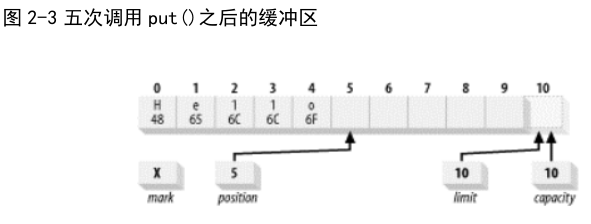
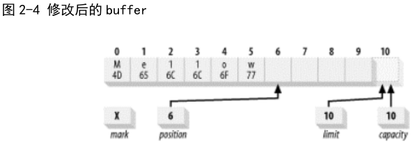

# Java NIO 系列教程 #

[http://tutorials.jenkov.com/java-nio/index.html](http://tutorials.jenkov.com/java-nio/index.html)

[http://ifeve.com/java-nio-all/](http://ifeve.com/java-nio-all/)

# 第一章 简介 #

## 1.1 I/O与CPU时间的比较 ##

## 1.2 CPU已不再是束缚 ##

JVM的I/O类喜欢操作小块数据——单个字节、几行文本。操作洗脱功能送来整缓冲区的数据，java.io的流数据类再发大量时间把它们拆成小块，往往拷贝一个小块都要往返于几层对象。（操作系统喜欢整卡车地运来数据，java.io类则喜欢一铲子一铲子地加工数据。有了NIO，就可以轻松地把一卡车数据备份到您）

## 1.3 进入正题 ##

java.nio 软件包提供了新的抽象。具体地说，就是 Channel 和 Selector类。

## 1.4 I/O概念 ##

* 缓冲区操作
* 内核控件与用户空间
* 虚拟内存
* 分页技术
* 面向文件的I/O和流I/O
* 多工I/O(就绪性选择)

### 1.4.1 缓冲区操作 ###

缓冲区，是所有 I/O 的基础。所谓“输入／输出”讲的无非就是把数据移进或移出缓冲区。

进程执行I/O操作，向操作系统发起请求，让它要么把缓冲区里的数据排干（写），要么用数据把缓冲区填满（读）。

当进程请求I/O操作的时候，执行一个系统调用将控制权移交给内核。C/C++程序员所熟知的底层函数open()、read()、write()和close()要做的就是建立和执行适当的系统调用。

当内核以这种方式被调用，它随即采取任何必要步骤，找到进程所需数据，并把数据传送到用户空间内的指定缓冲区。内核试图对数据进行高速缓存或预读取，因此进程所需数据可能已经在内核空间里了。如果是这样，该数据只需简单地拷贝出来即可。如果数据不在内核空间，则进程被挂起，内核着手把数据读进内存。

#### 1.4.1.1 发散/汇聚 ####

进程只需一个系统调用，就能把一连串缓冲区地址传递给操作系统。然后，内核就可以顺序填充或排干多个缓冲区，读的时候就把数据发散到多个用户空间缓冲区，写的时候再从多个缓冲区把数据汇聚起来。

### 1.4.2 虚拟内存 ###

所有现代操作系统都使用虚拟内存。虚拟内存意为使用虚假（或虚拟）地址取代物理（硬件RAM）内存地址。

1. 一个以上的虚拟地址可指向同一个物理内存地址。
2. 虚拟内存空间可大于实际可用的硬件内存。

### 1.4.3 内存页面调度 ###

为了支持虚拟内存的第二个特性（寻址空间大于物理内存），就必须进行虚拟内存分页（经常称为交换，虽然真正的交换是在进程层面完成，而非页层面）。

把内存页大小设定为磁盘块大小的倍数。这样内核就可以直接向磁盘控制硬件发布命令，把内存页写入磁盘，在需要时再重新装入。结果，所有磁盘I/O都在页层面完成。对于采用分页技术的现代操作系统而言，这数据在磁盘与物理内存之间往来的唯一方式。

现代CPU包含一个称为内存管理单元（MMU）的子系统，逻辑上位于CPU与物理内存之间。该设备包含虚拟地址向物理内存地址转换时所需映射信息。当CPU引用某内存地址时，MMU负责确定该地址所在页（往往通过对地址值进行移位），并将虚拟页号转换为物理页号（这一步由硬件完成）。如果当前不存在与该虚拟页形成有效映射的物理页面，MMU会向CPU提交一个页错误。

### 1.4.4 文件I/O ###

磁盘把数据存在扇区上，通常一个扇区 512 字节。磁盘属硬件设备，对何谓文件一无所知，它只是提供了一系列数据存取窗口。

文件系统是更高层次的抽象，是安排、解释磁盘（或其他随机存取块设备）数据的一种独特方式。

所有 I/O 都是通过请求页面调度完成的。您应该还记得，页面调度是非常底层的操作，仅发生于磁盘扇区与内存页之间的直接传输。而文件 I/O 则可以任意大小、任意定位。

采用分页技术的操作系统执行 I/O 的全过程可总结为以下几步：

1. 确定请求的数据分布在文件系统的哪些页（磁盘扇区租）。磁盘上的文件内容和元数据可能跨越多个文件系统页，而且这些页可能也不连续。
2. 在内核空间分配足够数量的内存页，以容纳得到确定的文件系统页。
3. 在内存页与磁盘上的文件系统页之间建立映射。
4. 为每一个内存页产生页错误。
5. 虚拟内存系统俘获页错误，安排页面调入，从磁盘上读取页内容，使页有效。
6. 一旦页面调入操作完成，文件系统即对原始数据进行解析，取得所需文件内容或属性信息。

#### 1.4.4.1 内容映射文件 ####

传统的文件 I/O 是通过用户进程发布 read( )和 write( )系统调用来传输数据的。

内存映射I/O使用文件系统建立从用户空间直到可用文件系统页的虚拟内存映射。

1. 用户进程把文件数据当作内存，所以无需发布 read( )或 write( )系统调用。
2. 当用户进程碰触到映射内存空间，页错误会自动产生，从而将文件数据从磁盘读进内存。如果用户修改了映射内存空间，相关页会自动标记为脏，随后刷新到磁盘，文件得到更新。
3. 操作系统的虚拟内存子系统会对页进行智能高速缓存，自动根据系统负载进行内存管理。
4. 数据总是按页对齐的，无需执行缓冲区拷贝。
5. 大型文件使用映射，无需耗费大量内存，即可进行数据拷贝。

虚拟内存和磁盘 I/O 是紧密关联的，从很多方面看来，它们只是同一件事物的两面。在处理大量数据时，尤其要记得这一点。如果数据缓冲区是按页对齐的，且大小是内建页大小的倍数，那么，对大多数操作系统而言，其处理效率会大幅提升。

#### 1.4.4.2 文件锁定 ####

文件锁定机制允许一个进程阻止其他进程存取某文件，或限制其存取方式。通常的用途是控制共享信息的更新方式，或用于事务隔离。在控制多个实体并行访问共同资源方面，文件锁定是必不可少的。数据库等复杂应用严重信赖于文件锁定。

文件锁定有两种方式：共享的和独占的。多个共享锁可同时对同一文件区域发生作用；独占锁则不同，它要求相关区域不能有其他锁定在起作用。

共享锁和独占锁的经典应用，是控制最初用于读取的共享文件的更新。某个进程要读取文件，会先取得该文件或该文件部分区域的共享锁。第二个希望读取相同文件区域的进程也会请求共享锁。

### 1.4.5 流I/O ###

并非所有 I/O 都像的是面向块的，也有流 I/O，其原理模仿了通道。I/O字节流必须顺序存取，常见的例子TTY（控制台）设备、打印机端口和网络连接。

流的传输一般比块设备慢，经常用于间歇性输入。多数操作系统允许把流置于非块模式，这样，进程可以查看流上是否有输入，即便当时没有也不影响它干别的。这样一种能力使得进程可以在有输入的时候进行处理，输入流闲置的时候执行其他功能。

## 1.5 总结 ##

系统层面的 I/O

Avi Silberschatz 所著《操作系统概念》（第六
版）（Operating System Concepts, Sixth Edition [John Wiley & Sons]）

# 第二章 缓存区 #

Buffer java.nio java.nio.channels

一个Buffer对象是固定数量的数据的容器。其作用是一个存储器，或者分段运输区，在这里数据可悲存储并在之后用于检索。缓冲区写满和释放。对于每个非布尔原始数据都一个缓冲区类。尽管缓冲区作用于它们存储的原始数据类型，但缓冲区十分倾向于处理字节。非字节缓冲区可以在后台执行从字节或到字节的转换，这取决于缓冲区是如何创建的。

缓冲区的工作与通道紧密联系。通道是I/O传输发生时发生时通过的入口，而缓冲区是这些数据传输的来源或目标。对于离开缓冲区的传输，想传递出去的数据被置于一个缓冲区，被传送到通道。对于传回缓冲区的传输，一个通道将数据放置在所提供的缓冲区。这种在协同对象（通常是缩写的对象以及一到多个Channel对象）之间进行缓冲区数据传递是高效数据处理的关键。

## 2.1 缓冲区基础 ##

缓冲区是包在一个对象内的基本数据元素数组。Buffer 类相比一个简单数组的优点是它将关于数据的数据内容和信息包含在一个单一的对象中。Buffer 类以及它专有的子类定义了一个用于处理数据缓冲区的 API。

### 2.1.1 属性 ###

* 容量（Capacity）

缓冲区能够容纳的数据元素的最大数量。这一容量在缓冲区创建时被设定，并且永远不能够被改变。

* 上界（Limit）

缓冲区的第一个不能被读或写的元素。或者说，缓冲区中现存元素的计数。

* 位置（Position）

下一个要被读或写的元素的索引。位置会自动由相应的 get( )和 put( )函数更新。

* 标记（Mark）

一个备忘位置。调用 mark( )来设定 mark = postion。调用 reset( )设定 position = mark。标记在设定前是未定义的( undefined) 。

0 <= mark <= position <= limit <= capacity

### 2.1.2 缓冲区API ###

Buffer类的方法签名

	package java.nio;
	public abstract class Buffer {
		public final int capacity( )
		public final int position( )
		public final Buffer position (int newPositio
		public final int limit( )
		public final Buffer limit (int newLimit)
		public final Buffer mark( )
		public final Buffer reset( )
		public final Buffer clear( )
		public final Buffer flip( )
		public final Buffer rewind( )
		public final int remaining( )
		public final boolean hasRemaining( )
		public abstract boolean isReadOnly( );
	}

级联调用允许这种类型的代码：

	buffer.mark( );
	buffer.position(5);
	buffer.reset( );

被简写为：

	buffer.mark().position(5).reset( );

java.nio 中的类被特意地设计为支持级联调用

对于 API 还要注意的一点是 isReadOnly()函数。所有的缓冲区都是可读的，但并非所有都可写。每个具体的缓冲区类都通过执行 isReadOnly()来标示其是否允许该缓存区的内容被修改。一些类型的缓冲区类可能未使其数据元素存储在一个数组中。例如MappedByteBuffer 的内容可能实际是一个只读文件。您也可以明确地创建一个只读视图缓冲区，来防止对内容的意外 修改。对只读的缓冲区的修改尝试将会导致ReadOnlyBufferException 抛出。但是我们要提前做好准备。

### 2.1.3 存取 ###

	public abstract class ByteBuffer extends Buffer implements Comparable {
		// This is a partial API listing
		public abstract byte get();
		public abstract byte get(int index);
		public abstract ByteBuffer put (byte b);	
	}

get和put可以是相对的或者是绝对的。

### 2.1.4 填充 ###

代表“Hello”字符串的ASCII码载入一个名为buffer的ByteBuffer对象中。

	buffer.put((byte)'H').put((byte)'e').put((byte)'l').put((byte)'l').put((byte)'o');

使用put()的绝对方案达到，已经在buffer中存放了一些数据，不想在不丢失位置的情况下进行修改。

	buffer.put(0, (byte)'M').put((byte)'w');

通过进行一次绝对方案的put将0位置的字节代替为十六进制数值0x4d，将0x77放入当前位置（当前位置不会受到绝对put()的影响）的字节，并将位置属性加一。

存放的是字节而不是字符。在Java中，字符在内部以Unicode码表示，每个Unicode字符占16位。

### 2.1.5 翻转 ###

	buffer.limit(buffer.position()).position(0);

	Buffer.flip();

Flip()函数将一个能够继续添加数据元素的填充状态的缓冲区翻转成一个准备读出元素的释放状态。

Rewind()函数与

### 2.1.6 释放 ###

布尔函数 hasRemaining()会在释放缓冲区时告诉您是否已经达到缓冲区的上界。

	for (int i = 0; buffer.hasRemainging(), i++) {
		myByteArray[i] == buffer.get();
	}

作为选择，remaining()函数将告知您从当前位置到上界还剩余的元素数目。

	int count = buffer.remaining( );

	for (int i = 0; i < count, i++) {
		myByteArray [i] = buffer.get( );
	}

缓冲区并不是多线程安全的。如果想以多线程同时存取特定的缓冲区，需要在存取缓冲区之前进行同步。

### 2.1.7 压缩 ###

	public abstract class ByteBuffer extends Buffer implements Comparable {
		// This is a partial API listing
		public abstract ByteBuffer compact();
	}

释放一部分数据，而不是全部，然后重新填充。

	buffer.compact();	

### 2.1.8 标记 ###

buffer.position(2).mark().position(4)

### 2.1.9 比较 ###

所有的缓冲区都提供了一个常规的equals()函数用以测试两个缓冲区的是否相等，以及一个compareTo()函数用以比较缓冲区。

* 两个对象类型相同
* 两个对象都剩余同样数量的元素。
* 在每个缓冲区中应被get()函数返回的剩余数据元素序列必须一致。

### 2.1.10 批量移动 ###

	public abstract class CharBuffer extends Buffer implements CharSequence, Comparable {
		//This is a partial API listing
		public CharBuffer get(char[] dst)
		public CharBuffer get(char[] dst, int offset, int length)
	}

有两种形式的get()可供从缓冲区到数组进行数据复制使用。

1. 只将一个数组作为参数，将一个缓冲区释放到给定的数组。
2. 使用offset和length参数来指定目标数组的子区间。

批量移动总是具有指定的长度，要求移动固定数量的数据元素。

	buffer.get(myArray);

等价于：

	buffer.get(myArray, 0, myArray.length)

## 2.2 创建缓冲区 ##

	public abstract class CharBuffer extends Buffer implements CharSequence, Comparable {
		// This is a partial API listing
		public static CharBuffer allocate(int capacity)
		public static CharBuffer wrap(char [] array)
		public static CharBuffer wrap(char [] array, int offset, int length)
		public final boolean hasArray()
		public final char[] array()
		public final int arrayOffset()
	}

新的缓冲区是由分配或包装操作创建的。分配操作创建一个缓冲区对象并分配一个私有的空间来存储容量大小的数据元素。

	CharBuffer charBuffer = CharBuffer.allocate(100);

这段代码隐含地从堆空间中分配了一个 char 型数组作为备份存储器来储存 100 个 char 变量。

	char [] myArray = new char [100];
	CharBuffer charbuffer = CharBuffer.wrap (myArray);

构造了一个新的缓冲区对象，但数据元素会存在于数组中。这意味着通过调用put()函数造成的对缓冲区的改动会直接影响这个数组，而且对这个数组的任何改动也会对这个缓冲区对象可见。带有 offset 和 length 作为参数的 wrap()函数版本则会构造一个按照您提供的 offset 和 length 参数值初始化位置和上界的缓冲区。

	CharBuffer charbuffer = CharBuffer.wrap (myArray, 12, 42);

创建了一个 position 值为 12，limit 值为 54，容量为 myArray.length 的缓冲区。

创建了一个只占用了一个数组子集的缓冲区。这个缓冲区可以存取这个数组的全部范围；offset 和 length 参数只是设置了初始的状态。调用使
用上面代码中的方法创建的缓冲区中的 clear()函数，然后对其进行填充，直到超过上界值，这将会重写数组中的所有元素。Slice()函数（2.3 节将会讨论）可以提供一个只占用备份数组一部分的缓冲区。

通过 allocate()或者 wrap()函数创建的缓冲区通常都是间接的。

如果 hasArray()函数返回 false，不要调用 array()函数或者 arrayOffset()函数。不然会得到UnsupportedOperationException异常。

## 2.3 复制缓冲区 ##

## 2.4 字节缓冲区 ##

### 2.4.1 字节顺序 ###

|数据类型|大小（以字节表示）|
|--|--|
|Byte|1|
|Char|2|
|Short|2|
|Int|4|
|Long|8|
|Float|4|
|Double|8|

多字节数值被存储在内存中的方式一般被成为endian-ness（字节顺序）。

	package java.nio;

	public final class ByteOrder{
		public static final ByteOrder BIG_ENDIAN
		public static final ByteOrder LITTLE_ENDIAN

		public static ByteOrder nativeOrder()
		public String toString()
	}

ByteOrder类定义了决定从缓冲区中存储或检索多字节数值时使用哪一字节顺序的常量。这个类的作用就像一个类型安全的枚举。定义了以本身预初始化的两个public区域。

	每个缓冲区类具有一个能够调用order()查询的当前字节顺序设定。

	public abstract class BarBuffer extends Buffer implements Comparable, CharSequence {
		//This is a partial API listing
		public final ByteOrder order()
	}

2.4.2 直接缓冲区

## 2.5 总结 ##

#### 缓冲区属性 ####

# 第三章 通道 #

通道（Channel）是java.nio的第二个主要创新。

Channel用于在字节缓冲区和位于通道另一侧的实体（通常是一个文件或套接字）之间有效地传输数据。

载体就好比一个缓冲区，先填充缓冲区，接着将缓冲区“写到”通道中，然后信息负载就被传递到通道另一侧的I/O服务。

Channel类的继承关系要比buffer类复杂一些。Channel类相互之间的关系更复杂，并且部分channel类依赖于在java.nio.channels.spi子包中定义的类。

## 3.1 通道基础 ##

	package java.nio.channels;
	public interface Channel {
		public boolean isOpen();
		public void close() throws IOException;
	}

### 3.1.1 打开通道 ###

通道是访问I/O服务的导管。I/O可以分为广义的两大类别：File I/O和Stream I/O。文件（file）通道和套接字（socket）通道。

通道可以以多种方式创建。Socket通道有可以直接创建新socket通道的共产方法。但是一个FileChannel对象却只能通过在一个打开的RandomAccessFile、FileInputStream或FileOutputStrean对象上调用getChannel()方法来获取。不能直接创建一个FileChannel对象。

	SocketChannel sc = SocketChannel.open();
	sc.connect(new InetSocketAddress("somehost", someport));
	ServerSocketChannel ssc = ServerSocketChannel.open();
	ssc.socket().bind(new InetSocketAddress(somelocalport));
	DatagramChannel dc = DatagramChannel.open();
	RandomAccessFile raf = new RandomAccessFile("somefile", "r");

java.net的socket类有新的getChannel()方法。这些方法虽然能返回一个相应的socket通道的对象，但它们并非新通道的来源。

RandomAccessFile.getChannel()方法才是，返回一个新通道。

### 3.1.2 使用通道 ###

通道将数据传输给ByteBuffer对象或者从ByteBuffer对象获取数据进行传输。

	public interface ReadableByteChannel extends Channel {
		public in read(ByteBuffer dst) throws IOException;
	}
	public interface WritableByteChannel extends Channel {
		public in read(ByteBuffer src) throws IOException;
	}
	public interfaceByteChannel extends ReadabkeByteCgabbek, WriteableByteChannle {

	}	

通道可以是单向（unidirectional）或者双向的（bidirectional）。

### 3.1.3 关闭通道 ###

与缓冲区不同，通道不能被重复使用。一个打开的通道即代表与一个特定I/O服务的特定连接并封装该连接的状态。当通道关闭时，那个连接会丢失，然后通道将不再连接任何东西。

	package java.nio.channels;
	public interface Channel {
		public boolean isOpen();
		public void close() throws IOException;
	}

调用通道的close()方法时，可能会导致在通道关闭底层I/O服务的过程中线程暂时阻塞。哪怕该通道处于非阻塞模式。

通过isOpen()方法来测试通道的开放状态。如果返回true值，那么该通道可以使用。如果返回false值，那么该通道已关闭，不能再被使用了。

## 3.2 Scatter/Gather ##

对于一个 write 操作而言，数据是从几个缓冲区按顺序抽取（称为 gather）并沿着通道发送的。

	public inteface ScatteringByteChannel extends ReadableByteChannel {
		public long read(ByteBuffer [] dsts) throws IOException;
		public long read(ByteBuffer [] dsts, int offset, int length) throws IOException;
	}

## 3.3 文件通道 ##

FileChannel类可以实现常用的read，write以及scatter/gather操作。

## 3.4 内存映射文件 ##

## 3.6 管道 ##

java.nio.channels包中含有一个名为Pipe（管道）的类。

Pipe类创建一对提供环回机制的Channel对象。这两个通道的远端是连接起来的，以便任何写在SinkChannel对象上的数据都能出现在SourceChannel对象上。

Pipe实例是通过调用不带参数的Pipe.open()工厂方法来创建的。

## 3.7 通道工具类 ##

NIO通道提供了一个全新的类似流的I/O隐喻，

一个工具类（java.nio.Channels.Channels）定义了几种静态的工厂方法以使用到可以更加容易地同流和读写器互联。

java.nio.channels.Channels工具方法汇总

|方法|返回|描述|
|--|--|--|
|newChannel(InputStream in)|ReadableByteChannel|返回一个将从给定的输入流读取数据的通道|
|newChannel(OutputStream out)|ReadableByteChannel|返回一个将从给定的输入流读取数据的通道|
|newInputStream(ReadableByteChannel ch)|ReadableByteChannel|返回一个将从给定的输入流读取数据的通道|
|newOutputStream(WritableByteChannel ch)|ReadableByteChannel|返回一个将从给定的输入流读取数据的通道|
|newReader(ReadableByteCHannel ch, CharsetDecoder dec, in minBufferCap)|Reader|返回一个reader，它将从给定的通道读取字节并依据提供的CharsetDecoder对读取到字节的进行解码。|
|newReader(ReadableByteCHannel ch, String csName)|Reader|返回一个reader，它将从给定的通道读取字节并依据提供的字符集名称对读取到字节解码成字符。|
|newWriter(WritableByteCHannel ch, CharsetEncoder dec, int minBufferCap)|Writer|返回一个writer，它将使用提供的CharsetEncoder对象对字符编码并写到给定的通道中。|
|newWriter(WritableByteCHannel ch, String csName)|Writer|返回一个writer，它将依据提供的字符集名称对字符编码并写到给定的通道中。|

常规的流仅传输字节，readers和writers则作用于字节数据。Readers和Writers运行在字符的基础上，在Java的世界里同字节是完全不同的。将一个通道（仅了解字节）连接到一个reader或writer需要一个中间对话来处理字节/字符（byte/char）。

## 3.8 总结 ##

#### 基本的通道操作 ####

怎样使用所有通道都通用的API方法调用来打开一个通道以及完成操作时如何关闭通道。

#### Scatter/Gather通道 ####

scatter/gather I/O。

#### 文件通道 ####

FileChannel，文件锁定、内存映射文件以及channel-to-channel传输

#### Socket通道 ####

Socket通道，非阻塞模式

#### 管道 ####

Pipe类

#### Socket通道 ####

# 第四章 选择器 #

选择器（selectors）。选择器提供选择执行已经就绪的任务的能力，这使得多元I/O成为可能。

## 4.1 选择器基础 ##

### 4.1.1 选择器，可选择通道和选择键类 ###

#### 选择器（Selector） ####

选择棋类管理着一个被注册的通道集合的信息和它们的就绪状态。通道是和
选择器一起被注册的，并且使用选择器来更新通道的就绪状态。当这么做的时候，可以选择将被激发的线程挂起，直到有就绪的通道。

#### 可选择通道（SelectableChannel） ####

FileChannel对象不是可选择的，因为它们没有继承SelectableChannel。所有socket通道都是可选择的，包括从管道（Pipe）对象中获得的通道。SelectableChannel可以被注册到Selector对象上，同时可以指定对那个选择器而言。一个通道可以被注册到多个选择器上，但对每个选择器而言只能被注册一次。

#### 选择键（SelectionKey） ####

选择键封装了特定的通道与特定的选择器的注册关系。选择键对象被SelectableChannel.register()返回并提供一个表示这种注册关系的标记。

## 4.2 使用选择键 ##

SelectiionKey

## 4.3 使用选择器 ##

### 4.3.1 选择过程 ###

每一个Selector对象维护三个键的集合：

	public abstract class Selector{
		// This is a 
	}

#### 已注册的键的集合（Registered key set） ####

### 4.3.4 并发性 ###

通过keys()和selectKeys()返回的键的集合是Selector对象内部的私有Set对象集合的直接引用。

如果在多个线程并发地访问一个选择器的键的集合的时候存在任何问题，您可以采取一些步骤来合理地同步访问。在执行选择操作时，选择器在 Selector 对象上进行同步，然后是已注册的键的集合，最后是已选择的键的集合，按照这样的顺序。已取消的键的集合也在选择过程的的第 1
步和第 3 步之间保持同步（当与已取消的键的集合相关的通道被注销时）。

Selector类的close()方法与select()方法的同步方式是一样的。

## 4.4 异步关闭能力 ##

一个线程在关闭一个处于选择操作中的通道时，被阻塞于无限期的等待。当一个通道关闭时，它相关的键也就都被取消了。这并不会影响正在进行的 select( )，但这意味着在您调用 select( )之前仍然是有效的键，在返回时可能会变为无效。

## 4.5 选择过程的可扩展性 ##

## 4.6 总结 ##

大规模、高容量的服务器端应用程序

**就绪选择相关类（Selector classes）**

Selector，SelectableChannel和SelectionKey这三个类组成了使得在Java平台上进行就绪检查变得可变的三驾马车。

**选择键（Selection keys）**

SelectionKey类封装了SelectableChannel对象和Selector之间的关系。

**选择器（Selectors）**

选择器请求操作系统决定那个注册到给定选择器上的通道。

**异步关闭能力（Asynchronous closability）**

关于异步关闭选择器和通道的问题。

**多线程（Multithreading）**