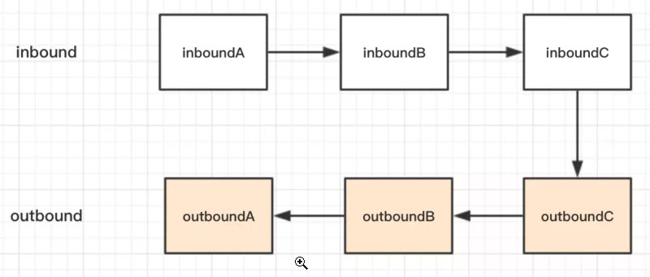
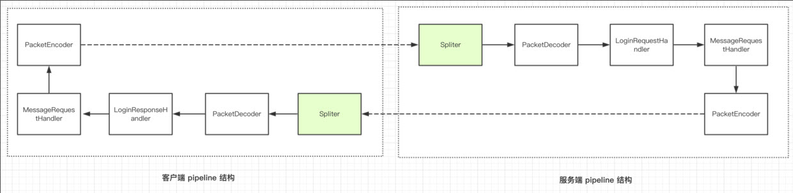
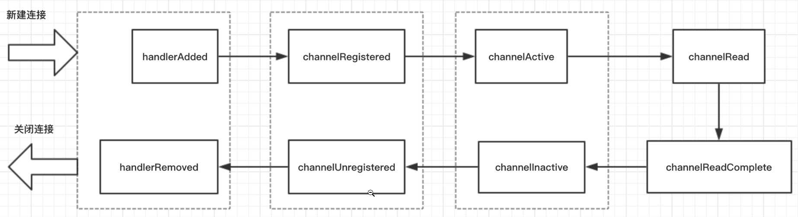

# Netty 入门与实战：仿写微信IM即时通讯系统 #

# ch1 仿微信IM系统简介 #

## 单聊流程 ##

1. 如上图，A 要和 B 聊天，首先 A 和 B 需要与服务器建立连接，然后进行一次登录流程，服务端保存用户标识和 TCP 连接的映射关系
2. A 发消息给 B，首先需要将带有 B 标识的消息数据包发送到服务器，然后服务器从消息数据包中拿到 B 的标识，找到对应的 B 的连接，将消息发送给 B
3. 任意一方发消息给对方，如果对方不在线，需要将消息缓存，对方上线之后再发送

我们把客户端与服务端之间相互通信的数据包称为**指令数据包**，指令数据包分为指令和数据，每一种指令对应客户端或者服务端的一种操作，数据部分对应的是指令处理需要的数据。

## 单聊的指令 ##

### 指令列表 ###

|指令内容|客户端|服务端|
|--|--|--|
|登录请求|发送|接收|
|登录响应|接收|发送|
|客户端发消息|发送|接收|
|服务端发消息|接收|发送|
|登出请求|发送|接收|
|登出响应|接收|发送|

## 群聊流程 ##

	Map<聊天室ID，List<用户标识>>

1. A，B，C 依然会经历登录流程，服务端保存用户标识对应的 TCP 连接
2. A 发起群聊的时候，将 A，B，C 的标识发送至服务端，服务端拿到之后建立一个群聊 ID，然后把这个 ID 与 A，B，C 的标识绑定
3. 群聊里面任意一方在群里聊天的时候，将群聊 ID 发送至服务端，服务端拿到群聊 ID 之后，取出对应的用户标识，遍历用户标识对应的 TCP 连接，就可以将消息发送至每一个群聊成员

#### 指令列表 ####

|指令内容|客户端|服务端|
|--|--|--|
|创建群聊请求|发送|接收|
|群聊创建成功通知|接收|发送|
|加入群聊请求|发送|接收|
|群聊加入通知|接收|发送|
|发送群聊消息|发送|接收|
|接收群聊消息|接收|发送|
|退出群聊请求|发送|接收|
|退出群聊通知|接收|发送|

## Netty ##

### 客户端使用 Netty 的程序逻辑结构 ###

1. 首先，客户端会解析控制台指令，比如发送消息或者建立群聊等指令
2. 然后，客户端会基于控制台的输入创建一个指令对象，用户告诉服务端具体要干什么事情
3. TCP 通信需要的数据格式为二进制，因此，接下来通过自定义二进制协议将指令对象封装成二进制，这一步称为协议的编码
4. 对于收到服务端的数据，首先需要截取出一段完整的二进制数据包（拆包粘包相关的内容后续小节会讲解）
5. 将此二进制数据包解析成指令对象，比如收到消息
6. 将指令对象送到对应的逻辑处理器来处理

# ch2 Netty是什么？ #

## IO编程 ##

1. 线程资源受限：线程是操作系统中非常宝贵的资源，同一时刻有大量的线程处于阻塞状态是非常严重的资源浪费，操作系统耗不起
2. 线程切换效率低下：单机 CPU 核数固定，线程爆炸之后操作系统频繁进行线程切换，应用性能急剧下降。
3. 除了以上两个问题，IO 编程中，我们看到数据读写是以字节流为单位。

## NIO编程 ##

#### 线程资源受限 ####

NIO编程模型，新来一个连接不再创建一个新的线程，而是可以把这条连接直接绑定到某个固定的线程，然后这条连接所有的读写都由这个线程来负责。

#### 线程切换效率低下 ####

### IO读写面向流 ###

**IO读写以字节为单位**

	 Set<SelectionKey> set = serverSelector.selectedKeys();

1. NIO模型中通常有两个县城，每个线程绑定一个轮询器selector，在我们这个例子中serverSelector负责轮询是否有新的连接，clientSelector负责轮询连接是否有数据可读
2. 服务端监测到新的连接之后，不再创建一个新的线程，而是直接将新连接绑定到clientSelector上，这样就不用 IO 模型中 1w 个 while 循环在死等，参见(1)
3. clientSelector被一个 while 死循环包裹着，如果在某一时刻有多条连接有数据可读，那么通过 clientSelector.select(1)方法可以轮询出来，进而批量处理，参见(2)
4. 数据的读写面向Buffer，参见（3）

## Netty编程 ##

1. `boss`对应`IOServer.java`中的接受新连接线程，主要负责创建新连接
2. `worker`对应`IOClient.java`中的负责读取数据的线程，主要用于读取数据以及业务逻辑处理

# ch3 Netty环境配置 #

略

# ch4 服务端启动流程 #

	public class NettyServer {
	    public static void main(String[] args) {
	        NioEventLoopGroup bossGroup = new NioEventLoopGroup();
	        NioEventLoopGroup workerGroup = new NioEventLoopGroup();
	
	        ServerBootstrap serverBootstrap = new ServerBootstrap();
	        serverBootstrap
	                .group(bossGroup, workerGroup)
	                .channel(NioServerSocketChannel.class)
	                .childHandler(new ChannelInitializer<NioSocketChannel>() {
	                    protected void initChannel(NioSocketChannel ch) {
	                    }
	                });
	
	        serverBootstrap.bind(8000);
	    }
	}

1. 创建两个NioEventLoopGroup，传统IO编程模型的两大线程组，`bossGroup`表示监听端口，accept新连接的线程组，`workerGroup`表示处理每一条连接的数据读写的线程组。
2. 创建一个引导类ServerBootstrap，这个类将引导我们进行服务端的启动工作，直接new出来。
3. .group(bossGroup, workerGroup)给引导类配置两大线程组，这个引导类的线程模型也就定型了。
4. 指定服务端的IO模型为*NIO*，.channel(NioServerSocketChannel.class)来指定IO模型，如果你想指定 IO 模型为 BIO，那么这里配置上OioServerSocketChannel.class类型即可，因为Netty的优势就在于NIO。
5. childHandler()方法，给这个引导类创建一个`ChannelInitializer`，定义后续每条连接的数据读写，业务处理逻辑。

ChannelInitializer这个类中，我们注意到有一个泛型参数NioSocketChannel，这个类呢，就是 Netty 对 NIO 类型的连接的抽象，而我们前面NioServerSocketChannel也是对 NIO 类型的连接的抽象，NioServerSocketChannel和NioSocketChannel的概念可以和 BIO 编程模型中的ServerSocket以及Socket两个概念对应上

BioServerSocketChannel和NioSocketChannel的概念可以和BIO编程模型种的ServerSocket以及Socket两个概念对应上

要启动一个Netty服务端，必须要指定三类属性，分别是线程模型、IO 模型、连接读写处理逻辑，有了这三者，之后在调用bind(8000)。public class NettyServer {
	    public static void main(String[] args) {
	        NioEventLoopGroup bossGroup = new NioEventLoopGroup();
	        NioEventLoopGroup workerGroup = new NioEventLoopGroup();
	
	        ServerBootstrap serverBootstrap = new ServerBootstrap();
	        serverBootstrap
	                .group(bossGroup, workerGroup)
	                .channel(NioServerSocketChannel.class)
	                .childHandler(new ChannelInitializer<NioSocketChannel>() {
	                    protected void initChannel(NioSocketChannel ch) {
	                    }
	                });
	
	        serverBootstrap.bind(8000);
	    }
	}## 自动绑定递增端口 ##

`serverBootstrap.bind(8000);`这个方法施一步方法，调用之后立即返回的，返回值是一个`ChannelFuture`，给这个ChannelFuture添加一个监听器`GenericFutureListener`，然后再`GenericFutureListener`和`operationComplete`方法里面，可以监听端口是否绑定成功

	serverBootstrap.bind(8000).addListener(new GenericFutureListener<Future<? super Void>>() {
	    public void operationComplete(Future<? super Void> future) {
	        if (future.isSuccess()) {
	            System.out.println("端口绑定成功!");
	        } else {
	            System.err.println("端口绑定失败!");
	        }
	    }
	});

	bind(serverBootstrap, 1000)

## 服务端启动其他方法 ##

#### handler()方法 ####

	serverBootstrap.handler(new ChannelInitializer<NioServerSocketChannel>() {
	    protected void initChannel(NioServerSocketChannel ch) {
	        System.out.println("服务端启动中");
	    }
	})

`handler()`方法呢，可以和`childHandler()`方法对应起来，`childHandler()`用于指定处理新连接数据的读写处理逻辑，`handler()`用于指定在服务端启动过程中的一些逻辑

#### attr()方法 ####

	serverBootstrap.attr(AttributeKey.newInstance("serverName"), "nettyServer")

attr()方法可以给服务端的 channel，也就是NioServerSocketChannel指定一些自定义属性，然后我们可以通过channel.attr()取出这个属性。

#### childAttr()方法 ####

	serverBootstrap.childAttr(AttributeKey.newInstance('clientKey', 'clientValue')

`childAttr`给每一条连接指定自定义属性，然后后续可以通过channel.attr()取出该属性。

#### childOption()方法 ####

	serverBootstrap
		.childOption(ChannelOption.SO_KEEPALIVE, true)
		.childOption(ChannelOption.TCP_NODELAY, true)

`childOption()`可以给每条连接设置一些TCP底层相关的属性。

* `ChannelOption.SO_KEEPALIVE`表示是否开启TCP底层心跳机制，true为开启
* `ChannelOption.TCP_NODELAY`表示是否开始Nagle算法，true表示关闭，false表示开启，如果要求高实时性，有数据发送时就马上发送，就关闭，如果需要减少发送次数减少网络交互，就开启

#### option()方法 ####

除了给每个连接设置这一系列属性之外，还可以给服务端channel设置一些属性，最常见就是so_backlog

	serverBootstrap.option(ChannelOption_SO_BACkLOG, 1024)

表示系统用于临时存放已完成三次握手的请求的队列的最大长度，如果连接建立频繁，服务器处理创建新连接较慢，可以适当调大这个参数。

### 总结 ###

* 本文中，首先学习了Netty服务端启动的流程，一句话来说就是：创建一个引导类，然后给他指定线程模型，IO模型，连接读写处理逻辑，绑定端口之后，服务端就启动起来了。
* 然后学习到bind方法是异步的，通过这个异步机制来实现端口递增绑定。
* 讨论了Netty服务端启动额外的参数，主要包括给服务端Channel或者客户端Channel设置属性值，设置底层TCP参数。

# ch5 客户端启动流程 #

## 客户端启动Demo ##

对于客户端的启动来说，和服务端的启动类似，依然需要线程模型、IO模型、以及IO业务处理逻辑三大参数。

客户端启动的引导类是 Bootstrap，负责启动客户端以及连接服务端，服务端的启动的时候，这个辅导类是 ServerBootstrap，引导类创建完成之后。

	public class NettyClient {
	    public static void main(String[] args) {
	        NioEventLoopGroup workerGroup = new NioEventLoopGroup();
	        
	        Bootstrap bootstrap = new Bootstrap();
	        bootstrap
	                // 1.指定线程模型
	                .group(workerGroup)
	                // 2.指定 IO 类型为 NIO
	                .channel(NioSocketChannel.class)
	                // 3.IO 处理逻辑
	                .handler(new ChannelInitializer<SocketChannel>() {
	                    @Override
	                    public void initChannel(SocketChannel ch) {
	                    }
	                });
	        // 4.建立连接
	        bootstrap.connect("juejin.im", 80).addListener(future -> {
	            if (future.isSuccess()) {
	                System.out.println("连接成功!");
	            } else {
	                System.err.println("连接失败!");
	            }
	
	        });
	    }
	}

客户端启动的引导类是`Bootstrap`，负责启动客户端以及连接服务端，服务端启动的时候辅导类是`ServerBootstrap`

1. 创建客户端引导类`Bootstrap`,
2. 指定io类型为nio
3. io处理逻辑
4. 建立连接

————————

1. 首先，与服务端的启动一样，我们需要给它指定线程模型，驱动着连接的数据读写，这个线程的概念可以和 `IOClient.java` 创建的线程联系起来
2. 然后，我们指定 IO 模型为 `NioSocketChannel`，表示 IO 模型为 NIO，当然，你可以可以设置 IO 模型为 `OioSocketChannel`，但是通常不会这么做，因为 Netty 的优势在于 NIO
3. 接着，给引导类指定一个 `handler`，这里主要就是定义连接的业务处理逻辑
4. 配置完线程模型、IO 模型、业务处理逻辑之后，调用 `connect` 方法进行连接，可以看到 `connect` 方法有两个参数，第一个参数可以填写 IP 或者域名，第二个参数填写的是端口号，*由于 connect 方法返回的是一个 `Future`，也就是说这个方是异步的*，我们通过 `addListener` 方法可以监听到连接是否成功，进而打印出连接信息

## 失败重连 ##

尝试重新连接，重新连接的逻辑写在连接失败的逻辑块里

	bootstrap.connect("juejin.im", 80).addListener(future -> {
	    if (future.isSuccess()) {
	        System.out.println("连接成功!");
	    } else {
	        System.err.println("连接失败!");
	        // 重新连接
	    }
	});

把建立连接的逻辑先抽取出来，然后在重连失败的时候，递归调用自身

	private static void connect(Bootstrap bootstrap, String host, int port) {
	    bootstrap.connect(host, port).addListener(future -> {
	        if (future.isSuccess()) {
	            System.out.println("连接成功!");
	        } else {
	            System.err.println("连接失败，开始重连");
	            connect(bootstrap, host, port);
	        }
	    });
	}

	connect(bootstrap, "juejin.im", 80, MAX_RETRY);
	
	private static void connect(Bootstrap bootstrap, String host, int port, int retry) {
	    bootstrap.connect(host, port).addListener(future -> {
	        if (future.isSuccess()) {
	            System.out.println("连接成功!");
	        } else if (retry == 0) {
	            System.err.println("重试次数已用完，放弃连接！");
	        } else {
	            // 第几次重连
	            int order = (MAX_RETRY - retry) + 1;
	            // 本次重连的间隔
	            int delay = 1 << order;
	            System.err.println(new Date() + ": 连接失败，第" + order + "次重连……");
	            bootstrap.config().group().schedule(() -> connect(bootstrap, host, port, retry - 1), delay, TimeUnit
	                    .SECONDS);
	        }
	    });
	}

1. 如果连接成功则打印连接成功的消息
2. 如果连接失败但是重试次数已经用完，放弃连接
3. 如果连接失败但是重试次数仍然没有用完，则计算下一次重连间隔 `delay`，然后定期重连

我们定时任务是调用 `bootstrap.config().group().schedule()`, 其中 bootstrap.config() 这个方法返回的是 BootstrapConfig，他是对 Bootstrap 配置参数的抽象，然后 bootstrap.config().group() 返回的就是我们在一开始的时候配置的线程模型 workerGroup，调 workerGroup 的 schedule 方法即可实现定时任务逻辑。

## 客户端启动其他方法 ##

#### attr()方法 ####

	bootstrap.attr(AttributeKey.newInstant"clientName"), "nettyClient");

`attr()`方法可以给客户端Channel，也即是说`NioSocketChannel`绑定自定义属性，然后通过`channel.attr()`取出这个属性，比如，上面的代码我们指定我们客户端Channel的一个`clientName`属性，属性值为`nettyClient`，`NioSocketChannel`维护一个map，后续再`NioSocketChannel`通过参数传来传去的时候，通过`NioSocketChannel`来取出设置的属性。

#### option()方法 ####
	
	Bootstrap
	        .option(ChannelOption.CONNECT_TIMEOUT_MILLIS, 5000)
	        .option(ChannelOption.SO_KEEPALIVE, true)
	        .option(ChannelOption.TCP_NODELAY, true)

`option()`方法可以给连接设置一些TCP底层相关的属性。

* ChannelOption.CONNECT_TIMEOUT_MILLIS 表示连接的超时时间，超过这个时间还是建立不上的话则代表连接失败
* CHannelOption.SO_KEEPALIVE 表示是否开启TCP底层心跳机制，true为开启
* ChannelOption.TCP_NODELAY 表示是否开始Nagle算法，true表示关闭，false表示开启，通俗地说，如果要求高实时性，有数据发送就马上发送，就设置true关闭，如果需要减少发送次数，减少网络交互，就设置false开启。

### 总结 ###

* 创建一个引导类，然后给他指定线程模型，IO模型，连接读写处理逻辑，连接上特定主机和端口，客户端就启动起来了。
* `connect`方法是异步的，通过这个异步回调机制来实现指数退避重连逻辑。
* 客户端`Channel`绑定自定义属性值，设置底层TCP参数。

### 思考题 ###

与服务端启动相比，客户端启动的引导类少了哪些方法，为什么不需要这些方法？欢迎留言讨论

# ch6 实战：客户端与服务端双向通信 #

## 客户端发数据到服务端 ##

	public class FirstClientHandler extends ChannelInboundHandlerAdapter {
	    @Override
	    public void channelActive(ChannelHandlerContext ctx) {
	        System.out.println(new Date() + ": 客户端写出数据");
	
	        // 1. 获取数据
	        ByteBuf buffer = getByteBuf(ctx);
	
	        // 2. 写数据
	        ctx.channel().writeAndFlush(buffer);
	    }
	
	    private ByteBuf getByteBuf(ChannelHandlerContext ctx) {
	        // 1. 获取二进制抽象 ByteBuf
	        ByteBuf buffer = ctx.alloc().buffer();
	        
	        // 2. 准备数据，指定字符串的字符集为 utf-8
	        byte[] bytes = "你好，闪电侠!".getBytes(Charset.forName("utf-8"));
	
	        // 3. 填充数据到 ByteBuf
	        buffer.writeBytes(bytes);
	
	        return buffer;
	    }
	}

客户端相关的数据读写逻辑是通过 `Bootstrap` 的 `handler()` 方法指定，我们在 `initChannel()` 方法里面给客户端添加一个逻辑处理器，这个处理器的作用就是负责向服务端写数据。

1. `ch.pipeline()`返回的是和这条连接相关的逻辑处理链，采用了责任链模式。
2. 然后再调用addLast()方法添加一个逻辑处理器，这个逻辑处理器为的就是再客户端建立成功之后，向服务端写数据。

## 服务端读取客户端数据 ##

## 服务端回数据给客户端 ##

服务端向客户端写数据逻辑与客户端侧的写数据逻辑一样，先创建一个 ByteBuf，然后填充二进制数据，最后调用 writeAndFlush() 方法写出去。

	public class FirstServerHandler extends ChannelInboundHandlerAdapter {
	
	    @Override
	    public void channelRead(ChannelHandlerContext ctx, Object msg) {
	        // ... 收数据逻辑省略
	
	        // 回复数据到客户端
	        System.out.println(new Date() + ": 服务端写出数据");
	        ByteBuf out = getByteBuf(ctx);
	        ctx.channel().writeAndFlush(out);
	    }
	
	    private ByteBuf getByteBuf(ChannelHandlerContext ctx) {
	        byte[] bytes = "你好，欢迎关注我的微信公众号，《闪电侠的博客》!".getBytes(Charset.forName("utf-8"));
	
	        ByteBuf buffer = ctx.alloc().buffer();
	
	        buffer.writeBytes(bytes);
	
	        return buffer;
	    }
	}

## 总结 ##

1. 通过给逻辑处理链 `pipeline` 添加逻辑处理器，来编写数据的读写逻辑
2. 客户端连接成功之后会回调到逻辑处理器的` channelActive()` 方法，而不管是服务端还是客户端，收到数据后都会调用 `channelRead` 方法。
3. 写数据调用 `writeAndFlush` 方法，客户端与服务端交互的二进制数据载体为 `ByteBuf`，`ByteBuf` 通过连接的内存管理器创建，字节数据填充到 `ByteBuf` 之后才能写到对端。

## 思考题 ##

如何实现新连接接入的时候，服务端主动向客户端推送消息，客户端回复服务端消息？欢迎留言讨论。

## ch7 数据传输载体ByteBuf介绍 ##

### ByteBuf结构 ###

1. ByteBuf是一个字节容器，容器里面的数据分为三个部分。
2. 以上三段内容是被两个指针给划分出来的，从左到右，依次是读指针（readerIndex）、写指针（writerIndex），然后还有一个变量capacity，表示ByteBuf底层内存的总容量
3. 从ByteBuf中每读取一个字节，readIndex自增1，ByteBuf 里面总共有 writerIndex-readerIndex 个字节可读, 由此可以推论出当 readerIndex 与 writerIndex 相等的时候，ByteBuf 不可读
4. 写数据是从 writerIndex 指向的部分开始写，每写一个字节，writerIndex 自增1，直到增到 capacity，这个时候，表示 ByteBuf 已经不可写了
5. ByteBuf 里面其实还有一个参数 maxCapacity，当向 ByteBuf 写数据的时候，如果容量不足，那么这个时候可以进行扩容，直到 capacity 扩容到 maxCapacity，超过 maxCapacity 就会报错

废弃字节、可读字节和可写字节

### 容量API ###

* capacity()

表示ByteBuf底层占用了多少字节的内存（包括丢弃的字节、可读字节、可写字节），不同的底层实现机制有不同的计算方式。

* maxCapacity()

表示ByteBuf底层最大能够占用多少字节的内存，当向ByteBuf种写数据的时候，如果发现容量不足，则进行扩容，直到扩容到maxCapacity，超过这个数，就抛异常

* readableBytes()与isReadable()

readableBytes()表示ByteBuf当前可读的字节数，它的值等于writeIndex-readerIndex，如果两者相等，则不可读，isReadable()方法返回false

* writableBytes()、isWritable()与maxWritableBytes()

writeableBytes()表示ByteBuf当前可写的字节数，它的值等于capacity-writeIndex，如果两者相等，则表示不可写，isWritable()方法false，但是这个时候，并不代表不能往ByteBuf重写数据了，如果发现往ByteBuf重写数据写不进去的话，Netty会自动扩容ByteBuf，直到扩容到底层的内存大小为maxCapacity，而maxWritableBytes()就表示可写的最大字节数，它的值等于maxCapacity-writeIndex

### 读写指针相关的API ###

	readerIndex()与readerIndex(int)

前者表示返回当前的读指针readerIndex，后者表示设置读指针。

	writeIndex()与writeIndex(int)

前者表示返回当前的写指针writeIndex，后者表示设置写指针。

	markReaderIndex()与resetReaderIndex()
	
前者表示把当前的读指针保存起来，后者表示把当前的读指针恢复到之前保存的值。

	// 代码片段1
	int readerIndex = buffer.readerIndex();
	// .. 其他操作
	buffer.readerIndex(readerIndex);
	
	
	// 代码片段二
	buffer.markReaderIndex();
	// .. 其他操作
	buffer.resetReaderIndex();

	markWriterIndex() 与 resetWriterIndex()

### 读写API ###

关于ByteBuf的读写都可以看作从指针开始的地方开始读写数据

	writeBytes(byte[] src)与buffer.readBytes(byte[] dst)

writeBytes()表示把字节数组src里面的数据全部写到ByteBuf，而readBytes()指的是把ByteBuf里面的数据全部读取到dst，这里dst字节数组的大小通常等于readableBytes()，而src字节数组大小的长度通常小于等于writableBytes()

	wrtieByte(byte b)与buffer.readByte()

writeByte()表示往ByteBuf中写一个字节，而buffer.readByte()表示从ByteBuf中读取一个字节，类似的API还有writeBoolean()、writeChar()、writeShort()、writeInt()、writeLong()、writeFloat()、writeDouble()与readBoolean()、readChar()、readShort()、readInt()、readLong()、readFloat()、readDouble()

读写 API 类似的 API 还有 getBytes、getByte() 与 setBytes()、setByte() 系列，唯一的区别就是 get/set 不会改变读写指针，而 read/write 会改变读写指针。

	release()与retain()

由于Netty使用了堆外内存，而堆外内存是不被jvm直接管理的，也就是说申请到的内存无法被垃圾回收器直接回收，所以需要我们手动回收。有点类似于c语言里面，申请到的内存必须手工释放，否则会造成内存泄漏。

Netty的ByteBuf是通过引用技术的方式来管理的，如果一个 ByteBuf 没有地方被引用到，需要回收底层内存。

* retain 加一
* release 减一

减完之后如果发现引用计数为0，则直接回收 ByteBuf 底层的内存。

	slice()、duplicate()、copy()

1. slice()方法从原始ByteBuf中截取一段，这段数据是从readerIndex到writeIndex，同时，返回的新的ByteBuf的最大容量maxCapacity为原始ByteBuf的readableBytes()
2. duplicate() 方法把整个 ByteBuf 都截取出来，包括所有的数据，指针信息
3. slice()方法与duplicate()方法的相同点是：底层内存以及引用次数与原始的ByteBuf共享，也就是说经过slice()或者duplicate()方法的相同点是：
4. slice()方法与duplicate()不同点就是：slice()只截取从readerIndex到writerIndex之间的数据，它返回的ByteBuf的最大容量被限制到原始ByteBuf的readableBytes()
5. slice() 方法与 duplicate() 方法不会拷贝数据，它们只是通过改变读写指针来改变读写的行为，而最后一个方法 copy() 会直接从原始的 ByteBuf 中拷贝所有的信息，包括读写指针以及底层对应的数据，因此，往 copy() 返回的 ByteBuf 中写数据不会影响到原始的 ByteBuf。
6. slice() 和 duplicate() 不会改变 ByteBuf 的引用计数，所以原始的 ByteBuf 调用 release() 之后发现引用计数为零，就开始释放内存，调用这两个方法返回的 ByteBuf 也会被释放，这个时候如果再对它们进行读写，就会报错。因此，我们可以通过调用一次 retain() 方法 来增加引用，表示它们对应的底层的内存多了一次引用，引用计数为2，在释放内存的时候，需要调用两次 release() 方法，将引用计数降到零，才会释放内存。
7. 这三个方法均维护着自己的读写指针，与原始的 ByteBuf 的读写指针无关，相互之间不受影响。

	retainedSlice()与retainedDuplicate()

相信读者应该已经猜到这两个 API 的作用了，它们的作用是在截取内存片段的同时，增加内存的引用计数，分别与下面两段代码等价

	// retainedSlice 等价于
	slice().retain();
	
	// retainedDuplicate() 等价于
	duplicate().retain()

使用到 slice 和 duplicate 方法的时候，千万要理清内存共享，引用计数共享，读写指针不共享几个概念

**1. 多次释放**

	Buffer buffer = xxx;
	doWith(buffer);
	// 一次释放
	buffer.release();
	
	
	public void doWith(Bytebuf buffer) {
	// ...    
	    
	// 没有增加引用计数
	Buffer slice = buffer.slice();
	
	foo(slice);
	
	}
	
	
	public void foo(ByteBuf buffer) {
	    // read from buffer
	    
	    // 重复释放
	    buffer.release();
	}

这里的 *doWith* 有的时候是用户自定义的方法，有的时候是 Netty 的回调方法，比如 *channelRead()* 等等

**2. 不释放造成内存泄漏**

	Buffer buffer = xxx;
	doWith(buffer);
	// 引用计数为2，调用 release 方法之后，引用计数为1，无法释放内存 
	buffer.release();
	
	
	public void doWith(Bytebuf buffer) {
	// ...    
	    
	// 增加引用计数
	Buffer slice = buffer.retainedSlice();
	
	foo(slice);
	
	// 没有调用 release
	
	}
	
	
	public void foo(ByteBuf buffer) {
	    // read from buffer
	}

在一个函数体里面，只要增加了引用计数（包括 `ByteBuf` 的创建和手动调用 `retain()` 方法），就必须调用 `release()` 方法

### 实战 ###

	public class ByteBufTest {
	    public static void main(String[] args) {
	        ByteBuf buffer = ByteBufAllocator.DEFAULT.buffer(9, 100);
	
	        print("allocate ByteBuf(9, 100)", buffer);
	
	        // write 方法改变写指针，写完之后写指针未到 capacity 的时候，buffer 仍然可写
	        buffer.writeBytes(new byte[]{1, 2, 3, 4});
	        print("writeBytes(1,2,3,4)", buffer);
	
	        // write 方法改变写指针，写完之后写指针未到 capacity 的时候，buffer 仍然可写, 写完 int 类型之后，写指针增加4
	        buffer.writeInt(12);
	        print("writeInt(12)", buffer);
	
	        // write 方法改变写指针, 写完之后写指针等于 capacity 的时候，buffer 不可写
	        buffer.writeBytes(new byte[]{5});
	        print("writeBytes(5)", buffer);
	
	        // write 方法改变写指针，写的时候发现 buffer 不可写则开始扩容，扩容之后 capacity 随即改变
	        buffer.writeBytes(new byte[]{6});
	        print("writeBytes(6)", buffer);
	
	        // get 方法不改变读写指针
	        System.out.println("getByte(3) return: " + buffer.getByte(3));
	        System.out.println("getShort(3) return: " + buffer.getShort(3));
	        System.out.println("getInt(3) return: " + buffer.getInt(3));
	        print("getByte()", buffer);
	
	
	        // set 方法不改变读写指针
	        buffer.setByte(buffer.readableBytes() + 1, 0);
	        print("setByte()", buffer);
	
	        // read 方法改变读指针
	        byte[] dst = new byte[buffer.readableBytes()];
	        buffer.readBytes(dst);
	        print("readBytes(" + dst.length + ")", buffer);
	
	    }
	
	    private static void print(String action, ByteBuf buffer) {
	        System.out.println("after ===========" + action + "============");
	        System.out.println("capacity(): " + buffer.capacity());
	        System.out.println("maxCapacity(): " + buffer.maxCapacity());
	        System.out.println("readerIndex(): " + buffer.readerIndex());
	        System.out.println("readableBytes(): " + buffer.readableBytes());
	        System.out.println("isReadable(): " + buffer.isReadable());
	        System.out.println("writerIndex(): " + buffer.writerIndex());
	        System.out.println("writableBytes(): " + buffer.writableBytes());
	        System.out.println("isWritable(): " + buffer.isWritable());
	        System.out.println("maxWritableBytes(): " + buffer.maxWritableBytes());
	        System.out.println();
	    }
	}

### 总结 ###

1. Netty对二进制数据的抽象ByteBuf的结构，本质上它的原理就是，引用了一段内存，这段内存可以是堆内也可以是堆外，然后用引用计数来控制这段内存是否需要被释放，使用读写指针来控制对ByteBuf的读写，可以理解为是外观模式的一种使用。
2. 基于读写指针和容量、最大可扩充容量，衍生出一系列的读写方法，要注意read/write与get/set区别。
3. 多个ByteBuf可以引用同一段内存，通过引用计数来控制内存的释放，遵循谁retain()谁release()的原则。
4. 具体的例子说明ByteBuf的实际使用

## 思考 ##

slice 方法可能用在什么场景？欢迎留言讨论。

## ch8 客户端与服务端通信协议编解码 ##

### 什么是服务端与客户端的通信协议 ###

1. 首先，客户端把一个Java对象按照通信协议转换成二进制数据包。
2. 然后通过网络，把这段二进制数据包发送到服务端，数据的传输过程由TCP/IP协议负责数据的传输，与我们的应用层无关。
3. 服务端受到数据之后，按照协议取出二进制数据包中的相应字段，包装成Java对象，交给应用逻辑处理。
4. 服务端处理完之后，如果需要吐出响应给客户端，那么按照相同的流程进行。

### 通信协议的设计 ###

1. 魔数，固定的几个字节（通常是4个），首先取出前面四个字节进行比对，能够在第一时间识别出这个数据包并非遵循自定义协议，也就是无效数据包
2. 版本号
3. 序列化算法表示如何把Java对象转换二进制数据以及二进制数据如何转换回Java对象，比如Java自带的序列化，json，hessian等序列化方式
4. 字段表示指令，服务端或者客户端每收到一种指令都会又相应的处理逻辑，这里，我们用一个字节来表示，最高支持256种指令。
5. 数据部分长度，占四个字节
6. 数据内容，每一种指令对应的数据是不一样的。

### 通信协议的实现 ###

把 Java 对象根据协议封装成二进制数据包的过程成为编码，而把从二进制数据包中解析出 Java 对象的过程成为解码。

#### Java对象 ####

	@Data
	public abstract class Packet {
	    /**
	     * 协议版本
	     */
	    private Byte version = 1;
	
	    /**
	    * 指令
	    * /
	    public abstract Byte getCommand();
	}

以上是通信过程中 Java 对象的抽象类，可以看到，我们定义了一个版本号（默认值为 1 ）以及一个获取指令的抽象方法，所有的指令数据包都必须实现这个方法，这样我们就可以知道某种指令的含义。

	public interface Command {
	
	    Byte LOGIN_REQUEST = 1;
	}
	
	@Data
	public class LoginRequestPacket extends Packet {
	    private Integer userId;
	
	    private String username;
	
	    private String password;
	
	    @Override
	    public Byte getCommand() {
	        
	        return LOGIN_REQUEST;
	    }
	}

登录请求数据包继承自 `Packet`，然后定义了三个字段，分别是用户 ID，用户名，密码，这里最为重要的就是覆盖了父类的 `getCommand()` 方法，值为常量 `LOGIN_REQUEST`。

#### 序列化 ####

	public interface Serializer {
	
	    /**
	     * 序列化算法
	     */
	    byte getSerializerAlgorithm();
	    
	    /**
	     * java 对象转换成二进制
	     */
	    byte[] serialize(Object object);
	
	    /**
	     * 二进制转换成 java 对象
	     */
	    <T> T deserialize(Class<T> clazz, byte[] bytes);
	}

序列化接口有三个方法，`getSerializerAlgorithm()` 获取具体的序列化算法标识，`serialize()` 将 Java 对象转换成字节数组，`deserialize()` 将字节数组转换成某种类型的 Java 对象

	public interface SerializerAlgorithm {
	    /**
	     * json 序列化标识
	     */
	    byte JSON = 1;
	}
	
	
	public class JSONSerializer implements Serializer {
	   
	    @Override
	    public byte getSerializerAlgorithm() {
	        
	        return SerializerAlgorithm.JSON;
	    } 
	
	    @Override
	    public byte[] serialize(Object object) {
	        
	        return JSON.toJSONBytes(object);
	    }
	
	    @Override
	    public <T> T deserialize(Class<T> clazz, byte[] bytes) {
	        
	        return JSON.parseObject(bytes, clazz);
	    }
	}

序列化算法的类型以及默认序列化算法

	public interface Serializer {
	    /**
	     * json 序列化
	     */
	    byte JSON_SERIALIZER = 1;
	
	    Serializer DEFAULT = new JSONSerializer();
	
	    // ...
	}

我们就实现了序列化相关的逻辑，如果想要实现其他序列化算法的话，只需要继承一下 `Serializer`，然后定义一下序列化算法的标识，再覆盖一下两个方法即可。

	PacketCodeC.java

	private static final int MAGIC_NUMBER = 0x12345678;
	
	public ByteBuf encode(Packet packet) {
	    // 1. 创建 ByteBuf 对象
	    ByteBuf byteBuf = ByteBufAllocator.DEFAULT.ioBuffer();
	    // 2. 序列化 Java 对象
	    byte[] bytes = Serializer.DEFAULT.serialize(packet);
	
	    // 3. 实际编码过程
	    byteBuf.writeInt(MAGIC_NUMBER);
	    byteBuf.writeByte(packet.getVersion());
	    byteBuf.writeByte(Serializer.DEFAULT.getSerializerAlgorithm());
	    byteBuf.writeByte(packet.getCommand());
	    byteBuf.writeInt(bytes.length);
	    byteBuf.writeBytes(bytes);
	
	    return byteBuf;
	}

1. 创建一个ByteBuf，调用Netty的ByteBuf分配器来创建，`ioBuffer()`方法来返回适配io读写相关的内存，尽可能创建一个直接内存，直接内存可以理解为不受jvm堆管理的内存空间，写到IO缓存区的效果更高。
2. 将Java对象序列化成二进制数据包
3. 对照本小节开头协议的设计以及`ByteBuf`的API，逐个往`ByteBuf`写入字段，即实现了编码过程。

Netty会将此ByteBuf写到另外一端，另外一端拿到的也是一个ByteBuf对象，基于这个ByteBuf对象，就可以反解出在对端创建的Java对象，这个过程称作为解码。

	PacketCodeC.java
	
	public Packet decode(ByteBuf byteBuf) {
	    // 跳过 magic number
	    byteBuf.skipBytes(4);
	
	    // 跳过版本号
	    byteBuf.skipBytes(1);
	
	    // 序列化算法标识
	    byte serializeAlgorithm = byteBuf.readByte();
	
	    // 指令
	    byte command = byteBuf.readByte();
	
	    // 数据包长度
	    int length = byteBuf.readInt();
	
	    byte[] bytes = new byte[length];
	    byteBuf.readBytes(bytes);
	
	    Class<? extends Packet> requestType = getRequestType(command);
	    Serializer serializer = getSerializer(serializeAlgorithm);
	
	    if (requestType != null && serializer != null) {
	        return serializer.deserialize(requestType, bytes);
	    }
	
	    return null;
	}

解码流程

1. 假定`decode`方法传递进来的`ByteBuf`已经是合法的，即首四个字节是定义的魔数`0x12345678`，调用`skipBytes`跳过这四个字节。
2. 通常在没有遇到协议升级的时候，这个字段暂时不处理
3. 调用`ByteBuf`的API分别拿到序列化算法标识、指令、数据包的长度。
4. 根据拿到的数据包的长度取出数据，通过指令拿到该数据包对应的Java对象的类型，根据序列化算法标识拿到序列化对象，将字节数组转换为Java对象。

### 总结 ###

1. 通信协议是为了服务端与客户端交互，双方协商出来的满足一定规则的二进制数据格式。
2. 介绍了一种通用的通信协议的设计，包括魔数、版本号、序列化算法标识、指令、数据长度、数据几个字段，该协议能够满足绝大多数的通信场景。
3. Java对象以及序列化，目的就是实现Java对象与二进制数据的互转。
4. 依照设计的协议以及ByteBuf的API实现了通信协议，这个过程称为编解码过程。

### 思考题 ###

1. 除了json序列化之外，还有哪些序列化方式？如何实现
2. 序列化和编码都是把 Java 对象封装成二进制数据的过程，这两者有什么区别和联系？

# ch9 实战：实现客户端登录 #

## 登录流程 ##

1. 客户端会构建一个登录请求对象，然后通过编码把请求对象编码为ByteBuf，写到服务端
2. 服务端接受到ByteBuf之后，首先通过解码把ByteBuf解码为登录请求响应，然后进行校验
3. 服务端校验通过之后，构造一个登录响应对象，然后经过编码，然后再写回到客户端
4. 客户端接收到服务端之后，解码ByteBuf，拿到登录响应响应，判断是否登录成功

## 逻辑处理器 ##

客户端启动的时候，我们会在引导类 `Bootstrap` 中配置客户端的处理逻辑。

	public class ClientHandler extends ChannelInboundHandlerAdapter {
	}

客户端启动的时候，我们给 `Bootstrap` 配置上这个逻辑处理器

	bootstrap.handler(new ChannelInitializer<SocketChannel>() {
	            @Override
	            public void initChannel(SocketChannel ch) {
	                ch.pipeline().addLast(new ClientHandler());
	            }
	        });

在客户端侧，Netty 中 IO 事件相关的回调就能够回调到我们的 `ClientHandler`。

在服务端引导类 `ServerBootstrap` 也配置一个逻辑处理器 `ServerHandler`

	public class ServerHandler extends ChannelInboundHandlerAdapter {
	}
	
	
	serverBootstrap.childHandler(new ChannelInitializer<NioSocketChannel>() {
	            protected void initChannel(NioSocketChannel ch) {
	                ch.pipeline().addLast(new ServerHandler());
	            }
	        }

在服务端侧，Netty 中 IO 事件相关的回调就能够回调到我们的 `ServerHandler`。

## 客户端发送登录请求 ##

#### 客户端处理登录请求 ####

我们实现在客户端连接上服务端之后，立即登录。在连接上服务端之后，Netty 会回调到 `ClientHandler` 的 `channelActive()` 方法，我们在这个方法体里面编写相应的逻辑

	public void channelActive(ChannelHandlerContext ctx) {
	    System.out.println(new Date() + ": 客户端开始登录");
	
	    // 创建登录对象
	    LoginRequestPacket loginRequestPacket = new LoginRequestPacket();
	    loginRequestPacket.setUserId(UUID.randomUUID().toString());
	    loginRequestPacket.setUsername("flash");
	    loginRequestPacket.setPassword("pwd");
	
	    // 编码
	    ByteBuf buffer = PacketCodeC.INSTANCE.encode(ctx.alloc(), loginRequestPacket);
	
	    // 写数据
	    ctx.channel().writeAndFlush(buffer);
	}

1. 在编码的环节，我们把 `PacketCodeC` 变成单例模式，然后把 `ByteBuf` 分配器抽取出一个参数，这里第一个实参 `ctx.alloc()` 获取的就是与当前连接相关的 `ByteBuf` 分配器。
2. 写数据的时候，我们通过 `ctx.channel()` 获取到当前连接（Netty 对连接的抽象为 Channel，后面小节会分析），然后调用 `writeAndFlush()` 就能把二进制数据写到服务端。

#### 服务端处理登录请求 ####

	public void channelRead(ChannelHandlerContext ctx, Object msg) {
	    ByteBuf requestByteBuf = (ByteBuf) msg;
	
	    // 解码
	    Packet packet = PacketCodeC.INSTANCE.decode(requestByteBuf);
	
	    // 判断是否是登录请求数据包
	    if (packet instanceof LoginRequestPacket) {
	        LoginRequestPacket loginRequestPacket = (LoginRequestPacket) packet;
	
	        // 登录校验
	        if (valid(loginRequestPacket)) {
	            // 校验成功
	        } else {
	            // 校验失败
	        }
	    }
	}
	
	private boolean valid(LoginRequestPacket loginRequestPacket) {
	    return true;
	}

向服务端引导类 `ServerBootstrap` 中添加了逻辑处理器 `ServerHandler` 之后，Netty 在收到数据之后，会回调 `channelRead()` 方法，这里的第二个参数 `msg`，在我们这个场景中，可以直接强转为 `ByteBuf`，为什么 Netty 不直接把这个参数类型定义为 ByteBuf ？

拿到 `ByteBuf` 之后，首先要做的事情就是解码，解码出 java 数据包对象，然后判断如果是登录请求数据包 `LoginRequestPacket`，就进行登录逻辑的处理，这里，我们假设所有的登录都是成功的，`valid()` 方法返回 true。 服务端校验通过之后，接下来就需要向客户端发送登录响应，我们继续编写服务端的逻辑。

## 服务端发送登录相应 ##

#### 服务端处理登录响应 ####

	LoginResponsePacket loginResponsePacket = new LoginResponsePacket();
	loginResponsePacket.setVersion(packet.getVersion());
	if (valid(loginRequestPacket)) {
	    loginResponsePacket.setSuccess(true);
	} else {
	    loginResponsePacket.setReason("账号密码校验失败");
	    loginResponsePacket.setSuccess(false);
	}
	// 编码
	ByteBuf responseByteBuf = PacketCodeC.INSTANCE.encode(ctx.alloc(), loginResponsePacket);
	ctx.channel().writeAndFlush(responseByteBuf);

服务端逻辑处理器 `ServerHandler` 的 `channelRead()` 方法里，我们构造一个登录响应包 `LoginResponsePacket`，然后在校验成功和失败的时候分别设置标志位，接下来，调用编码器把 Java 对象编码成 `ByteBuf`，调用 `writeAndFlush()` 写到客户端，至此，服务端的登录逻辑编写完成

#### 客户端处理登录响应 ####

客户端接收服务端数据的处理逻辑也是在 `ClientHandler` 的 `channelRead()` 方法

	public void channelRead(ChannelHandlerContext ctx, Object msg) {
	    ByteBuf byteBuf = (ByteBuf) msg;
	
	    Packet packet = PacketCodeC.INSTANCE.decode(byteBuf);
	
	    if (packet instanceof LoginResponsePacket) {
	        LoginResponsePacket loginResponsePacket = (LoginResponsePacket) packet;
	
	        if (loginResponsePacket.isSuccess()) {
	            System.out.println(new Date() + ": 客户端登录成功");
	        } else {
	            System.out.println(new Date() + ": 客户端登录失败，原因：" + loginResponsePacket.getReason());
	        }
	    }
	}

客户端拿到数据之后，调用 `PacketCodeC` 进行解码操作。

## 总结 ##

梳理了一下客户端登录的基本流程，然后结合上一小节的编解码逻辑，我们使用 Netty 实现了完整的客户端登录流程。

## 思考 ##

客户端登录成功或者失败之后，如果把成功或者失败的标识绑定在客户端的连接上？服务端又是如何高效避免客户端重新登录？ 欢迎留言讨论。

# ch10 实战：实现客户端与服务端收发消息 #

## 收发消息对象 ##

客户端发送至服务端的消息对象定义为 `MessageRequestPacket`。

	@Data
	public class MessageRequestPacket extends Packet {
	
	    private String message;
	
	    @Override
	    public Byte getCommand() {
	        return MESSAGE_REQUEST;
	    }
	}

指令为 `MESSAGE_REQUEST ＝ 3`

服务端发送至客户端的消息对象定义为 `MessageResponsePacket`

	@Data
	public class MessageResponsePacket extends Packet {
	
	    private String message;
	
	    @Override
	    public Byte getCommand() {
	
	        return MESSAGE_RESPONSE;
	    }
	}

指令为 `MESSAGE_RESPONSE = 4`

	public interface Command {
	
	    Byte LOGIN_REQUEST = 1;
	
	    Byte LOGIN_RESPONSE = 2;
	
	    Byte MESSAGE_REQUEST = 3;
	
	    Byte MESSAGE_RESPONSE = 4;
	}

## 判断客户端是否登陆成功 ##

## 控制台输入消息并发送 ##

	private static void connect(Bootstrap bootstrap, String host, int port, int retry) {
	    bootstrap.connect(host, port).addListener(future -> {
	        if (future.isSuccess()) {
	            Channel channel = ((ChannelFuture) future).channel();
	            // 连接成功之后，启动控制台线程
	            startConsoleThread(channel);
	        } 
	        // ...
	    });
	}

	private static void startConsoleThread(Channel channel) {
	    new Thread(() -> {
	        while (!Thread.interrupted()) {
	            if (LoginUtil.hasLogin(channel)) {
	                System.out.println("输入消息发送至服务端: ");
	                Scanner sc = new Scanner(System.in);
	                String line = sc.nextLine();
	                
	                MessageRequestPacket packet = new MessageRequestPacket();
	                packet.setMessage(line);
	                ByteBuf byteBuf = PacketCodeC.INSTANCE.encode(channel.alloc(), packet);
	                channel.writeAndFlush(byteBuf);
	            }
	        }
	    }).start();
	}

调用 `startConsoleThread()` 开始启动控制台线程，然后在控制台线程中，判断只要当前 channel 是登录状态，就允许控制台输入消息。

从控制台获取消息之后，将消息封装成消息对象，然后将消息编码成 `ByteBuf`，最后通过 `writeAndFlush()` 将消息写到服务端。

## 服务端收发消息处理 ##

	public void channelRead(ChannelHandlerContext ctx, Object msg) {
	    ByteBuf requestByteBuf = (ByteBuf) msg;
	
	    Packet packet = PacketCodeC.INSTANCE.decode(requestByteBuf);
	
	    if (packet instanceof LoginRequestPacket) {
	        // 处理登录..
	    } else if (packet instanceof MessageRequestPacket) {
	        // 处理消息
	        MessageRequestPacket messageRequestPacket = ((MessageRequestPacket) packet);
	        System.out.println(new Date() + ": 收到客户端消息: " + messageRequestPacket.getMessage());
	
	        MessageResponsePacket messageResponsePacket = new MessageResponsePacket();
	        messageResponsePacket.setMessage("服务端回复【" + messageRequestPacket.getMessage() + "】");
	        ByteBuf responseByteBuf = PacketCodeC.INSTANCE.encode(ctx.alloc(), messageResponsePacket);
	        ctx.channel().writeAndFlush(responseByteBuf);
	    }
	}

服务端在收到消息之后，仍然是回调到 `channelRead()` 方法，解码之后用一个 `else` 分支进入消息处理的流程。

1. 服务端将收到的消息打印到控制台，然后封装一个消息响应对象 MessageResponsePacket
2. 先编码成 ByteBuf
3. 调用 writeAndFlush() 将数据写到客户端

## 客户端收消息处理 ##

## 控制台输出 ##

## 总结 ##

1. 定义了收发消息的Java对象进行消息的收发。
2. 然后学到了channel的attr()的实际用法：可以通过给channel绑定属性来设置状态，获取某些状态，不需要额外的map来维持。
3. 在控制台获取消息并且发送至服务端。
4. 实现了服务端回消息，客户端响应的逻辑。

## 思考 ##

随着我们实现的指令越来越多，如何避免 `channelRead()` 中对指令处理的 `if else` 泛滥？欢迎留言讨论。

# ch11 pipeline与channelHandler #

客户端写在`ClientHandler`，服务端写在`ServerHandler`。

每次发指令数据包都要手动调用编码器编码成 `ByteBuf`，把他们放在一个类中进行模块化处理，使用链式解决。

Netty中的pipeline和channelHandler通过责任链设计模式组织代码逻辑，并且能够支持逻辑的动态添加和删除。Netty能够支持各类的扩展，比如HTTP，Websocket，Redis，靠的就是pipeline和channelHandler。

## pipeline与channelHandler的构成 ##

在Netty整个框架里面，一条连接对应着一个Channel，这条Channel所有的处理逻辑都在一个叫做`ChannelPipeline`的对象里面，`ChannelPipeline`是一个双向链表结构，他和Channel之间是一对一的关系。

`ChannelPipeline`里面每个节点都是一个`ChannelHandlerContext`对象，这个对象能够拿到Channel相关的所有上下文信息，然后这个对象包着一个重要的对象，那就是逻辑处理器`ChannelHandler`

## channelHandler的分类 ##

`ChannelHandler`有两大子接口：

1. 第一个子接口是`ChannelInboundHandler`是处理读数据的逻辑。最重要的方法是`channelRead()`。将 `ChannelInboundHandler` 的逻辑处理过程与 TCP 的七层协议的解析联系起来，收到的数据一层层从物理层上升到我们的应用层。
2. 第二个子接口是`ChannelOutboundHandler`是处理写数据的逻辑，它是定义一端在组装完响应之后，把数据写到对端的逻辑。最重要的方法是`write()`。将 `ChannelOutBoundHandler` 的逻辑处理过程与 TCP 的七层协议的解析联系起来，收到的数据一层层从物理层上升到我们的应用层。

对应的默认实现，`ChannelInboundHandlerAdapter`和`ChanneloutBoundHandlerAdapter`，分别实现了两大接口的所有功能，默认情况会把读写事件传播到下一个handler。

## ChannelInboundHandler的事件传播 ##

在服务端的pipeline添加三个`ChannelInboundHandler`。

	serverBootstrap
	        .childHandler(new ChannelInitializer<NioSocketChannel>() {
	            protected void initChannel(NioSocketChannel ch) {
	                ch.pipeline().addLast(new InBoundHandlerA());
	                ch.pipeline().addLast(new InBoundHandlerB());
	                ch.pipeline().addLast(new InBoundHandlerC());
	            }
	        });

每个inBoundHandler都继承自`ChannelInboundHandlerAdapter`，然后实现了channelRead()方法。

	public class InBoundHandlerA extends ChannelInboundHandlerAdapter {
	    @Override
	    public void channelRead(ChannelHandlerContext ctx, Object msg) throws Exception {
	        System.out.println("InBoundHandlerA: " + msg);
	        super.channelRead(ctx, msg);
	    }
	}
	
	public class InBoundHandlerB extends ChannelInboundHandlerAdapter {
	    @Override
	    public void channelRead(ChannelHandlerContext ctx, Object msg) throws Exception {
	        System.out.println("InBoundHandlerB: " + msg);
	        super.channelRead(ctx, msg);
	    }
	}
	
	public class InBoundHandlerC extends ChannelInboundHandlerAdapter {
	    @Override
	    public void channelRead(ChannelHandlerContext ctx, Object msg) throws Exception {
	        System.out.println("InBoundHandlerC: " + msg);
	        super.channelRead(ctx, msg);
	    }
	}

在`channelRead()`方法里面，打印当前handler的信息，然后调用父类的`channelRead()`方法，而这里父类的`channelRead()`方法会自动调用到下一个inBoundhandler的`channelRead()`方法，并且会把当前inBoundHandler里处理完毕的对象 传递到下一个inBoundHandler。

addLast()方法来为pipeline添加inBoundHandler，A->B->C

inBoundHandler嗯但执行顺序与我们通过`addLast()`方法添加的顺序保持一致。

## ChannelOutboundHandler的事件传播 ##

`ChanneloutBoundHandler` -> `write()`

继续在服务端的pipeline添加三个`ChanneloutBoundHandler`

	serverBootstrap
	        .childHandler(new ChannelInitializer<NioSocketChannel>() {
	            protected void initChannel(NioSocketChannel ch) {
	                // inBound，处理读数据的逻辑链
	                ch.pipeline().addLast(new InBoundHandlerA());
	                ch.pipeline().addLast(new InBoundHandlerB());
	                ch.pipeline().addLast(new InBoundHandlerC());
	                
	                // outBound，处理写数据的逻辑链
	                ch.pipeline().addLast(new OutBoundHandlerA());
	                ch.pipeline().addLast(new OutBoundHandlerB());
	                ch.pipeline().addLast(new OutBoundHandlerC());
	            }
	        });

每个 outBoundHandler 都继承自 `ChanneloutBoundHandlerAdapter`，然后实现了 `write()` 方法

	public class OutBoundHandlerA extends ChannelOutboundHandlerAdapter {
	    @Override
	    public void write(ChannelHandlerContext ctx, Object msg, ChannelPromise promise) throws Exception {
	        System.out.println("OutBoundHandlerA: " + msg);
	        super.write(ctx, msg, promise);
	    }
	}
	
	public class OutBoundHandlerB extends ChannelOutboundHandlerAdapter {
	    @Override
	    public void write(ChannelHandlerContext ctx, Object msg, ChannelPromise promise) throws Exception {
	        System.out.println("OutBoundHandlerB: " + msg);
	        super.write(ctx, msg, promise);
	    }
	}
	
	public class OutBoundHandlerC extends ChannelOutboundHandlerAdapter {
	    public void write(ChannelHandlerContext ctx, Object msg, ChannelPromise promise) throws Exception {
	        System.out.println("OutBoundHandlerC: " + msg);
	        super.write(ctx, msg, promise);
	    }
	}

在 write() 方法里面，我们打印当前 handler 的信息，然后调用父类的 write() 方法，而这里父类的 write() 方法会自动调用到下一个 outBoundHandler 的 write() 方法，并且会把当前 outBoundHandler 里处理完毕的对象传递到下一个 outBoundHandler。

我们通过 `addLast()` 方法 添加 outBoundHandler 的顺序为 A -> B -> C

outBoundHandler 的执行顺序与我们添加的顺序相反

两种类型的handler在一个双向链表离，但是这两类handler分工是不一一样的，inBoundHandler的事件通常只会传播到下一个inBoundHandler，outBoundHandler的事件通常只会传播到下一个outBoundHandler，两者相互不受干扰。

可以使用这几种特殊的 channelHandler 来改造我们的客户端和服务端逻辑，解决掉 if else 泛滥的问题

## 总结 ##

1. 引出pipeline和channelHandler的概念 #TODO
2. channelHandler分为inBound和outBound两种类型的接口，分别是处理数据读和数据写的逻辑，可与tcp协议栈联系起来。
3. 两种类型的handler均有相应的默认实现，默认会把事件传递到下一个，这里的传递时间其实说
4. inBoundHandler的执行顺序与实际添加的顺序相同，而outBoundHandler则相反。

## 思考 ##

1. 往pipeline里面添加handler的顺序不变，要在控制台打印打印出 inboundA -> inboundC -> outboundB -> outboundA。该如何实现
2. 如何在每个handler里面打印上一个handler处理结束的时间点？

# ch12 实战：构建客户端与服务端pipeline #

Netty内置的 ChannelHandler 来逐步构建我们的 pipeline。

## ChannelInboundHandlerAdapter 与 ChannelOutboundHandlerAdapter ##

1. `ChannelInboundHandlerAdapter`,这个适配器主要实现其接口 `ChannelInboundHandler`的所有方法，编写自己的handler的时候不需要实现handler里面的的每一种方法，而只需要实现我们所关心的方法。

	@Override
	public void channelRead(ChannelHandlerContext ctx, Object msg) throws Exception {
	    ctx.fireChannelRead(msg);
	}

接收上一个handler的输出，这里的`msg`就是上个handler的输出。默认情况下adapter会通过`fireChannelRead()`方法直接把上一个handler输出结果传递到下一个handler。

与`ChannelInboundHandlerAdapter`类似的类是`ChannelOutboundHandlerAdapter`。

	@Override
	public void write(ChannelHandlerContext ctx, Object msg, ChannelPromise promise) throws Exception {
	    ctx.write(msg, promise);
	}

默认情况下，这个adapter把对象传递到下一个outBound节点，它的传播顺序与inboundHandler相反。

	@Override
	public void channelRead(ChannelHandlerContext ctx, Object msg) throws Exception {
	        ByteBuf requestByteBuf = (ByteBuf) msg;
	        // 解码
	        Packet packet = PacketCodeC.INSTANCE.decode(requestByteBuf);
	        // 解码后的对象传递到下一个 handler 处理
	        ctx.fireChannelRead(packet)
	}

## ByteToMessageDecoder ##

把二进制转换成一个Java对象。

	public class PacketDecoder extends ByteToMessageDecoder {
	
	    @Override
	    protected void decode(ChannelHandlerContext ctx, ByteBuf in, List out) {
	        out.add(PacketCodeC.INSTANCE.decode(in));
	    }
	}

继承了`ByteToMessageDecoder`这个类之后，需要实现`decode()`这个方法

堆外内存我们需要自行释放，在我们前面小节的解码的例子中，其实我们已经漏掉了这个操作，这一点是非常致命的，随着程序运行越来越久，内存泄露的问题就慢慢暴露出来了， 而这里我们使用 `ByteToMessageDecoder`，Netty 会自动进行内存的释放，我们不用操心太多的内存管理方面的逻辑，关于如何自动释放内存大家有兴趣可以参考一下 ByteToMessageDecoder的实现原理(8-2)。

## SimpleChannelInboundHandler ##

	if (packet instanceof LoginRequestPacket) {
	    // ...
	} else if (packet instanceof MessageRequestPacket) {
	    // ...
	} else if ...

通过 `if else` 逻辑进行逻辑的处理，当我们要处理的指令越来越多的时候，代码会显得越来越臃肿，我们可以通过给 pipeline 添加多个 handler(ChannelInboundHandlerAdapter的子类) 来解决过多的 if else 问题

	if (packet instanceof XXXPacket) {
	    // ...处理
	} else {
	   ctx.fireChannelRead(packet); 
	}

编写指令处理 handler 的时候，依然编写了一段我们其实可以不用关心的 if else 判断，然后还要手动传递无法处理的对象 (XXXPacket) 至下一个指令处理器，这也是一段重复度极高的代码，因此，Netty 基于这种考虑抽象出了一个 `SimpleChannelInboundHandler` 对象，类型判断和对象传递的活都自动帮我们实现了，而我们可以专注于处理我们所关心的指令即可。

	public class LoginRequestHandler extends SimpleChannelInboundHandler<LoginRequestPacket> {
	    @Override
	    protected void channelRead0(ChannelHandlerContext ctx, LoginRequestPacket loginRequestPacket) {
	        // 登录逻辑
	    }
	}

`SimpleChannelInboundHandler`，我们在继承这个类的时候，给他传递一个泛型参数，然后在 `channelRead0()` 方法里面，我们不用再通过 if 逻辑来判断当前对象是否是本 handler 可以处理的对象，也不用强转，不用往下传递本 handler 处理不了的对象，这一切都已经交给父类 `SimpleChannelInboundHandler` 来实现了，我们只需要专注于我们要处理的业务逻辑即可。

	public class MessageRequestHandler extends SimpleChannelInboundHandler<MessageRequestPacket> {
	    @Override
	    protected void channelRead0(ChannelHandlerContext ctx, MessageRequestPacket messageRequestPacket) {
	
	    }
	}

## MessageToByteEncoder ##

	public class LoginRequestHandler extends SimpleChannelInboundHandler<LoginRequestPacket> {
	    @Override
	    protected void channelRead0(ChannelHandlerContext ctx, LoginRequestPacket loginRequestPacket) {
	        LoginResponsePacket loginResponsePacket = login(loginRequestPacket);
	        ByteBuf responseByteBuf = PacketCodeC.INSTANCE.encode(ctx.alloc(), loginResponsePacket);
	        ctx.channel().writeAndFlush(responseByteBuf);
	    }
	}
	
	public class MessageRequestHandler extends SimpleChannelInboundHandler<MessageRequestPacket> {
	    @Override
	    protected void channelRead0(ChannelHandlerContext ctx, MessageRequestPacket messageRequestPacket) {
	        MessageResponsePacket messageResponsePacket = receiveMessage(messageRequestPacket);
	        ByteBuf responseByteBuf = PacketCodeC.INSTANCE.encode(ctx.alloc(), messageRequestPacket);
	        ctx.channel().writeAndFlush(responseByteBuf);
	    }
	}

我们处理每一种指令完成之后的逻辑是类似的，都需要进行编码，然后调用 writeAndFlush() 将数据写到客户端，这个编码的过程其实也是重复的逻辑，而且在编码的过程中，我们还需要手动去创建一个 ByteBuf。

	public ByteBuf encode(ByteBufAllocator byteBufAllocator, Packet packet) {
	    // 1. 创建 ByteBuf 对象
	    ByteBuf byteBuf = byteBufAllocator.ioBuffer();
	    // 2. 序列化 java 对象
	
	    // 3. 实际编码过程
	
	    return byteBuf;
	}

Netty 提供了一个特殊的 channelHandler 来专门处理编码逻辑，我们不需要每一次将响应写到对端的时候调用一次编码逻辑进行编码，也不需要自行创建 ByteBuf，这个类叫做 MessageToByteEncoder，从字面意思也可以看出，它的功能就是将对象转换到二进制数据。

	public class PacketEncoder extends MessageToByteEncoder<Packet> {
	
	    @Override
	    protected void encode(ChannelHandlerContext ctx, Packet packet, ByteBuf out) {
	        PacketCodeC.INSTANCE.encode(out, packet);
	    }
	}

`PacketEncoder` 继承自 `MessageToByteEncoder`，泛型参数 `Packet` 表示这个类的作用是实现 `Packet` 类型对象到二进制的转换。

	// 更改前的定义
	public ByteBuf encode(ByteBufAllocator byteBufAllocator, Packet packet) {
	    // 1. 创建 ByteBuf 对象
	    ByteBuf byteBuf = byteBufAllocator.ioBuffer();
	    // 2. 序列化 java 对象
	
	    // 3. 实际编码过程
	
	    return byteBuf;
	}
	// 更改后的定义
	public void encode(ByteBuf byteBuf, Packet packet) {
	    // 1. 序列化 java 对象
	
	    // 2. 实际编码过程
	}

`PacketCodeC` 不再需要手动创建对象，不再需要再把创建完的 ByteBuf 进行返回。当我们向 pipeline 中添加了这个编码器之后，我们在指令处理完毕之后就只需要 writeAndFlush java 对象即可

	public class LoginRequestHandler extends SimpleChannelInboundHandler<LoginRequestPacket> {
	    @Override
	    protected void channelRead0(ChannelHandlerContext ctx, LoginRequestPacket loginRequestPacket) {
	        ctx.channel().writeAndFlush(login(loginRequestPacket));
	    }
	}
	
	public class MessageRequestHandler extends SimpleChannelInboundHandler<MessageResponsePacket> {
	    @Override
	    protected void channelRead0(ChannelHandlerContext ctx, MessageResponsePacket messageRequestPacket) {
	        ctx.channel().writeAndFlush(receiveMessage(messageRequestPacket));
	    }
	}

## 构建客户端与服务端pipeline ##

	服务端

	serverBootstrap
               .childHandler(new ChannelInitializer<NioSocketChannel>() {
                    protected void initChannel(NioSocketChannel ch) {
                        ch.pipeline().addLast(new PacketDecoder());
                        ch.pipeline().addLast(new LoginRequestHandler());
                        ch.pipeline().addLast(new MessageRequestHandler());
                        ch.pipeline().addLast(new PacketEncoder());
                    }
            });

	客户端

	bootstrap
        .handler(new ChannelInitializer<SocketChannel>() {
            @Override
            public void initChannel(SocketChannel ch) {
                ch.pipeline().addLast(new PacketDecoder());
                ch.pipeline().addLast(new LoginResponseHandler());
                ch.pipeline().addLast(new MessageResponseHandler());
                ch.pipeline().addLast(new PacketEncoder());
            }
        });

### 总结 ###

通过内置的 channelHandler 可以减少很多重复逻辑。

1. 基于 ByteToMessageDecoder，我们可以实现自定义解码，而不用关心 ByteBuf 的强转和解码结果的传递。
2. 基于 SimpleChannelInboundHandler，我们可以实现每一种指令的处理，不再需要强转，不再有冗长乏味的 `if else` 逻辑，不需要手动传递对象。
3. 基于 `MessageToByteEncoder`，我们可以实现自定义编码，而不用关心 ByteBuf 的创建，不用每次向对端写 Java 对象都进行一次编码。

## 思考 ##

在 `LoginRequestHandler` 以及 `MessageRequestHandler` 的 `channelRead0()` 方法中，第二个参数对象（XXXRequestPacket）是从哪里传递过来的？ 

# ch13 实战：拆包粘包理论与解决方案 #

## 拆包粘包例子 ##

	客户端 FirstClientHandler

	public class FirstClientHandler extends ChannelInboundHandlerAdapter {
	    @Override
	    public void channelActive(ChannelHandlerContext ctx) {
	        for (int i = 0; i < 1000; i++) {
	            ByteBuf buffer = getByteBuf(ctx);
	            ctx.channel().writeAndFlush(buffer);
	        }
	    }
	
	    private ByteBuf getByteBuf(ChannelHandlerContext ctx) {
	        byte[] bytes = "你好，欢迎关注我的微信公众号，《闪电侠的博客》!".getBytes(Charset.forName("utf-8"));
	        ByteBuf buffer = ctx.alloc().buffer();
	        buffer.writeBytes(bytes);
	        
	        return buffer;
	    }
	}

	服务端 FirstServerHandler

	public class FirstServerHandler extends ChannelInboundHandlerAdapter {
	
	    @Override
	    public void channelRead(ChannelHandlerContext ctx, Object msg) {
	        ByteBuf byteBuf = (ByteBuf) msg;
	
	        System.out.println(new Date() + ": 服务端读到数据 -> " + byteBuf.toString(Charset.forName("utf-8")));
	    }
	}

## 为什么会有粘包半包现象？ ##

在应用层面使用了Netty，但对于操作系统来说，只认TCP协议，尽管应用层是按照ByteBuf为单位来发送数据，但是到了底层操作系统仍然是按照字节流发送数据，因此，数据到了服务端，也是按照字节流的方式流入，然后到了Netty应用层面，重新拼装成ByteBuf，而这里的ByteBuf与客户都安按顺序发送的ByteBuf可能是不对等的。因此，我们需要在客户端根据自定义协议来组装我们应用层的数据包，然后在服务端根据我们的应用层的协议来组装数据包，这个过程在服务端称为拆包，而在客户端称为粘包。

拆包和粘包是相对的，一端粘了包，另外一端就需要将粘过的包拆开。

发送端将三个数据包粘成三个数据包粘成两个TCP数据包发送到接收端，接收端就需要根据应用协议将两个数据包重新组装成三个数据包。

## 拆包的原理 ##

在没有Netty的情况下，用户如果自己需要拆包，基本原理就是不断从TCP缓冲区中读取数据，每次读取完都需要判断是否是一个完整的数据包

1. 如果当前读取的数据不足以拼接成一个完整的业务苏杭举报，那就保留该数据，继续从TCP缓冲区中读取，直到得到一个完整的数据包。
2. 如果当前读到的数据加上已经读取的数据足够拼装成一个数据包，那就将已经读取的数据拼接上本次读取的数据，构成一个完整的业务数据包传递到业务逻辑，多余的数据仍然保留，比便和下次读到的苏话剧尝试拼接。

## Netty自带的拆包器 ##

#### 1. 固定长度的拆包器 FixedLengthFrameDecoder ####

如果你的应用层协议非常简单，每个数据包的长度都是固定的，比如 100，那么只需要把这个拆包器加到 pipeline 中，Netty 会把一个个长度为 100 的数据包 (ByteBuf) 传递到下一个 channelHandler。

#### 2. 行拆包器 LineBasedFrameDecoder ####

从字面意思来看，发送端发送数据包的时候，每个数据包之间以换行符作为分隔，接收端通过 LineBasedFrameDecoder 将粘过的 ByteBuf 拆分成一个个完整的应用层数据包。

#### 3. 分隔符拆包器 DelimiterBasedFrameDecoder ####

DelimiterBasedFrameDecoder 是行拆包器的通用版本，只不过我们可以自定义分隔符。

#### 4. 基于长度域拆包器 LengthFieldBasedFrameDecoder ####

最后一种拆包器是最通用的一种拆包器，只要你的自定义协议中包含长度域字段，均可以使用这个拆包器来实现应用层拆包。由于上面三种拆包器比较简单，读者可以自行写出 demo，接下来，我们就结合我们小册的自定义协议，来学习一下如何使用基于长度域的拆包器来拆解我们的数据包。

## 如何使用 LengthFieldBasedFrameDecoder ##

	服务端

	ch.pipeline().addLast(new LengthFieldBasedFrameDecoder(Integer.MAX_VALUE, 7, 4));
	ch.pipeline().addLast(new PacketDecoder());
	ch.pipeline().addLast(new LoginRequestHandler());
	ch.pipeline().addLast(new MessageRequestHandler());
	ch.pipeline().addLast(new PacketEncoder());

	客户端

	ch.pipeline().addLast(new LengthFieldBasedFrameDecoder(Integer.MAX_VALUE, 7, 4));
	ch.pipeline().addLast(new PacketDecoder());
	ch.pipeline().addLast(new LoginResponseHandler());
	ch.pipeline().addLast(new MessageResponseHandler());
	ch.pipeline().addLast(new PacketEncoder());

在后续 `PacketDecoder` 进行 decode 操作的时候，ByteBuf 就是一个完整的自定义协议数据包。

## 拒绝非本协议连接 ##

设计魔数的原因是为了尽早屏蔽非本协议的客户端，通常在第一个 handler 处理这段逻辑。每个客户端发过来的数据包都做一次快速判断，判断当前发来的数据包是否是满足我的自定义协议， 我们只需要继承自 LengthFieldBasedFrameDecoder 的 `decode()` 方法，然后在 decode 之前判断前四个字节是否是等于我们定义的魔数 `0x12345678`

	public class Spliter extends LengthFieldBasedFrameDecoder {
	    private static final int LENGTH_FIELD_OFFSET = 7;
	    private static final int LENGTH_FIELD_LENGTH = 4;
	
	    public Spliter() {
	        super(Integer.MAX_VALUE, LENGTH_FIELD_OFFSET, LENGTH_FIELD_LENGTH);
	    }
	
	    @Override
	    protected Object decode(ChannelHandlerContext ctx, ByteBuf in) throws Exception {
	        // 屏蔽非本协议的客户端
	        if (in.getInt(in.readerIndex()) != PacketCodeC.MAGIC_NUMBER) {
	            ctx.channel().close();
	            return null;
	        }
	
	        return super.decode(ctx, in);
	    }
	}

	//ch.pipeline().addLast(new LengthFieldBasedFrameDecoder(Integer.MAX_VALUE, 7, 4));
	// 替换为
	ch.pipeline().addLast(new Spliter());

## 服务端和客户端的 pipeline 结构 ##

## 总结 ##

1. 拆包器的作用就是根据我们的自定义协议，把数据拼装成一个个符合我们自定义数据包大小的 ByteBuf，然后送到我们的自定义协议解码器去解码。
2. Netty 自带的拆包器包括基于固定长度的拆包器，基于换行符和自定义分隔符的拆包器，还有另外一种最重要的基于长度域的拆包器。通常 Netty 自带的拆包器已完全满足我们的需求，无需重复造轮子。
3. Netty 自带的拆包器包括基于固定长度的拆包器，基于换行符和自定义分隔符的拆包器，还有另外一种最重要的基于长度域的拆包器。通常 Netty 自带的拆包器已完全满足我们的需求，无需重复造轮子。

## 思考 ##

在我们的 IM 这个 完整的 pipeline 中，如果我们不添加拆包器，客户端连续向服务端发送数据，会有什么现象发生？为什么会发生这种现象？ 欢迎留言讨论。

# ch14 channelHandler的生命周期 #

## ChannelHandler的生命周期详解 ##

对于服务端应用程序来说，我们这里讨论 ChannelHandler 更多的指的是 `ChannelInboundHandler`。

	public class LifeCyCleTestHandler extends ChannelInboundHandlerAdapter {
	    @Override
	    public void handlerAdded(ChannelHandlerContext ctx) throws Exception {
	        System.out.println("逻辑处理器被添加：handlerAdded()");
	        super.handlerAdded(ctx);
	    }
	
	    @Override
	    public void channelRegistered(ChannelHandlerContext ctx) throws Exception {
	        System.out.println("channel 绑定到线程(NioEventLoop)：channelRegistered()");
	        super.channelRegistered(ctx);
	    }
	
	    @Override
	    public void channelActive(ChannelHandlerContext ctx) throws Exception {
	        System.out.println("channel 准备就绪：channelActive()");
	        super.channelActive(ctx);
	    }
	
	    @Override
	    public void channelRead(ChannelHandlerContext ctx, Object msg) throws Exception {
	        System.out.println("channel 有数据可读：channelRead()");
	        super.channelRead(ctx, msg);
	    }
	
	    @Override
	    public void channelReadComplete(ChannelHandlerContext ctx) throws Exception {
	        System.out.println("channel 某次数据读完：channelReadComplete()");
	        super.channelReadComplete(ctx);
	    }
	
	    @Override
	    public void channelInactive(ChannelHandlerContext ctx) throws Exception {
	        System.out.println("channel 被关闭：channelInactive()");
	        super.channelInactive(ctx);
	    }
	
	    @Override
	    public void channelUnregistered(ChannelHandlerContext ctx) throws Exception {
	        System.out.println("channel 取消线程(NioEventLoop) 的绑定: channelUnregistered()");
	        super.channelUnregistered(ctx);
	    }
	
	    @Override
	    public void handlerRemoved(ChannelHandlerContext ctx) throws Exception {
	        System.out.println("逻辑处理器被移除：handlerRemoved()");
	        super.handlerRemoved(ctx);
	    }
	}

我们在每个方法被调用的时候都会打印一段文字，然后把这个事件继续往下传播。这个 handler 添加到我们在上小节构建的 pipeline 中。

	// 前面代码略
	.childHandler(new ChannelInitializer<NioSocketChannel>() {
	    protected void initChannel(NioSocketChannel ch) {
	        // 添加到第一个
	        ch.pipeline().addLast(new LifeCyCleTestHandler());
	        ch.pipeline().addLast(new PacketDecoder());
	        ch.pipeline().addLast(new LoginRequestHandler());
	        ch.pipeline().addLast(new MessageRequestHandler());
	        ch.pipeline().addLast(new PacketEncoder());
	    }
	});

	handlerAdded() -> channelRegistered() -> channelActive() -> channelRead() -> channelReadComplete()

1. `handlerAdded()`：指的是当检测到新连接之后，调用 `ch.pipeline().addLast(new LifeCyCleTestHandler());` 之后的回调，表示在当前的 channel 中，已经成功添加了一个 handler 处理器。
2. `channelRegistered()`：这个回调方法，表示当前的 channel 的所有的逻辑处理已经和某个 NIO 线程建立了绑定关系。BIO 编程中，accept 到新的连接，然后创建一个线程来处理这条连接的读写，只不过 Netty 里面是使用了线程池的方式，只需要从线程池里面去抓一个线程绑定在这个 channel 上即可。这里的 NIO 线程通常指的是 `NioEventLoop`。
3. `channelActive()`：当 channel 的所有的业务逻辑链准备完毕（也就是说 channel 的 pipeline 中已经添加完所有的 handler）以及绑定好一个 NIO 线程之后，这条连接算是真正激活了，接下来就会回调到此方法。
4. `channelRead()`：客户端向服务端发来数据，每次都会回调此方法，表示有数据可读。
5. `channelReadComplete()`：服务端每次读完一次完整的数据之后，回调该方法，表示数据读取完毕。

ChannelHandler 回调方法的执行顺序为

    channelInactive() -> channelUnregistered() -> handlerRemoved()

这里的回调方法的执行顺序是新连接建立时候的逆操作，下面我们还是来解释一下每个方法的含义

1. `channelInactive()`：表面这条连接已经被关闭了，这条连接在 TCP 层面已经不再是 ESTABLISH 状态了
2. `channelUnregistered()`：既然连接已经被关闭，那么与这条连接绑定的线程就不需要对这条连接负责了，这个回调就表明与这条连接对应的 NIO 线程移除掉对这条连接的处理
3. `handlerRemoved()`：最后，我们给这条连接上添加的所有的业务逻辑处理器都给移除掉。

## ChannelHandler 生命周期各回调方法用法举例 ##

#### 1. ChannelInitializer 的实现原理 ####

在给新连接定义 handler 的时候，其实只是通过 `childHandler()` 方法给新连接设置了一个 handler，这个 handler 就是 `ChannelInitializer`，而在 `ChannelInitializer` 的 `initChannel()` 方法里面，我们通过拿到 channel 对应的 pipeline，然后往里面塞 handler

	.childHandler(new ChannelInitializer<NioSocketChannel>() {
	    protected void initChannel(NioSocketChannel ch) {
	        ch.pipeline().addLast(new LifeCyCleTestHandler());
	        ch.pipeline().addLast(new PacketDecoder());
	        ch.pipeline().addLast(new LoginRequestHandler());
	        ch.pipeline().addLast(new MessageRequestHandler());
	        ch.pipeline().addLast(new PacketEncoder());
	    }
	});

这里的 ChannelInitializer 其实就利用了 Netty 的 handler 生命周期中 `channelRegistered()` 与 `handlerAdded()` 两个特性

	 protected abstract void initChannel(C ch) throws Exception;
	
	    public final void channelRegistered(ChannelHandlerContext ctx) throws Exception {
	        // ...
	        initChannel(ctx);
	        // ...
	    }
	
	    public void handlerAdded(ChannelHandlerContext ctx) throws Exception {
	        // ...
	        if (ctx.channel().isRegistered()) {
	            initChannel(ctx);
	        }
	        // ...
	    }
	
	    private boolean initChannel(ChannelHandlerContext ctx) throws Exception {
	        if (initMap.putIfAbsent(ctx, Boolean.TRUE) == null) {
	            initChannel((C) ctx.channel());
	            // ...
	            return true;
	        }
	        return false;
	    }

1. `ChannelInitializer` 定义了一个抽象的方法 `initChannel()`，这个抽象方法由我们自行实现，我们在服务端启动的流程里面的实现逻辑就是往 pipeline 里面塞我们的 handler 链
2. `handlerAdded()` 和 `channelRegistered()` 方法，都会尝试去调用 `initChannel()` 方法，`initChannel()` 使用 `putIfAbsent()` 来防止 `initChannel()` 被调用多次
3. 如果你 debug 了 `ChannelInitializer` 的上述两个方法，你会发现，在 `handlerAdded()` 方法被调用的时候，channel 其实已经和某个线程绑定上了，所以，就我们的应用程序来说，这里的 `channelRegistered()` 其实是多余的，那为什么这里还要尝试调用一次呢？我猜测应该是担心我们自己写了个类继承自 `ChannelInitializer`，然后覆盖掉了 `handlerAdded()` 方法，这样即使覆盖掉，在 `channelRegistered()` 方法里面还有机会再调一次 `initChannel()`，把我们自定义的 handler 都添加到 pipeline 中去。

#### 2. handlerAdded() 与 handlerRemoved() ####

这两个方法通常可以用在一些资源的申请和释放

#### 3. channelActive() 与 channelInActive() ####

1. 对我们的应用程序来说，这两个方法表明的含义是 TCP 连接的建立与释放，通常我们在这两个回调里面统计单机的连接数，channelActive() 被调用，连接数加一，channelInActive() 被调用，连接数减一。
2. 在 channelActive() 方法中，实现对客户端连接 ip 黑白名单的过滤。

#### 4. channelRead() ####

拆包粘包原理，服务端根据自定义协议来进行拆包，其实就是在这个方法里面，每次读到一定的数据，都会累加到一个容器里面，然后判断是否能够拆出来一个完整的数据包，如果够的话就拆了之后，往下进行传递。

#### 5. channelReadComplete() ####

在每次向客户端写数据的时候，都通过 `writeAndFlush()` 的方法写并刷新到底层，其实这种方式不是特别高效，我们可以在之前调用 `writeAndFlush()` 的地方都调用 `write()` 方法，然后在这个方面里面调用 `ctx.channel().flush()` 方法，相当于一个批量刷新的机制，当然，如果你对性能要求没那么高，`writeAndFlush()` 足矣。

## 总结 ##

1. 详细剖析了 `ChannelHandler`（主要是`ChannelInBoundHandler`）的各个回调方法，连接的建立和关闭，执行回调方法有个逆向的过程
2. 每一种回调方法都有他各自的用法，但是有的时候某些回调方法的使用边界有些模糊，恰当地使用回调方法来处理不同的逻辑，可以使你的应用程序更为优雅。

## 思考 ##

1. 在服务端每隔一秒输出当前客户端的连接数，当然了，你需要建立多个客户端。
2. 统计客户端的入口流量，以字节为单位。

# ch15 实战：使用channelHandler的热插拔实现客户端身份校验 #

## 1. 身份校验 ##

我们在客户端登录成功之后，标记当前的 channel 的状态为已登录

	LoginRequestHandler.java

	protected void channelRead0(ChannelHandlerContext ctx, LoginRequestPacket loginRequestPacket) {
	    if (valid(loginRequestPacket)) {
	        // ...
	        // 基于我们前面小节的代码，添加如下一行代码
	        LoginUtil.markAsLogin(ctx.channel());
	    } 
	    // ...
	}

----

	LoginUtil.java

	public static void markAsLogin(Channel channel) {
	    channel.attr(Attributes.LOGIN).set(true);
	}

在登录成功之后，我们通过给 channel 打上属性标记的方式，标记这个 channel 已成功登录，那么，接下来，是不是需要在后续的每一种指令的处理前，都要判断一下用户是否登录？

	LoginUtil.java

	public static boolean hasLogin(Channel channel) {
	    Attribute<Boolean> loginAttr = channel.attr(Attributes.LOGIN);
	
	    return loginAttr.get() != null;
	}

判断一个用户是否登录很简单，只需要调用一下 `LoginUtil.hasLogin(channel)` 即可，但是，Netty 的 pipeline 机制帮我们省去了重复添加同一段逻辑的烦恼，我们只需要在后续所有的指令处理 handler 之前插入一个用户认证 handle：

	NettyServer.java

	.childHandler(new ChannelInitializer<NioSocketChannel>() {
	    protected void initChannel(NioSocketChannel ch) {
	        ch.pipeline().addLast(new PacketDecoder());
	        ch.pipeline().addLast(new LoginRequestHandler());
	        // 新增加用户认证handler
	        ch.pipeline().addLast(new AuthHandler());
	        ch.pipeline().addLast(new MessageRequestHandler());
	        ch.pipeline().addLast(new PacketEncoder());
	    }
	});

在 `MessageRequestHandler` 之前插入了一个 `AuthHandler`，因此 `MessageRequestHandler` 以及后续所有指令相关的 handler（后面小节会逐个添加）的处理都会经过 `AuthHandler` 的一层过滤，只要在 `AuthHandler` 里面处理掉身份认证相关的逻辑，后续所有的 handler 都不用操心身份认证这个逻辑。

	AuthHandler.java
	
	public class AuthHandler extends ChannelInboundHandlerAdapter {
	
	    @Override
	    public void channelRead(ChannelHandlerContext ctx, Object msg) throws Exception {
	        if (!LoginUtil.hasLogin(ctx.channel())) {
	            ctx.channel().close();
	        } else {
	            super.channelRead(ctx, msg);
	        }
	    }
	}

1. `AuthHandler` 继承自 `ChannelInboundHandlerAdapter`，覆盖了 `channelRead()` 方法，表明他可以处理所有类型的数据
2. 在 `channelRead()` 方法里面，在决定是否把读到的数据传递到后续指令处理器之前，首先会判断是否登录成功，如果未登录，直接强制关闭连接，否则，就把读到的数据向下传递，传递给后续指令处理器。

`AuthHandler`的处理逻辑其实就是这么简单。

## 2. 移除校验逻辑 ##

handler 其实可以看做是一段功能相对聚合的逻辑，然后通过 pipeline 把这些一个个小的逻辑聚合起来，串起一个功能完整的逻辑链。既然可以把逻辑串起来，也可以做到动态删除一个或多个逻辑。

在客户端校验通过之后，我们不再需要 `AuthHandler` 这段逻辑。

	AuthHandler.java
	
	public class AuthHandler extends ChannelInboundHandlerAdapter {
	
	    @Override
	    public void channelRead(ChannelHandlerContext ctx, Object msg) throws Exception {
	        if (!LoginUtil.hasLogin(ctx.channel())) {
	            ctx.channel().close();
	        } else {
	            // 一行代码实现逻辑的删除
	            ctx.pipeline().remove(this);
	            super.channelRead(ctx, msg);
	        }
	    }
	
	    @Override
	    public void handlerRemoved(ChannelHandlerContext ctx) {
	        if (LoginUtil.hasLogin(ctx.channel())) {
	            System.out.println("当前连接登录验证完毕，无需再次验证, AuthHandler 被移除");
	        } else {
	            System.out.println("无登录验证，强制关闭连接!");
	        }
	    }
	}

判断如果已经经过权限认证，那么就直接调用 `pipeline` 的 `remove()` 方法删除自身，这里的 `this` 指的其实就是 `AuthHandler` 这个对象，删除之后，这条客户端连接的逻辑链中就不再有这段逻辑了。

覆盖了 `handlerRemoved()` 方法

## 3. 身份校验演示 ##

对于客户端侧的代码，我们先把客户端向服务端发送消息的逻辑中，每次都判断是否登录的逻辑去掉，这样我们就可以在客户端未登录的情况下向服务端发送消息

	NettyClient.java

    private static void startConsoleThread(Channel channel) {
        new Thread(() -> {
            while (!Thread.interrupted()) {
                // 这里注释掉
	//                if (LoginUtil.hasLogin(channel)) {
                    System.out.println("输入消息发送至服务端: ");
                    Scanner sc = new Scanner(System.in);
                    String line = sc.nextLine();

                    channel.writeAndFlush(new MessageRequestPacket(line));
	//                }
            }
        }).start();
    }

#### 3.1 有身份认证的演示 ####

先启动服务端，再启动客户端，在客户端的控制台，我们输入消息发送至服务端，这个时候服务端与客户端控制台的输出分别为

在客户端第一次发来消息的时候， AuthHandler 判断当前用户已通过身份认证，直接移除掉自身，移除掉之后，回调 handlerRemoved。

#### 3.2 无身份认证的演示 ####

我们再来演示一下，客户端在未登录的情况下发送消息到服务端，我们到 `LoginResponseHandler` 中，删除发送登录指令的逻辑：

	LoginResponseHandler.java

	public class LoginResponseHandler extends SimpleChannelInboundHandler<LoginResponsePacket> {
	
	    @Override
	    public void channelActive(ChannelHandlerContext ctx) {
	        // 创建登录对象
	        LoginRequestPacket loginRequestPacket = new LoginRequestPacket();
	        loginRequestPacket.setUserId(UUID.randomUUID().toString());
	        loginRequestPacket.setUsername("flash");
	        loginRequestPacket.setPassword("pwd");
	
	        // 删除登录的逻辑
	//        ctx.channel().writeAndFlush(loginRequestPacket);
	    }
	
	    @Override
	    public void channelInactive(ChannelHandlerContext ctx) {
	        System.out.println("客户端连接被关闭!");
	    }
	}

把客户端向服务端写登录指令的逻辑进行删除，然后覆盖一下 `channelInactive()` 方法，用于验证客户端连接是否会被关闭。

客户端如果第一个指令为非登录指令，`AuthHandler` 直接将客户端连接关闭，并且，从上小节，我们学到的有关 ChannelHandler 的生命周期相关的内容中也可以看到，服务端侧的 `handlerRemoved`() 方法和客户端侧代码的 `channelInActive`() 会被回调到。

## 总结 ##

1. 如果有很多业务逻辑的 handler 都要进行某些相同的操作，我们完全可以抽取出一个 handler 来单独处理
2. 如果某一个独立的逻辑在执行几次之后（这里是一次）不需要再执行了，那么我们可以通过 ChannelHandler 的热插拔机制来实现动态删除逻辑，应用程序性能处理更为高效

## 思考 ##

对于最后一部分的演示，对于客户端在登录情况下发送消息以及客户端在未登录情况下发送消息，`AuthHandler` 的其他回调方法分别是如何执行的，为什么？欢迎留言一起讨论。

# ch16 实战：客户端互聊原理与实现 #

## 1. 最终效果 ##

	服务端

	客户端1

	客户端2

1. 客户端启动之后，在控制台输入用户名，服务端随机分配一个userId给客户端，省去了账号密码注册的过程，userId就在服务端随机生成了，生产环境可能会持久化在数据库，然后每次通过账号密码去“捞”。
2. 当有两个客户端登录成功之后，在控制台输入`userId + 空格 + 消息`，这里的userId是消息接收方的标识，消息接收方的控制条接着就会显示另外一个客户端发来的消息。

## 2. 一对一单聊原理 ##

## 3. 一对一单聊实现 ##

### 3.1 用户登录状态与channel的绑定 ###

	LoginRequestHandler.java

	// 我们略去了非关键部分的代码，详细可以本地更新下代码，切换到本小节名称对应的 git 分支
	protected void channelRead0(ChannelHandlerContext ctx, LoginRequestPacket loginRequestPacket) {
	    LoginResponsePacket loginResponsePacket = xxx;
	    String userId = randomUserId();
	    loginResponsePacket.setUserId(userId);
	    SessionUtil.bindSession(new Session(userId, loginRequestPacket.getUserName()), ctx.channel());
	
	    // 登录响应
	    ctx.channel().writeAndFlush(loginResponsePacket);
	}
	
	// 用户断线之后取消绑定
	public void channelInactive(ChannelHandlerContext ctx) {
	    SessionUtil.unBindSession(ctx.channel());
	}

登录成功之后，服务端创建一个 `Session` 对象，这个对象表示用户当前的会话信息，在我们这个应用程序里面，`Session` 只有两个字段

	Session.java

	public class Session {
	    // 用户唯一性标识
	    private String userId;
	    private String userName;
	}

	SessionUtil.bindSession()

	public class SessionUtil {
	    // userId -> channel 的映射
	    private static final Map<String, Channel> userIdChannelMap = new ConcurrentHashMap<>();
	
	
	    public static void bindSession(Session session, Channel channel) {
	        userIdChannelMap.put(session.getUserId(), channel);
	        channel.attr(Attributes.SESSION).set(session);
	    }
	
	    public static void unBindSession(Channel channel) {
	        if (hasLogin(channel)) {
	            userIdChannelMap.remove(getSession(channel).getUserId());
	            channel.attr(Attributes.SESSION).set(null);
	        }
	    }
	    
	    public static boolean hasLogin(Channel channel) {
	
	        return channel.hasAttr(Attributes.SESSION);
	    }
	
	    public static Session getSession(Channel channel) {
	
	        return channel.attr(Attributes.SESSION).get();
	    }
	
	    public static Channel getChannel(String userId) {
	
	        return userIdChannelMap.get(userId);
	    }
	}

1. `SessionUtil` 里面维持了一个 useId -> channel 的映射 map，调用 `bindSession()` 方法的时候，在 map 里面保存这个映射关系，`SessionUtil` 还提供了 `getChannel()` 方法，这样就可以通过 userId 拿到对应的 channel。
2. 除了在 map 里面维持映射关系之外，在 `bindSession()` 方法中，我们还给 channel 附上了一个属性，这个属性就是当前用户的 `Session`，我们也提供了 `getSession()` 方法，非常方便地拿到对应 channel 的会话信息。
3. 这里的 `SessionUtil` 其实就是前面小节的 `LoginUtil`，这里重构了一下，其中 `hasLogin()` 方法，只需要判断当前是否有用户的会话信息即可。
4. 在 `LoginRequestHandler` 中，我们还重写了 `channelInactive()` 方法，用户下线之后，我们需要在内存里面自动删除 userId 到 channel 的映射关系，这是通过调用 `SessionUtil.unBindSession()` 来实现的。

### 3.2 服务端接收信息并转发的实现 ###

### 3.3 客户端收消息的逻辑处理 ###

### 3.4 客户端控制台登录和发送消息 ###

## 总结 ##

1. 我们定义一个会话类 `Session` 用户维持用户的登录信息，用户登录的时候绑定 `Session` 与 `channel`，用户登出或者断线的时候解绑 Session 与 channel。
2. 服务端处理消息的时候，通过消息接收方的标识，拿到消息接收方的channel，调用`writeAndFlush()`将消息发送给消息接收方。

## 思考 ##

我们在本小节其实还少了用户登出请求和响应的指令处理，你是否能说出，对登出指令来说，服务端和客户端分别要干哪些事情？是否能够自行实现？

欢迎留言一起讨论，具体实现也会在下小节对应的代码分支上放出，读者可先自行尝试下实现。

# ch17 实战：群聊的发起与通知 #

# ch18 实战：群聊的成员管理（加入与推出，获取成员列表） #

# ch19 实战：群聊消息的收发及Netty性能优化 #

# ch20 实战：心跳与空闲检测 #

## 1. 网络问题 ##

连接假死：在某一端（服务端或者客户端）看来，底层的 TCP 连接已经断开了，但是应用程序并没有捕获到，因此会认为这条连接仍然是存在的，从 TCP 层面来说，只有收到四次握手数据包或者一个 RST 数据包，连接的状态才表示已断开。

连接假死会带来以下两大问题

1. 对于服务端来说，因为每条连接都会耗费 cpu 和内存资源，大量假死的连接会逐渐耗光服务器的资源，最终导致性能逐渐下降，程序奔溃。
2. 对于客户端来说，连接假死会造成发送数据超时，影响用户体验。

通常，连接假死由以下几个原因造成的

1. 应用程序出现线程阻塞，无法进行数据的读写。
2. 客户端或者服务端网络相关的设备出现故障
3. 公网丢包

如果我们的应用是面向用户的，那么公网丢包这个问题出现的概率是非常大的。对于内网来说，内网丢包，抖动也是会有一定的概率发生。一旦出现此类问题，客户端和服务端都会受到影响，接下来，我们分别从服务端和客户端的角度来解决连接假死的问题。

## 2. 服务端空闲检测 ##

对于服务端来说，客户端的连接如果出现假死，那么服务端将无法收到客户端的数据，也就是说，如果能一直收到客户端发来的数据，那么可以说明这条连接还是活的，因此，服务端对于连接假死的应对策略就是空闲检测。

何为空闲检测？空闲检测指的是每隔一段时间，检测这段时间内是否有数据读写，简化一下，我们的服务端只需要检测一段时间内，是否收到过客户端发来的数据即可，Netty 自带的 `IdleStateHandler` 就可以实现这个功能。

	public class IMIdleStateHandler extends IdleStateHandler {
	
	    private static final int READER_IDLE_TIME = 15;
	
	    public IMIdleStateHandler() {
	        super(READER_IDLE_TIME, 0, 0, TimeUnit.SECONDS);
	    }
	
	    @Override
	    protected void channelIdle(ChannelHandlerContext ctx, IdleStateEvent evt) {
	        System.out.println(READER_IDLE_TIME + "秒内未读到数据，关闭连接");
	        ctx.channel().close();
	    }
	}

1. `IMIdleStateHandler`的构造函数，调用父类`IdleStateHandler`的构造函数，有四个参数：

	* 第一个表示读空闲时间，指的是在这段时间内如果没有数据读到，就表示连接假死
	* 第二个是写空闲时间，指的是在这段时间如果没有写数据，就表示连接假死
	* 第三个参数是读写空闲时间，表示在这段时间内如果没有产生数据读或者写，就表示连接假死。写空闲和读写空闲为0，表示我们不关心者两类条件
	* 第四个参数表示时间单位（如何15秒没有读到数据，就表示连接假死）
2. 连接假死之后会回调`channelIdle()`方法，打印消息，并手动关闭连接。

把这个handler插入到服务端pipeline的最前面

## 3. 客户端定时发心跳 ##

服务端在一段时间内没有收到客户端的数据，这个现象产生的原因有两种：

1. 连接假死
2. 非假死状态下确认没有发送数据

要排查第二种情况，可以在客户端定期发送数据到服务端，通常这个数据包称为心跳数据包，定义一个handler，定期发送心跳给服务端

	public class HeartBeatTimerHandler extends ChannelInboundHandlerAdapter {
	
	    private static final int HEARTBEAT_INTERVAL = 5;
	
	    @Override
	    public void channelActive(ChannelHandlerContext ctx) throws Exception {
	        scheduleSendHeartBeat(ctx);
	
	        super.channelActive(ctx);
	    }
	
	    private void scheduleSendHeartBeat(ChannelHandlerContext ctx) {
	        ctx.executor().schedule(() -> {
	
	            if (ctx.channel().isActive()) {
	                ctx.writeAndFlush(new HeartBeatRequestPacket());
	                scheduleSendHeartBeat(ctx);
	            }
	
	        }, HEARTBEAT_INTERVAL, TimeUnit.SECONDS);
	    }
	}

`ctx.executor()`返回的是当前的channel绑定的NIO线程，NIO线程有一个方法，`schedule()`，类似jdk的延时任务机制，（可以隔一段时间之后执行一个任务，而我们这边是实现了每隔5秒，向服务端发送一个心跳数据包，这个时间段通常要比服务端的空闲检测时间的一半要短一些，直接定义为空闲检测时间的三分之一，主要为了排除公网偶发的秒级抖动。）

发送心跳间隔时间和空闲检测时间可以略长一些，可以设置为几分钟级别，具体应用可以具体对待，没有强制的规定。

服务端的空闲检测问题，服务端这个时候是能够在一定时间段之内关掉假死的连接，释放连接的资源了，但是对于客户端来说，我们也需要检测到假死的连接。

## 4. 服务端回复心跳与客户端空闲检测 ##

客户端的空闲检测其实和服务端一样，依旧是在客户端 pipeline 的最前方插入 `IMIdleStateHandler`

	bootstrap
	        .handler(new ChannelInitializer<SocketChannel>() {
	            public void initChannel(SocketChannel ch) {
	                // 空闲检测
	                ch.pipeline().addLast(new IMIdleStateHandler());
	                ch.pipeline().addLast(new Spliter());
	                // ...

然后为了排除是否因为服务端在非假死状态下确认没有发送数据，服务端也要定期发送心跳给客户端。

而其实在前面我们已经实现了客户端向服务端定期发送心跳，服务端这边其实只要在收到心跳之后回复客户端，给客户端发送一个心跳响应包即可。如果在一段时间之内客户端没有收到服务端发来的数据，也可以判定这条连接为假死状态。

服务端的pipeline中需要再加上如下一个handler-`HeartBeatRequestHandler`，由于这个handler的处理其实是无需登录的，所以，我们将该handler放置再`AuthHander`前面

	serverBootstrap
	                ch.pipeline().addLast(new IMIdleStateHandler());
	                ch.pipeline().addLast(new Spliter());
	                ch.pipeline().addLast(PacketCodecHandler.INSTANCE);
	                ch.pipeline().addLast(LoginRequestHandler.INSTANCE);
	                // 加在这里
	                ch.pipeline().addLast(HeartBeatRequestHandler.INSTANCE);
	                ch.pipeline().addLast(AuthHandler.INSTANCE);
	                ch.pipeline().addLast(IMHandler.INSTANCE);
	            }
	        });

## 5. 总结 ##

1. 讨论了连接假死相关的现象以及产生的原因
2. 要处理假死问题首先要实现客户端与服务端定期发送心跳，在这里，其实服务端只需要对客户端的定时心跳包进行回复。
3. 客户都安与服务端如果都需要检测假死，那么直接在pipeline的最前方插入一个自定义`IdleStateHandler`，在`channelIdle()`方法里面自定义连接假死之后的逻辑。
4. 通常空闲检测时间要比发送心跳的时间的两倍要长一些，这是为了排除偶发的公网抖动，防止误判。

## 6. 思考 ##

1. IMIdleStateHandler能够实现为单例模式，为什么？
2. 如何实现客户都安在断开连接之后自动连接并重新登录？

# 小册总结 #

## 1. Netty是什么？ ##

Netty 其实可以看做是对 BIO 和 NIO 的封装，并提供良好的 IO 读写相关的 API，另外还提供了非常多的开箱即用的 handler，工具类等等。

## 2. 服务端和客户端启动 ##

Netty 提供了两大启动辅助类，`ServerBootstrap` 和 `Bootstrap`， 他们的启动参数类似，都是分为

1. 配置 IO 类型，配置线程模型。
2. 配置 TCP 参数，attr 属性。
3. 配置 handler。server 端除了配置 handler，还需要配置 childHandler，他是定义每条连接的处理器。

## 3. ByteBuf ##

Netty 对二进制数据的抽象类 ByteBuf,ByteBuf 底层又可以细分为堆内存和堆外内存，它的 API 要比 jdk 提供的 ByteBuffer 要更好用，ByteBuf 所有的操作其实都是基于读指针和写指针来进行操作的，把申请到的一块内存划分为可读区、可写区，另外还提供了自动扩容的功能。

## 4. 自定义协议拆包与编解码 ##

我们要实现客户端与服务端的通信，需要自定义协议，说白了就是双方商量在字节流里面，对应位置的字节段分别表示什么含义。

最多的协议就是基于长度的协议，一个协议数据包里面包含了一个长度字段，
1. 从字节流里面根据自定义协议截取出一个个数据包，使用的最多的拆包器就是`LengthFieldBasedFrameDecoder`，只需要给他配置一些参数，即可实现自动拆包
2. 拆包之后，拿到了代表字节流区段的一个个ByteBuf，解码器的作用就是把这些个ByteBuf变成一个个java对象，将后续的handler进行相应的逻辑的处理。

## 5. handler 与 pipeline ##

Netty 对逻辑处理流的处理其实和 TCP 协议栈的思路非常类似，分为输入和输出，也就是 inBound 和 outBound 类型的 handler，inBound 类 handler 的添加顺序与事件传播的顺序相同，而 outBound 类 handler 的添加顺序与事件传播的顺序相反。

无状态的 handler 可以改造为单例模式，但是千万记得要加 `@ChannelHandler.Sharable` 注解，平行等价的 handler 可以使用压缩的方式减少事件传播路径，调用 `ctx.xxx()` 而不是 `ctx.channel().xxx()` 也可以减少事件传播路径，不过要看应用场景。

每个handler都有自己的生命周期，Netty 会在 channel 或者 channelHandler 处于不同状态的情况下回调相应的方法，channelHandler 也可以动态添加，特别适用于一次性处理的 handler，用完即删除，干干净净。

## 6. 耗时操作的处理与统计 ##

对于耗时的操作，不要直接在 NIO 线程里做，比如，不要在 `channelRead0()` 方法里做一些访问数据库或者网络相关的逻辑，要扔到自定义线程池里面去做，然后要注意这个时候，`writeAndFlush()` 的执行是异步的，需要通过添加监听回调的方式来判断是否执行完毕，进而进行延时的统计。

## 7. 总结 & 思考 ##

# 小册读者总结 #

# 扩展：进阶学习Netty的方向与资料 #

## 1. 官网与github ##

[4.x 版本的 Netty 的一个学习指引](https://link.juejin.im/?target=https%3A%2F%2Fnetty.io%2Fwiki%2Fuser-guide-for-4.x.html)

[有哪些开源项目使用了 Netty](https://link.juejin.im/?target=https%3A%2F%2FNetty.io%2Fwiki%2Frelated-projects.html)

## 2. 源码解析博客 ##

关于 Netty 服务端启动的流程可以参考

[Netty 源码分析之服务端启动全解析](https://juejin.im/post/5bc92271e51d450ea4024c75)

关于服务端是如何处理一条新的连接的，可以参考

[Netty 源码分析之新连接接入全解析](https://juejin.im/post/5bcd01ccf265da0aa664f99b)

关于 Netty 里面 NIO 到底干了啥事，为啥可以做到一个 NIO 线程就可以处理上万连接，异步机制又是如何实现的，可以参考以下三篇文章

1. [Netty 源码分析之揭开 reactor 线程的面纱（一）](https://juejin.im/post/5bce54826fb9a05d1f2247a0)
2. [Netty 源码分析之揭开 reactor 线程的面纱（二）](https://juejin.im/post/5bce54826fb9a05d1f2247a0)
3. [Netty 源码分析之揭开 reactor 线程的面纱（三）](https://juejin.im/post/5bce54826fb9a05d1f2247a0)

关于事件传播机制 Netty 又是如何实现的，为什么 inBound 和 outBound 的传播顺序与添加顺序的对应规则不同，Netty 又是如何来区分 inBound 和 outBound 的，Netty 的 pipeline 默认又有哪两个 handler，他们的作用分别是什么，一切尽在以下两篇文章

1. [Netty 源码分析之 pipeline (一)](https://juejin.im/post/5bd26334e51d457a496de685)
2. [Netty 源码分析之 pipeline (二)](https://juejin.im/post/5bd79c39f265da0aa81c47cf)

Netty 中拆包器的原理是什么？可以参考 [Netty 源码分析之拆包器的奥秘](https://juejin.im/post/5bedf8636fb9a049b07cec90)

最后，我们在本小册接触最频繁的 `writeAndFlush()` 方法，它又是如何实现异步化的，可以参考 [Netty 源码分析之 writeAndFlush 全解析](https://link.juejin.im/?target=https%3A%2F%2Fwww.jianshu.com%2Fp%2Ffeaeaab2ce56)

1. [Netty 堆外内存泄露排查盛宴](https://juejin.im/post/5b8dbbd4518825430810d760)
2. [海量连接服务端 jvm 参数调优杂记](https://link.juejin.im/?target=https%3A%2F%2Fwww.jianshu.com%2Fp%2F051d566e110d)
3. [一次 Netty "引发的" 诡异 old gc 问题排查过程](https://link.juejin.im/?target=https%3A%2F%2Fwww.jianshu.com%2Fp%2F702ef10102e4)

## 3. 源码解析视频 ##

## 4. 微信公众号 ##