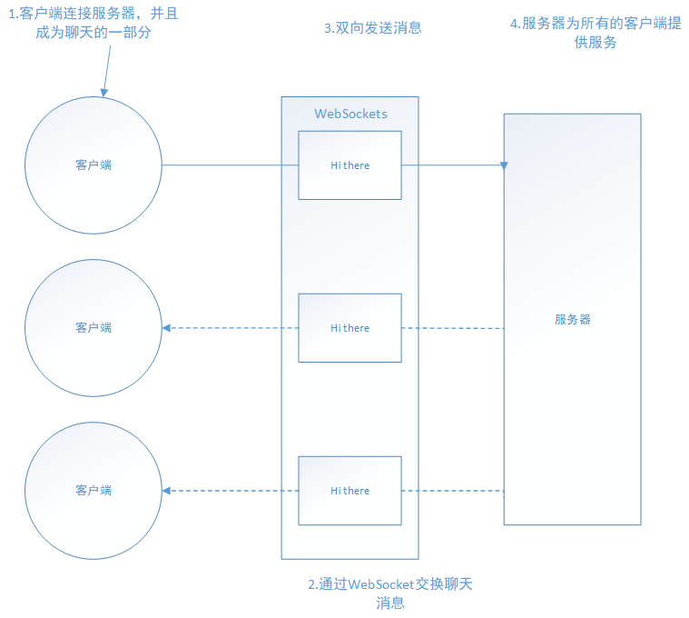

Netty实战

# 第1章 Netty——异步和事件驱动 #

Netty是一款异步的事件驱动的**网络**应用程序框架，支持快速地开发可维护的**高性能**的面向协议的服务器和客户端。

网络编程、多线程处理和并发的专业知识。

## 1.1 Java网络编程 ##

* ServerScoket上的accept()方法将会一直阻塞到一个连接建立，随后返回一个新的Socket用于客户端和服务器之间的通信。该ServerSocket将继续监听传入的连接。
* BufferedReader和PrintWriter都衍生自Socket的输入输出流。前者从一个字符输入流中读取文本，后者打印对象的格式化的表示到文本输出流。
* readLine()方法将会阻塞，直到在3处一个由换行符或者回车符结尾的字符串被读取
* 客户端的请求已经被处理

1. 在任何时候都可能有大量的线程处于休眠状态，只是等待输入或者输出数据就绪，这可能算是一种资源浪费。
2. 需要为每个线程的调用栈都分配内存，器默认值大小区间为64KB到1MB，具体取决于操作系统
3. 即使Java虚拟机（JVM）在物理上可以支持非常大数量的线程，但是远在到达该极限之前，上下文切换带来的开销就会带来麻烦。

### 1.1.1 Java NIO ###

本地套接字库很早地提供了*非阻塞调用*，其为网络资源的利用率提供了相当多的控制。

* 可以使用setsockopt()方法配置套接字，以便读/写调用在没有数据的时候立即返回，也就是说，如果是一个阻塞调用应该已经被阻塞了。
* 可以使用操作系统的事件通知API注册一组非阻塞套接字，以确定它们中是否有任何的套接字已经有数据可供读写。

since JDK1.4 java.nio包中

### 1.1.2 选择器 ###

	class java.nio.channels.Selector是Java的非阻塞I/O实现的关键。

与阻塞I/O模型相比，这种模型提供了更好的资源管理：

* 使用较小的线程便可以处理许多连接，因此也减少了内存管理和上下文切换所带来开销；
* 当没有I/O操作需要处理的时候，线程也可以被用于其他任务。

## 1.2 简介 ##

**Netty的特性总结**

|分类|Netty的特性|
|--|--|
|设计|统一的API，支持多种传输类型，阻塞和非阻塞的|
|易于使用|Netty的特性|
|性能|拥有比Java的核心和大量示例集|
|健壮性|不会因为慢速、快速|
|安全性|完整的SSL/TLS以及StartTLS支持可用于受限环境，如Applet和OSGI|
|社区驱动|发布快速而且频繁|

### 1.2.1 谁在使用Netty ###

Netty的强大的网络抽象

### 1.2.2 异步和事件驱动 ###

## 1.3 核心组件 ##

* Channel
* 回调
* Future
* 事件和ChannelHandler

资源、逻辑以及通知

## 1.3.1 Channel ##

Channel是Java NIO的一个基本构造

代表一个到实体（如一个硬件设备、一个文件、一个网络套接字或者一个能够执行一个或者多个不同的I/O操作的程序组件）的开发连接，如读操作和写操作。

## 1.3.2 回调 ##

一个*回调*其实就是一个方法。一个指向已经被提供给另一个方法的方法的引用。

Netty在内部使用了回调来处理事件。

	public void channelActive(ChannelHandlerContext ctx) {
        // 新连接建立时，channelActive.
        System.out.println("Client " + ctx.channel().remoteAddress() + " connected");
    }

## 1.3.3 Future ##

Future提供了另一种在操作完成时通知应用程序的方式。

interface java.util.concurrent.Future

ChannelFuture提供了几种额外的方法，这些方法使得能够注册一个或者多个ChannelFutureListener实例。监听器的回调方法operationComplete()，将会在对应的操作完成时调用。然后监听器可以判断该操作是成功地完成了还是出错了。

每个Netty的出站I/O操作都将返回一个ChannelFuture；也就是说，他们都不会阻塞。Netty完全是异步和事件驱动的。

	Channel channel = null;
    // Dose not block
    // 异步地连接到远程节点
    ChannelFuture future = channel.connect(new InetSocketAddress("192.168.1.1", 25));

## 1.3.4 事件和ChannelHandler ##

Netty使用不同的事件来通知我们状态的改变或者是操作的状态。

* 记录日志;
* 数据转换;
* 流控制;
* 应用程序逻辑;

Netty是一个网络编程框架，所以事件是按照它们与入站或出站数据流的相关性进行分类的。可能由入站数据或者相关的状态更改而触发的事件包括：

* 连接已被激活或者连接失活；
* 数据读取；
* 用户事件；
* 错误事件；

出站事件是未来将会触发的某个动作的操作结果，这些动作包括：

* 打开或者关闭到远程节点的连接；
* 将数据写到或者冲刷到套接字；

每个事件都可以被分成给ChannelHandler类中的某个用户实现的方法。

### 1.3.5 把它们放在一起 ###

#### 1.Future、回调和ChannelHandler ####

Netty的异步编程模型是建立在Future和回调的概念之上的，而将事件派发到ChannelHandler的方法则发生在更深的层次上。结合在一起，这些元素就提供了一个处理环境，使你的应用程序逻辑可以独立于任何网络操作相关的

拦截操作以及高速地转换入站数据和出站数据，都只需要提供回调或者利用操作所返回的Future。

#### 2.选择器、事件和EventLoop ####

Netty通过触发事件将Selector从应用程序中抽象出来，消除了所有本来将需要手动编写的派发文集那。在内部，将会为每个Channel分配一个EventLoop，用以处理所有事件，包括：

* 注册感兴趣的事件；
* 将事件派发给ChannelHandler
* 安排进一步的动作。

EventLoop本身只由一个线程驱动，其处理了一个Channel的所有I/O事件，并且在该EventLoop的整个生命周期内都不会发生改变。

## 1.4 小结 ##

Netty框架的背景知识、包括Java网络编程API的演变过程，阻塞和非阻塞网络操作之间的区别，以及异步I/O在高容量、高性能的网络编程中的优势。

概述了Netty的特性、设计和优点，其中包括Netty异步模型的底层机制，包括回调、Future以及他们的结合使用。

# 第2章 你的第一款Netty应用程序 #

## 2.1 设置开发环境 ##

### 2.1.1 获取并安装Java开发工具包 ###

## 2.2 Netty 客户端/服务器概览 ##

Echo客户端和服务器应用程序

Echo客户端和服务器之间的交互是非常简单的；在客户但建立一个连接之后，它会向服务器发送一个或多个消息，反过来，服务器又会将每个消息会送给客户端。——充分地体现了客户端/服务器系统中典型的请求-响应交互模式。

## 2.3 编写Echo服务器 ##

* 至少一个ChannelHandler——该组件实现了服务器将从客户端接收的数据的处理，即它的业务逻辑
* 引导——这是配置服务器的启动代码。至少，它会将服务器绑定到它要监听连接请求的端口上。

### 2.3.1 ChannelHandler和业务逻辑 ###

Echo服务器会响应传入的消息，需要实现ChannelInboundHandler接口，用来定义响应*入站*事件的方法。这个简单的应用程序只需要用到少量的这些方法，所以继承ChannelInboundHandlerAdapter类。

* channelRead() ——对于每个传入的消息都要调用；
* channelReacComplete() ——通知ChannelInboundHandler最后一次对channelRead()的调用是当前批量读取中的最后一条消息；
* exceptionCaught()——在读取操作期间，有异常抛出时会调用；

* 针对不同类型的事件来调用ChannelHandler；
* 应用程序通过实现或者扩展ChannelHandler来挂钩到事件的生命周期，并且提供自定义的应用程序逻辑
* 在架构上，ChannelHandler有助于保持业务逻辑与网络处理代码的分离。这简化了开发过程，因为代码必须不断地演化以响应不断变化的需求。

ChannelInboundHandlerAdapter 有一个直观的 API，并且它的每个方法都可以被重写以挂钩到事件生命周期的恰当点上。因为需要处理所有接收到的数据，所以你重写了 channelRead()方法。在这个服务器应用程序中，你将数据简单地回送给了远程节点。

### 2.3.2 引导服务器 ###

EchoServerHandler实现的核心业务逻辑之后，可以探讨引导服务器本身的过程，具体涉及：

* 绑定到服务器将在其上监听并接受传入连接请求的端口
* 配置Channel，以将有关的入站消息通知给EchoServerHandler实例。

* EchoServerHandler实现了业务逻辑；
* main()方法引导了服务器；

	final EchoServerHandler serverHandler = new EchoServerHandler();
	// 创建EventLoopGroup
	EventLoopGroup group = new NioEventLoopGroup();
	try {
	    ServerBootstrap b = new ServerBootstrap();
	    b.group(group)
	            .channel(NioServerSocketChannel.class)
	            // 使用指定的端口设置套接字地址
	            .localAddress(new InetSocketAddress(port))
	            // 添加一个EchoServerHandler到子Channel的ChannelPipeline
	            .childHandler(new ChannelInitializer<SocketChannel>() {
	                @Override
	                public void initChannel(SocketChannel ch) throws Exception {
	                    // EchoServerHandler被标注为@Shareable，所以总是使用同样的实例
	                    ch.pipeline().addLast(serverHandler);
	                }
	            });
	    // 异步地绑定服务器；调用sync()方法阻塞等待直到绑定完成
	    ChannelFuture f = b.bind().sync();
	    // 获取Channel的CloseFuture，并阻塞当前线程直到他完成
	    f.channel().closeFuture().sync();
	} finally {
	    group.shutdownGracefully().sync();
	}

在(2)处，创建了一个ServerBootStrap实例。因为正在使用的是NIO传输，所以指定了NioEventLoopGroup(1)来接受和处理新的连接，并且将Channel的类型指定为NioServerSocketChannel(3)。在此之后，将本地地址设置为一个具有选定端口的InetSocketAddress(4)。服务器将绑定到这个地址以监听新的连接请求。
在(5)处，你使用了一个特殊的类——ChannelInitializer。这是关键。当一个新的连接被接受时，一个新的子 Channel 将会被创建，而 ChannelInitializer 将会把一个你的EchoServerHandler 的实例添加到该 Channel 的 ChannelPipeline 中。正如我们之前所解释的，这个 ChannelHandler 将会收到有关入站消息的通知。
接下来绑定了服务器（6），并等待绑定完成。（对sync()方法的调用将导致当前Thread阻塞，一直到绑定操作完成为止）。在（7）处，该应用程序将会阻塞等待直到服务器的Channel关闭（因为在Channel的CloseFuture上调用了sync()方法）。然后，将可以关闭EventLoopGroup，并释放所有的资源，包括所有被创建的线程。

引导过程中所需要的步骤如下：

* 创建一个ServerBootstrap的实例以引导和绑定服务器；
* 创建并分配一个NioEventLoopGroup实例以进行事件的处理，如接受新连接以及读/写数据；
* 指定服务器绑定的本地的InetSocketAddress；
* 使用一个EchoServerHandler的实例初始化每一个新的Channel；
* 调用ServerBootstrap.bind()方法以绑定服务器。

## 2.4 编写Echo客户端 ##

1. 连接到服务器；
2. 发送一个或者多个消息；
3. 对于每个消息，等待并接收从服务器发回的相同的消息；
4. 关闭连接。

### 2.4.1 通过ChannelHandler实现客户端逻辑  ###

客户端将拥有一个用来处理数据的ChannelInboundHandler，并重写

* channelActive()——在到服务器的连接已经建立之后将被调用；
* channelRead0()——当从服务器接收到一条消息时被调用；
* exceptionCaught()——在处理过程中引发异常时被调用。

### 2.4.2 引导客户端 ###

* 为初始化客户端，创建了一个Bootstrap实例；
* 为进行事件处理分配了一个NioEventLoopGroup实例，其中事件处理包括创建新的连接以及处理入站和出站数据；

## 2.5 构建和运行Echo服务器和客户端 ##

### 2.5.1 运行构建 ###

### 2.5.2 运行Echo服务器和客户端 ###

1. 一旦客户端建立连接，它就发送它的消息——Netty rocks！；
2. 服务器报告接收到的消息，并将其回送给客户端；
3. 客户端报告返回的消息并退出。

## 2.6 小结 ##

# 第3章 Netty的组件和设计 #

通过两个不同的但却又密切相关的视角来探讨Netty：*类库的视角以及框架的视角*。对于使用Netty编写高效的、可重用的可维护的代码。

Netty解决了两个相应的关注领域，大致标记为技术的和体系结构的。

1. 基于Java NIO的异步的和事件驱动的实现，保证了高负载下应用程序性能的最大化和可伸缩性。
2. Netty包含了一组设计模式，将应用程序逻辑从网络层解耦，简化了开发过程，同时也最大限度地提高了可测试性、模块化以及代码的可重用性。

## 3.1 Channel、EventLoop和ChannelFuture ##

* Channel——Socket；
* EventLoop——控制流、多线程处理、并发；
* ChannelFuture——异步通知。

### 3.1.1 Channel接口 ###

基本的 I/O 操作（bind()、connect()、read()和 write()）依赖于底层网络传输所提供的原语。

在基于 Java 的网络编程中，其基本的构造是 class Socket。

Netty的Channel接口所提供的API，大大地降低了直接使用Socket类的复杂性。此外，Channel也是拥有许多预定义的、专门化实现的广泛类层次结构的根。

* EmbeddedChannel;
* LocalServerChannel;
* NioDatagramChannel;
* NioSctpChannel;
* NioSocketChannel;

### 3.1.2 EventLoop接口 ###

EventLoop定义了Netty的核心抽象，用于处理连接的声明周期中所发生的事件。

在高层次上说明了Channel、EventLoop、Thread以及EventLoopGroup之间的关系。

* 一个EventLoopGroup包含一个或者多个EventLoop；
* 一个EventLoop在它的生命周期内之和一个Thread绑定；
* 所有由EventLoop处理的I/O事件都将在它专有的Thread上被处理；
* 一个Channel在它的生命周期内只注册于一个EventLoop；
* 一个EventLoop可能会被分配给一个或多个Channel。

### 3.1.3 ChannelFuture接口 ###

Netty中所有的I/O操作都是异步的。因为一个操作可能不会立即返回，所以需要用于在之后的某个时间点确定其结果的方式。

Netty提供了ChannelFuture接口，其addListener()方法注册了一个ChannelFutureListener，以便在某个操作完成时（无论是否成功）得到通知。

## 3.2 ChannelHandler 和 ChannelPipline ##

### 3.2.1 ChannelHandler接口 ###

Netty的主要组件是ChannelHandler，充当了所有处理入站和出站数据的应用程序逻辑的容器。因为ChannelHandler的方法是由网络事件触发的。

### 3.2.2 ChannelPipelin接口 ###

ChannelPipeline 提供了 ChannelHandler 链的容器，并定义了用于在该链上传播入站和出战事件流的API。当Channel被创建时，它会被自动地分配到它专属的ChannelPipeline。

* 一个ChannelInitializer的实现被注册到了ServerBootstrap中；
* 当ChannelInitializer.initChannel()方法被调用时，ChannelInitializer将在ChannelPipline中安装一组自定义的ChannelHandler;
* ChannelInitializer将它自己从ChannelPipeline中移除。

事件流经ChannelPipeline是ChannelHandler的工作，它们是在应用程序的初始化或者引导阶段被安装的。

### 3.2.3 更加地深入地了解ChannelHandler ###

有许多不同类型的ChannelHandler，各自的功能主要取决于它们的超类。Netty以适配器类的形式提供了大量默认的ChannelHandler实现，其皆在简化应用程序处理逻辑的开发过程。

ChannelPipeline中的每个ChannelHandler将负责把事件转发到链中的下一个ChannelHandler。

* ChannelHandlerAdapter
* ChannelInboundHandlerAdapter
* ChannelOutboundHandlerAdapter
* ChannelDuplexHandler

ChannelHandler的子类型：编码器、解码器和SimpleChannelInboundHandler<T>——ChannelInboundHandlerAdapter的一个子类。

### 3.2.4 编码器和解码器 ###

当你通过Netty发送或者接收一个消息的时候，就将会发生一次数据转换。入站消息会被解码；从字节转换为另一种格式（通常是Java对象）。如果是出站消息，则会发生相反的转换：将从它的当前格式编码为字节。

对应于特定的需要，Netty为编码器和解码器提供了不同类型的抽象类。这些基类的名称将类似于ByteToMessageDecoder或MessageToByteEncoder。

Netty提供的编码器/解码器适配器类都山脊线了ChannelOutboundHandler或者ChannleInboundHandler接口，对于入站数据来说，channelRead方法/事件已经被重写了。对于每个从入站Channel读取的消息，这个方法都将会被调用。随后，它将调用由预置解码器所提供的decode()方法，并将已解码的字节转发给ChannelPipeline中的下一个ChannelInboundHandler。

出站消息的模式是相反反响的：编码器将消息转换为字节，并将它们转发给下一个ChannelOutBoundHandler。

### 3.2.5 抽象类 SimpleChannelInboundHandler ###

利用一个ChannelHandler来接受解码消息，并对数据应用业务逻辑要创建一个这样的ChannelHandler，只需要扩展基类SimpleChannelInboundHandler<T>，其中T是你要处理的消息的Java类型。在这个ChannelHandler中，需要重写基类的一个或者多个方法，并且获取一个到ChannelHandlerContext的引用，这个引用将作为输入参数传递给ChannerlHandler的所有方法。

## 3.3 引导 ##

Netty的引导类为应用车改内需的网络层配置提供了容器，这涉及将一个进程绑定到某个指定的端口，或者将一个进程连接到另一个运行在某个指定主机的指定端口上的进程。

*面向连接的协议，“连接”这个术语仅适用于面向连接的协议，如TCP，其保证了两个连接端点之间消息的有序传递。*

有两种类型的引导：一种用于客户端（简单地称为Bootstrap），而另一种（ServerBootstrap）用于服务器。

**3.1 比较Bootstrap类**

|类别|Bootstrap|ServerBootstrap|
|--|--|--|
|网络编程中的作用|连接到远程主机和端口|绑定到一个本地端口|
|EventLoopGroup的数目|1|2|

1. ServerBootStrap将绑定到一个端口，因为服务器必须要监听连接欸，而BootStrap则是由想要连接到远程节点的客户端应用程序所使用的。
2. 引导一个客户端只需要一个EventLoopGroup，但是一个ServerBootStrap则需要两个（也可以是同一个实例）。
3. 

## 3.4 小结 ##

ChannelHandler、ChannelPipeline和引导

ChannelHandler类的层次结构，并介绍了编码器和解码器，描述了在数据和网络字节格式之间来回转换的互补功能

# 第4章 传输 #

不同的类型的传输

流经网络的数据总是具有相同的类型：字节。

Netty为它所有的传输实现提供了一个通用的API，使得这种转换比直接使用JDK能够达到简单很多。所产生的代码不会被实现的细节所污染，而不需要在整个代码库上进行广泛的重构。

## 4.1 案例研究 ##

### 4.1.1 不通过Netty使用OIO和NIO ###

阻塞（OIO）版本和异步（NIO）版本

### 4.1.2 通过Netty使用OIO和NIO ###

### 4.1.3 非阻塞的Netty版本 ###

## 4.2 传输API ##

传输API的核心是interface Channel，他被用于所有的I/O操作。

每个Channel都将会被分配一个ChannelPipeline和ChannelConfig。ChannelCOnfig包含了该Channel的所有配置设置，并且支持热更新

ChannelPipeline持有所有将应用于入站和出站数据以及事件的ChannelHandler实例，这些ChannelHandler实现了应用程序在用于处理状态变化以及数据处理的逻辑。

* 将数据从一个格式转换为另一种格式；
* 提供异常的通知
* 提供Channel变为活动的或者非活动的通知
* 提供当Channel注册到EventLoop或者从EventLoop注销时的通知；
* 提供有关用户自定义事件的通知。

ChannelPipeline实现了一种常见的设计模式——拦截过滤器（Intercepting Filter）。UNIX管道是另一个熟悉的例子：多个命令被链接在一起，其中一个命令的输出端将连接到命令行中下一个命名的输入端。

Channel的方法

|方法名|描述|
|--|--|
|eventLoop|返回分配给Channel的EventLoop|
|pipeline|返回分配给Channel的ChannelPipeline|
|isActive|如果Channel桑出活动的，则返回true。活动的意义可能依赖于底层的传输。例如，一个Socket传输一旦连接到了远程节点便是活动的，而一个Datagram传输一旦被打开便是活动的|
|localAddress|返回本地的SocketAddress|
|remoteAddress|返回远程的SocketAddress|
|write|将数据写到远程节点。这个数据将被传递给ChannelPipeline，并且排队直到它被冲刷|
|flush|将之前已写的数据冲刷到底层传输，如一个Socket|
|writeAndFlush|一个简便的方法，等同于调用write()并借着调用flush()|

Netty的Channel实现是线程安全的，因此可以存储一个到Channel的引用，并且每当需要向远程结点写数据时，都可以使用它，即使当时许多线程都在使用它。

## 4.3 内置的传输 ##

Netty内置了一些可开箱即用的传输，因为并不是它们所有的传输都支持每一种协议，所以必须选择一个和应用车改内需所使用的协议相容的传输。

**4.2 Netty所提供的传输**

|名称|包|描述|
|--|--|
|NIO|io.netty.channel.socket.nio|使用java.nio.channels包作为基础——基于选择器的方式|
|Epoll|io.netty.channel.epoll|由JNI驱动的epoll()和非阻塞IO。这个传输支持只有在Linux上可用的多种特性，如SO_REUSEPORT，比NIO传输更快，而且是完全非阻塞|
|OIO|io.netty.channel.socket.oio|使用java.net包作为基础——使用阻塞流|
|Local|io.netty.channel.local|可以在VM内部通过管道进行通信的本地传输|
|Embedded|io.netty.channel.embedded|Embedded传输，允许使用ChannelHandler而又不需要一个真正的基于网络的传输

### 4.3.1 NIO——非阻塞I/O ###

NIO提供了一个所有I/O操作的全异步的实现。它利用了自NIO子系统被引入JDK1.4时便可用的基于选择器的API。

可以在Channel的状态发生变化时得到通知：

1. 新的Channel已被接收并且就绪
2. Channel连接已经完成
3. Channel有已经就绪的可供读取的数据
4. Channel可用于写数据

**4-3 选择操作的位模式**

|名称|描述|
|--|--|
|OP_ACCEPT|请求在接受新连接并创建Channel时获得通知|
|OP_CONNECT|请求建立一个连接时获得通知|
|OP_READ|请求当数据已经就绪，可以从Channel中读取获得通知|
|OP_WRITE|请求当可以向Channel中写更多的数据时获得通知。这处理了套接字缓冲区被完全填满时的情况，这种情况通常发生在数据的发送速度比远程节点可处理的速度更快的时候|

1. 新的Channel注册到选择器
2. 选择器处理状态变化的通知
3. 之前已注册的Channel
4. Selector.select()将会阻塞，直到接收到新的状态变化或者配置的超过时间已过时
5. 检查是否有状态变化
6. 处理所有的状态变化
7. 在选择器运行的同一线程中执行其他任务

### 4.3.2 Epoll——用于Linux的本地非阻塞传输 ###

Netty的NIO传输基于Java提供的异步/非阻塞网络编程的通用抽象。

epoll——一个高度可扩展的I/O事件通知特性。这个API自Linux内核版本2.5.44（2002）被引入，提供了比旧的POSIX select和poll系统调用更好的性能，同时现在也是Linux上非阻塞网络编程的事实标准。

使用epoll代替NIO，只需将NioEventLoopGroup替换为EpollEventLoopGroup，并且将NioServerSocketChannel.class替换为EpollServerSocketChannel.class即可

### 4.3.3 OIO——旧的阻塞I/O ###

Netty的OIO传输实现代表了一种折中：可以通过常规的传输API使用，但是由于它是建立在java.net包的阻塞实现之上的，所以它不是异步的。

Netty利用了SO_TIMEOUT这个Socket标志，指定了等待一个I/O操作完成的最大毫秒数。如果操作在指定的时间间隔内没有完成，则将会抛出一个SocketTimeout Exception。

### 4.3.4 用于JVM内部通信的Local传输 ###

Netty提供了一个Local，用于在同一个JVM中运行的客户端和服务器程序之间的异步通信。

JDK的实现是水平触发，而Netty的（默认的）是边沿触发。

### 4.3.5 Embedded传输 ###

Netty提供了一种额外的传输，使得你可以将一组ChannelHandler作为帮助器类嵌入到其他的ChannelHandler内部。通过这种方式，可以扩展一个ChannelHandler的功能，而不需要修改其内部代码。

## 4.4 传输的用例 ##

* 非阻塞代码库
* 阻塞代码块
* 在同一个JVM内部的通信
* 测试你的ChannelHandler实现

**应用程序的最佳传输**

|应用程序的需求|推荐的传输|
|--|--|
|非阻塞代码库或者一个常规的起点|NIO(或者在Linux上使用epoll)|
|阻塞代码库|OIO|
|在同一个JVM内部的通信|Local|
|测试ChannelHandler的实现|Embedded|

## 4.5 小结 ##

# 第5章 ByteBuf #

Netty 的 ByteBuffer 替代品是 ByteBuf ，一个强大的实现，既解决了 JDK API 的局限性，又为网络应用程序的开发者提供了更好的 API。

## 5.1 ByteBuf的API ##

abstract class Bytebuf 和 interface ByteBufHolder

* 它可以被用户自定义的缓冲区类型扩展；
* 通过内置的复合缓冲区类型实现了透明的零拷贝；
* 容量可以按需增长（类似于 JDK 的 StringBuilder）；
* 在读和写这两种模式之间切换不需要调用 ByteBuffer 的 flip()方法；
* 读和写使用了不同的索引；
* 支持方法的链式调用；
* 支持引用计数；
* 支持池化。

ByteBuf和BuyteBufHolder

## 5.2 ByteBuf类——Netty的数据容器 ##

### 5.2.1 它是如何工作 ###

ByteBuf维护了两个不同的索引：一个用于读取，一个用于写入。当你从 ByteBuf 读取时，它的 readerIndex 将会被递增已经被读取的字节数。同样地，当你写入 ByteBuf 时，它的 writerIndex 也会被递增。

默认的限制是 Integer.MAX_VALUE

### 5.2.2 ByteBuf 的使用模式 ###

1. 堆缓冲区

最常用的 ByteBuf 模式是将数据存储在 JVM 的堆空间中。这种模式被称为*支撑数组*（backing array），它能在没有使用池化的情况下提供快速的分配和释放。

2. 直接缓冲区

直接缓冲区是另外一种 ByteBuf 模式。期望用于对象创建的内存分配永远都来自于堆中，但这并不是必须的——NIO 在 JDK 1.4 中引入的 ByteBuffer 类允许 JVM 实现通过本地调用来分配内存。

相对与基于堆的缓冲区，他们的分配和释放都较为昂贵。	

3. 复合缓冲区

第三种也是最后一种模式使用的是复合缓冲区，它为多个 ByteBuf 提供一个聚合视图。

Netty 通过一个 ByteBuf 子类——CompositeByteBuf ——实现了这个模式，它提供了一个将多个缓冲区表示为单个合并缓冲区的虚拟表示。

CompositeByteBuf中的ByteBuf实例可能同时包含直接内存分配和非直接内存分配。如果其中只有一个实例，那么对CompositeByteBuf上的hasArray()方法的调用将返回该组件上的hasArray()方法的值；否则它将返回false。

头部和主题——组成的将通过HTTP协议传输的消息。这两部分由应用程序的不同模块产生，将会在消息被发送的时候组装。该应用程序可以选择为多个消息重用相同的消息主体。当这种情况发生式，对与每个消息都将会创建一个新的头部。

## 5.3 字节级操作 ##

ByteBuf 提供了许多超出基本读、写操作的方法用于修改它的数据。

### 5.3.1 随机访问索引 ###

如同在普通的 Java 字节数组中一样，ByteBuf 的索引是从零开始的：第一个字节的索引是 0，最后一个字节的索引总是 capacity() - 1。

	ByteBuf buffer = null;
    for (int i = 0; i < buffer.capacity(); i++){
        byte b = buffer.getByte(i);
        System.out.println((char)b);
    }

使用那些需要一个索引值参数的方法（的其中）之一来访问数据既不会改变
readerIndex 也不会改变writerIndex。如果有需要，也可以通过调用readerIndex(index) 或者 writerIndex(index)来手动移动这两者。

### 5.3.2 顺序访问索引 ###

ByteBuf同时具有读索引和写索引，但是JDK的ByteBuffer却只有一个索引。——必须调用flip()方法来在读模式和写模式之间进行切换。

### 5.3.3 可丢弃字节 ###

在标记为可丢弃字节的分段包含了已经被读过的字节。通过调用discardReadBytes()方法，可以丢弃他们并回收空间。这个分段的初始化大小为0，存储在readerIndex中，会随着read操作的执行而增加（get*操作不会移动readerIndex）。

discardReadBytes()方法，丢弃字节分段中的空间已经变为可写的。

### 5.3.4 可读字节 ###

ByteBuf的可读字节分段存储了实际数据。新分配的、包装的或者复制的缓冲区的默认的readerIndex值为0。任何名称以read或者skip开头的操作都将检索或者跳过位于当前readerIndex的数据，并且将它增加已读字节数。

如果被调用的方法需要一个 ByteBuf 参数作为写入的目标，并且没有指定目标索引参数，那么该目标缓冲区的 writerIndex 也将被增加

	readBytes(ByteBuf dest);

### 5.3.5 可写字节 ###

可写字节分段是指一个拥有未定义内容的、写入就绪的内存区域。新分配的缓冲区的writerIndex的默认值为0.任何名称以write开头的操作都将从当前的writerIndex处开始些数据，并将它增加已经写入的字节数。如果谢操作的目标也是ByteBuf，并且没有指定源索引的值，则缓冲区的readerIndex也同样会被增加相同的大小。

	ByteBuf buffer = null;
    while (buffer.isReadable()) {
        System.out.println(buffer.readByte());
    }

### 5.3.6 索引管理 ###

JDK的InputStream定义了mark(int readlimit)和reset()方法，这些方法分别被用来将流中的当前位置标记为指定的值，以及流重置到该位置。

markReaderIndex()、markWriterIndex()、resetWriterIndex()和resetReaderIndex()来标记和重置ByteBuf的readerIndex和writerIndex。

    ByteBuf bytebuf = null;
    while (bytebuf.writableBytes() >= 4) {
        bytebuf.writeInt(random.nextInt());
    }

readerIndex(int)或者writerIndex(int)来将索引移动到指定位置。试图将任何一个索引设置到一个无效的位置都将导致一个IndexOutOfBoundsException。

调用clear()方法来将readerIndex和writerIndex都设置为0.

### 5.3.7 查找操作 ###

在 ByteBuf中有多种可以用来确定指定值的索引的方法。最简单的是使用indexOf()方法。

	boolean process(byte value)

它将检查输入值是否是正在查找的值。

ByteBufProcessor针对一些常见的值定义了许多便利的方法。假设你的应用程序需要和所谓的包含由以下NULL结尾的内容的Flash套接字集成。调用
	
	forEachByte(ByteBufProcessor.FIND_NUL)

将简单高效地消费该Flash数据，因为在处理期间只会执行较少的边界检查。

	ByteBuf buffer = ...;
	int index = buffer.forEachByte(ByteBufProcessor.FIND_CR);

### 5.3.8 派生缓冲区 ###

派生缓冲区为ByteBuf提供了以专门的方式来呈现其内容的视图。

* duplicate();
* slice();
* slice(int, int)
* Unpooled.unmodifiableBuffer(..)
* order(ByteOrder)
* readSlice(int)

每个方法都将返回一个新的ByteBuf实例，它具有自己的读索引、写索引和标记索引。其内部存储和JDK的ByteBuffer一样是共享的。

对ByteBuf进行切片
	创建一个用于保存给定字符串的字节的ByteBuf
	Charset utf8 = Charset.forName("UTF-8");
	ByteBuf buf = Unpooled.copiedBuffer("Netty in Action rocks!", utf8);
	// 创建该ByteBuf从索引0开始到索引15结束的一个新切片
	ByteBuf sliced = buf.sllice(0, 15);
	// 将打印“Netty in Action”
	System.out.println(sliced.toString(utf8));
	// 更新索引0处的字节
	buf.setByte(0, (byte)'J');
	将会成功，因为数据是共享的，对其中一个所做的更改对另外一个也是可见的
	assert buf.getByte(0) == sliced.getByte(0);

复制一个ByteBuf
	// 创建ByteBuf以保存所提供的字符串的字节
	Charset utf8 = Charset.forName("UTF-8");
	ByteBuf buf = Unpooled.copiedBuffer("Netty in Action rocks!", utf8);
	// 创建该ByteBuf从索引0开始到索引15结束的分段的副本
	ByteBuf copy = buf.copy(0, 15);
	// 将打印“Netty in Action”
	System.out.println(copy.toString(utf8));
	// 更新索引0处的字节
	buf.setByte(0, (byte) 'J');
	// 将会成功，因为数据不是共享的
	assert buf.getByte(0) != copy.getByte(0);

### 5.3.9 读/写操作 ###

* get()和set()操作，从给定的索引开始，并且保持索引不变；
* read()和write()操作，从给定的索引开始，并且互斥根据已经访问过的字节数对索引进行调整。

### get()操作 ####

|名称|索引|
|--|--|
|getBoolean(int)|返回给定索引处的Boolean值|
|getByte(int)|返回给定索引处的字节|
|getUnsignedByte(int)|返回给定索引处的Boolean值|
|getMedium(int)|返回给定索引处的Boolean值|
|getUnsignedMedium(int)|返回给定索引处的Boolean值|
|getInt(int)|返回给定索引处的Boolean值|
|getUnsignedInt(int)|返回给定索引处的Boolean值|
|getLong(int)|返回给定索引处的Boolean值|
|getShort(int)|返回给定索引处的Boolean值|
|getUnsignedShort(int)|返回给定索引处的Boolean值|
|getBytes(int, ...)|返回给定索引处的Boolean值|

### set()操作 ####

|名称|索引|
|--|--|
|setBoolean(int, boolean)|设定给定索引处的Boolean值|
|setByte(int index, int value)|设定给定索引处的字节值|
|setMedium(int index, int value)|设定给定索引处的24位的中等int值|
|setInt(int index, int value)|设定给定索引处的int值|
|setLong(int index, long value)|设定给定索引处的long值|
|setShort(int index, int value)|设定给定索引处的short值|

	Charset utf8 = Charset.forName("UTF-8");
	// 创建一个新的ByteBuf以保存给定字符串的字节
	ByteBuf buf = Unpooled.copiedBuffer("Netty in Action rocks!", utf8);
	// 打印第一个字符'N'
	System.out.println((char)buf.getByte(0));
	// 存储当前的readerIndex和writerIndex
	int readerIndex = buf.readerIndex();
	int writerIndex = buf.writerIndex();
	buf.setByte(0, (byte)'B'); //将索引0处的字节更新位字符'B'
	System.out.println((char)buf.getByte(0)); //打印第一个字符
	assert readerIndex == buf.readerIndex();
	assert writerIndex == buf.writerIndex();

**read()**

|名称|描述|
|--|--|
|readBoolean()|返回当前readerIndex处的Boolean，并将readerIndex增加1|
|readByte()|返回当前readerIndex处的字节，并将readerIndex增加1|
|readUnsignedByte()|将当前readerIndex处的无符号字节值作为short返回，并将readerIndex增加1|
|readMedium()|返回当前readerIndex处的24位的中等int值，并将readerIndex增加3|
|readUnsignedMedium|返回当前readerIndex处的24位的无符号的中等int值，并将readerIndex增加3|
|readInt()|返回当前 readerIndex的int 值并将
readerIndex增加4|
|readUnsignedInt()|将当前readerIndex处的无符号的int值作为
long值返回，并将readerIndex增加4|
|readLong()|返回当前readerIndex处的long值，并将readerIndex增加8|
|readShort()|返回当前readerIndex处的short值，并将readerIndex增加2|
|readUnsignedShort()|将当前readerIndex处的无符号的short值作为
int值返回，并将readerIndex增加2|
|readBytes(ByteBuf byte[] destination, int dstIndex , int length)|将当前ByteBuf中从当前readerIndex处开始的（如果设置了length长度的字节）数据传送到一个目标ByteBuf或者byte[]，从目标的dstIndex开始的位置。本地的readerIndex将被增加已经传输的字节数|

几乎每个read()方法都有对应的write()方法，用于将数据追加到ByteBuf中。

	Charset utf8 = Charset.forName("UTF-8");
	ByteBuf buf = Unpooled.copiedBuffer("Netty in Action rocks!", utf8);
	System.out.println((char)buf.readByte());
	int readerIndex = buf.readerIndex();
	int writerIndex = buf.writerIndex();
	buf.writeByte((byte)'?');
	assert readerIndex = buf.readerIndex();
	assert writerIndex != buf.writerIndex();

### 5.3.10 更多的操作 ###

|名称|描述|
|isReadeable()|如果至少有一个字节可供读取，则返回true|
|isWritable()|如果至少有一个字节可被写入，则返回true|
|readableBytes()|返回可被读取的字节数|
|writableBytes()|返回可被写入的字节数|
|capacity()|返回ByteBuf可容纳的字节数。在此之后，它会尝试再次扩展直到达到maxCapacity()|
|maxCapacity()|返回ByteBuf可以容纳的最大字节数|
|hasArray()|如果ByteBuf由一个字节数组支撑，则返回true|
|array()|如果ByteBuf由一个字节数组支撑则返回该数组；否则，它将抛出一个UnsupportedOperationException异常|

## 5.4 ByteBufHolder 接口 ##

ByteBufHolder为Netty的高级特性提供了支持，如缓冲区化，其中可以从池中借用ByteBuf，并且在需要时自动释放。

ByteBufHolder的操作
|名称|描述|
|content()|返回由这个ByteBufHolder所持有的ByteBuf|
|copy()|返回这个ByteBufHolder的一个深拷贝，包括一个其所包含的ByteBuf的非共享拷贝|
|duplicate()|返回这个ByteBufHolder的一个浅拷贝，包括一个其所包含的ByteBuf的共享拷贝|

如果想要实现一个将其有效负载存储在ByteBuf中的消息对象，那么ByteBufHolder将是个不错的选择

## 5.5 ByteBuf分配 ##

### 5.5.1 按需分配：ByteBufAllocator接口 ###

降低分配和释放内存的开销

Netty 通过 interface ByteBufAllocator实现了（ByteBuf的）池化，可以用来分配描述过的任意类型的ByteBuf实例。

ByteBufAllocator的方法

|名称|描述|
|--|--|
|buffer(); buffer(int initialCapacity); buffer(int initialCapacity, int maxCapacity);|返回一个基于堆或者直接内存存储的ByteBuf|
|heapBuffer() heapBuffer(int initialCapacity); heapBuffer(int initialCapacity, int maxCapacity)|返回一个基于堆内存存储的ByteBuf|
|directBuffer()  directBuffer(int initialCapacity)  directBuffer(int initialCapacity, int maxCapacity)|返回一个基于直接内存存储的ByteBuf|
|compositeBuffer() compositeBuffer(int maxNumComponents) compositeDirectBuffer() compositeDirectBuffer(int maxNumComponents); compositeHeapBuffer() compositeHeapBuffer(int maxNumComponents)|返回一个可以用过添加最大到指定数目的基于堆的或者直接存储的缓冲区来扩展的CompositeByteBuf|
|ioBuffer()|返回一个用于套接字的I/O操作的ByteBuf|

可以通过Channel（每个都可以用一个不同的ByteBufAllocator实例）或者绑定到ChannelHandler的ChannelHandlerContext获取一个到ByteBufAllocator的引用

获取一个到ByteBufAllocator的引用
	
	Channel channel = ...;
	// 从Channel获取一个ByteBufAllocator的引用
	ByteBufAllocator allocator = channel.alloc();
	...
	ChannelHandlerContext ctx = ...;
	// 从ChannelHandlerContext获取一个到ByteBufAllocator的引用
	ByteBufAllocator allocator2 = ctx.alloc();

ByteBufAllocator的实现：PooledByteBufAllocator和UnpooledByteBufAllocator。前者池化了ByteBuf的实例以提高性能并最大限度地减少内存碎片

Netty默认是用了PooledByteBufAllocator

### 5.5.2 Unpooled缓冲区 ###

可能某些情况下，未能获取一个到ByteBufAllocator的引用。对于这种情况，Netty提供了一个简单的称为Unpooled的工具类，它提供了静态的辅助方法来创建未池化的ByteBuf实例。

Unpooled的方法

|名称|描述|
|--|--|
|buffer() buffer(int initialCapacity) buffer(int initialCapacity, int maxCapacity)|返回一个未池化的基于堆内存存储的ByteBuf|
|directBuffer() directBuffer(int initialCapacity) directBuffer(int initialCapacity, int maxCapacity)|返回一个未池化的基于直接内存存储的ByteBuf|
|wrappedBuffer()|返回一个包装了给定数据的ByteBuf|
|copiedBuffer()|返回一个复制了给定的数据的ByteBuf|

Unpooled 类还使得 ByteBuf 同样可用于那些并不需要 Netty 的其他组件的非网络项目，使得其能得益于高性能的可扩展的缓冲区 API。

### 5.5.3 ByteBufUtil类 ###

ByteBufUtil提供了用于操作ByteBuf的静态的辅助方法。因为这个API是通用的，并且和池化无关，所以这些方法已然在分配类的外部实现。

1. hexdump()方法，以十六进制的表示形式打印ByteBuf的内容。
2. boolean equals(ByteBuf, ByteBuf)，它被用来判断两个ByteBuf实例的相等性。

## 5.6 引用计数 ##

*引用计数*是一种通过在某个对象所持有的资源不再被其他对象引用时释放该对象所持有的资源来优化内存使用和性能的技术。

Netty在第4版中为ByteBuf和ByteBufHolder引入了引用计数技术，都实现了interface ReferenceCounted。

引用计数主要涉及跟踪到某个特定对象的活动引用的数量。一个ReferenceCounted实现的实例将通场以活动的引用计数为1作为开始。只要引用计数大于0，就能保证对象不会被释放。当活动引用的数量减少到0时，该实例就会被释放。

引用计数对于池化实现（如 PooledByteBufAllocator ）来说是至关重要的，它降低了内存分配的开销。

	//引用计数
	Channel channel = ...;
	// 从Channel获取ByteBufAllocator
	ByteBufAllocator allocator = channel.alloc();
	...
	// 从ByteVufAllocator分配一个ByteBuf
	ByteBuf buffer = allocator.directBuffer();
	assert buffer.refCnt() == 1;

	//释放引用计数的对象
	ByteBuf buffer = ...;
	// 减少到该对象的活动引用。当减少到0时，该对象被释放，并且该方法返回true
	boolean released = buffer.release();

试图访问一个已经被释放的引用计数的对象，将会导致一个IllegalReferenceCountException。

## 5.7 小结 ##

* 使用不同的读索引和写索引来控制数据访问；
* 使用CompositeByteBuf生成多个ByteBuf的聚合视图；
* 通过CompositeByteBuf生成多个ByteBuf的聚合视图；
* 数据访问方法——搜索、切片以及复制；
* 读、写、获取和设置API；
* ByteBufAllocator池化和引用计数。

# 第6章 ChannelHandler 和 ChannelPipeline #

ChannelPipeline中将ChannelHandler链接在一起以组织处理逻辑。

## 6.1 ChannelHandler 家族 ##

### 6.1.1 Channel的生命周期 ###

**Channel的生命周期状态**

|状态|描述|
|--|--|
|ChannelUnregistered|Channel已经被创建，但还未注册到至EventLoop|
|ChannelRegistered|Channel已经被注册的到了EventLoop|
|ChannelActive|Channel处于活动状态（已经连接到它的远程节点）。它现在接收和发送数据了|
|ChannelInactive|Channel没有连接到远程节点|

ChannelRegistered->ChannelActive->ChannelInactive->ChannelUnregistered

### 6.1.2 ChannelHandler的生命周期 ###

|类型|描述|
|--|--|
|handlerAdded|当把ChannelHandler添加到ChannelPipeline中时被调用|
|handlerRemoved|当把ChannelHandler移除到ChannelPipeline中时被调用|
|exceptionCaught|当处理过程中在ChannelPipeline中由错误产生时被调用|

Netty定义了两个重要的ChannelHandler子接口：

* ChannelInboundHandler——处理入站数据以及各种状态变化；
* ChannelOutboundHandler——处理出站数据并且允许拦截所有的操作。

### 6.1.3 ChannelInboundHandler 接口 ###

**ChannelInboundHandler的方法**

|类型|描述|
|--|--|
|channelRegistered|当Channel已经注册到它的EventLoop并且能够处理I/O时被调用|
|channelUnregistered|当Channel从它的EventLoop注销并且无法处理I/O时被调用|
|channelActive|当 Channel 处于活动状态时被调用；
Channel 已经连接/绑定并且已经就绪|
|channelInactive|当 Channel 离开活动状态并且不再连接它的远程节点时被调用|
|channelReadComplete|当 Channel 上的一个读操作完成时被调用|
|channelRead|当从 Channel 读取数据时被调用|
|ChannelWritabilityChanged|当 Channel 的可写状态发生改变时被调用。用户可以确保写操作不会完成得太快（以避免发生 OutOfMemoryError ）或者可以在 Channel 变为再次可写时恢复写入。可以通过调用 Channel 的 isWritable() 方法来检测Channel 的可写性。与可写性相关的阈值可以通过 Channel.config().setWriteHighWaterMark() 和 Channel.config().setWriteLowWaterMark() 方法来设置|
|userEventTriggered|当 ChannelnboundHandler.fireUserEventTriggered() 方法被调
用时被调用，因为一个 POJO 被传经了 ChannelPipeline|

当某个 ChannelInboundHandler 的实现重写 channelRead()方法时，它将负责显式地释放与池化的 ByteBuf 实例相关的内存。Netty 为此提供了一个实用方法 ReferenceCountUtil.release()

Netty将使用WARN级别的日志消息记录未释放的资源，使得可以非常简单地在代码中发现违规的实例。

### 6.1.4 ChannelOutboundHandler接口 ###

出站操作和数据将由ChannelOutboundHandler处理。它的方法将被Channel、ChannelPipeline以及ChannelHandlerContext调用。

**ChannelOutboundHandler的方法**

|类型|描述|
|bind(ChannelHandlerContext, SocketAddress, ChannelPromise)|当请求将Channel绑定到本地地址时被调用|
|connect(ChannelHandlerContext, SocketAddress, ChannelPromise)|当请求将Channel连接到远程地址时被调用|
|disconnect(ChannelHandlerContext, ChannelPromise)|当请求将Channel从远程节点断开时被调用|
|close(ChnanelHandlerContext, ChannelPromise)|当请求关闭Channel时被调用|
|deregister(ChannelHandlerContext, ChannelPromise) |当请求将Channel从它的EventLoop注销时被调用|
|read(ChannelHandlerContext)|当请求从Channel读取更多的数据时被调用|
|flush(ChannelHandlerContext)|当请求通过Channel将入队数据冲刷到远程节点时被调用|
|write(ChannelHandlerContext, Object, ChannelPromise)|当请求通过Channel将数据写到远程节点时被调用|

ChannelPromise与ChannelFuture ChannelOutboundHandler中的大部分方法都需要一个ChannelPromise参数

ChannelPromise是ChannelFuture的一个子类，其定义了一些可写的方法，如setSuccess()和setFailure()，从而使ChannelFuture不可变。

### 6.1.5 ChannelHandler适配器 ###

ChannelInboundHandlerAdapter和ChannelOutboundHandlerAdapter类作为自己的ChannelHandler的起始点。着两个适配器分别提供了ChannelInboundHandler和ChannelOutboundHandler的基本实现。通过扩展抽象类ChannelHandlerAdapter，他们获得共同的超接口ChannelHandler的方法。

ChannelHandlerAdapter提供了实用方法isSharable()。如果其对应的实现被标注未Sharable，那么这个方法将返回true，表示它可以被添加到多个ChannelPipeline中。

在ChannelInboundHandlerAdapter和ChannelOutboundHandlerAdapter中所提供的方法体调用了其相关联的ChannelHandlerContext的等效方法，从而将事件转发到ChannelPipeline中的下一个ChannelHandler中。

### 6.1.6 资源管理 ###

每当通过调用 ChannelInboundHandler.channelRead()或者 ChannelOutboundHandler.write()方法来处理数据时，你都需要确保没有任何的资源泄漏。

Netty实用引用计数来处理池化的ByteBuf。所以在完全使用完某个ByteBuf后，调整其引用计数是很重要的。

泄露检测级别

|级别|描述|
|--|--|
|DISABLED|禁用泄露检测。只有在详尽的测试之后才应该设置未这个值|
|SIMPLE|使用1%的默认采样率检测并报告任何发现的泄露。这时默认级别，适合绝大部分的情况|
|ADVANCED|使用默认的采样率，报告所发现的任何的泄露以及对应的消息被访问的位置|
|PARANOID|类似于ADVANCED，但是其将会对每次（对消息的）访问都进行采样。这对性能将会由很大的影响，应该只在调试阶段使用|

## 6.2 ChannelPipeline接口 ##

ChannelPipeline是一个拦截流经Channel的入站和出站时间的ChannelHandler实例链。

每一个新创建的Channel都将会分配一个新的ChannelPipeline。这项关联是永久性的；Channel既不能附加另一个ChannelPipeline，也不能分离其当前的。

根据事件的起源，事件将会被ChannelInboundHandler或者ChannelOutboundHandler处理。随后，通过调用ChannelHandlerContext实现，它将会被转发给同一个超类型的下一个ChannelHandler。

**ChannelHandlerContext**

ChannelHandlerContext使得ChannelHandler能够和它的ChannelPipeline以及其他的ChannelHandler交互。ChannelHandler可以通知其所属的ChannelPipeline中的下一个ChannelHandler，甚至可以动态修改它所属的ChannelPipeline。

ChannelHandlerContext具有丰富的用于处理事件和执行I/O操作的API。

**ChannelPipeline 相对论**

决于该事件是入站的还是出站的。然而 Netty 总是将 ChannelPipeline 的入站口作为头部，而将出站口作为尾端。
当你完成了通过调用 ChannelPipeline.add*()方法将入站处理器（ChannelInboundHandler）
和出站处理器（ChannelOutboundHandler ） 混合添 加到 ChannelPipeline 之 后，每一 个
ChannelHandler 从头部到尾端的顺序位置正如同我们方才所定义它们的一样。

在 ChannelPipeline 传播事件时，它会测试 ChannelPipeline 中的下一个 Channel-
Handler 的类型是否和事件的运动方向相匹配。如果不匹配，ChannelPipeline 将跳过该
ChannelHandler 并前进到下一个，直到它找到和该事件所期望的方向相匹配的为止。（当然，ChannelHandler 也可以同时实现 ChannelInboundHandler 接口和 ChannelOutbound-
Handler 接口。）

### 6.2.1 修改ChannelPipeline ###

ChannelHandler可以通过添加、删除或者替换其他的ChannelHandler来实时地修改ChannelPipeline的布局。（它也可以将它自己从ChannelPipeline中移除。）

**ChannelHandler的用于修改ChannelPipeline的方法**

|名称|描述|
|AddFirstaddBeforeaddAfteraddLast|将一个ChannelHandler添加到ChannelPipeline中|
|remove|将一个ChannelHandler从ChannelPipeline移除|
|replace|将ChannelPipeline中一个ChannelHandler替换未另一个ChannelHandler|

**ChannelHandler的执行和阻塞**

通常ChannelPipeline中的每一个ChannelHandler都是通过它的EventLoop(I/O线程)来处理传递给它的事件的。所以至关重要的是不要阻塞这个线程，因为这会对整体的I/O处理产生负面的影响。

**ChannelPipeline的用于访问ChannelHandler的操作**

|名称|描述|
|get|通过类型或者名称返回ChannelHandler|
|context|返回和ChannelHandler绑定的ChannelHandlerContext|
|names|返回ChannelPipeline中所有ChannelHandler的名称|

### 6.2.2 触发事件 ###

ChannelPipeline的API公开了用于调用入站和出站操作的附加方法。

**ChannelPipeline的入站操作**

|方法名称|描述|
|--|--|
|fireChannelRegistered|调用 ChannelPipeline 中下一个 ChannelInboundHandler 的
channelRegistered(ChannelHandlerContext) 方法|
|fireChannelUnregistered|调用 ChannelPipeline 中下一个 ChannelInboundHandler 的
channelUnregistered(ChannelHandlerContext) 方法|
|fireChannelActive|调用 ChannelPipeline 中下一个 ChannelInboundHandler 的
channelActive(ChannelHandlerContext) 方法|
|fireChannelInactive|调用 ChannelPipeline 中下一个 ChannelInboundHandler 的
channelInactive(ChannelHandlerContext) 方法|
|fireExceptionCaught|调用 ChannelPipeline 中下一个 ChannelInboundHandler 的
exceptionCaught(ChannelHandlerContext, Throwable) 方法|
|fireUserEventTriggered|调用 ChannelPipeline 中下一个 ChannelInboundHandler 的
userEventTriggered(ChannelHandlerContext, Object) 方法|
|fireChannelRead|调用 ChannelPipeline 中下一个 ChannelInboundHandler 的
channelRead(ChannelHandlerContext, Object msg) 方法|
|fireChannelReadComplete|调用 ChannelPipeline 中下一个 ChannelInboundHandler 的
channelReadComplete(ChannelHandlerContext) 方法|
|fireChannelWritabilityChanged|调用 ChannelPipeline 中下一个 ChannelInboundHandler 的
channelWritabilityChanged(ChannelHandlerContext) 方法|

**ChannelPipeline的出站操作**

|方法名称|描述|
|--|--|
|bind|将 Channel 绑定到一个本地地址，这将调用 ChannelPipeline 中的下一个ChannelOutboundHandler 的 bind(ChannelHandlerContext, SocketAddress, ChannelPromise) 方法|
|connect||
|disconnect||
|close||
|deregister||
|flush||
|write||
|writeAndFlush||
|read||

* ChannelPipeline 保存了与 Channel 相关联的 ChannelHandler;
* ChannelPipeline 可以根据需要，通过添加或者删除 ChannelHandler 来动态地修改；
* ChannelPipeline 有着丰富的 API 用以被调用，以响应入站和出站事件。

## 6.3 ChannelHandlerContext接口 ##

ChannelHandlerContext代表了ChannelHandler和ChannelPipeline之间的关联，每当由ChannelHandler添加到ChannelPipeline中时，都会创建ChannelHandlerContext。ChannelHandlerContext的主要功能是管理它所关联的ChannelHandler和再同一个ChannelPipeline中的其他ChannelHandler之间的交互。

**ChannelHandlerContext的API**

### 6.3.1 使用ChannelHandlerContext ###

ChannelHandlerContext 的用法，以及存在于ChannelHandler
Context、Channel 和ChannelPipeline 上的方法的行为

将通过 ChannelHandlerContext 获取到 Channel 的引用。调用
Channel 上的 write()方法将会导致写入事件从尾端到头部地流经 ChannelPipeline。

### 6.3.2 ChannelHandler和ChannelHandlerContext 的高级用法 ###

1. 调用ChannelHandlerContext上的pipeline()方法来获得被封闭的ChannelPipeline的引用。这使得运行时得以操作ChannelPipeline的ChannelHandler。
2. 缓存到ChannelHandlerContext的引用以供稍后使用，

ChannelHandler可以从属于多个ChannelPipeline，所以它也可以绑定到多个ChannelHandlerContext实例。对于这种用法指在多个ChannelPipeline中共享同一个试图将它添加到多个ChannelPipeline时将会触发异常。

显而易见，为了安全地被用于多个并发的 Channel（即连接），这样的 ChannelHandler 必须是线程安全的

**为何要共享同一个 ChannelHandler **
在多个ChannelPipeline中安装同一个ChannelHandler
的一个常见的原因是用于收集跨越多个Channel 的统计信息。

## 6.4 异常处理 ##

### 6.4.1 处理入站异常 ###

如果再处理入站事件的过程中有异常被抛出，那么它将从在ChannelInboundHandler里被触发的那一点开始流经ChannelPipeline。

	public void exceptionCaought (ChannelHandlerContext ctx, Throwable cause)throws Exception

* ChannelHandler.exceptionCaught()的默认实现是简单地将当前异常转发给ChannelPipeline中的下一个ChannelHandler;
* 如果异常到达了ChannelPipeline的尾端，它将会被记录为未被处理；
* 要想定义自定义的处理逻辑，你需要重写exceptionCaught()方法。然后需要决定是否需要将该异常传播出去。

### 6.4.2 处理出站异常 ###

用于处理出站操作中的正常完成以及异常的选项，都基于以下的通知机制。

* 每个出站操作都将返回一个ChannelFuture。注册到ChannelFuture的ChannelFutureListener将在操作完成时被通知该操作是成功了还是出错了。
* 几乎所有的 ChannelOutboundHandler 上的方法都会传入一个 ChannelPromise的实例。作为 ChannelFuture 的子类，ChannelPromise 也可以被分配用于异步通知的监听器。

	ChannelPromise setSuccess();
	ChannelPromise setFailure(Throwable cause);

2. 是将 ChannelFutureListener 添加到即将作为参数传递给 ChannelOutboundHandler 的方法的 ChannelPromise。

**ChannelPromise 的可写方法**

通过调用ChannelPromise上的setSuccess()和setFailure()方法，可以使一个操作的状态在 ChannelHandler 的方法返回给其调用者时便即刻被感知到。

## 6.5 小结 ##

ChannelHandler，ChannelHandler是如何链接在一起，以及他们是如何作为ChannelInboundHandler和ChannelOutboundHandler与ChannelPipeline进行交互。

# 第7章 EventLoop和线程模型 #

*线程模型*指定了操作系统、编程语言、框架或者应用程序的上下文中的线程管理的关键方面。

## 7.1 线程模型概述 ##

在早期的Java语言中，使用多线程处理的主要方式无非是按需创建和启动新的Thread来执行并发的任务单元——一种在高负载下工作得很差的原始方式。

基本的线程池化模式可以描述为：

* 从池的空闲线程列表中选择一个Thread，并且指派它去运行一个已提交的任务（一个Runable的实现）；
* 当任务完成时，将该Thread返回给该列表，使其被重用。

PS：虽然池化和重用线程相对于简单地为每个任务都创建和销毁线程是一种进步，但是它并不能消除由上下文切换所带来的开销，并将其随着线程数量的增加很快变得明显，并且在高负载下越演越烈。

## 7.2 EventLoop接口 ##

运行任务来处理在连接的生命周期内发生的事件是任何网络框架的基本功能。与之相应的编程上的构造通常被称为事件循环——一个Netty是用了interface io.netty.channel.EventLoop来适配术语。

事件循环的基本思想，其中每个人物都是一个Runnable的实例。

Netty的EventLoop是协同设计的一部分，采用了两个基本的API：并发和网络编程。

1. io.netty.util.concurrent包构建在JDK的java.util.concurrent包上，用来提供线程执行器
2. io.netty.channel包中的类，为了与Channel的事件进行交互，扩展了这些接口/类。

在这个模型中，一个EventLoop将由一个永远都不会改变的Thread驱动，同时任务（Runnable或者Callable）可以直接提交给EventLoop实现，以立即执行或者调度执行。

#### 7.2.1 Netty4中的I/O和事件处理 ####

由 I/O 操作触发的事件将流经安装了一个或者多个ChannelHandler 的 ChannelPipeline。传播这些事件的方法调用可以随后被 Channel-
Handler 所拦截，并且可以按需地处理事件。

在Netty4中，所有I/O操作和事件都由已经被分配给了EventLoop的那个Thread来处理。

#### 7.2.2 Netty3中的I/O操作 ####

在以前的版本中所使用的线程模型只保证了入站（之前称为上游）事件会在所谓的 I/O 线程（对应于 Netty 4 中的 EventLoop）中执行。所有的出站（下游）事件都由调用线程处理，其可能是 I/O 线程也可能是别的线程。

因为需要在 ChannelHandler 中对出站事件进行仔细的同步。简而言之，不可能保证多个线程不会在同一时刻尝试访问出站事件。

当出站事件触发了入站事件时，将会导致另一个负面影响。当 Channel.write()方法导致异常时，需要生成并触发一个 exceptionCaught 事件。但是在 Netty 3 的模型中，由于这是
一个入站事件，需要在调用线程中执行代码，然后将事件移交给 I/O 线程去执行，然而这将带来额外的上下文切换。

Netty 4 中所采用的线程模型，通过在同一个线程中处理某个给定的 EventLoop 中所产生的所有事件，解决了这个问题。这提供了一个更加简单的执行体系架构，并且消除了在多个ChannelHandler 中进行同步的需要（除了任何可能需要在多个 Channel 中共享的）。

## 7.3 任务调度 ##

### 7.3.1 JDK的任务调度API ###

在Java5之前，任务调度是建立在Java.util.Timer类之上的，其使用了一个后台Thread，并且具有与标准线程相同的限制。

**java.util.concurrent.Executors类的工厂方法**

|方法|描述|
|--|--|
|newScheduledThreadPool(int corePoolSize) newScheduleThreadPool(int corePoolSize, ThreadFactorythreadFactory)|创建一个ScheduledThreadExecutorService，用于调度命令在指定延迟之后运行或者周期性地真系那个，它使用corePoolSize参数来计算线程数|
|newSingleThreadScheduleExecutor() newSingleThreadScheduleExecutor(ThreadFactorythreadFactory)|创建一个ScheduledThreadExecutorService，用于调度命令在指定延迟之后运行或者周期性地真系那个，它使用一个线程来执行被调度的任务|

### 7.3.2 使用EventLoop调度任务 ###

ScheduleExecutorService的实现具有局限性。

## 7.4 实现细节 ##

### 7.4.1 线程管理 ###

如果（当前）调用线程正是支撑EventLoop的线程，那么所提交的代码块将会被（直接执行）。否则，EventLoop将调度该任务以便稍后执行，并将它放入到内部队队列中。当EventLoop下次处理它的事件时，它会执行队列中的那些任务/事件。（也就解释了任何的Thread是如何与Channel直接交互而无需在ChannelHandler中进行额外同步的）

每个EventLoop都由它自己的任务队列，独立于任何其他的EventLoop。

永远不要将一个长时间运行的任务放入到执行队列中，因为它将阻塞需要在同一线程上执行的任何其他任务。如果必须要进行阻塞调用或者执行长时间运行的任务，我们建议使用一个专门的EventExecutor。

### 7.4.2 EventLoop/线程的分配 ###

#### 1. 异步传输 ####

异步传输实现只使用少量的EventLoop（以及和它们相关联的Thread），而且再当前的线程模型中，它们可能会被多个Channel所共享。（这使得通过尽可能的少量的Thread来支撑大量的Channel，而不是每个Channel分配一个Thread）

EventLoopGroup负责为每个新创建的Channel分配一个EventLoop。在当前实现中，使用顺序循环（round-robin）的方式进行分配以获取一个均衡的分布，并且相同的EventLoop可能会被分配给多个Channel。一旦一个Channel被分配给一个EventLoop，它将在它的整个生命周期中都是用这个EventLoop（以及相关联的Thread）。需要注意的是，EventLoop的分配方式对ThreadLocal的使用的影响，因为一个EventLoop通常会被用于支撑多个Channel，所以对于所有相关联的Channel来说，ThreadLocal都将是一样的。

#### 2. 阻塞传输 ####

用于像OIO（旧的阻塞I/O）这样的其他传输的设计略有不同。

每一个Channel都将被分配给一个EventLoop（以及它的Thread）。

## 7.5 小结 ##

1. EventLoop（I/O Thread）中执行自己的任务
2. 调度任务以便推迟执行，探究高负载下的伸缩性问题
3. 验证一个任务是否已被执行以及如何取消它

# 第8章 引导 #

引导一个应用程序是指对它进行配置，并使它运行起来的过程 — 尽管该过程的具体细节可能并不如它的定义那样简单，尤其是对于一个网络应用程序来说。

## 8.1 Bootstrap类 ##

引导类的层次结构包括一个抽象的父类和两个具体的引导子类。

*. Channel 继承了 AttributeMap。

服务器致力于使用一个父Channel来接受来自客户端的连接，并创建子Channel以用于它们之间的通信；而客户端将最可能只需要一个单独的、没有父Channel的Channel来用于所有的网络交互。

两种应用程序类型之间通用的引导步骤由AbstractBootstrap处理，
客户端（Bootstrap）和服务器（ServerBootstrap）

**为什么引导类是Cloneable的**

需要具有类似配置和完全相同配置的Channel。为了支持这种模式而又不需要为每个Channel都创建并配置一个新的引导类实例，AbstractBootstrap被标记为了Cloneable。在一个已经配置完成的引导类实例上调用clone()方法将返回另一个可以立即使用的引导类实例。

AbstractBootstrap类的完整声明是：

	public abstract class AbstractBootstrap <B extends AbstractBootstrap<B, C>,C extends Channel>

在这个签名中，子类型B是其父类型的一个类型参数，因此可以返回到运行时实例的引用以支持方法的链式调用。（也就是所谓的流式方法）。

## 8.2 引导客户端和无连接协议 ##

Bootstrap类被用于客户端或者是用了无连接协议的应用程序中。

**Bootstrap类的API**

|名称|描述|
|--|--|
|Bootstap group(EventLoopGroup)|设置用于处理Channel所有事件的EventLoopGroup|
|Bootstrap channel(Class<? extends C>) Bootstrap channelFactory ChannelFactory<? extends C>|channel()方法指定了Channel的实现类。如果该实现类没提供默认的构造函数，可以通过调用channelFactory()方法来指定一个工厂类，它将会被bind()方法调用|
|Bootstrap localAddress(SocketAddress)|指定Channel应该绑定到的本地地址。如果没有指定，则将由操作系统创建一个随机的地址。或者，也可以通过bind()或者connect()方法指定localAddress|
|<T> Bootstrap option(ChannelOption<T> option, T value)|设置ChannelOption，其将被应用到每个新创建的Channel的ChannelConfig。这些选项将会通过bind()或者connect()放置设置到Channel，不管哪个先被调用。这个方法在Channel已经被创建后再调用将不会由任何的效果。支持的ChannelOption取决于使用的Channel类型。|
|<T> Bootstrap attr(Attribute<T> key, T value)|指定新创建的Channel的属性值。这些属性值是通过bind()或者connect|
|Bootstrap handler(ChannelHandler)|设置将被添加到ChannelPipeline以接收事件通知的ChannelHandler|
|Bootstrap clone()|创建一个当前Bootstrap的克隆，其具有和原始Bootstrap相同的设置信息|
|Bootstrap remoteAddress(SocketAddress)|设置远程地址。或者，也可以通过connect()方法来指定它|
|ChannelFuture connect()|连接到远程节点并返回一个ChannelFuture，其将会在连接操作完成后接收到通知|
|ChannelFuture bind()|绑定Channel并返回一个ChannelFuture，其将会在绑定操作完成后接收到通知，在那之后必须调用Channel.connect()方法来建立连接|

### 8.2.1 引导客户端 ###

1. Bootstrap类将会在bind()方法被调用后创建一个新的Channel，在这之后将会调用connect()方法以建立连接
2. 在connect()方法被调用后，Bootstrap类将会创建一个新的Channel。

### 8.2.2 Channel和EventLoopGroup的兼容性 ###

	channel
	├───nio
	│ 		NioEventLoopGroup
	├───oio
	│ 		OioEventLoopGroup
	└───socket
		├───nio
		│ 		NioDatagramChannel
		│ 		NioServerSocketChannel
		│ 		NioSocketChannel
		└───oio
				OioDatagramChannel
				OioServerSocketChannel
				OioSocketChannel

**关于illegalStateException的**

* group;
* channel或者channelFactory();
* handler()

如果不这样做，则将会导致IllegalStateException。对handler()方法的调用尤其重要，因为它需要配置好ChannelPipeline。

## 8.3 引导服务器 ##

### 8.3.1 ServerBootstrap类 ###

**ServerBootstrap类的方法**

|名称|描述|
|--|--|
|group|设置ServerBootstrap要用的EventLoopGroup。这个EventLoopGroup将用于ServerChannel和被接受的子Channel的I/O处理|
|channel|设置将要被实例化的 ServerChannel类|
|channelFactory|如果不能通过默认的构造函数 1.创建 Channel ，那么可以提供一个 ChannelFactory|
|localAddress|指定ServerChannel应该绑定到的本地地址。如果没有指定，则将由操作系统使用一个随机地址。或者，可以通过bind()方法来指定该localAddress|
|option|指定要应用到新创建的ServerChannel的ChannelConfig。这些选项将会通过bind()方法设置到Channel。在bind()方法被调用之后，设置或者改变ChannelOption都不会有任何的效果。所支持的ChannelOption取决于所使用的Channel类型。|
|childOption|指定当子Channel被接受时，应用到子Channel的ChannelConfig的ChannelOption。所支持的ChannelOption取决于所使用的Channel的类型|
|attr|指定ServerChannel上的属性，属性将会通过bind()方法设置给Channel。在调用bind()方法之后改变它们将不会有任何的效果|
|childAttr|将属性设置个i已经被接受的子Channel。接下来的调用将不会有任何的效果|
|handler|设置被添加到ServerChannel的ChannelPipeline中的ChannelHandler。更加常见的方法参见childHandler()|
|childHandler|设置将被添加到已被接受的子Channel的ChannelPipeline中的ChannelHandler。handler()方法和childHandler()方法之间的区别是：前者所添加的ChannelHandler将由已被接受的子Channel处理，其代表一个绑定到远程节点的套接字|
|clone|克隆一个设置和原始的ServerBootstrap相同的ServerBootStrap|
|bind|绑定ServerChannel并且返回一个ChannelFuture，其将会在绑定操作完成后收到通知（带着成功或者失败的结果）|

### 8.3.2 引导服务器 ###

childHandler()、childAttr()和childOption()。

ServerChannel的实现负责创建子Channel，这些子Channel代表了已被接受的连接。

## 8.4 从Channel引导客户端 ##

服务器正在处理一个客户端的请求，这个请求需要它充当第三方系统的客户端。当一个应用程序（如一个代理服务器）必须要和组织现有的系统（如Web服务和数据库）集成时，就可能发生这种情况。在这种情况下，将需要从已经被接受的子Channel中引导一个客户端Channel。

创建新的Bootstrap实例，但这并不是最高效的解决方案，因为它将要求你为每个新创建的客户端Channel定义另一个EventLoop。这会产生额外的线程，以及在已被接受的子Channel和客户端Channel之间交互数据时不可避免的上下文切换。

通过将已被接受的子Channel的EventLoop传递给Bootstrap的group()方法来共享该EventLoop。因为分配给EventLoop的所有Channel都使用同一个线程，所以避免了额外的线程创建，以及前面所提到的相关的上下文切换。

1. 在bind()方法被调用时，ServerBootstrap将创建一个新的ServerChannel
2. ServerChannel接受新的连接，并创建子Channel来处理它们
3. 为已被接受的连接创建子Channel
4. 由子Channel创建的Bootstrap类的实例将在connect()方法被调用时创建新的Channel
5. 新的Channel连接到了远程节点
6. EventLoop在由ServerChannel所创建子Channel以及由connect()方法所创建Channel之间共享。

实现EventLoop共享涉及通过调用group()方法来设置EventLoop。

## 8.5 在引导过程中添加多个ChannelHandler ##

在引导过程中调用了handler()或者childHandler()方法来添加单个的ChannelHandler。

根据需要，通过在ChannelPipeline中将它们链接在一起来部署尽可能多的ChannelHandler。如果只能设置一个ChannelHandler，针对此例，Netty提供了一个特殊的ChannelInboundHandlerAdapter子类：

	public abstract class ChannelInitializer<C extends Channel> extends ChannelInboundHandlerAdapter

这个方法提供了一种将多个ChannelHandler添加到一个ChannelPipeline中的简便方法。简单地向Bootstrap或ServerBootstrap的实例提供你的ChannelInitializer实现即可，并且一旦Channel被注册到了它的EventLoop之后，就会调用你的initChannel()版本。在该方法返回之后，ChannelInitizlizer的实例将会从ChannelPipeline中移除自己。

## 8.6 使用Netty的ChannelOption和属性 ##

使用option()方法来讲ChannelOption引用到引导。所提供的值将会被自动应用到引导所创建的所有Channel。可用的ChannelOption包括了底层链接的详细信息，如果keep-alive或者超时属性以及缓冲区设置。

## 8.7 引导DatagramChannel ##

基于TCP协议的SocketChannel，但是Bootstrap类也可以被用于无连接的协议。为此，Netty提供了各种DatagramChannel的实现。唯一区别就是，不再调用connect()方法，而是只调用bind()方法。

使用 Bootstrap 和 DatagramChannel

	// 创建一个Bootstrap的实例以创建和绑定新的数据报 Channel
	Bootstrap bootstrap = new Bootstrap();
	// 设置EventLoopGroup，其提供了用以处理 Channel 事件的 EventLoop
	bootstrap.group(new OioEventLoopGroup()).channel(
		// 指定Channel的实现
		OioDatagramChannel.class).handler(
			//设置用以处理Channel的I/O 以及数据的 Channel-
			InboundHandler
			new SimpleChannelInboundHandler<DatagramPacket>() {
				@Override
				public void channelRead0(ChannelHandlerContext ctx,
					DatagramPacket msg) throws Exception {
					// Do something with the packet
				}
			}

## 8.8 关闭 ##

干净地释放资源，关闭Netty应用程序。

1. 需要关闭EventLoopGroup，它将处理任何挂起的事件和任务，并且随后释放所有的活动线程。（调用EventLoopGroup.shutdownGracefully()方法的作用）
2. 返回一个Future，在关闭完成时接收到通知。
3. shutdownGracefully()方法也是一个异步的操作，所以需要阻塞等待直到它完成，或者向所返回的Future注册一个监听器以在关闭完成时获得通知。

优雅关闭
	
	// 创建处理 I/O 的 EventLoopGroup
	EventLoopGroup group = new NioEventLoopGroup();
	// 创建一个 Bootstrap类的实例并配置它
	Bootstrap bootstrap = new Bootstrap();
	bootstrap.group(group).channel(NioSocketChannel.class);
	...
	// shutdownGracefully()方法将释放所有的资源，并且关闭所有的当前正在使用中的 Channel
	Future<?> future = group.shutdownGracefully();
	// block until the group has shutdown
	future.syncUninterruptibly()

## 8.9 小结 ##

引导Netty服务器和客户端应用车改内需，包括那些使用无连接协议的应用程序。包括在服务器应用程序中的多个ChannelHandler的安装，设置Channel的配置选项，以及如何使用属性来将信息附加到Channel。

# 第9章 单元测试 #

ChannelHandler是Netty应用程序的关键元素，所以彻底地测是它们应该是开发程序的一个标准的部分。最佳事件要求你的测是不仅使能够证明你的实现是正确的，而且还要能够很容易地隔离那些因修改代码而突然出现的问题。这种类型的测试叫作单元测试。

特殊的Channel实现——EmbeddedChannel，是Netty专门为改进针对ChannelHandler的单元测是而提供的。

## 9.1 EmbeddedChannel概述 ##

**9.1 特殊的EmbeddedChannel方法**

Netty 提供了它所谓的 Embedded 传输，用于测试 ChannelHandler。这个传输是一种特殊的 Channel 实现 — EmbeddedChannel — 的功能，这个实现提供了通过 ChannelPipeline 传播事件的简便方法。

|名称|职责|
|--|--|
|writeInbound(Object...msgs)|将入站消息写到EmbeddedChannel中。如果可以通过readInbound()方法从EmbeddedChannel中读取数据，则返回true|
|readInbound()|从 EmbeddedChannel 中读取一个入站消息。任何返回的东西都穿越了整个 ChannelPipeline 。如果没有任何可供读取的，则返回 null|
|writeOutbound(Object...msgs)|将出站消息写到EmbeddedChannel中。如果现在可以通过readOutbound()方法从EmbeddedChannel中读取到什么东西，则返回true|
|readOutbound()|从EmbeddedChannel中读取一个出站消息。任何返回的东西都穿越了整个ChannelPipeline。如果没有任何可供读取的，则返回null|
|finish()|将EmbeddedChannel标记为完成，并且如果有可被读取的入站数据或者出站数据，则返回true。这个方法还将会调用EmbeddedChannel上的close()方法|

入站数据由ChannelInboundHandler处理，代表从远程节点读取的数据。出站数据由ChannelOutboundHandler处理，代表将要写到远程结点的数据。

在每种情况下，消息都将会传递过 ChannelPipeline，并且被相关的 ChannelInboundHandler 或者 ChannelOutboundHandler 处理。如果消息没有被消费，那么你可以使用 readInbound()或者readOutbound()方法来在处理过了这些消息之后，酌情把它们从Channel
中读出来。

## 9.2 使用EmbeddedChannel测是ChannelHandler ##

**JUnit 断言**

org.junit.Assert 类提供了很多用于测试的静态方法。失败的断言将导致一个异常被抛出，并将终止当前正在执行中的测试。导入这些断言的最高效的方式是通过一个 import static 语句来实现：

	import static org.junit.Assert.*;

一旦这样做了，就可以直接调用 Assert 方法了：

	assertEquals(buf.readSlice(3), read);

### 9.2.1 测试入站消息 ###

给定足够的数据，这个实现将产生固定大小的帧。如果没有足够的数据可供读取，它将等待下一个数据块的到来，并将再次检查是否能够产生一个新的帧。

### 9.2.2 测试出站消息 ###

如何使用EmbeddedChannel来测试一个编码器形式的ChannelOutboundHandler，编码器是一种将一种消息格式转换为另一种的组件。

AbsIntegerEncoder，它是Netty的MessageToMessageEncoder的一个特殊化的实现，用于将负值整数转换为绝对值。

* 持有AbsIntegerEncoder的EmbeddedChannel将会以4字节的负整数的形式写出站数据；
* 编码器将从传入的ByteBuf中读取每个负整数，并将会调出Math.abs()方法来获取其绝对值；
* 编码器将会把每个负整数的绝对值写到 ChannelPipeline 中。

1. 将 4 字节的负整数写到一个新的 ByteBuf 中。
2. 创建一个 EmbeddedChannel，并为它分配一个 AbsIntegerEncoder。
3. 调用 EmbeddedChannel 上的 writeOutbound()方法来写入该 ByteBuf。
4. 标记该 Channel 为已完成状态。
5. 从 EmbeddedChannel 的出站端读取所有的整数，并验证是否只产生了绝对值。

## 9.3 测试异常处理 ##

最大的帧大小已经被设置为3 字节。如果一个帧的大小超出了该限制，那么程序将会丢弃它的字节，并抛出一个 TooLongFrameException。位于 ChannelPipeline 中的其他ChannelHandler 可以选择在exceptionCaught()方法中处理该异常或者忽略它。

对TooLongFrameException的处理。这里使用的try/catch块是EmbeddedChannel的一个特殊功能。如果其中一个write*方法产生了一个受检查的Exception，那么它将会被包装在一个RuntimeException中并抛出

## 9.4 小结 ##

使用JUnit这样的测试工具来进行单元测试是一种非常行之有效的方式。

第二部分 编解码器

网络只将数据看作是原始的字节序列。

将应用程序的数据转换为网络格式，以及将网络格式转换为应用程序的数据组件分别叫作编码器和解码器。

# 第10章 编解码器框架 #

编码和解码

## 10.1 什么是编解码器 ##

如果将消息看作是对于特定的应用程序具有具体含义的结构化的字节序列——它的数据。那么编码器是将消息转换为适合于传输的格式（最有可能就是字节流）；而对应的解码器则是将网络字节流转换回应用程序的消息格式。

编码器操作出站数据，而解码器处理入站数据。

## 10.2 解码器 ##

* 将字节解码为消息——ByteToMessageDecoder和ReplayingDecoder；
* 将一种消息类型解码为另一种——MessageToMessageDecoder。

每当需要为ChannelPipeline中的下一个ChannelInboundHandler转换入站数据时会用到。

### 10.2.1 抽象类ByteToMessageDecoder ###

将字节解码为消息（或者另一个字节序列）是一项常见的任务，Netty为它提供了一个抽象的基类：ByteToMessageDecoder。由于你不可能直到远程节点是否会一次性地发送一个完整的消息，所以这个类对入站数据进行缓冲，直到它准备好处理。

**ByteMessageDecoder API**

|方法|描述|
|--|--|
|decode(ChannelHandlerContext ctx, ByteBuf in, List<Object> out)|decode()方法被调用时将会传入一个包含了传入数据的ByteBuf，以及一个用来添加解码消息的List。|
|decodeLast(ChannelHandlerContext ctx, ByteBuf in, List<Object> out)|Netty提供的这个默认实现只是简单地调用了decode()方法。当Channel的状态变为非活动时，这个方法将会被调用一次。可以重写该方法以提供特殊的处理|

### 10.2.2 抽象类ReplayingDecoder ###

ReplayingDecoder扩展了ByteToMessageDecoder类，不必调用readableBytes()方法。通过使用一个自定义的ByteBuf实现，ReplayingDecoderByteBuf，包装传入的ByteBuf实现了这一点，其将在内部执行该调用。

	public abstract class ReplayingDecoder<S> extends ByteToMessageDecoder
	类型参数S指定了用于状态管理的类型，其中Void代表不需要状态管理。

* 并不是所有的ByteBuf操作都被支持，如果调用了一个不被支持的方法，将会抛出一个UnsupportedOperationException；
* ReplayingDecoder稍慢于ByteToMessageDecoder。

两者比较，如果使用ByteToMessageDecoder不会引入太多的复杂性，可以使用它；否则，请使用ReplayingDecoder。

**other**

* io.netty.hander.coderc.LineBasedFrameDecoder
* io.netty.hander.coderc.http.HttpObjectDecoder

### 10.2.3 抽象类MessageToMessageDecoder ###

	public abstract class MessageToMessageDecoder<T> extends ChannelInboundHandlerAdapter

**MessageToMessageDecoder API**

|方法|描述|
|--|--|
|decode(ChannelHandlerContext ctx, I msg, List<Object> out)|对于每个需要被解码为另一种格式的入站消息来说，该方法都将会被调用。解码消息随后会被传递给ChannelPipeline中的下一个ChannelInboundHandler|

	public void decode(ChannelHandlerContext ctx, Integer msg, List<Object> out) throw Exception;

解码的String将被添加到传出的List中，并转发给下一个ChannelInboundHandler。

	HttpObjectAggregator
	
### 10.2.4 TooLongFrameException类 ###

将由解码器在帧超出指定的大小限制时抛出。

为了避免这种情况，设置一个最大字节数的阀值，如果超出该阀值，则会导致抛出一个TooLongFrameException类（随后会被ChannelHandler.exceptionCaught()）

## 10.3 编码器 ##

* 将消息编码为字节；
* 将消息编码为另一种格式的消息。

### 10.3.1 抽象类MessageToByteEncoder ###

MessageToByteEncoder

### 10.3.2 抽象类MessageToMessageEncoder ###

|名称|描述|
|--|--|
|encode(ChannelHandlerContext ctx, I msg, List<Object> out)|实现的唯一方法。每个通过write()方法写入的消息都将会被传递给encode()方法，以编码为一个或者多个出站消息。随后，这些出站消息将会被转发给ChannelPipeline中的下一个ChannelOutboundHandler|

## 10.4 抽象的编解码器类 ##

同一个类中管理入站和出站数据和消息的转换是很有用的。这些类同时实现了ChannelInboundHandler和ChannelOutboundHandler接口。

### 10.4.1 抽象类ByteToMessageCodec ###

字节解码为某种形式的消息，可能是POJO，随后再次对它进行编码。可以使用ByteToMessageCodec，因为它结合了ByteToMessageDecoder以及它的逆向——MessageToByteEncoder。

任何的请求/响应协议都可以作为使用ByteToMessageCodec的理想选择。例如，在某个SMTP的实现中，编解码器将读取传入字节，并将它们解码为一个自定义的消息类型，如SmtpRequest。而在接收端，当一个响应被创建时，将会产生一个SmtpReponse，其将被编码回字节以便进行传输。

**ByteToMessageCodec API**

|方法名称|描述|
|--|--|
|decode(ChannelHandlerContext ctx, ByteBuf in, List<Object> out)|只要有字节可以被消费，这个方法就将会被调用。它将入站ByteBuf转换为指定的消息格式，并将其转发给ChannelPipline中的下一个CHannelInboundHandler|
|decodeLast(ChannelHandlerContext ctx, ByteBuf in, List<Object> out)|这个方法的默认实现委托给了decode()方法。它只会在Channel的状态变为非活动时被调用一次。它可以被重写以实现特殊的处理|
|encode(ChannelHandlerContext ctx, ByteBuf in, List<Object> out)|对于每个将被编码并写入出站ByteBuf的（类型为I的）消息来说，这个方法都将会被调用|

### 10.4.2 抽象类MessageToMessageCodec ###

	public abstract class MessageToMessageCodec<INBOUND_IN, OUTBOUND_IN>

**MessageToMessageCodec的方法**

|方法名称|描述|
|--|--|
|protected abstract decode(ChannelHandlerContext ctx, INBOUND_IN msg, List<Object> out)|INBOUND_IN -> OUTBOUND_IN，这些消息将被转发给ChannelPipeline中的下一个ChannelInboundHandler|
|protected abstract encode(ChannelHandlerContext ctx, OUTBOUND_IN msg, List<Object> out)|OUTBOUND_IN -> INBOUND_IN，这些消息将被转发给ChannelPipeline中的下一个ChannelOutboundHandler|

decode()方法是将INBOUND_IN类型的消息转换为OUTBOUND_IN类型的消息，而encode()方法则进行它的逆向操作。将INBOUND_IN类型的消息看作是通过网络发送的类型，而将OUTBOUND_IN类型的消息看作桑i应用程序所处理的类型。

**WebSocket协议**

下面关于MessageToMessageCodec的示例引用了一个新出的WebSocket协议，这个协议能实现Web浏览器和服务器之间的全双向通信。

### 10.4.3 CombinedChannelDuplexHandler类 ###

结合一个解码器和编码器可能会对可重用性造成影响，但是，有一种方法既能够避免这种惩罚，又不会牺牲将一个解码器和一个编码器作为一个单独的单元部署所带来的便利性。

	CombinedChannelDuplexHandler

	public class CombinedChannelDuplexHandler <I extends ChannelInboundHandler, O extends ChannelOutboundHanlder>

ChannelInboundHandler和ChannelOutboundHandler（该类的类型参数I和O）的容器。通过提供分别继承了解码器类和编码器类的类型，可以实现一个编解码器，而又不必直接扩展抽象的编解码器类。

## 10.5 小结 ##

抽象的编解码器类是如何为在一个实现中处理解码和编码提供支持的。如果你需要更大的灵活性，或者希望重用现有的实现，那么你还可以选择结合他们，而无需扩展任何抽象的编解码器类。

# 第11章 预置的ChannelHandler和编解码器 #

SSL/TLS 和 WebSocket

## 11.1 通过SSL/TLS保护Netty应用程序 ##

为了支持SSL/TLS，Java提供了javax.net.ssl包，它的SSLContext和SSLEngine类使得实现解密和加密相当简单直接。Netty通过一个和名为SslHandler的ChannelHandler实现利用了这个API，其中SslHandler在内部使用SSLEngine来完成实际的工作。

在大多数情况下，SslHandler将是ChannelPipeline中的第一个ChannelHandler。确保只有在所有其他的ChannelHandler将他们的逻辑应用在数据之后，才会进行加密。

**SslHandler方法**

|方法名称|描述|
|--|--|
|setHandshakeTimeout(long, TimeUnit) setHandShakeTimeoutMillis(long) getHandshakeTimeoutMillis()|设置和获取超时事件，超时之后，握手ChannelFuture将会被通知失败|
|setCloseNotifyTimeout(long, TimeUnit) setCloseNotifyTimeout(long) setCloseNotifyTimeout()|设置和获取超过事件，超时之后，将会触发一个关闭通知并关闭连接。这也将会导致通知该ChannelFuture失败|
|handshakeFuture()|返回一个在握手完成后将会得到通知的ChannelFuture。如果握手先前已经执行过了，则返回一个包含了先前的握手结果的ChannelFuture|
|close() close(ChannelPromise) close(ChannelHandlerContext, ChannelPromise)|发送close_notify以请求关闭并销毁底层的SslEngine|

## 11.2 构建基于Netty的HTTP/HTTPS应用程序 ##

HTTP/HTTPS是常见的协议套件之一。

Netty提供的ChannelHandler，可以用它来处理HTTP和HTTPS协议，而不必编写自定义的编解码器。

### 11.2.1 HTTP解码器、编码器和编解码器 ###

HTTP是基于请求/响应模式的，客户端向服务器发送一个HTTP请求，然后服务器将会返回一个HTTP响应。Netty提供了多种编码器和解码器以简化对这个协议的使用。

完整的HTTP请求（FullHttpRequset）：

1. HTTP请求的第一个部分包含了HTTP的头部消息（HttpRequest）
2. HTTPContent包含了数据，后面可能还跟着一个或者多个HttpContent部分（HttpContent）
3. HttpContent 
4. LastHttpContent标记了该HTTP请求的结束，可能还包含了尾随的HTTP头部信息（LastHttpContent）

一个HTTP请求/响应可能由多个数据部分组成，并且它总是以一个LastHttpContent部分作为结束。FullHttpRequest和FullHttpResponse消息是特殊的子类型，分别代表了完整的请求和响应。所有类型的HTTP消息（FullHttpRequest、LastHttpContent）都实现了HttpObject接口。

**HTTP解码器和编码器**

|名称|描述|
|--|--|
|HttpRequestEncoder|将HttpRequest、HttpContent和LastHttpContent消息编码为字节|
|HttpRequestEncoder|将HttpResponse、HttpContent和LastHttpContent消息编码为字节|
|HttpRequestEncoder|将字节解码为HttpRequest、HttpContent和LastHttpContent消息|
|HttpRequestEncoder|将字节解码为HttpResponse、HttpContent和LastHttpContent消息|

### 11.2.2 聚合HTTP消息 ###

在ChannelInitializer将ChannelHandler安装到ChannelPipeline中之后，你便可以处理不同类型的HttpObject消息了。但是由于HTTP的请求和响应可能由许多部分组成，因此它需要聚合它们以形成安装的消息。Netty提供了一个聚合器，可以将多个消息部分合并为FullHttpRequest或者FullHttpReponse消息。

由于消息分段需要被缓冲，直到可以转发一个安装的消息给下一个ChannelInboundHandler带来轻微开销。

引入这种自动聚合机制只不过是向ChannelPipeline中添加另一个ChannelHandler罢了。

### 11.2.3 HTTP压缩 ###

当使用HTTP时，建议开启压缩功能以尽可能多地减少传输数据的大小，但会带来了一些CPU时钟周期的开销。 

Netty为压缩和解压缩提供了ChannelHandler实现，他们同事支持gzip和
deflate编码。

	HTTP请求的头部信息
	客户端可以通过提供以下头部信息来指示服务器它所支持的压缩格式：

	GET/encrtpted-area HTTP/1.1
	Host: www.example.com
	Accept-Encoding: gzip, deflate

### 11.2.4 使用HTTPS ###

启用HTTPS只需将SslHandler添加到ChannelPipline的hannelHandler组合中。

Netty的架构方式是如何将代码重用变为杠杠作用的。只需要简单地将一个ChannelHandler添加到ChannelPipeline中，便可以提供一项新功能，甚至像加密这样重要的功能都能提供。

### 11.2.5 WebSocket ###

WebSocket规范，提供了“在一个单个的TCP连接上提供双向的通信...结合WebSocketAPI...它为网页和远程服务器之间的双向通信提供了一种代替HTTP轮询的方案”。

WebSocket在客户端和服务器之间提供了真正的双向数据交换。WebSocket现在可以用于传输任意类型的数据，很像普通的套接字。

要想问你的应用程序中添加对于WebSocket的支持，需要将适当的客户端或者服务器WebSocket ChannelHandler添加到ChannelPipeline中。这个类将处理由WebSocket定义的称为帧的特殊消息类型。

**WebSocketFrame类型**

|名称|描述|
|--|--|
|BinaryWebSocketFrame|数据帧：二进制数据|
|TextWebSocketFrame|数据帧：文本数据|
|ContinuationWebSocketFrame|数据帧：属于上一个BinaryWebSocketFrame或者TextWebSocketFrame的文本或者二进制和数据|
|CloseWebSocketFrame|控制帧：一个CLOSE请求、关闭的状态码以及关闭的原因|
|PingWebSocketFrame|控制帧：请求一个PongWebSocketFrame|
|PongWebSocketFrame|控制帧：对PingWebSocketFrame请求的响应|

Netty主要是一种服务器端的技术，重点创建WebSocket服务器。

WebSocketServerProtocolHandler的简单实例，这个类处理协议升级握手，以及三种控制帧——Close、Ping和Pong。Text和Binary数据帧将会被专递给下一个（实现的）ChannelHandler进行处理。

*保护WebSocket 要想为WebSocket添加安全性，只需要将SslHandler作为第一个ChannelHandler添加到ChannelPipline中。*

## 11.3 空闲的连接和超时 ##

连接管理

**用于空闲连接以及超时的ChannelHandler**

|名称|描述|
|--|--|
|IdleStateHandler|当连接空闲时间太长，将会触发一个IdleStateEvent时间，然后你可以通过在你的ChannelInboundHandler中重写userEventTriggered()方法来处理该IdleStateEvent|
|ReadTimeoutHandler|如果在指定时间间隔内每首收到任何的入站数据|
|WriteTimeoutHandler|如果在指定时间间隔内每首收到任何的出站数据|

## 11.4 解码基于分隔符的协议和基于长度的协议 ##

解码器的基于分隔符和帧长度的协议

### 11.4.1 基于分隔符的协议 ###

基于分隔符的（delimited）消息协议使用定义的字符来标记的消息或者消息段（通常被称为帧）的开头或者结尾。

**用于处理基于分隔符的协议和基于长度的协议的解码器**

|名称|描述|
|--|--|
|DelimiterBaseFrameDecoder|使用任何由用户提供的分隔符来提取帧的通用解码器|
|LineBasedFrameDecoder|提取由行尾符(\n或者\r\n)分隔的帧的解码器。这个解码器比DelimiterBasedFrameDecoder更快|

协议规范

* 传入数据流是一系列的帧，每个帧都由换行符（\n）分隔；
* 每个帧都由一系列的元素组成，每个元素都由单个空格字符分隔；
* 一个帧的内容代表一个命令，定义为一个命令名称后跟着数目可变的参数；

自定义解码器

* Cmd——将帧（命令）的内容存储在ByteBuf中，一个ByteBuf用于名称，另一个用于参数
* CmdDecoder——从被重写的decode()方法中获取一行字符串，并从它的呢日哦那个构建一个Cmd的实例
* CmdHandler
* CmdHandlerInitializer

### 11.4.2 基于长度的协议 ###

|名称|描述|
|--|--|
|FixedLengthFrameDecoder|提取在调用构造函数时指定的定长帧|
|LengthFieldBasedFrameDecoder|根据编码进帧头部中的长度值提取帧；该字段的偏移量以及长度在构造函数中指定|

## 11.5 写大型数据 ##

通过支持零拷贝的文件传输的Channel来发送的文件区域

在需要将数据从文件系统复制到用户内存中时，可以使用ChunkedWriterHandler，支持异步写大型数据流，而不会导致大量的内存消耗。

关键是 interface ChunkedInput<B>，其中类型参数B是readChunk()方法返回类型。Netty预置了该接口的4个实现。

|名称|描述|
|--|--|
|ChunkedFile|从文件中逐块获取数据，当平台不支持零拷贝或者需要转换数据时使用|
|ChunkedNioFile|和ChunkedFile类似，只是它使用了FileChannel|
|ChunkedStream|从InputStream中逐块传输内容|
|ChunkedNioStream|从ReadableByteChannel中逐块传输内容|

## 11.6 序列化数据 ##

JDK提供了ObjectOutputStream和ObjectInputStream，用于通过网络对POJO的基本数据类型和图进行序列化和反序列化。

### 11.6.1 JDK序列化 ###

ObjectOutputStream和ObjectInputStream的远程节点交互

|名称|描述|
|--|--|
|CompatibleObjectDecoder|和使用JDK序列化的非基于Netty的远程节点进行互操作的解码器|
|CompatibleObjectEncoder|和使用JDK序列化的非基于Netty的远程节点进行互操作的编码器|
|ObjectDecoder|构建于JDK序列化之上的使用自定义的序列化来解码的解码器；当没有其他的外部依赖时，它提供了速度上的改进。否则其他的序列化实现更加可取|
|ObjectEncoder|构建于JDK序列化之上的使用自定义的序列化来编码的编码器；当没有其他的外部依赖时，它提供了速度上的改进。否则其他的序列化实现更加可取|

### 11.6.2 使用JBoss Marshalling进行序列化 ###

|名称|描述|
|--|--|
|CompatibleMarshallingDecoder|与只使用JDK序列化的远程节点兼容|
|CompatibleMarshallingEncoder|与只使用JDK序列化的远程节点兼容|
|MarshallingDecoder|适用于使用JBoss Marshalling的节点。这些类必须一起使用|
|MarshallingEncoder|适用于使用JBoss Marshalling的节点。这些类必须一起使用|

### 11.6.3 通过Protocol Buffers序列化 ###

Protobuf 编解码器

|名称|描述|
|--|--|
|ProtobufDecoder|使用protobuf对消息进行解码|
|ProtobufEncoder|使用protobuf对消息进行解码|
|ProtobufVarint32FrameDecoder|根据消息中的Google Protocol Buffers的“Base 128 Varint” 整型长度字段值动态地分割所接收的ByteBuf|
|ProtobufVarint32LengthFieldPrepender|使用protobuf对消息进行解码|

## 11.7 小结 ##

Netty提供的编码器以及各种ChannelHandler可以被组合和扩展，以实现非常广泛的处理方案。

第三部分 网络协议

# 第12章 WebSocket #

硬实时服务质量是保证计算结果将在指定的时间间隔内被递交，仅HTTP的请求/响应模式设计就使得其很难被支持。

## 12.1 WebSocket 简介 ##

皆在为Web上的双向数据传输问题提供一个切实可行的解决方案，使得客户端和服务器之间在任意时刻传输消息。

## 12.2 我们的WebSocket示例应用程序 ##

该应用程序的逻辑：

1. 客户端发送一个消息；
2. 该消息将被广播到所有其他连接的客户端。

1. 客户端连接服务器，并且成为聊天的一部分
2. 通过WebSocket应用程序逻辑
3. 双向发送消息
4. 服务器为所有的客户端提供服务

## 12.3 添加WebSocket支持 ##

在从标准的HTTP或者HTTPS协议切换到WebSocket时，将会使用一种称为*升级握手*的机制。

如果被请求的URL以/ws结尾，那么将会把该协议升级为WebSocket；否则，服务器使用基本的HTTP/S。在连接已经升级完成周，所有数据都将会使用WebSocket进行传输。

1. 聊天室客户端
2. 客户端发送HTTP请求（到标准的/或者位置为/ws的URI）
3. 聊天室服务器
4. 服务器响应到地址为/的URI的请求，其将传输index.html
5. 如果地址为/ws的URI被访问，那么服务器将会处理WebSocket升级
6. 在协议升级完成之后，服务器将会通过WebSocket发送消息

### 12.3.1 处理HTTP请求 ###

首先，将实现该处理HTTP请求的组件。这个组件系那个提供用于访问聊天室显示由连接的客户端发送的消息的网页。

### 12.3.2 处理WebSocket帧 ###

由 IETF 发布的 WebSocket RFC，定义了 6 种帧，Netty 为它们每种都提供了一个 POJO 实现。

**WebSocketFrame 的类型**

|帧类型|描述|
|--|--|
|BinaryWebSocketFrame|包含了二进制数据|
|TextWebSocketFrame|包含了文本数据|
|ContinuationWebSocketFrame|包含属于上一个BinaryWebSocketFrame或TextWebSocketFrame的文本数据或者二进制数据|
|CloseWebSocketFrame|表示一个 CLOSE 请求，包含一个关闭的状态码和关闭的原因|
|PingWebSocketFrame|请求传输一个 PongWebSocketFrame|
|PongWebSocketFrame|作为一个对于 PingWebSocketFrame 的响应被发送|

* CloseWebSocketFrame
* PingWebSocketFrame
* PongWebSocketFrame
* TextWebSocketFrame

### 12.3.3 初始化ChannelPipeline ###

|ChannelHandler|职责|
|--|--|
|HttpServerCodec|将字节解码为HttpRequest、HttpContent和LastHttpContent。并将HttpRequest、HttpContent和LastHttpContent编码为字节|
|ChunkWriteHandler|写入一个文件的内容|
|HttpObjectAggregator|将一个HttpMessage和跟随它的多个HttpCOntent聚合为单个FullHttpRequst或者FullHttpResponse（取决于它是被用来处理请求还是响应）。安装了这个之后，ChannelPipeline中的下一个ChannelHandler将只会收到完成的HTTP请求或响应。|
|HttpRequestHandler|处理FullHttpRequest（那些不发送到/ws URI的请求）|
|WebSocketServerProtocolHandler|按照WebSocket规范的要求，处理WebSocket升级握手PingWebSocketFrame、PongWebSocketFrame和CloseWebSocketFrame|
|TextWebSocketFrameHandler|处理TextWebSocketFrame和握手完成事件|

Netty的WebSocketServerProtocolHandler处理了所有委托管理的WebSocket帧类型以及升级握手本身。如果握手成功，那么所需的Channelhandler将会添加到ChannelPipeline中，而那些不再需要的ChannelHandler则将会被移除。

### 12.3.4 引导 ###

引导该服务器，并安装ChatServerInitializer的代码。

## 12.4 测试该应用程序 ##

#### 如何进行加密 ####

使用Netty，将一个SslHandler添加到ChannelPipeline中，并配置它的问题。

## 12.5 小结 ##

使用Netty的WebSocket实现来管理Web应用程序中的实时数据。

# 第13章 使用UDP广播事件 #

