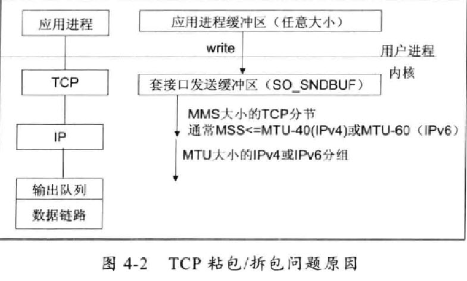

# Netty 权威指南 #

### 基础篇 走进Java Nio ###

## 第1章 Java的I/O演进之路 ##

### 1.1 I/O基础入门 ###

* 没有数据缓冲区，I/O性能存在问题；
* 没有C或者C++中的Channel概念，只有输入和输出流；
* 同步阻塞式I/O通信（BIO），通常会导致通信线程被长时间阻塞；
* 支持的字符集有限，硬件可移植性不好。

#### 1.1.1 Linux网络I/O模型简介 ####

UNIX网络编程对I/O模型的分类，UNIX提供了5种I/O模型

1. 阻塞I/O模型
2. 非阻塞I/O模型
3. I/O复用模型
4. 信号驱动I/O模型
5. 异步I/O：告知內核

#### 1.1.2 I/O多路复用技术 ####

在I/O编程过程中，当需要同时处理多个客户端接入请求时，可以利用多线程或者I/O多路复用技术进行处理。I/O多路复用技术通过把多个I/O的阻塞复用到同一个select的阻塞上，从而使得系统在单线程的情况下可以同时处理多个客户端请求。与传统的多线程/多进程模型比，I/O多路复用的最大优势是系统开销小，系统不需要创建新的额外进程或者线程，也不需要维护这些进程和线程的运行。

* 服务器需要同时处理多个处于监听状态或者多个连接的套接字；
* 服务器需要同时处理多种网络协议的套接字。

select、pselsect、poll、epoll。

1. 支持一个进程打开的socket描述符（FD）不受限制（仅受限于操作系统的最大文件句柄数）。
2. I/O效率不会随着FD的增加而线性下降。
3. 使用mmap加速内核与用户空间的消息传递。
4. epoll的API更加简单。

### 1.2 Java的I/O演进 ###

java.nio

* 进行异步I/O操作的缓冲区ByteBuffer等；
* 进行异步I/O的管道Pipe；
* 进行各种I/O操作（异步或者同步）的Channel，包括ServerSocketChannel和SocketChannel；
* 多种字符集的编码能力和解码能力；
* 实现非阻塞I/O操作的多路复用器selector；
* 基于流行的Perl实现的正则表达式类库；
* 文件通道FileChannel。

**Java的I/O发展简史**

### 1.3 总结 ###

## 第2章 Java的I/O演进之路 ##

### 2.1 传统的BIO编程 ###

#### 2.1.1 BIO通信模型图 ####

#### 2.1.2 同步阻塞式I/O创建的TimeServer源码分析 ####

#### 2.1.3 同步阻塞式I/O创建的TimeClient源码分析 ####

客户端通过Socket创建，发送查询时间服务器的“QUERY TIME ORDER”指令，然后读取服务端的响应并将结果打印出来，随后关闭连接，释放资源，程序退出执行。

当有一个新的客户端请求接入时，服务端必须创建一个新的线程处理新接入的客户端链路，一个线程只能处理一个客户端连接。

### 2.2 伪异步I/O编程 ###

通过一个线程池来处理多个客户端的请求接入，形成客户端个数M：线程池最大线程数N的比例关系，其中M可以远远大于N。通过线程池可以灵活地调配线程资源，设置线程的最大值。

#### 2.2.1 伪异步I/O模型图 ####

采用线程池和任务队列 伪异步的I/O通信框架。

当有新的客户端接入时，将客户端的Socket封装成一个Task（该任务实现java.lang.Runnable接口）投递到后端的线程池中进行处理，JDK的线程池维护一个消息队列和N个活跃线程，对消息队列中的任务进行处理。由于线程池可以设置消息队列的大小和最大线程数，因此，它的资源占用是可控的，无论多少个客户端并发访问，都不会导致资源的耗尽和

伪异步I/O的主函数代码发生了变化，创建一个时间服务器处理类的线程池，当接收到新的客户端连接时，将请求Socket封装成一个Task，然后调用线程池的executor方法执行，从而避免了每个请求接入都创建一个新的线程。

#### 2.2.2 伪异步I/O创建的TimeServer源码分析 ####

#### 2.2.3 伪异步I/O弊端分析 ####

* 有数据可读;
* 可用数据已经读取完毕；
* 发生空指针或者I/O异常；

对方发送请求或者应答消息比较缓慢，或者网络传输较慢时，读取输入流一方的通信线程将被长时间阻塞，如果对咬放60s才能够将数据发送完成，读取一方的I/O线程也将会被同步阻塞60s，在此期间，其他接入消息只能在消息队列中排队。

伪异步I/O实际上仅仅是对之前的I/O线程模型的一个简单优化，无法从根本上解决同步I/O导致的通信线程阻塞问题。

1. 服务端处理缓慢，返回应答消息耗费60s，平时只需要10ms。
2. 采用伪异步I/O的线程正在读取故障服务节点的响应，由于读取输入流是阻塞的，将会被同步阻塞60s。
3. 假如所有的可用线程都被故障服务器阻塞，那后续所有的I/O消息都将在队列中排队。
4. 由于线程池采用阻塞队列实现，当队列积满之后，后续入队列的操作将被阻塞。
5. 由于前端只有一个Accptor线程接受客户端接入，它将被阻塞在线程池的同步阻塞队列之后，新的客户端请求消息将被决绝，客户端会发生大量的连接超时。
6. 由于几乎所有的链接都超时，调用者会认为系统已经崩溃，无法接受新的请求消息。

### 2.3 NIO编程 ###

与Socket类和ServerSocket类相对应，NIO也提供了SocketChannel和ServerSocketChannel两种不同的套接字通道实

#### 2.3.1 NIO类库简介 ####

**1. 缓冲区Buffer**

Buffer是一个对象，包含一些要写入或者要读出的数据。再NIO类库中加入Buffer对象，体现了新库与原I/O的一个重要区别。

在面向流的I/O中，数据直接写入或者将数据直接读到Stream对象中。

在NIO库中，所有数据都是用缓冲区处理的。在读取数据时，直接读到缓冲区中的；在写入数据时，写入到缓冲区。任何时候访问NIO中的数据，都是通过缓冲区进行操作。

最常用的缓冲区是ByteBuffer。

* ByteBuffer：字节缓冲区
* CharBuffer：字符缓冲区
* ShortBuffer：短整型缓冲区
* IntBuffer：整形缓冲区
* LongBuffer：长整形缓冲区
* FloatBuffer：浮点型缓冲区
* DoubleBuffer：双精度浮点型缓冲区

**2. 通道Channel**

Channel是一个通道，网络数据通过Channel读取和写入。通道与流的不同之处在于通道是双向的，流只是在一个方向上移动（一个流必须是InputStream或者OutputStream的子类），而通道可以用于读、写或者两者同时进行。

Channel可以分为两大类：用于网络读写的SelectableChannel和用于文件操作的FileChannel。

**3. 多路复用器Selector**

探索多路复用器Selector，是Java NIO编程的基础。

Selector会不断地轮训注册在其上的Channel，如果某个Channel上面发生读或者写事件，这个Channel就处于就绪状态，会被Selector轮训出来，然后通过SelectionKey可以获取就绪Channel的集合，进行后续的I/O操作。

一个多路复用器Selector可以同时轮训多个Channel，由于JDK使用了epoll()代替传统的select实现，所以它并没有最大连接句柄1024/2048的限制。

#### 2.3.2 NIO服务端序列图 ####

1. 打开ServerSocketChannel（NioServer）
2. 绑定监听地址InetSocketAddress（NioServer）
3. 创建Selector，启动线程（Reactor Thread）
4. 将ServerSocketChannel注册到Selector，监听(NioServer->Reactor Thread)
5. Selector轮询就绪的Key(Reactor Thread)
6. handleAccept()处理新的客户端接入(ioHandler)
7. 设置新建客户端连接的Socket参数(Reactor Thread->ioHandler)
8. 向Selector注册监听读操作SeletionKey.OP_READ(ioHandler->Reactor Thread)
9. handlerRead()异步读请求消息到ByteBuffer(Reactor Thread->ioHandler)
10. decode请求消息(IOHandler)
11. 异步写ByteBuffer到SocketChannel()

代码解析

1. 打开ServerSocketChannel，用于监听客户端的连接，是所有客户端连接的父管道 `ServerSocketChannel acceptorSvr = ServerSocketChannel.open();`
2. 绑定监听端口，设置连接为非阻塞模式     `acceptorSvr.socket().bind(new InetSocketAddress(InetAddress.getByName("IP"), port)); acceptorSvr.configureBlocking(false);`
3. 创建Reactor线程，创建多路复用器并启动线程	 `Selector selector = Selector.open(); New Thread(new ReactorTask()).start()`
4. 将ServerSocketChannel注册到Reactor线程的多路复用器Selector上，监听ACCEPT事件。 SelectionKey key = acceptorSvr.register(selector, SelectionKey.OP_ACCEPT, ioHandler)
5. 多路复用器在线程run方法的无限循环体内轮询准备就绪的Key。 

	int num = selector.select(); 
	Set selectedKeys = selector.selectedKeys(); 
	Iterator it = selectedKeys.iterator(); 
	while(it.hasNext()) { 
		SelectionKey key = (SelectionKey)it.next(); 
		//...deal with I/O event ... 
	}

6. 多路复用器监听到有新的客户端接入，处理新的接入请求，完成TCP三次握手，建立物理链路。

	SocketChannel channel = svrChannel.accept();

7. 设置客户端链路为非阻塞模式

	channel.configureBlocking(false);
	channel.socket().setReuseAddress(true);

8. 将新接入的客户端连接注册到Reactor线程的多路复用上，监听读操作，读取客户端发送的网络消息

	SelectionKey key = socketChannal.register(selector, SelectionKey.OP_READ, ioHandler);

9. 异步读取客户端请求消息到缓冲区
	
	int readNumber = channel.Read(receivedBuffer);

10. 对ByteBuffer进行编解码，如果有半包消息指针reset，继续读取后续的报文，将解码成功的消息封装成Task，投递到业务线程池中，进行业务逻辑编排。

	Object message = null;
	while(buffer.hasRemain())
	{
		byteBuffer.mark();
		Object message = decode(byteBuffer);
		if (message == null)
		{
			byteBuffer.reset();
			break;
		}
		messageList.add(message);
	}
	if (!byteBuffer.hasRemain())
		byteBuffer.clear();
	else 
		byteBuffer.compact();
	if (messageList != null &  !messageList.isEmpty()){
		for (Object messageE : messageList){
			handlerTask(messageE);
		}
	}

11. 将PJO对象encode成ByteBuffer，调用SocketChannel的异步write接口，将消息异步发送给客户端。

	socketChannel.write(buffer);

如果发送区TCP缓冲区满，会导致写半包，此时，需要注册监听写操作位，循环写，直到整包消息写入TCP缓冲区。

#### 2.3.3 NIO创建的TimeServer源码分析 ####

#### 2.3.4 NIO客户端序列图 ####

1. 打开SocketChannel
2. 设置SocketChannel为非阻塞模式，同时设置TCP参数
3. 异步连接服务端
4. 判断连接结果，如果连接成功，调到步骤10，否则执行步骤5
5. 向Reactor线程的多路复用器注册OP_CONECT事件
6. 创建Selector，启动线程
7. Selector轮询就绪的Key
8. handerConnect()
9. 判断连接是否完成，完成执行步骤10
10. 向多路复用器注册读事件 OP_READ
11. handleRead()异步读请求消息到ByteBuffer
12. decode请求消息
13. 异步写ByteBuffer到SocketChannel

#### 2.3.5 NIO创建的TimeClient源码分析 ####

* 客户端发起的连接操作是异步的，可以通过在多路复用器注册OP_CONECT等待后续结果，不需要像之前的客户端那样被同步阻塞
* SocketChannel的读写操作都是异步的，如果没有可读写的数据不会同步等待，直接返回，这样I/O通信线程可以处理其他的链路，不需要同步等待这个链路可用。
* 线程模型的优化：由于JDK的Selector在Linux等主流操作系统上通过epoll实现，没有连接句柄数的限制（只受限于操作系统的最大句柄数或者对单个进程的句柄限制），这意味着一个Selector线程可以同时处理成千上万个客户端连接，而且性能不会随着客户端的增加而线性下降。

### 2.4 AIO编程 ###

NIO 2.0引入了新的异步通道的概念，并提供了异步文件通道和异步套接字通道的实现。

* 通过java.util.concurrent.Future类来表示异步操作的结果。
* 在执行异步操作的时候传入一个java.nio.channels。

CompletionHandler接口的实现类作为操作完成的回调。

NIO2.0的异步套接字通道是真正的异步非阻塞I/O，对应于UNIX网络编程中的事件驱动I/O（AIO）。不需要通过多路复用器（Selector）对注册的通道进行轮询操作即可实现异步读写，从而简化了NIO的编程模型。

#### 2.4.1 AIO创建的TimeServer源码分析 ####

#### 2.4.2 AIO创建的TimeClient源码分析 ####

#### 2.4.3 AIO版本时间服务器运行结果 ####

### 2.5 4种I/O的对比 ###

#### 2.5.1 概念澄清 ####

**1. 异步非阻塞I/O**

NIO框架称为异步非阻塞I/O

JDK1.4和1.5update10版本之前，JDK的Selector基于select/poll模型实现，是基于I/O复用技术的非阻塞I/O，不是异步I/O。

在JDK1.5update10和Linux core2.6以上版本，Sun优化了Selector的实现，在底层使用epoll替换了select/poll。

由JDK1.7提供的NIO2.0新增了异步的套接子通道，是真正的异步I/O，异步I/O擦坐的时候可以传递信号变量，当操作完成之后会回调相关的方法，异步I/O也被称为AIO。

**2. 多路复用器Selector**

多路复用的核心是通过Selector来轮训注册在其上的Channel，当发现某个或者多个Channel处于就绪装后，从阻塞状态返回就绪的Channel的选择键集合，进行I/O操作。

**3. 伪异步I/O**

在通信线程和业务线程之间做个缓冲区，用于隔离I/O线程和业务线程间的直接访问，这样业务线程就不会被I/O线程阻塞。

对于后端的业务侧来说，将消息或者Task放到线程池后就返回了，放到后端的线程池执行。

#### 2.5.2 不同I/O模式对比 ####

||同步阻塞I/O(BIO)|伪异步I/O|非阻塞I/O（NIO）|异步I/O（AIO）|
|--|--|--|--|--|
|客户端个数：I/O线程|1:1|M:N（其中M可以大于N）|M:1（1个I/O线程处理多个客户端连接）|M:0（不需要启动额外的I/O线程，被动回调）|
|I/O类型（阻塞）|阻塞I/O|阻塞I/O|非阻塞I/O|非阻塞I/O|
|I/O类型（同步）|同步I/O|同步I/O|非常复杂|复杂|
|API使用难度|简单|简单|复杂|复杂|
|调试难度|简单|简单|复杂|复杂|
|可靠性|非常差|差|高|高|
|吞吐量|低|中|高|高|

### 2.6 选择Netty的理由 ###

#### 2.6.1 不选择Java原声NIO编程的原因 ####

#### 2.6.2 为什么选择Netty ####

### 2.7 总结 ###

同步阻塞I/O、伪异步I/O、非阻塞I/O（NIO）和异步I/O（AIO）

## 第3章 Netty入门应用 ##

### 3.1 Netty开发环境的搭建 ###

#### 3.1.1 下载Netty的软件包 ####

#### 3.1.2 搭建Netty应用工程 ####

### 3.2 Netty服务端开发 ###

1. 创建ServerSocketChannel，配置它为非阻塞模式；
2. 绑定监听，配置TCP参数，例如backlog大小；
3. 创建一个独立的I/O线程，用于轮询多路复用器Selector；
4. 创建Selector，将之前创建的ServerSocketChannel注册到Selector上，监听SelectionKey.ACCEPT；
5. 启动I/O线程，在循环体中执行Selector.select()方法，轮询就绪的Channel；
6. 当轮询到了处于就绪状态的Channel时，需要对其进行判断，如果是OP_ACCEPT状态，说明是新的客户端接入，则调用ServerSocketChannel.accept()方法接受新的客户端；
7. 设置新接入的客户端链路SocketChannel为非阻塞模式，配置其他的一些TCP参数；
8. 将SocketChannel注册到Selector，监听OP_READ操作位；
9. 如果轮询的Channel为OP_READ，则说明SocketChannel中有新的就绪数据包需要读取，则构造ByteBuffer对象，读取数据包；
10. 如果轮询的Channel为OP_WRITE，说明还有数据没有发送完成，需要继续发送。

### 3.3 Netty客户端开发 ###

1. NioEventLoopGroup线程组
2. 客户端辅助启动类Bootstrap
3. NioSocketChannel
4. Handler
5. ChannelHandler

* channelActive
* channelRead
* exceptionCaught

### 3.4 运行和调试 ###

#### 3.4.1 服务端和客户端的运行 ####

#### 3.4.2 打包和部署 ####

### 3.5 总结 ###

Netty的优势

# 第4章 TCP粘包/拆包问题的解决之道 #

## 4.1 TCP粘包/拆包 ##

TCP是个“流”协议，所谓流，就是没有界限的一串数据。

会根据TCP缓冲区的实际情况进行包的划分，在业务上认为，一个完整的包可能会被 TCP 拆分成多个包进行发送，也有可能把多个小的包装成一个大的数据包发送，也即是所谓的TCP粘包和拆包问题。

### 4.1.1 TCP 粘包/拆包问题说明 ###

假如客户端分别发送了两个数据包D1和D2给服务端，由于服务端一次读取到的字节数是不确定的，存在4种可能

1. 服务端分两次读取到了两个独立的数据包，分别是D1和D2，没有粘包和拆包；
2. 服务端一次接收到了两个数据包，D1和D2粘合在一起，被称为TCP粘包；
3. 服务端分两次读取到了两个数据包，第一次读取到了完整的D1包和D2包的部分内容，第二次读取到了D2包的剩余内容，这被称为TCp拆包；
4. 服务端分两次读取到了两个数据包，第一次读取到了D1包的部分内容D1_1，第二次读取到了D1包的剩余内容D1_2和D2包的整包。

### 4.1.2 TCP 粘包/拆包发生的原因 ###

问题原因

1. 应用程序write写入的字节大小大于套接口发送缓冲区大小；
2. 进行MSS大小的TCP分段；
3. 以太网帧的payload大于MTU进行IP分片。

#### 4.1.3 粘包问题的解决策略 ####

底层的TCP无法理解上层的业务数据，所以在底层是无法保证数据包不被拆分和重组的，只能通过上层的应用协议栈设计来解决。

1. 消息定长，例如每个报文的大小为固定长度200字节，如果不够，空位补空格；
2. 在包尾增加回车换行符进行分割，例如FTP协议；
3. 将消息分为消息头和消息体，消息头中包含表示消息总长度（或消息体长度）的字段，通常设计思路为消息头的第一个字段使用int32来表示消息的总长度；
4. 更复杂的应用层协议

### 4.2 未考虑TCP粘包导致功能异常案例 ###

利用Netty的半包解码器来解决TCP粘包/拆包问题，在功能测试时往往没有问题，但是一旦压力上来，或者发送大报文之后，就会存在粘包/拆包问题。

#### 4.2.1 TimeServer的改造 ####

见code

#### 4.2.2 TimeClient的改造 ####

见code

#### 4.2.3 运行结果 ####

见code

### 4.3 利用LineBasedFrameDecoder解决TCP粘包问题 ###

为了解决TCP粘包/拆包导致的半包读写的问题，Netty默认提供了多种编码器用于处理半包。

#### 4.3.1 支持TCP粘包的TimeServer ####

	LineBasedFrameDecoder和StringDecoder

#### 4.3.2 支持TCP粘包的TimeClient ####

	LineBasedFrameDecoder(1024)和StringDecoder

#### 4.3.3 运行支持TCP粘包的时间服务器程序 ####

TimeServer和TimeClient

使用LineBaseFrameDecoder 和 StringDecoder 成功解决了TCP粘包导致的读半包问题。对于使用者来说，只要将支持半包解码的 Handler 添加到 ChannelPipeline中即可。

#### 4.3.4 LineBasedFrameDecoder和StringDecoder的原理分析 ####

LineBasedFrameDecoder依次遍历ByteBuf的可读字节，判断看是否有"\n"护着"\r\n"，如果有，则是以此为结束位置，从可读索引到结束位置区间的就组成一行，以换行符为结束的解码器，支持携带结束符或者不携带结束符两种解码方式，同时支持配置单行的最大长度。如果连续读取到最大长度后仍然没有发现换行符，就会抛出异常，同时忽略掉之前的读到的异常码流。

StringDecoder就是将接收到的对象转换成字符串，然后继续调用后面的Handler。LineBasedFrameDecoder + StringDecoder组合就是换行切换的文本解码器，被设计用来支持TCP的粘包和拆包。

### 4.4 总结 ###

对TCP粘包，拆包进行了解，会造成什么问题，然后有什么解决方案

使用LineBasedFrameDecoder + StringDecoder来解决TCP粘包/拆包问题。

# 第5章 分隔符和定长解码器的应用 #

上层的应用协议为对消息进行区分

1. 消息长度固定，累计读取到长度总和为定长LEN的报文，就认为读取到了一个完整的信息
2. 将回车换行符作为消息结束符
3. 将特殊的分隔符作为消息的结束标志
4. 通常在消息头中定义长度字段来标识消息的总长度

## 5.1 DelimiterBasedFrameDecoder应用开发 ##

### 5.1.1 DelimiterBasedFrameDecoder 服务端开发 ###

	ByteBuf delimiter = Unpooled.copiedBuffer("$_".getBytes());
	ch.pipeline().addLast(new DelimiterBasedFrameDecoder(1024, delimiter));
	ch.pipeline().addLast(new StringDecoder());
	ch.pipeline().addLast(new EchoServerHandler());

DelimiterBasedFrameDecoder(1024, delimiter); 

1. 1024表示单条消息的最大长度，当达到该长度后仍然没有查找到分隔符，就抛出TooLongFrameException异常，防止由于异常码流缺失分隔符导致的内存溢出
2. delimiter表示分隔符缓存的对象

### 5.1.2 DelimiterBasedFrameDecoder 客户端开发 ###

	ByteBuf delimiter = Unpooled.copiedBuffer("$_".getBytes());
	ch.pipeline().addLast(new DelimiterBasedFrameDecoder(1024), delimiter);
	ch.pipeline().addLast(new StringDecoder);
	ch.pipeline().addLast(new EchoClientHandler());

### 5.1.3 运行DelimiterBasedFrameDecoder服务端和客户端 ###

# TODO 修改成自定义协议，解决粘包粘包问题 #

## 5.2 FixedLengthFrameDecodeer应用开发 ##

FixedLengthFrameDecoder是固定长度解码器，能够按照指定的长度对消息进行自动解码。开发者不需要考虑TCP的粘包/拆包问题。

### 5.2.1 FixedLengthFrameDecoder服务端开发 ###

FixedLengthFrameDecoder，长度设置为20

	ch.pipeline().addLast(new FixedLengthFrameDecoder(20));
	ch.pipeline().addLast(new StringDecoder());

### 5.2.2 利用telnet命令行测试EchoServer服务端 ###

	telnet localhost 8080

## 5.3 总结 ##

DelimiterBasedFramerDecoder和FixedLengthFrameDecoder

DelimiterBasedFrameDecoder用于对使用分隔符结尾的消息进行自动解码，FixedLengthFrameDecoder用于对固定长度的消息进行自动解码。

# 中级篇 Netty编解码开发指南 #

# 第6章 编解码技术 #

基于Java提供的对象输入/输出流ObjectInputStream和ObjectOutputStream，可以直接把Java对象作为可存储的字节数组写入文件，也可以传输到网络上。

Java序列化的目的主要有两个二：

* 网络传输
* 对象持久化

Java序列化从JDK1.1版本就已经提供，不需要添加额外的类库，只需实现java.io.Serializable并生成序列ID即可。

## 6.1 Java序列化的缺点 ✔##

### 6.1.1 无法跨语言 ###

### 6.1.2 序列化后的码流太大 ###

* 是否支持跨语言，支持的语言种类是否丰富；
* 编码后的码流大小；
* 编解码的性能；
* 类库是否小乔，API使用是否方便；
* 使用者需要手工开发的工作量和难度

在同等情况下，编码后的字节数组越大，存储的时候就越占空间，存储的硬件成本就越高，并且在网络传输时更占带宽，导致系统的吞吐量降低。Java序列化后的码流偏大也一直被业界所诟病，导致它的应用范围受到了很大的限制。

### 6.1.3 序列化性能太低 ###

无论是序列化后的码流大小，还是序列化的性能， JDK默认的序列化机制表现得都很差。因此，不会选择Java序列化作为远程跨节点调用的编解码框架。

## 6.2 业界主流的编解码框架 ##

### 6.2.1 Google的Protobuf介绍 ###

ProtoBuf全称Google Protocol Buffers。

1. Protobuf使用二进制编码，在空间和性能上具有更大的优势。

	* 结构化数据存储格式（XML、JSON等）；
	* 高效的编解码性能；
	* 语言无关、平台无关、扩展性好；
	* 官方支持Java、C++和Python三种语言。

2. 数据描述文件和代码生成机制，利用数据描述文件对数据结构进行说明。

	* 文本化的数据结构描述语言，可以实现语言和平台无关，特别适合异构系统间的系统； 
	* 通过标识字段的顺序，可以实现协议前的前向兼容；
	* 自动代码生成，不需要手工编码同样数据结构的C++和Java版本；
	* 方便后续的管理和维护。相比于代码，结构化的文档更容易管理和维护。

### 6.2.2 Facebook的Thrift介绍 ###

Thrift可以作为高性能的通信中间件使用，它支持数据（对象）序列化和多种类型的RPC服务。Thrift适用于静态的数据交换，需要先确定好它的数据结构，当数据结构发生变化时，必须重新编辑IDL文件，生成代码和编译。

Thrift适用于搭建大型数据交换及存储的通用工具，对于大型系统中的内部数据传输，相对于JSON和XML在性能和传输大小上都有明显的优势。

Thrift主要由5部分组成：

1. 语言系统以及IDL编译器：负责由用户给定的IDL文件生成相应语言的接口代码；
2. TRrotocol：RPC的协议层，可以选择多种不同的对象序列化方式，如JSON和Binary；
3. TTransport：RPC的传输层，同样可以选择不同的传输层实现，如socket、NIO、MemoryBuffer等；
4. TProcessor：作为协议层和用户提供的服务实现之间的纽带，负责调用
5. TServer：聚合TProtocol、TTransport和TProcessor等对象。

Thrift支持三种比较典型的编解码方式。

1. 通用的二进制编解码
2. 压缩二进制编解码
3. 优化的可选字段压缩编解码

### 6.2.3 JBoss Marshalling介绍 ###

相比于传统的Java序列化机制，它的优点如下：

* 可插拔的类解析器，提供更加便捷的类加载定制策略，通过一个接口即可实现定制；
* 可插拔的对象替换技术，不需要通过继承的方式；
* 可插拔的预定义类缓存表，可以减少序列化的字节数组长度，提升常用类型的对象序列化性能；
* 无须实现java.io.Serializable接口，即可实现Java序列化；
* 通过缓存技术提升对象的序列化性能；

## 6.3 总结 ##

# 第7章 MessagePack编解码 #

## 7.1 MessagePack介绍 ##

MessagePack：

1. 编解码高效，性能高；
2. 序列化之后的码流小；
3. 支持跨语言。

### 7.1.1 MessagePack多语言支持 ###

### 7.1.2 MessagePack Java API介绍 ###

	<dependency>
		<groupId>org.msgpack</groupId>
		<artifactId>msgpack</artifactId>
		<version>${msgpack.version}</version>
	</dependency>

	List<String> src = new ArrayList<String>();
	src.add("msgpack");
	src.add("kumofs");
	src.add("viver");
	MessagePack msgpack = new MessagePack();
	byte[] raw = msgpack.write(src);
	List<String> dst1 = msgpack.read(raw, Templates.tList(Templates.TString));
	System.out.println(dst1.get(0));
	System.out.println(dst1.get(1));
	System.out.println(dst1.get(2));

### 7.1.3 MessagePack开发包下载 ###

## 7.2 MessagePack 编码器和解码器开发 ##

编解码框架可以方便地集成第三方序列化框架，Netty预集成了几种常用的编解码框架。

### 7.2.1 MessagePack 编码器开发 ###

MsgpackEncoder继承MessageToByteEncoder，负责Object类型的POJO对象编码为byte数组，然后写入到ByteBuf中。

	protected void encode(ChannelHandlerContext ctx, Object param, ByteBuf buffer) {
		MessagePack msgpack = new MessagePack();
		byte[] raw = msgpack.write(param);
		buffer.writeBytes(raw);
	}

MsgpackEncoder继承MessgeToByteEncoder，它负责将Object类型的POJO对象编码为byte数组，然后写入到ByteBuf中。

### 7.2.2 MessagePack 解码器开发 ###

编解码器开发之后，以Netty原生的Echo程序为例，进行测试。对Echo进行简单改造，传输的对象由字符串修改为POJO对象，利用MessagePack对POJO对象进行序列化。

	protected void decode(ChannelHandlerContext ctx, ByteBuf buffer, List<Object> out) {
		final int length = buffer.readableBytes();
		array = new byte[length];
		buffer.getBytes(arg1.readerIndex(), array, 0, length);
		MessagePack msgpack = new MessagePack();
		out.add(msgpack.read(array));
	}

1. 从数据报buffer中获取需要解码的byte数组
2. 调用MessagePack的read方法将其反序列化为Object对象
3. 解码后的对象加入到解码列表out中

#### 7.2.3 功能测试 ####

# TODO #

## 7.3 粘包/半包支持 ##

## 第8章 Goole Protobuf 编解码 ##

### 8.1 Protobuf的入门 ###

#### 8.1.1 Protobuf开发环境搭建 ####

#### 8.1.2 Protobuf编解码开发 ####

#### 8.1.3 运行Protobuf例程 ####

### 8.2 Netty的Protobuf服务端开发 ###

#### 8.2.1 Protobuf版本的图书订购服务端开发 ####

## 第9章 JBoss Marsshalling 编解码 ##

# 高级篇 Netty多协议开发和应用 #

## 第10章 HTTP协议开发应用 ##

### 10.1 HTTP协议介绍 ###

HTTP是一个属于应用层的面向对象的协议。

* 支持Client/Server模式；
* 简单——客户向服务器请求服务时，只需指定服务URL，携带必要的请求参数或者消息体；
* 灵活——HTTP允许传输任意类型的数据对象，传输的内容类型由HTTP消息头中的Content-Type加以标记；
* 无状态——HTTP协议是无状态，无状态是指协议对于事务处理没有记忆的能力；

#### 10.1.1 HTTP协议的URL ####

#### 10.1.2 HTTP请求消息（HttpRequest） ####

* HTTP请求行
* HTTP请求头
* HTTP请求正文

#### 10.1.3 HTTP响应消息（HttpResponse） ####

### 10.2 Netty HTTP服务端入门开发 ###

基于NIO TCP协议栈开发的HTTP协议也是异步非阻塞的。

#### 10.2.1 HTTP服务端例程场景描述 ####

文件服务器使用HTTP协议对外提供服务，当客户端通过浏览器访问文件服务器时，对访问路径进行检查，检查失败时返回HTTP403错误，该页无法访问。

如果是目录，可以继续递归访问它下面的子目录或者文件。

#### 10.2.2 HTTP服务端开发 ####

**TODO CODE**

#### 10.2.3 Netty HTTP文件服务器例程运行结果 ####

### 10.3 Netty HTTP + XML协议栈开发 ###

#### 10.3.1 开发场景介绍 ####

### 10.4 总结 ###

## 第11章 WebSocket协议开发 ##

### 11.1 HTTP协议的弊端 ###

1. HTTP协议为半双工协议。
2. HTTP消息冗长而繁琐
3. 针对服务器推送的黑客攻击

### 11.2 WebSocket入门 ###

* 单一的TCP连接，采用全双工模式通信；
* 对代理、防火墙和路由器透明；
* 无头部信息、Cookie和身份验证；
* 无安全开销；
* 通过“ping/pong”帧保持链路激活；
* 服务器可以主动传递消息给客户都按，不再需要客户端轮询。

#### 11.2.1 WebSocket背景 ####

取代轮询和Comet技术

#### 11.2.2 WebSocket连接建立 ####

为了建立一个WebSocket连接，客户端浏览器首先要向服务器发起一个HTTP请求，这个请求和通常的HTTP请求不同，包含了一些附加头信息，其中附加头信息“Upgrade WebSocket”表明这事一个申请协议升级的HTTP请求。

#### 11.2.3 WebSocket生命周期 ####

握手成功之后，服务器和客户端可以通过“messages”的方式进行通信，一个消息由一个或者多个帧组成。WebSocket的消息不一定对应一个特定网络层的帧，

#### 11.2.4 WebSocket连接关闭 ####

为关闭WebSocket连接，客户端和服务端需要通过一个安全的方法关闭底层TDCP连接以及TLS会话。如果合适，丢弃任何肯呢个已经接收的字节；必要时（比如受到攻击），可以通过任何可用的手段关闭连接。

底层的TCP连接，在正常情况下，应该首先由服务器关闭。再异常情况下（例如再一个合理的时间周期后没有接收到服务器

### 11.3 Netty WebSocket协议开发 ###

#### 11.3.1 WebSocket服务端功能介绍 ####

支持WebSocket的浏览器通过WebSocket协议发送请求消息给服务端，服务端对请求消息进行判断，如果是合法的WebSocket请求，则获取请求消息体（文本）。

#### 11.3.2 WebSocket服务端开发 ####

服务端对握手

* HttpServerCodec，将请求和应答消息编码或者解码为HTTP消息
* HttpObjectAggregator，将HTTP消息的多个部分组合成一条完整的HTTP消息
* ChunkedWriteHandler，来向客户端发送HTML5文件，主要用于支持浏览器和服务端进行WebSocket通信
* 最后增加WebSocket服务端handler

WebSocketServerHandler

1. 第一次握手请求消息由HTTP协议承载，是一个HTTP消息，执行handleHttpRequest方法处理WebSocket握手请求。
2. 对握手请求	请求消息进行判断，如果消息头没有包含Upgrade字段或者它的值不是websocket，则返回HTTP400响应。
3. 握手请求简单校验通过之后，开始构造握手工厂，创建握手处理类WebSocketServerHandler，通过它构造握手响应消息返回给客户端，同时将WebSocket的编码和解码类动态添加到ChannelPipeline中，用于WebSocket消息的编解码。
4. 添加WebSocketEncoder和WebSocketDecoder之后，服务端就可以自动对WebSocket消息进行编解码（后面的业务handler可以直接对WebSocket对象进行操作）
5. handler业务可以直接对WebSocket对象进行操作，客户端通过问嗯框提交请求消息给服务端，WebSocketServerHandler接收到的是已经解码后的WebSocketFrame消息。
6. 对WebSocket请求消息进行处理，首先对控制帧进行判断，如果是关闭链路的控制消息，就调用WebSocketServerHandler的close关闭链路；如果是ping，则返回pong消息返回
7. 从TextWebSocketFrame中获取请求字符串，对它处理后通过构造新的TextWebSocketFram消息返回给客户端，由于握手应答时动态添加了TextWebSocketFrame的编码类。

#### 11.3.3 运行WebSocket服务端 ####

### 11.4 总结 ###

第

## 第21章 Java多线程编程在Netty中的应用 ##

### 21.1 Java内存模型与多线程编程 ###

#### 21.1.1 硬件的发展和多任务处理 ####

#### 21.1.2 Java内存模型 ####

JVM规范定义了Java内存范围（Java Memory Model）来屏蔽掉各种操作系统、虚拟机实现厂商和硬件内存放问差异，以确保Java程序在所有操作系统和平台上能够一次编写、到处运行的效果。

**1. 工作内存和主内存**

Java内存模型规定所有的变量都存储在主内存中（JVM内存的一部分），每个线程有自己独立的工作内存，保存了都该线程使用的主内存复制。线程对这些变量的操作都在自己的工作内存中进行，不能直接操作主内存和其他工作内存中的存储的变量或者变量副本。

**2. Java内存交互协议**

* lock：主内存变量
* unlock：主内存变量
* read：主内存变量
* load：工作内容变量
* use：工作内存变量
* assign：工作内存变量
* store：工作内存变量
* write：主内存变量

**3. Java的线程**

1. 内核线程（KLT）实现，这种线程由内核来完成线程切换，内核通过线程调度器对线程进行调度，并负责将线程任务映射到不同的处理器上。
2. 用户线程实现(UT)，通常情况下，用户线程指的是完全建立再用户空间线程库上的线程，用户线程的创建、启动、运行、销毁和切换完全在用户态中完成，不需要内核的帮助，因此执行性能更高。
3. 混合实现，将内核线程和用户线程混合在一期使用的方式。

#### 21.2 Netty的并发编程实践 ####

**21.2.1 对共享的可变数据进行正确的同步**

**21.2.2 正确使用锁**

ForkJoinTask

通过循环检测的方式对状态变量status进行判断，当它的状态大于等于0时，执行wait()，阻塞当前的调度线程，直到status小于0，唤醒所有被阻塞的线程，继续执行。

	do {
	    if (U.compareAndSwapInt(this, STATUS, s, s | SIGNAL)) {
	        synchronized (this) {
	            if (status >= 0) {
	                try {
	                    wait(0L);
	                } catch (InterruptedException ie) {
	                    interrupted = true;
	                }
	            }
	            else
	                notifyAll();
	        }
	    }
	} while ((s = status) >= 0);

1. wait方法用来使线程等待某个条件
2. 始终使用wait循环来调用wait方法，永远不要在循环之外调用wait方法。
3. 唤醒线程

当多个线程共享同一个变量的时候，每个读或者写数据的操作方法都必需加锁进行同步，如果没有正确的同步，就无法保证

**21.2.3 volatile的正确使用**

关键字volatile是Java提供的最轻量级的同步机制，Java内存模型对volatile专门定义了一些特殊的访问规则

* 线程可见性：当一个线程修改了被volatile修饰的变量后，无论是否加锁，其他线程都可以立即看到最新的修改，而普通变量却做不到这点。
* 禁止指令重新排序优化，普通的变量仅仅保证在该方法的执行过程中所有依赖赋值结果的地方都能获取正确的结果，而不能保证变量赋值操作的顺序与程序代码的执行顺序一致。

* main线程对stop的修改在work

volatile仅仅解决了可见性问题，但是它并不能保证互斥性。volatile适合一个线程写，其他线程读的场合。

**21.2.4 CAS指令和原子类**

阻塞同步，悲观锁。非阻塞同步，乐观锁。

先进行操作，操作完成之后再判断操作是否成功，是否有并发问题，如果有则进行失败补偿，如果没有就算操作成功。

**21.2.5 线程安全类的应用**

## 第24章 安全性 ##

### 24.1 严峻的安全形势 ###

#### 24.1.1 OpenSSL Heart bleed漏洞 ####

#### 24.1.2 安全漏洞的大家 ####

#### 24.1.3 Netty面临的安全风险 ####

### 24.2 Netty SSL 安全特性 ###

### 24.3 Netty SSL源码 ###

#### 24.3.1 客户端 ####

### 24.4 Netty扩展的安全特性 ###

## 第25章 Netty未来展望 ##

### 25.1 应用范围 ###

### 25.2 技术演进 ###

### 25.3 社区活跃度 ###

### 25.4 Road Map ###

### 25.5 总结 ###