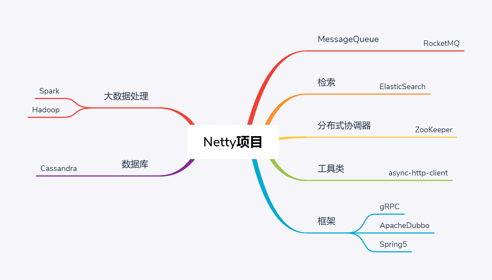

# Netty源码剖析与实战 #

## 01 | 课程介绍 ##

## 02 | 内容综述 ##

## 03 | 揭开Netty面纱 ##

## 04 | 为什么舍近求远：不直接使用JDK NIO ##

## 05 | 为什么孤注一掷：独选Netty？ ##

## 06 | Netty的前尘往事 ##

## 07 | Netty的现状与趋势 ##

## 一 介绍Netty是什么 ##

## 08 | Netty怎么切换三种I/O模式 ##

* BIO（阻塞I/O）
* NIO（非阻塞I/O）
* AIO（异步I/O）

NIO

* COMMON
	* NioEventLoopGroup
	* NioEventLoop
	* NioServerSocketChannel
	* NioSocketChannel 
* Linux
	* EpollEventLoopGroup
	* EpollEventLoop
	* EpollServerSocketChannel
	* EpollSocketChannel
* macOS/BSD
	* KQueueEventLoopGroup
	* KQueueEventLoop
	* KQueueServerSocketChannel
	* KQueueSocketChannel

## 11 | TCP粘包/半包Netty全搞定 ##

