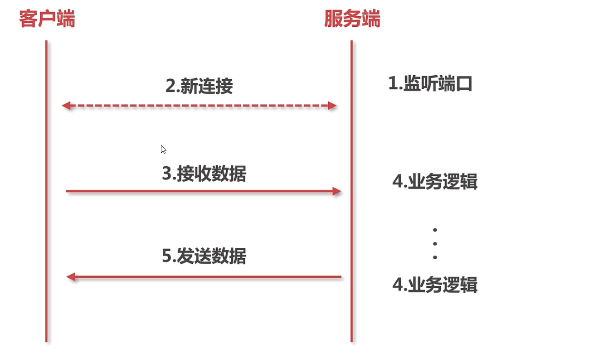
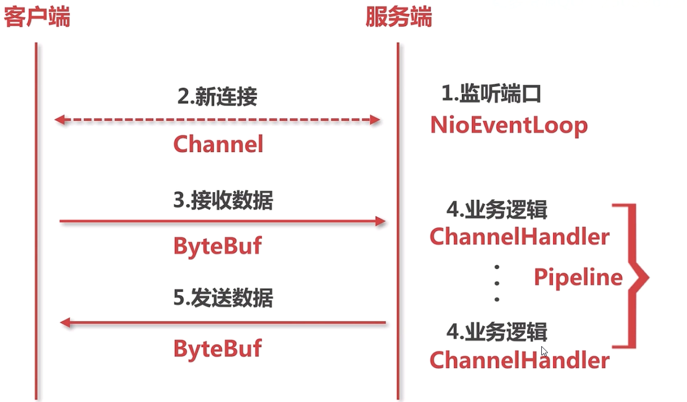

# 慕课网 Java读源码之Netty深入剖析 笔记 #

# ch1 Netty深入剖析 # 

Dubbo、RocketMQ、Spart、Elasticsearch、Cassandra、Flink、Netty-SocketIO、Spring5、Play、Grpc

* 异步事件驱动框架，用于快速开发高性能服务端和客户端
* 封装了JDK底层BIO和NIO模型，提供高度可用的API
* 自带编解码器解决拆包粘包问题，用户只用关心业务逻辑
* 精心设计的ractor线程模型支持高并发海量连接
* 自带各种协议栈让你处理任何一种通用协议都不用亲自动手

## Netty是什么？ ##

## 技术储备 ##

# ch2 # 

## 2.1 一个简单的socket例子 ##

## 2.2 Netty对于socket的抽象 ##

线程：监听连接

在监听连接中的一个线程中：监听信息

## 2.3 Netty 组建简单介绍 ##

### Netty基本组件 ###

* NioEventLoop -> Thread

run方法

监听客户端链接，处理客户端读写

* Channel -> Socket

ServerSocketChannel 对应的底层Nio模型的SocketChannel（父类就是一个channel）

对简单的连接进行封装

# TODO 了解的还不够精细，需要加大力度

* ByteBuf -> IO Byte

* Pipeline -> 逻辑链（logic chain）

每个channel都会有个pipeline，最终把逻辑的链路加到对应的channel中间

ChannelHandler -> 逻辑处理块（logic）

对逻辑的动态增加、更改。加入到ChannelHandler中数据流每次读写都会被ChannelHandler处理

NioEventLoop 启用了两种线程

1. 监听客户端连接
2. 监听客户端的读写

## ch3 Netty服务端启动 ##

### 3.1 服务端启动demo ###

### 3.2 服务端Channel的创建 ###

#### 两个问题 #### 

1. 服务端的socket在哪里初始化？
2. 在哪里accept连接

### Netty服务端启动 ###

* 创建服务端Channel
* 初始化服务端Channel
* 注册selector
* 端口绑定

### 创建服务端Channel ###

	bind()[用户代码入口]
	
		initAndRegister()[初始化并注册]
	
			反射创建服务单Channel
	
				newSocket()[通过jdk来创建底层jdk channel]

bind方法->doBind方法->initAndRegister方法->channelFactory.newChannel()->.channel->ReflectiveChannelFactory

### 反射创建服务端Channel ###

	newSocket()[通过jdk来创建底层jdk channel]
	
	* NioServerSocketChannel->newSocket->java.nio.channel.ServerSocketChannel->provider.openServerSocketChannel()->SelectorProvider.provider()

	NioServerSocketChannelConfig()[tcp参数配置类]
	
	* ServerSocket配置的抽象

	AbstractNioChannel()

		configureBlocking(false)[阻塞模式]

		AbstractChannel()[创建id，unsafe，pipeline]

		* 对channel的抽象
		 id = newId();
		 unsafe = newUnsafe();
		 pipeline = newChannelPipeline();

TODO 表示服务端channel创建的流程

### 初始化服务端Channel ###

### 注册selector ###

	AbstractChannel.register(channel) [入口]
		this.eventLoop = eventLoop[绑定线程]
		resgiter0()[实际注册]
			doRegister()[调用jdk底层注册]
			invokeHandlerAddedIfNeeded()
			fireChannelRegistered()[传播事件]

### 端口绑定 ###

	AbstractUnsafe.bind() [入口]
		doBind()
			javaChannel().bind()[jdk底层绑定]
		pipeline.fireChannelActive()[传播事件]
			HeadContext.readIfIsAutoRead()

## 3.3 服务端Channel的初始化 ##

### 初始化服务端Channel ###

* bind()[用户代码入口]

	* initAndRegister()[初始化并注册]

		* newChannel()[创建服务端channel]

			* init()[初始化服务端channel]

				* set ChannelOptions，ChannelAttrs
				
				* set ChildlOptions，ChildAttrs

				* config handler[配置服务端pipeline]

				* add ServerBootstrapAcceptor[添加连接器]

####  set ChannelOptions，ChannelAttrs ####

ServerBootStrap

绑定用户自定义属性，把option全部拿出来，最后绑定到channel上

	final Map<ChannelOption<?>, Object> options = options0();

    synchronized (options) {
        setChannelOptions(channel, options, logger);
    }

	final Map<AttributeKey<?>, Object> attrs = attrs0();
    synchronized (attrs) {
        for (Entry<AttributeKey<?>, Object> e: attrs.entrySet()) {
            @SuppressWarnings("unchecked")
            AttributeKey<Object> key = (AttributeKey<Object>) e.getKey();
            channel.attr(key).set(e.getValue());
        }
    }

####  set ChildlOptions，ChildAttrs ####

    synchronized (childOptions) {
        currentChildOptions = childOptions.entrySet().toArray(newOptionArray(0));
    }
    synchronized (childAttrs) {
        currentChildAttrs = childAttrs.entrySet().toArray(newAttrArray(0));
    }

#### config handler[配置服务端pipeline] ####

	final ChannelPipeline pipeline = ch.pipeline();
	ChannelHandler handler = config.handler();
	if (handler != null) {
	    pipeline.addLast(handler);
	}

#### add ServerBootstrapAcceptor[添加连接器] ####

	ch.eventLoop().execute(new Runnable() {
                    @Override
                    public void run() {
                        pipeline.addLast(new ServerBootstrapAcceptor(
                                ch, currentChildGroup, currentChildHandler, currentChildOptions, currentChildAttrs));
                    }
                });

## 3.4 注册selector ##

* AbstractChannel.register(channel)[入口]
	* this.eventLoop = eventLoop [绑定线程]
	* resgiter0()[实际注册]
		* doRegister()[调用jdk底层注册]
		* invokeHandlerAddedIfNeeded()
		* fireChannelRegistered()[传播事件]

### doRegister()[调用jdk底层注册] ###

	this.selectionKey = this.javaChannel().register(this.eventLoop().unwrappedSelector(), 0, this);

使用jdk底层的channel注册方式，将服务端的channel注册到selector上

## 3.5 服务端口的绑定 ##

* AbstractUnsafe.bind()[入口]
	* doBind()
		* javaChannel().bind() [jdk底层绑定]
	* pipeline.fireChannelActive()[传播事件]
		* HeadContext.readIfIsAutoRead() 

### doBind ###

	boolean wasActive = isActive();
	try {
	    doBind(localAddress);
	} catch (Throwable t) {
	    safeSetFailure(promise, t);
	    closeIfClosed();
	    return;
	}
	
	// TODO	在你绑定之前不是active，在你绑定之后是active的
	if (!wasActive && isActive()) {
	    invokeLater(new Runnable() {
	        @Override
	        public void run() {
	            pipeline.fireChannelActive();
	        }
	    });
	}

### boBeginRead ###

	// Channel.read() or ChannelHandlerContext.read() was called
    final SelectionKey selectionKey = this.selectionKey;
    if (!selectionKey.isValid()) {
        return;
    }

    readPending = true;

    final int interestOps = selectionKey.interestOps();
    if ((interestOps & readInterestOp) == 0) {
        selectionKey.interestOps(interestOps | readInterestOp);
    }

端口绑定->触发active事件->最终调用read事件->我可以读了（即新的连接）

## 3.6 服务启动总结 ##

newChannel() -> init() -> register() -> doBind()

* newChannel —— 调用jdk底层的api生成jdk的channel，生成一些组件（pipeline等）
* init —— 初始化，为服务端channel添加一个连接处理器
* register —— 注册selector，将jdk底层的channel注册到事件轮询器
* doBind —— 重新向selector注册readInterestOp，可以接受新的连接

# ch4 NioEventLoop #

## 4.1 NioEventLoop概述 ##

三个问题

* 默认情况下，Netty服务端起多少线程？何时启动？
* Netty是如何解决JDK空轮训bug的？
* Netty如何保证异步串行无锁化？

* NioEventLoop创建
* NioEventLoop启动
* NioEventLoop执行逻辑

### NioEventLoop创建 ###

* new NioEventLoopGroup()[线程，默认2*cpu]
	* new ThreadPerTaskExecutor()[线程创建器]
	* for(){newChild()}[构造NioEventLoop]
	* chooserFactory.newChooser()[线程选择器]

#### new ThreadPerTaskExecutor()[线程创建器] ####

	if (executor == null) {
	    executor = new ThreadPerTaskExecutor(newDefaultThreadFactory());
	}

#### for(){newChild()}[构造NioEventLoop] ####

	for (int i = 0; i < nThreads; i ++) {
	    boolean success = false;
	    try {
	        children[i] = newChild(executor, args);
	        success = true;
	    } catch (Exception e) {
	        // TODO: Think about if this is a good exception type
	        throw new IllegalStateException("failed to create a child event loop", e);
	    } finally {
	        if (!success) {
	            for (int j = 0; j < i; j ++) {
	                children[j].shutdownGracefully();
	            }
	
	            for (int j = 0; j < i; j ++) {
	                EventExecutor e = children[j];
	                try {
	                    while (!e.isTerminated()) {
	                        e.awaitTermination(Integer.MAX_VALUE, TimeUnit.SECONDS);
	                    }
	                } catch (InterruptedException interrupted) {
	                    // Let the caller handle the interruption.
	                    Thread.currentThread().interrupt();
	                    break;
	                }
	            }
	        }
	    }
	}

#### chooserFactory.newChooser()[线程选择器] ####

	chooser = chooserFactory.newChooser(children);

## 4-3 ThreadPerTaskThread ##

ThreadPerTaskExecutor

* 每次执行任务都会创建一个线程实体
* NioEventLoop线程命名规则nioEventLoop-1-xx

ThreadPerTaskExecutor(newDefaultThreadFactory)

newThread -> new FastThreadLocalThread

#TODO 深入理解下

## 4.4 创建NioEventLoop线程 ##

### newchild() ###

* 保存线程执行器ThreadPerTaskExecutor
* 创建一个MpscQueue
* 创建一个selector

newTaskQueue -> newMpscQueue

### 4.5 创建线程选择器 ###

chooserFactory.newChooser()

chooser.next() 

NioEvenentLoop[] 0 1 2 ... N
当n+1个链接进来的时候会循环从0开始绑定

* isPowerOfTwo()[判断是否是2的幂，如2、4、8、16]
	* PowerOfTwoEventExecutorChooser[优化]
		* index++ &(length-1)
	* GenericEventExecutorChhoser[普通]
		* abs(index++ % length)

#### PowerOfTowEventExecutorChooser ####

ids.getAndIncrement() & executors.length - 1

# TODO

				idx 111010
						 &
	executor.length-1 1111
			 result   1010

二进制的性能比取模来要高效得多

## 4.6 NioEventLoop启动触发器 ##

* 服务端启动绑定端口
* 新连接接入通过chooser绑定一个NioEventLoop

### NioEventLoop启动 ###

* bind() -> execute(task)[入口]
	* startThread() -> doStartThread()[创建线程]
		* ThreadPerTaskExecutor.execute()
			* thread = Thread.currentThread()
			* NioEventLoop.run[启动]  

#### bind() -> execute(task)[入口] ####

	// This method is invoked before channelRegistered() is triggered.  Give user handlers a chance to set up
	// the pipeline in its channelRegistered() implementation.
	channel.eventLoop().execute(new Runnable() {
	    @Override
	    public void run() {
	        if (regFuture.isSuccess()) {
	            channel.bind(localAddress, promise).addListener(ChannelFutureListener.CLOSE_ON_FAILURE);
	        } else {
	            promise.setFailure(regFuture.cause());
	        }
	    }
	});

Runable即是一个task，具体做的就是绑定端口的事情

#### startThread() -> doStartThread()[创建线程] ####
	
	// 判断是否是在本线程里面，这里的话，线程还没创建，自然返回的是不等false
	boolean inEventLoop = inEventLoop();
	if (inEventLoop) {
	    addTask(task);
	} else {
		// ThreadPerTaskExecutor 创建一个线程并启用
	    startThread();
	    addTask(task);
	    if (isShutdown() && removeTask(task)) {
	        reject();
	    }
	}

netty服务端启动的过程中，主线程最终会调用一个bind的方法，而这个bind的方法最终会把实际绑定的流程封装成一个task，调用服务端channel的一个方executor的方法去具体的执行。Netty会判断调用executor的方法不是Nio方法，调用doStartThread方法创建线程

## 4.7 NioEventLoop执行 ##

	SingleThreadEventExecutor.this.run()

	case SelectStrategy.CONTINUE:
        continue;
    case SelectStrategy.SELECT:
        select(wakenUp.getAndSet(false));

轮询IO事件-》处理IO事件

ioRatio默认是50

轮询IO事件，处理IO事件是1比1

### NioEventLoop.run() ###

* run() -> for(;;)
	* select()[检查是否有io事件]
	* processSelectedKeys()[处理io事件]
	* runAllTasks()[处理异步任务队列]

## 4.8 检测IO事件 ##

### select()方法执行逻辑 ###

* deadline以及任务穿插逻辑处理
* 阻塞式select
* 避免jdk空轮训的bug

#### deadline以及任务穿插逻辑处理 ####

#### 阻塞式select ####

    if (selectedKeys != 0 || oldWakenUp || wakenUp.get() || hasTasks() || hasScheduledTasks()) {
        // - Selected something, select!=0 表明轮训到
        // - waken up by user, or
        // - the task queue has a pending task.
        // - a scheduled task is ready for processing
        break;
    }

#### 避免jdk空轮训的bug ####

已经执行过一次

	long time = System.nanoTime();

减掉超轮训时间

    if (time - TimeUnit.MILLISECONDS.toNanos(timeoutMillis) >= currentTimeNanos) {
	// time - currentTimeNanos > TimeUnit.MILLSECONDS.toNanos(timeoutMillis) 当前时间减去
        // timeoutMillis elapsed without anything selected.
        selectCnt = 1;
    }

# TODO rebuildSelector

## 4.9 处理IO事件 ##

### processSelectedKey()执行逻辑 ###

* selected keySet优化
* processSelectedKeysOptimized()

	provider = selectorProvider;
	selector = openSelector();

	SelectedSelectionKeySet => SelectionKey[] keysA, int keysASize = size

	selectedKeys

	final AbstractNioChannel.NioUnsafe unsafe = ch.unsafe(); 一个unsafe跟一个channel绑定

#TODO 听不懂……继续深入

# ch5 Netty新连接的接入 #

## 5.1 Netty新连接接入处理逻辑 ##

1. 检测新连接
2. 创建NioSocketChannel
3. 分配线程及注册selector
4. 向selector注册读事件

### 两个问题 ###

* Netty是在哪里检测有新连接接入的？
* 新连接是怎样注册到NioEventLoop线程的？

## 5.2 检测新连接 ##

服务端启动的时候会绑定boss进程，selector io事件

* processSelectedKey(key, channel)[入口]
	* NioMessageUnsafe.read()
		* doReadMessages() [while循环]
			* javaChannel().accept()   

#### NioMessageUnsafe.read() ###

readyOps & (SelectionKey.OP_READ | SelectionKey.OP_ACCEPT)) != 0 || readyOps == 0

会进入 unsafe.read() —— AbstractNioMessageChannel$NioMessageUnsafe

#### doReadMessages() [while循环] ####

表示服务端NioServerSocket的config和pipeline

    final ChannelConfig config = config();
    final ChannelPipeline pipeline = pipeline();

控制速率

    final RecvByteBufAllocator.Handle allocHandle = unsafe().recvBufAllocHandle();

	do {
	    int localRead = doReadMessages(readBuf);
	    if (localRead == 0) {
	        break;
	    }
	    if (localRead < 0) {
	        closed = true;
	        break;
	    }
	
	    allocHandle.incMessagesRead(localRead);
	} while (allocHandle.continueReading());

通过拿到服务端channel底层的jdk的channel

	SocketChannel ch = SocketUtils.accept(javaChannel());

通过将channel封装成NioSocketChannel并添加到buf（上层对象添加容器的对象）

	buf.add(new NioSocketChannel(this, ch));

#### continueReading ####

	return config.isAutoRead() &&
		attemptedBytesRead == lastBytesRead &&
		totalMessages(1) < maxMessagePerRead(16) &&
		totalBytesRead < Integer.MAX_VALUE

如果没有读到新的链接则会把while循环break掉

#### javaChannel().accept() ####

将NioSocketChannel 转化为 服务端启动的jdk channel

## 5.3 NioSocketChannel的创建 ##

* processSelectedKey(key, channel)[入口]
	* NioMessageUnsafe.read()
		* doReadMessages()[while循环]
			* javaChannel().accept()

### 创建NioSocketChannel ### 

* new NioSocketChannel(parent, ch)[入口] 
	* AbstractNioByteChannel(p, ch, op_read)
		* configureBlocking(false) & save op
		* create id, unsafe, pipeline
	* new NioSocketChannelConfig()
		* setTcoNoDelay(true) 禁止Nagle算法，小的数据包尽可能发出去降低延时

#### new NioSocketChannel(parent, ch)[入口] ####

这里的ch是客户端的channel

直接使用new关键词来创建，而服务端channel使用反射的方法来创建

    public NioSocketChannel(Channel parent, SocketChannel socket) {
        super(parent, socket); // 创建一个NioSocketChannel
		//         super(parent, ch, SelectionKey.OP_READ); 表示我对这个事件的读事件感兴趣，如果后续有读事件，则表示会继续关注
        config = new NioSocketChannelConfig(this, socket.socket()); // 创建一个NioSocketChannelConfig
    }

设置此channel为非阻塞模式

	ch.configureBlocking(false)

#### AbstractNioByteChannel(p, ch, op_read) ####

channel的read事件，后续如果有事件读写，那么请告诉我

#### create id, unsafe, pipeline ####

AbstractChannel

	this.parent = parent; // 创建此channel的服务端channel
	id = newId(); // 创建id
	unsafe = newUnsafe(); // 创建channel的unsafe
	pipeline = newChannelPipeline();  // 创建服务端channel的pipeline

#### new NioSocketChannelConfig() ####

	if (PlatformDependent.canEnableTcpNoDelayByDefault()) {
        try {
            setTcpNoDelay(true);
        } catch (Exception e) {
            // Ignore.
        }
    }

    private static final boolean CAN_ENABLE_TCP_NODELAY_BY_DEFAULT = !isAndroid();

netty支持安卓上网络通信，netty一般在linux上运行比较多，所以一般在这返回是false，则通过非关系返回true

#### setTcpNoDelay(true) 禁止Nagle算法 ####

通过刚保存的javaSocket进行tcpNoDelay的设置

### 小结 ###

创建NioSocketChannel可以分成两个部分

1. 逐层调用父类函数，该channel的阻塞模式为false，把对应的读事件进行保存，接下来创建一系列的id，unsafe，pipeline
2. 创建跟这个channel相关的config，这个config设置tcpNoDelay为true

## 5.4 Channel的分类 ##

NioServerSocketChannel的class

* NioServerSocketChannel
* NioSocketChannel 新连接接入
* Unsafe

### Channel的层级关系 ###

Channel -> AbstractChannel(pipeline) -> AbstractNioChannel

1. Channel
2. AbstractChannel
3. AbstractNioChannel
4. 
	* 4.1 AbstractNioByteChannel
		* 4.1.1 NioSocketChannel
			* 4.1.1.1 NioSocketChannelConfig 
		* 4.1.2 NioByteUnsafe 
	* 4.2 AbstractNioMessageChannel
		* 4.2.1 NioMessageUnsafe
		* 4.2.2 NioServerSocketChannel
			* NioServerSocketChannelConfig 

## 5.5 新连接NioEventLoop的分配和selector注册 ##

#### 服务端Channel的pipeline构成 ####

Head -> ServerBootstrapAcceptor -> Tail

#### ServerBootstrapAcceptor ####

* 添加childHandler
* 设置options和attrs
* 选择NioEventLoop并注册selector

	child.pipeline().addLast(childHandler);

## 5.6 NioSocketChannel读事件的注册 ##

## 5.7 新连接接入总结 ##

检测新连接 -> 创建NioSocketChannel -> 分配线程及注册selector -> 向selector注册读事件

* Netty是在哪里检测有新连接接入的？ boss线程的，jdk底层的channel方法去创建这个连接
* 新连接是怎样注册到NioEventLoop线程的？

# 第6章 pipeline # 

## 6.1 三个问题 ##

* netty是如何判断ChannelHandler类型的？
* 对于ChannelHandler的添加应该遵循什么样的顺序？
* 用户手动触发时间创传播，不同的触发方式有什么样的区别？

---

* pipeline的初始化
* 添加删除ChannelHandler
* 事件和异常的传播

## 6.2 pipeline初始化 ##

* pipeline在创建Channel的时候被创建
* pipeline节点数据结构：ChannelHandlerContext
* pipeline中的两大哨兵：head和tail

#### pipeline在创建Channel的时候被创建 ####

    protected AbstractChannel(Channel parent) {
        this.parent = parent;
        id = newId();
        unsafe = newUnsafe();
        pipeline = newChannelPipeline();
    }

	// this 指我们的channel 
	return new DefaultChannelPipeline(this);

    this.channel = ObjectUtil.checkNotNull(channel, "channel");
    succeededFuture = new SucceededChannelFuture(channel, null);
    voidPromise =  new VoidChannelPromise(channel, true);
	// 创建两个节点，一个是tailContext，一个是headContext
    tail = new TailContext(this);
    head = new HeadContext(this);
	// 组成双向链表
    head.next = tail;
    tail.prev = head;

#### pipeline节点数据结构：ChannelHandlerContext ####

ChannelHandlerContext => AbstractChannelHandlerContext

继承于

* AttributeMap 存储自己的属性
* ChannelInboundInvoker 传播读事件，inBound事件的传播
* ChannelOutboundInvoker 传播写事件，outBound事件的传播

ChannelInboundInvoker传播读事件

ChannelOutboundInvoker传播写事件

AbstractChannelHandlerContext

    volatile AbstractChannelHandlerContext next;
    volatile AbstractChannelHandlerContext prev;

#### pipeline中的两大哨兵：head和tail ####

	tail = new TailContext(this)
	head = new HeadContext(this)

    TailContext(DefaultChannelPipeline pipeline) {
        super(pipeline, null, TAIL_NAME, true, false);
        setAddComplete();
    }

TailContext主要做收尾的事情，如果一层没有处理好，则tail则对事件进行后续处理（inbound：true，outbound：false）

HeadContext（inbound：false，outbound：true）

读写操作，最后都会委托到unsafe中进行操作

TODO 分析tail跟head各自充当什么角色

## 6.3 添加ChannelHandler ##

#### addLast ####

* 判断是否重复添加
* 创建节点并添加至链表
* 回调添加完成事件

ChannelHandler 包装成 ChannelHandlerContext

	ChannelPipeline addLast(ChannelHandler... handlers)
	支持多个ChannelHandler，可变参数

	checkMultiplicity(handler); // 判断是否重复添加
	TODO

## 6-4 删除ChannelHandler ##

* 找到节点
* 链表的删除
* 回调删除Handler事件

#### 找到节点 ####

	getContextOrDie(handler)

	AbstractChannelHandlerContext ctx = head.next;
	for (;;) {
	    if (ctx == null) {
	        return null; //边离到节点，如果最后还是没有节点的话则返回null
	    }
	    if (ctx.handler() == handler) {
	        return ctx;
	    }
	    ctx = ctx.next;
	}

拿到这个节点

#### 链表的删除 ####

	assert ctx != head && ctx != tail; // head节点和tail节点不可被删除

    private static void remove0(AbstractChannelHandlerContext ctx) {
        AbstractChannelHandlerContext prev = ctx.prev;
        AbstractChannelHandlerContext next = ctx.next;
        prev.next = next;
        next.prev = prev;
    }

#### 回调删除Handler事件 ####

	try {
	    ctx.handler().handlerRemoved(ctx);
	} finally {
	    ctx.setRemoved();
	}

# 第七章 ByteBuf #

## 8.1 三个问题 ##

* 内存的类别有哪些
* 如何减少多线程内存分配之间的竞争
* 不同大小的内存是如何进行分配的

———

* 内存与内存管理器的抽象
* 不同规格大小和不同类别的内存的分配策略
* 内存的回收过程

## 8.2 ByteBuf结构以及重要API ##

* ByteBuf结构

readIndex、writeIndex和capacity

	readIndex <= writeIndex <= capacity

* discardable bytes表示无用信息
* readable bytes表示可读取信
* writable bytes表示可写入信息（空白区域）

maxCapacity