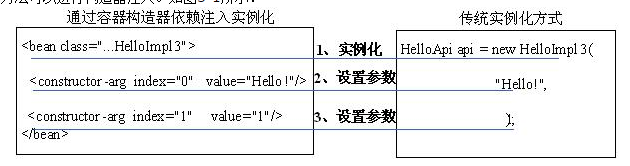
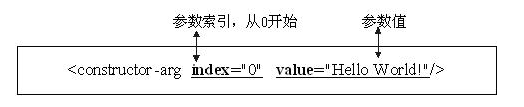
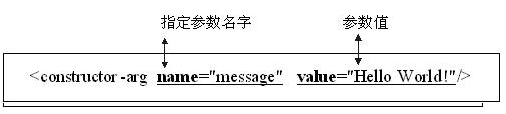

# 3.1 DI的配置使用 #

## #3.1.1 依赖和依赖注入 ##
传统应用程序设计中所说的依赖一般指“类之间的关系”
**泛化**：表示类与类之间的继承关系、接口与接口之间的继承关系；
**实现**：表示类对接口的实现；
**依赖**：当类与类之间有使用关系时就属于依赖关系，不同于关联关系，依赖不具有“拥有关系”，而是一种“相识关系”，只在某个特定地方（比如某个方法体内）才有关系。
**关联**：表示类与类或类与接口之间的依赖关系，表现为“拥有关系”；具体到代码可以用实例变量来表示；
**聚合**：属于是关联的特殊情况，体现部分-整体关系，是一种弱拥有关系；整体和部分可以有不一样的生命周期；是一种弱关联；
**组合**：属于是关联的特殊情况，也体现了体现部分-整体关系，是一种强“拥有关系”；整体与部分有相同的生命周期，是一种强关联；

Spring IoC容器的依赖有两层含义：**Bean依赖容器****和容器注入Bean的依赖资源**：

 Bean依赖容器：也就是说Bean要依赖于容器，这里的依赖是指容器负责创建Bean并管理Bean的生命周期，正是由于由容器来控制创建Bean并注入依赖，也就是控制权被反转了，这也正是IoC名字的由来，**此处的有依赖是指Bean和容器之间的依赖关系**。

 容器注入Bean的依赖资源：容器负责注入Bean的依赖资源，依赖资源可以是Bean、外部文件、常量数据等，在Java中都反映为对象，并且由容器负责组装Bean之间的依赖关系，此处的依赖是指Bean之间的依赖关系，**可以认为是传统类与类之间的“关联”、“聚合”、“组合”关系**。

为什么要应用依赖注入，应用依赖注入能给我们带来哪些好处呢？
**动态替换Bean依赖对象**，程序更灵活：替换Bean依赖对象，无需修改源文件：应用依赖注入后，由于可以采用配置文件方式实现，从而能随时动态的替换Bean的依赖对象，无需修改java源文件；
**更好实践面向接口编程**，代码更清晰：在Bean中只需指定依赖对象的接口，接口定义依赖对象完成的功能，通过容器注入依赖实现；
**更好实践优先使用对象组合**，而不是类继承：因为IoC容器采用注入依赖，也就是组合对象，从而更好的实践对象组合。

* 采用对象组合，Bean的功能可能由几个依赖Bean的功能组合而成，其Bean本身可能只提供少许功能或根本无任何功能，全部委托给依赖Bean，对象组合具有动态性，能更方便的替换掉依赖Bean，从而改变Bean功能；
* 而如果采用类继承，Bean没有依赖Bean，而是采用继承方式添加新功能，，而且功能是在编译时就确定了，不具有动态性，而且采用类继承导致Bean与子Bean之间高度耦合，难以复用。

**增加Bean可复用性**：依赖于对象组合，Bean更可复用且复用更简单；
**降低Bean之间耦合**：由于我们完全采用面向接口编程，在代码中没有直接引用Bean依赖实现，全部引用接口，而且不会出现显示的创建依赖对象代码，而且这些依赖是由容器来注入，很容易替换依赖实现类，从而降低Bean与依赖之间耦合；
**代码结构更清晰**：要应用依赖注入，代码结构要按照规约方式进行书写，从而更好的应用一些最佳实践，因此代码结构更清晰。

其实依赖注入只是一种装配对象的手段，设计的类结构才是基础，如果设计的类结构不支持依赖注入，Spring IoC容器也注入不了任何东西，从而从根本上说“**如何设计好类结构才是关键，依赖注入只是一种装配对象手段**”。
**构造器注入**：就是容器实例化Bean时注入那些依赖，通过在在Bean定义中指定构造器参数进行注入依赖，包括实例工厂方法参数注入依赖，但静态工厂方法参数不允许注入依赖；
**setter注入**：通过setter方法进行注入依赖；
**方法注入**：能通过配置方式替换掉Bean方法，也就是通过配置改变Bean方法功能。

## 3.1.2  构造器注入 ##
使用构造器注入通过配置构造器参数实现，构造器参数就是依赖。除了构造器方式，还有静态工厂、实例工厂方法可以进行构造器注入。如图3-1所示：

构造器注入可以根据参数索引注入、参数类型注入或Spring3支持的参数名注入，但参数名注入是有限制的，需要使用在编译程序时打开调试模式（即在编译时使用“javac –g:vars”在class文件中生成变量调试信息，默认是不包含变量调试信息的，从而能获取参数名字，否则获取不到参数名字）或在构造器上使用@ConstructorProperties（java.beans.ConstructorProperties）注解来指定参数名。

	package cn.javass.spring.chapter3.helloworld;  
	public class HelloImpl3 implements HelloApi {  
	    private String message;  
	private int index;  
	//@java.beans.ConstructorProperties({"message", "index"})  
	    public HelloImpl3(String message, int index) {  
	        this.message = message;  
	        this.index = index;  
	    }  
	    @Override  
	    public void sayHello() {  
	        System.out.println(index + ":" + message);  
	    }  
	}  

一、根据参数索引注入，使用标签“<constructor-arg index="1" value="1"/>”来指定注入的依赖，其中“index”表示索引，从0开始，即第一个参数索引为0，“value”来指定注入的常量值，配置方式如下：

 
二、根据参数类型进行注入，使用标签“<constructor-arg type="java.lang.String" value="Hello World!"/>”来指定注入的依赖，其中“type”表示需要匹配的参数类型，可以是基本类型也可以是其他类型，如“int”、“java.lang.String”，“value”来指定注入的常量值，配置方式如下：

三、根据参数名进行注入，使用标签“<constructor-arg name="message" value="Hello World!"/>”来指定注入的依赖，其中“name”表示需要匹配的参数名字，“value”来指定注入的常量值，配置方式如下：

四、让我们来用具体的例子来看一下构造器注入怎么使用吧。
（1）首先准备Bean类，在此我们就使用“HelloImpl3”这个类。
（2）有了Bean类，接下来要进行Bean定义配置，我们需要配置三个Bean来完成上述三种依赖注入测试，其中Bean ”byIndex”是通过索引注入依赖；Bean ”byType”是根据类型进行注入依赖；Bean ”byName”是根据参数名字进行注入依赖，具体配置文件（resources/chapter3/ constructorDependencyInject.xml）如下：

	@Test  
	public void testConstructorDependencyInjectTest() {        
		BeanFactory beanFactory =  new ClassPathXmlApplicationContext("chapter3/constructorDependencyInject.xml");  
		//获取根据参数索引依赖注入的Bean  
		HelloApi byIndex = beanFactory.getBean("byIndex", HelloApi.class);  
		byIndex.sayHello();  
		//获取根据参数类型依赖注入的Bean  
		HelloApi byType = beanFactory.getBean("byType", HelloApi.class);  
		byType.sayHello();  
		//获取根据参数名字依赖注入的Bean  
		HelloApi byName = beanFactory.getBean("byName", HelloApi.class);  
		byName.sayHello();  
	}  
 
五、大家已经会了构造器注入，那让我们再看一下静态工厂方法注入和实例工厂注入吧，其实它们注入配置是完全一样，在此我们只示范一下静态工厂注入方式和实例工厂方式配置：
（1）静态工厂类

	//静态工厂类  
	package cn.javass.spring.chapter3;  
	import cn.javass.spring.chapter2.helloworld.HelloApi;  
	public class DependencyInjectByStaticFactory {  
	       public static HelloApi newInstance(String message, int index) {  
	              return new HelloImpl3(message, index);  
	       }  
	} 

静态工厂类Bean定义配置文件（chapter3/staticFactoryDependencyInject.xml）

	<bean id="byIndex"  
	class="cn.javass.spring.chapter3.DependencyInjectByStaticFactory" factory-method="newInstance">  
	<constructor-arg index="0" value="Hello World!"/>  
	<constructor-arg index="1" value="1"/>  
	</bean>  
	<bean id="byType"  
	class="cn.javass.spring.chapter3.DependencyInjectByStaticFactory" factory-method="newInstance">  
	<constructor-arg type="java.lang.String" value="Hello World!"/>  
	       <constructor-arg type="int" value="2"/>  
	</bean>  
	<bean id="byName"  
	class="cn.javass.spring.chapter3.DependencyInjectByStaticFactory" factory-method="newInstance">  
	       <constructor-arg name="message" value="Hello World!"/>  
	       <constructor-arg name="index" value="3"/>  
	</bean> 

（2）实例工厂类

	//实例工厂类  
	package cn.javass.spring.chapter3;  
	import cn.javass.spring.chapter2.helloworld.HelloApi;  
	public class DependencyInjectByInstanceFactory {  
	    public HelloApi newInstance(String message, int index) {  
	        return new HelloImpl3(message, index);  
	    }  
	} 
实例工厂类Bean定义配置文件

	<bean id="instanceFactory"  
	class="cn.javass.spring.chapter3.DependencyInjectByInstanceFactory"/>  
	   
	<bean id="byIndex"  
	factory-bean="instanceFactory"  factory-method="newInstance">  
	    <constructor-arg index="0" value="Hello World!"/>  
	       <constructor-arg index="1" value="1"/>  
	</bean>  
	<bean id="byType"  
	factory-bean="instanceFactory" factory-method="newInstance">  
	<constructor-arg type="java.lang.String" value="Hello World!"/>  
	<constructor-arg type="int" value="2"/>  
	</bean>  
	<bean id="byName"  
	factory-bean="instanceFactory" factory-method="newInstance">  
	<constructor-arg name="message" value="Hello World!"/>  
	<constructor-arg name="index" value="3"/>  
	</bean> 

（3）测试代码和构造器方式完全一样，只是配置文件不一样，大家只需把测试文件改一下就可以了。还有一点需要大家注意就是静态工厂方式和实例工厂方式根据参数名字注入的方式只支持通过在class文件中添加“变量调试信息”方式才能运行，ConstructorProperties注解方式不能工作，它只对构造器方式起作用，不建议使用根据参数名进行构造器注入。

### 3.1.3  setter注入 ###

### 3.1.4  注入常量 ###

### 3.1.5    注入Bean ID ###

### 3.1.6  注入集合、数组和字典 ###
Spring不仅能注入简单类型数据，还能注入集合（Collection、无序集合Set、有序集合List）类型、数组(Array)类型、字典(Map)类型数据、Properties类型数据，接下来就让我们一个个看看如何注入这些数据类型的数据。

 一、注入集合类型：包括Collection类型、Set类型、List类型数据：
（1）List类型：需要使用<list>标签来配置注入，其具体配置如下：
## 代修改 ##

