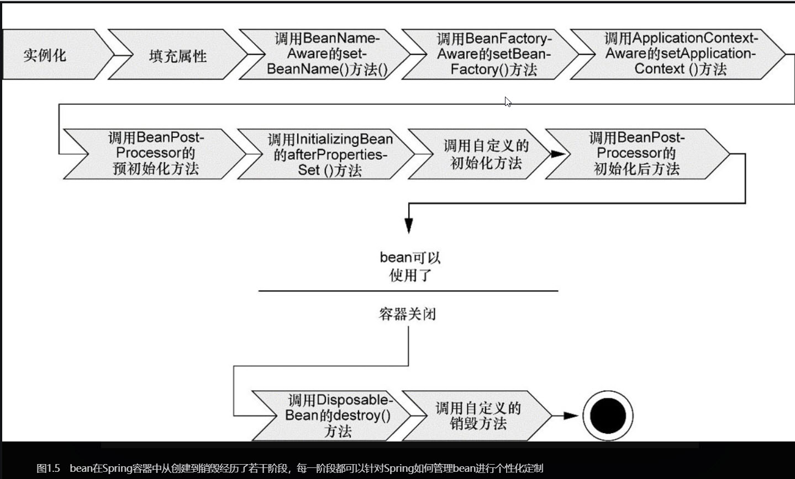

# 第1章 Spring之旅 #

# 1.1 简化Java开发 #

Spring最根本的使命

为了降低Java开发的复杂性，Spring采取了以下4种关键策略：

* 基于POJO的轻量级和最小倾入性编程
* 通过依赖注入和面向接口实现松耦合
* 基于切面和惯例进行声明式编程；
* 通过切面和魔板减少样板式代码。

### 1.1.1 激发POJO的潜能 ###

POJO（Plain Ordinary Java Object）简单的Java对象，实际就是普通JavaBeans，是为了避免和EJB混淆所创造的简称。

JavaBeans事实上有三层含义。首先，JavaBeans是一种规范，一种在Java（包括JSP）中可重复使用的Java组件的技术规范,也可以说成我们常说的接口。其次，JavaBeans是一个Java的类，一般来说，这样的Java类将对应于一个独立的 .java文件 ，在绝大多数情况下，这应该是一个public类型的类。最后，当JavaBeans这样的一个Java类在我们的具体的Java程序中被实例之后，这就是我们面向对象的对象，我们有时也会将这样的一个JavaBeans的实例称之为JavaBeans。总之，就是Java中的接口、类和对象。

Spring赋予POJO魔力的方式之一就是通过DI来装配它们。

### 1.1.2 依赖注入 ###

耦合具有两面性（two-headed beast）。

1. 紧密耦合的代码难以测试，难以复用，难以理解，并且典型地表现出“打地鼠”式的bug特性（修复一个bug，导致出现一个新的或者甚至更多的bug）。另一方面，一定程度的耦合又是必须的——完全没有耦合的代码什么都做不了。
2. 通过依赖注入（DI），对象的依赖关系将有负责协调系统中各个对象的第三方组件在创建对象时设定。对象无需自行创建或管理它们的依赖关系——依赖关系将被自动注入到需要它们的对象中去

构造器注入

### 1.1.3 应用切面 ###

DI能够让相互协作的软件组件保持松散耦合，而面向切面编程（aspect-oriented programming, AOP）允许你把遍布应用各处的功能分离出来形成可重用的组件。

#### AOP应用 ####

### 1.1.4 使用模板消除样板式代码 ###

## 1.2 容纳你的Bean ##

在基于Spring的应用中，你的应用对象生存于Spring容器（container）中。Spring容器负责创建对象，装配它们，配置它们并管理它们的整个生命周期，从生存刀死亡。

容器式Spring框架的核心。Spring容器使用DI管理构成应用的组件，它会创建相互协作的组件之间的关联。

Spring容器。bean工厂（由org.springframework.beans.factory.BeanFactory接口定义）是最简单的容器，提供基本的DI支持。

### 1.2.1 使用应用上下文 ###

* AnnotationConfigApplicationContext：从一个或多个基于Java的配置类中加载Spring应用上下文。
* AnnotationConfigWebApplicationContext:从一个或多个基于Java的配置类中加载Spring Web应用上下文。
* ClassPathXmlApplicationContext：从类路径下的一个或多个XML配置文件中加载上下文定义，把应用上下文的定义文件作为类资源
* FileSystemXmlApplicationContext：从文件系统下的一个或多个XML配置文件中加载上下文定义。
* XmlWebApplicationContext：从Web应用下的一个或多个XML配置文件中加载上下文定义。

### 1.2.2 bean的生命周期 ###

1. Spring对bean进行实例化；
2. Spring将值和bean的引用注入到bean对应的属性中；
3. 如果bean实现了BeanNameAware接口，Spring将bean的ID传递给setBean-Name()方法；
4. 如果bean实现了BeanFactoryAware接口，Spring将调用setBeanFactory()方法，将BeanFactory容器实例传入；
5. 如果bean实现了ApplicationContextAware接口，Spring将调用setBeanFacotry()方法，将BeanFactory容器实例传入；
6. 如果bean实现了BeanPostProcessor接口，Spring将调用它们的post-ProcessBeforeInitialization()方法；
7. 如果bean实现了InitializtingBean接口，Spring将调用它们的after-PropertiesSet()方法。类似地，如果bean使用init-method声明了初始化方法，该方法也会被调用；
8. 如果bean实现了BeanPostProcessor接口，Spring将调用它们地post-ProcessAfterInialization()方法；
9. bean已经准备就绪，可以被应用程序使用了，它们将一直驻留在应用上下文中，直到该应用上下文被销毁；
10. 如果bean实现了DisposableBean接口。Spring将调用它地destory()接口方法。同样 ，如果bean使用了destory-method声明了销毁方法，该方法也会被调用。

## 1.3 俯瞰Spring风景线 ##

### 1.3.1 Spring模块 ###

### 1.3.2 Spring Portfolio ###

