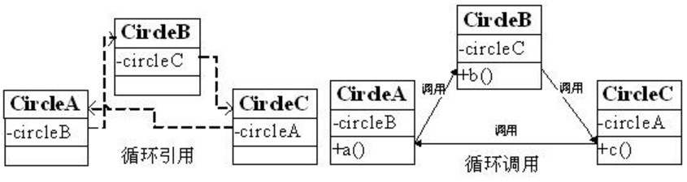

# 3.2 循环依赖 #

## 3.2.1 什么是循环依赖 ##
循环依赖就是循环引用，就是两个或多个Bean相互之间的持有对方，比如CircleA引用CircleB，CircleB引用CircleC，CircleC引用CircleA，则它们最终反映为一个环。此处不是循环调用，循环调用是方法之间的环调用。如图3-5所示：

循环调用是无法解决的，除非有终结条件，否则就是死循环，最终导致内存溢出错误。
Spring容器循环依赖包括构造器循环依赖和setter循环依赖，那Spring容器如何解决循环依赖呢？首先让我们来定义循环引用类：
	
	package cn.javass.spring.chapter3.bean;  
	public class CircleA {  
	    private CircleB circleB;  
	    public CircleA() {  
	    }  
	    public CircleA(CircleB circleB) {  
	        this.circleB = circleB;  
	    }  
	public void setCircleB(CircleB circleB)   
	{  
	        this.circleB = circleB;  
	    }  
	public void a() {  
	   circleB.b();  
	}  
	}  

	package cn.javass.spring.chapter3.bean;  
	public class CircleB {  
	    private CircleC circleC;  
	    public CircleB() {  
	    }  
	    public CircleB(CircleC circleC) {  
	        this.circleC = circleC;  
	    }  
	public void setCircleC(CircleC circleC)   
	{  
	        this.circleC = circleC;  
	    }  
	    public void b() {  
	        circleC.c();  
	    }  
	}  

	package cn.javass.spring.chapter3.bean;  
	public class CircleC {  
	    private CircleA circleA;  
	    public CircleC() {  
	    }  
	    public CircleC(CircleA circleA) {  
	        this.circleA = circleA;  
	    }  
	public void setCircleA(CircleA circleA)   
	{  
	        this.circleA = circleA;  
	    }  
	    public void c() {  
	        circleA.a();  
	    }  
	}  

## 3.2.2 Spring如何解决循环依赖 ##
一、构造器循环依赖：表示通过构造器注入构成的循环依赖，此依赖是无法解决的，只能抛出BeanCurrentlyInCreationException异常表示循环依赖。

如在创建CircleA类时，构造器需要CircleB类，那将去创建CircleB，在创建CircleB类时又发现需要CircleC类，则又去创建CircleC，最终在创建CircleC时发现又需要CircleA；从而形成一个环，没办法创建。
Spring容器将每一个正在创建的Bean 标识符放在一个“当前创建Bean池”中，Bean标识符在创建过程中将一直保持在这个池中，因此如果在创建Bean过程中发现自己已经在“当前创建Bean池”里时将抛出BeanCurrentlyInCreationException异常表示循环依赖；而对于创建完毕的Bean将从“当前创建Bean池”中清除掉。

二、setter循环依赖：表示通过setter注入方式构成的循环依赖。

对于setter注入造成的依赖是通过Spring容器提前暴露刚完成构造器注入但未完成其他步骤（如setter注入）的Bean来完成的，而且只能解决单例作用域的Bean循环依赖。

如下代码所示，通过提前暴露一个单例工厂方法，从而使其他Bean能引用到该Bean。

	addSingletonFactory(beanName, new ObjectFactory() {  
	    public Object getObject() throws BeansException {  
	        return getEarlyBeanReference(beanName, mbd, bean);  
	    }  
	});  

 具体步骤如下：

1. Spring容器创建单例“circleA” Bean，首先根据无参构造器创建Bean，并暴露一个“ObjectFactory ”用于返回一个提前暴露一个创建中的Bean，并将“circleA” 标识符放到“当前创建Bean池”；然后进行setter注入“circleB”；
2. Spring容器创建单例“circleB” Bean，首先根据无参构造器创建Bean，并暴露一个“ObjectFactory”用于返回一个提前暴露一个创建中的Bean，并将“circleB” 标识符放到“当前创建Bean池”，然后进行setter注入“circleC”；
3. Spring容器创建单例“circleC” Bean，首先根据无参构造器创建Bean，并暴露一个“ObjectFactory ”用于返回一个提前暴露一个创建中的Bean，并将“circleC” 标识符放到“当前创建Bean池”，然后进行setter注入“circleA”；进行注入“circleA”时由于提前暴露了“ObjectFactory”工厂从而使用它返回提前暴露一个创建中的Bean；
4. 最后在依赖注入“circleB”和“circleA”，完成setter注入。

对于“prototype”作用域Bean，Spring容器无法完成依赖注入，因为“prototype”作用域的Bean，Spring容器不进行缓存，因此无法提前暴露一个创建中的Bean。

	<!-- 定义Bean配置文件，注意scope都是“prototype”-->  
	<bean id="circleA" class="cn.javass.spring.chapter3.bean.CircleA" scope="prototype">  
	        <property name="circleB" ref="circleB"/>  
	   </bean>  
	   <bean id="circleB" class="cn.javass.spring.chapter3.bean.CircleB" scope="prototype">  
	       <property name="circleC" ref="circleC"/>  
	   </bean>  
	   <bean id="circleC" class="cn.javass.spring.chapter3.bean.CircleC" scope="prototype">  
	       <property name="circleA" ref="circleA"/>  
	   </bean>  

	//测试代码cn.javass.spring.chapter3.CircleTest  
	@Test(expected = BeanCurrentlyInCreationException.class)  
	public void testCircleBySetterAndPrototype () throws Throwable {  
	    try {  
	        ClassPathXmlApplicationContext ctx = new ClassPathXmlApplicationContext(  
	"chapter3/circleInjectBySetterAndPrototype.xml");  
	        System.out.println(ctx.getBean("circleA"));  
	    }  
	    catch (Exception e) {  
	        Throwable e1 = e.getCause().getCause().getCause();  
	        throw e1;  
	    }  
	}  

补充：出现循环依赖是设计上的问题，一定要避免！
请参考《敏捷软件开发：原则、模式与实践》中的“无环依赖”原则
包之间的依赖结构必须是一个直接的无环图形（DAG）。也就是说，在依赖结构中不允许出现环（循环依赖）。 