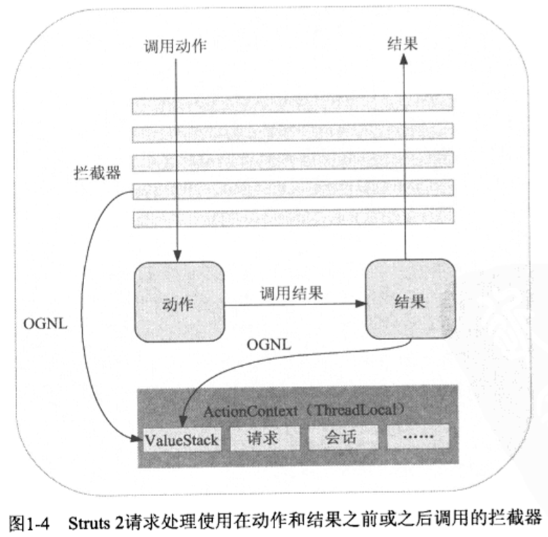

#第1章 Struts2：线代Web框架

##1.1 Web应用程序：快速学习

###1.1.1 构建Web应用程序
对于Web应用程序而言，需要跨越HTTP协议的两个障碍——无状态和基于文本。

###1.1.3 深入研究

1. 请求参数数据绑定和数据验证

2. 访问业务逻辑和数据层

3. 呈现表示层和国际化

##1.2 Web应用程序框架

###1.2.1 什么是框架
框架是一种结构化的软件。框架主要在两个方面帮助我们快速开发：第一，尽量自动化Web应用程序开发过程中的常见问题；第二，尽量提供优秀的架构解决方案来优化Web应用程序中常见的工作流。

1. 框架自动化了常见任务  
不重复造轮子
2. 框架提供了架构解决方法

###1.2.2 为什么使用框架

##1.3 Struts2 框架

###1.3.1 Struts2 简史
Struts2是实现MVC（Model-View-Controller）设计模式的第二代Web应用程序框架。

###1.3.2 Struts2概览：MVC模式
在Struts2中，分别通过动作（action）、结果（result）和过滤分配器（FilterDispatcher）
####1、控制器——FilterDispatcher

####2、模型——动作
模型是事物本身，是应用程序的内部状态，这个状态可由数据模型和业务逻辑共同组成。宏观上看，数据和业务逻辑融合在一起构成了应用程序的整体状态。

Struts的动作组件有两个作用。  
1. 一个动作将业务逻辑调用封装到一个单独的工作单元中。
2. 动作是一个数据传输的场所。
####3、视图——结果
视图是MVC模式的呈现组件。
视图的作用将应用程序的状态转换为一种用户可以与之交互的可视化的标识。

###1.3.3 Struts2的工作原理
拦截器、OGNL和ValueStack

1. 拦截器

2. ValueStack和OGNL

