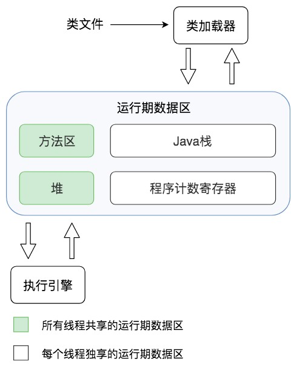

# 后端技术基础详解 #

# 开篇词 #

## 开篇词 | 掌握软件开发技术的第一性原理 ##

第一性原理——建立技术体系的起点。

软件的基础原理、软件的设计原理、架构的核心原理。

我想从软件技术的第一性原理出发，写一写软件技术那些最基本的知识原理和知识体系。

### 精选留言 ###

# 软件的基础原理 #

## 01 | 程序运行原理：程序是如合运行又是如合崩溃的？ ##

### 程序是如合运行起来的 ###

* 程序，静态的
* 进程，动态的，除了包含可执行的程序代码，还包括进程在运行期使用的内存堆空间、栈空间、供操作系统管理用的数据结构。

要想让程序处理数据，完成计算任务，必须把程序从外部设备加载到内存中，并在操作系统的管理调度下交给CPU去执行，去运行起来，才能真正发挥软件的作用，程序运行起来以后，被称作进程。

进程除了包含可执行的程序代码，还包括进程在运行期使用的内存堆空间、栈空间、供操作系统管理用的数据结构。

### 一台计算机如何同时处理数以百计的任务 ###

* 运行
* 就绪
* 阻塞

### 系统为什么会变慢，为什么会崩溃 ###

Tomcat 启动多个线程，为每个用户请求分配一个线程，调用和请求 URL 路径相对应的 Servlet（或者 Controller）代码，完成用户请求处理。而 Tomcat 则在 JVM 虚拟机进程中，JVM 虚拟机则被操作系统当做一个独立进程管理。真正完成最终计算的，是 CPU、内存等服务器硬件，操作系统将这些硬件进行分时（CPU）、分片（内存）管理，虚拟化成一个独享资源让 JVM 进程在其上运行。

不管你是否有意识，你开发的 web 程序都是被多线程执行的，web 开发天然就是多线程开发。

CPU 以线程为单位进行分时共享执行，可以想象代码被加载到内存空间后，有多个线程在这些代码上执行，这些线程从逻辑上看，是同时在运行的，每个线程有自己的线程栈，所有的线程栈都是完全隔离的，也就是每个方法的参数和方法内的局部变量都是隔离的，一个线程无法访问到其他线程的栈内数据。

* 系统变慢
* 应用崩溃

此外必要时还需要在请求入口处进行限流，减小系统的并发请求数；在应用内进行业务降级，减小线程的资源消耗。

### 小结 ###

### 思考题 ###

线程安全的临界区需要依靠锁，而锁的获取必须也要保证自己是线程安全的，也就是说，不能出现两个线程同时得到锁的情况，那么锁是如何保证自己是线程安全的呢？或者说，在操作系统以及 CPU 层面，锁是如何实现的？

在java里 锁是通过cas把当前线程id刷新到对象的头信息里 在获取锁时会去头信息里拿这个信息 如果没有 则会cas刷新进去 刷新成功就获取到锁 刷新失败就表明有别的线程也在尝试刷新这个信息 在操作系统层面 有pv操作保证原子性 而pv操作也是利用cpu中原语指令 在获取锁时保证不会被别的指令打断（或被重排序）

### 精选留言 ###

#### 1. ####

有些地方可能不是很到位，欢迎补充
小结：
1. 我们平时开发出来的程序是文本格式代码，但只是在硬盘中还只是一个程序，只有加载到内存里面通过cpu执行成为进程才是发挥了程序作用。
2.进程里面有堆，栈，可执行代码和进程数据结构。
3.cpu分时共享技术进行并发操作，进程切换效率不高，所以有了线程切换
4.因为线程安全问题引入锁，不过也引入了更多造成阻塞的可能
5.线程阻塞可能是I/O,锁，网络请求，数据库链接获取
6利用分布式系统架构来减缓高并发的性能不佳

#### 2. ####

我们用文本格式书写的程序有三种执行方式:
1.解释执行。例子是脚本语言书写的程序或类似于BASIC语言书写的程序。著名的PYTHON也属于这种情况。
2.编译执行。通常C/C++程序属于这种情况。文本格式书写的程序称之为源程序，需要编译器编译成机器语言代码，称之为可执行程序一或目标程序。
3.虚拟机执行。将文本格式的程序先编译成一种中间代码，然后由驻留在计算机中的虚拟机解释执行。例子是通常的JAVA程序。

#### 3.  ####

我想请教下，一个JVM 是一个进程。JVM 上跑 tomcat，tomcat 可以部署多个应用？那每个跑在tomcat 上的应用是一个线程吗？那一个应用crash了，其他应用也会crash.这块感觉有点问题。不知道老师方便解释下吗？

作者回复: JVM是一个进程；tomcat是一个框架；tomcat会启动线程处理应用请求，执行应用的代码；应用自己不能跑起来的，只能被tomcat的线程执行，应用在tomcat线程中执行时，也可以自己启动线程，并发、异步执行自己的某些计算。

tomcat会对不同应用做一些隔离，但是如果某个应用导致JVM crash，所有应用都crash。

可参考后续专栏《JVM虚拟机原理》

#### 4.  ####

老师，看完文章，联想到两个关于协程的问题：

1. 使用协程在出现IO等待时，程序会自己调度去执行其他的(CPU)任务。理论上这样可以避免额外的IO等待导致的线程间切换。我的问题是从系统的角度上看，使用协程可以抢占到更多的CPU时间片吗？

2. 感觉系统崩溃（除人为Bug外) 主要是系统资源不足导致的。那么即使用轻量级的协程也不会变得更好。因为当协程数量过多，导致event loop过大，变慢，系统还是要崩溃的对吗？

作者回复: 1 多个协程通过自我调度复用同一个线程，所以某个协程IO等待的时候，会导致整个线程阻塞，并不能避免线程切换。更好的做法是使用异步IO，不要IO等待。

能否抢到时间片是操作系统调度的，协程自己控制不了，但是协程利用自己更轻量级，配合异步IO等方法，可以提高运行效率，整体性能得到优化。

2 是的。但是用好协程，减少额外的线程调度切换，可以提高整体的系统吞吐能力。

#### 5. ####

您好，老师，这节课太适合我这种新手了，这里有三个不太明白的地方，希望老师能够解惑。
问题1：CPU 分时共享技术同时执行进程的数量，取决于什么？
问题2：为什么线程切换的代价更小？
问题3：进程切换是不是必须要等到线程切换完毕后进行？如果不是，优先级是由什么决定的？
一点小建议：
有一些表达程度的词，如果能用数据举例简单说明一下，对于我们理解会更有帮助。比如2问题中，代价更小，小到什么程度，是进程切换速度的几倍?
思考题：
作为小白，我的思路是这样，锁是在线程的临界区，线程是在进程的线程栈，而 一个 cpu 同时只能运行一个进程，所以本质上都是轮流执行的……于是，只要保证在获取锁的时候，锁不在正在获取或已经被获取的状态即可，进而推断线程中会有一片内存区域用来存这些状态信息。
😂不知道这个思路对不对。
最后谢谢老师。

作者回复: 1 取决于CPU的核数
2 线程比进程占据的资源少，切换代价小，而且进程内线程可能执行相同的代码，切换线程后也许还可以复用CPU cache数据
3 线程切换和进程切换只依赖CPU是否空闲，和线程进程彼此没关系

PS，上面回复内容其实我也没有确切的资料证实，我是根据第一性原理推导出来的，我觉得仅根据专栏文章内容就可以推导出来，我希望你也可以自己分析推导，这样获得的知识会更加稳固

#### 6. ####

你好，想提个问题。文章中大部分知识点都掌握，但是遇到问题的时候没有从这些角度出发，只是跟着一些关联去分析问题，对遇到的问题反应比较慢。这种情况是不是知识没有成体系？那么怎样建立比较完整的知识体系呢？

作者回复: 思考问题从问题的根源出发思考，如果在解决问题的时候现场比较乱，无法做到。事后做复盘，复盘的时候重新从根源思考。

#### 7. ####

老师，别人常说java和go等是带有运行时的语言，难道c和cpp没有吗？运行时是指垃圾回收这些功能吗？

作者回复: C和C++的执行代码直接交给操作系统调度管理，Java和Go的执行代码在JVM和Go的虚拟机环境中运行，不仅仅是垃圾回收，Java和Go的虚拟机职责也不一样。详情可参考后续专栏《JVM虚拟机原理》。

## 02 | 数据结构原理：Hash表的时间复杂度为什么是O（1）？ ##

Hash表的时间复杂度为什么是O（1）？

Hash表，需要从数组讲起

## 数组 ##

数组是最常用的数据结构，创建数组必须要从内存一块**连续**的空间，并且数组中必须存放**相同**的数据类型。

随机快速读写是数组的一个重要特性，但是要随机放问数据，必须知道数据在数组中的下表。如果我们只知道数据的值，想要在数组中找到这个值，我们就只能遍历整个数组，时间复杂度位O(N)。

## 链表 ##

不同于数组必须要连续的内存空间，链表可以使用零散的内存空间存储数据。不过因为链表在内存中的数据不是连续的，所以链表中的每个数据元素都必须包含一个指向下一个数据元素的内存地址指针。如下图，链表的每个元素包含两部分。一部分是数据，一部分是指向下一个原申诉的地址指针。最后一个元素指向null，表示链表到此为止。

因为链表是不连续存储的，要想在链表中查找一个数据，只能遍历链表，所以链表的查找复杂度是O(N)。

## Hash表 ##

对数组中的数据进行快速访问必须通过数组的下标，时间复杂度为O(1)。

Hash表中数据结构以Key，Value的方式存储。

Hash表的物理存储其实是一个数组，如果能够根据Key计算出数组下标，那么就可以快速在数组中查找倒需要的Key和Value。

当我们要读取数据的时候，直摇给定Key abc，算一个算法过程，先求取它的HashCode 101，然后再对8取模，因为数组的长度不变，对8取模之后依然是余5，然后倒数组下标中取找5的的位置，就可以找到前面存储进去的abc对应的Value值。

Hash冲突，解决Hash冲突的常用的方法是链表法。

Key、Value数据并不会直接存储在Hash表的数组中，因为数组要求存储固定数据类型，主要目的是每个数组元素中要存放固定长度的数据。所以，数组中存储的是 Key、Value 数据元素的地址指针。一旦发生 Hash 冲突，只需要将相同下标，不同 Key 的数据元素添加到这个链表就可以了。查找的时候再遍历这个链表，匹配正确的 Key。

## 栈 ##

数组和链表都被称为线性表，因为里面的数据是按照线性组织存放的，每个数据元素的前面只能有一个（前驱）数据元素，后面也只能有一个（后继）数据元素，所以称为线性表

操作受限的线性表

## 队列 ##

队列也是一个操作受限的线性表，栈是后进先出，而队列是先进先出。

## 树 ##

数据、链表、栈和队列都是线性表，即有一个前驱，一个后继。而树则是非线性表。

## 小结 ##

## 03 | Java虚拟机原理：JVM为什么被称为机器（machine）？ ##

JVM的全称是Java Virtual Machine。

### JVM的组成构造 ###

JVM的主要由类加载器、运行时数据区、执行引擎三个部分组成。

运行时数据区主要包括方法区、堆、Java栈、程序计数寄存器。

方法区主要存放从磁盘加载的类字节码，而在程序运行过程中创建的类实例则存放在堆里。程序运行的时候，实际以线程为单位运行的，当JVM进入启动类的main方法的时候，就会为应用程序创建一个主线程，main方法里的代码就会被这个主线程执行，每个线程都有自己的Java栈，栈里存放着

一个典型的Java程序运行过程是下面这样的：

通过Java命令启动JVM，JVM的类加载器根据Java命令的参数到指定的路径加载.class类

### JVM的垃圾回收 ###

所谓自动垃圾回收是将JVM堆中的已经不再被使用的对象清理掉，释放宝贵的内存资源。

垃圾回收 -> 如何直到哪些对象是不再被使用的

JVM通过一种可达性分析算法进行垃圾对象的识别，具体过程是：从线程

#### 第一种方式是清理 ####

#### 第二种方式是压缩 ####

#### 第三种方式是复制 ####

#### 第四种方式是清理 ####

### 小结 ###

## 04 | 网络编程原理：一个字符的互联网之旅 ##

DNS -> CDN -> IP -> HTTP -> TCP

### DNS ###

构成互联网Internet的最基本的网络协议就是互联网协议InternetProtocol，简称IP协议。IP协议里面最重要的部分是IP地址，各种计算机设备之间能够互相通信。IP地址就是互联网的地址标识。

### CDN ###

如果用户请求的数据是静态

CDN是内容分发网络Content Delivery Network的缩写。

如果用户请求的数据是静态资源，域名解析的时候就会解析为淘宝CDM的IP地址，请求先被CDN处理，如果CDN中有需要的静态文件，就直接返回，如果没有，CDN会将请求发送到淘宝的数据中心，CDN从淘宝数据中心获得静态文件后，一方面缓存缓存在自己的服务器上，一方面将数据返回给用户的App。

如果请求的数据是动态的，请求的域名可能是search.taobao.com这样的二级域名，就会直接被DNS解析为淘宝的数据中心的服务器IP地址，App请求发送到数据中心处理。

### HTTP ###

HTTP是一个应用层协议，

1. 应用层的通信协议，我们通信的数据是如何编码，既能使网络传输过去的数据携带必要的信息
2. 通信的双方都能正确识别这些信息（双方英雄程序需要约定一个数据编码协议）
3. 网络底层通信协议，即如何为网络上需要通信的两个节点建立连接完成数据传输，目前互联网应用中最主要的就是TCP协议

在TCP传输层协议层面

1. 保证建立通信双方的稳定通信连接，将一方的数据以bit流的方式源源不断地发送到另一方
2. 

HTTP请求头

1. GET：请求头
2. POST：请求头+body部分 Content-length body

HTTP响应头

200，302，4xx，5xx 相应body HTML或JSON字符

### TCP ###

### LB（负载均衡 ###）

搜索请求到达数据中心的时候

1. 首先到达的饿是搜索服务器集群的负载均衡服务器。
2. DNS解析出来的是负载均衡服务器的IP地址。
3. 由负载均衡服务器将请求分发到搜索服务器集群中的某台服务器上。

负载均衡服务器的实现手段->通常使用Linux内核支持的链路层负载均衡。

直接路由模式，在负载均衡服务器的Linux操作系统内核拿到数据包后，直接修改数据帧的mac地址，将其修改为搜索服务器集群中某个服务器的mac地址，然后将数据重新发送回服务器集群所在的局域网，这个数据帧就会被某个真实的搜索服务器接收到。

负载均衡服务器和集群内的搜索服务器配置相同的虚拟IP地址。在网络通信的IP层面，负载均衡服务器变更mac地址的操作是透明的，不影响TCP/Ip的通信连接。所以真实的搜索服务器处理完搜索请求，发送应答相应的时候，就会直接发送回请求的App手机，不会再经过负载均衡服务器。

### 小结 ###

## 05 | 文件系统原理：如何用1分钟遍历100TB的文件？ ##

## 06 | 数据库原理：为什么PrepareStatement性能更好更安全？ ##

1. 通过Statement直接提交SQL
2. 先通过PrepareStatement预编译SQL，然后设置可变参数再提交执行

	statement.executeUpdate("UPDATE Users SET stateus = 2 WHERE userID=233");

	PreparedStatement updateUser = con.prepareStatement("UPDATE Users SET stateus = ? WHERE userID = ?"); 
	updateUser.setInt(1, 2); 
	updateUser.setInt(2,233); 
	updateUser.executeUpdate();

### 数据库架构与SQL执行过程 ###

关系数据库RDBMS有很多种，但是关系数据库的架构基本差不多，包括支持SQL语言的Hadoop大数据从仓库。一个SQL提交到数据库，经过连接器将SQL语句交给语法分析器，生成一个抽象语法树AST；AST经过语义分析与优化器，进行语义优化，使计算过程和需要获取的中间数据尽可能少，然后得到数据库执行计划；执行计划提交给具体的执行引擎进行计算，将结果通过连接器再返回给应用程序。

这些连接一旦建立，不管是否有SQL执行，都会消耗一定的数据库内存资源，所以对于一个大规模互联网集群了来说，如果启动了很多应用程序实例，这些程序每个都会和数据库建立若干个连接，即使不提交SQL到数据库执行，也就会对数据库产生很大的压力。

连接器收到SQL以后，会将SQL交给语法分析器进行处理，语法分析器工作比较简单机械，就是根据SQL语法规则生成对应的抽象语法树。

如果SQL语句中存在语法错误，那么在生成语法树的时候就会报错。

	mysql> explain select * from users whee id = 1;
	
	ERROR 1064 (42000): You have an error in your SQL syntax; check the manual that corresponds to your MySQL server version for the right syntax to use near 'id = 1' at line 1

因为语法错误是在构建抽象语法树的时候发现的，上面例子中，虽然语法分析器不能知道whee是一个语法拼写错误，因为这个whee可能是表名users的别名，但是语法分析器在构建语法树到了id=1这里的时候就出错了，所以返回的报错信息可以提示，在“id=1”附近有语法错误。

语法分析器生成的抽象语法树并不仅仅可以用来做语法校验，它是下一步处理的基础。语义分析与优化器会对抽象语法树进一步做语义优化，也就是在保证SQL语义不变的前提下，进行语义等价转换，使最后的计算量和中间过程数据量尽可能小。

	select f.id from orders f where f.user_id = (select id from users); 

等价于

	select f.id from orders f join users u on f.user_id = u.id;

SQL语义分析与优化器就是将各种复杂嵌套的SQL进行语义等价转化，得到有限几种关系代数计算结构，并历用索引等信息进一步进行优化。

语义分析与优化器最后会输出一个执行计划，由执行引擎完成数据查询或者更新。MySQL执行的计划：

执行引擎是可替换的，直摇能够执行这个执行计划就可以了。所以MySQL有多种执行引擎（也叫存储殷勤）可以选择，缺省的是InnoDB，此外还有MyISAM、Memory等，我们可以在创建表的时候指定存储引擎。大数据仓库Hive也是这样的架构，Hive输出的执行计划可以在Hadoop上执行。

### 使用PrepareStatement执行SQL的好处 ###

1. PrepareStatement会预先提交带占位符的SQL到数据库进行预处理，提前生成执行计划，当给定占位符参数，真正执行SQL的时候，执行引擎可以直接执行，效率会更好一点。
2. PrepareStatement可以防止SQL注入攻击。

	select * from users where username = 'Frank';
	
	用户输入 
	'Frank';drop table users;--
	
	最后生成 
	select * from users where username = 'Frank';drop table users;--';
	
通过Statement提交SQL，会被当作两条SQL执行，一条是正常的select查询SQL，一条是删除users的SQL。

但PrepareStatement会提前进行语义分析，就不会被当作两条SQL处理，避免SQL注入。

	select * from users where username = ?;

### 数据库文件存储原理 ###

数据库通过索引进行查询加快查询速度 => 为什么索引能加快查询速度

数据库索引使用B+树，B+树是一种N叉排序树，树的每个节点包含N个数据，这些数据按顺序排好，两个数据之间是一个指向子节点的指针，而子节点的数据则在这两个数据大小之间。

B+树的节点存储在磁盘上，每个节点存储1000多个数据，这样树的深度只要4层，就可存储数亿的数据。如果将树的根节点缓存在内存中，则最多只需要三次磁盘访问就可以检索倒需要的索引数据。

B+树加快了索引的检索速度。

数据库索引有两种

1. 聚簇索引，聚簇索引的数据库记录和索引存储在一起，在叶子节点中，索引1和记录行r1存储在一起，查找到索引就是查找到数据库记录。像MySQL数据库的主键就是聚簇索引，主键ID和所在记录行存储在一起。MySQL的数据库文件实际上是以主键作为中间节点，行记录作为叶子节点的一颗B+树。
2. 非聚簇索引，非聚簇索引在叶子节点记录就不是数据行记录，而是聚簇索引，也就是主键。

通过B+树在叶子节点中找到非聚簇索引a，和索引a在一起存储的时主键1，再根据主键1通过主键（聚簇）索引就可以找到对应的记录r1，这种通过非聚簇索引找到主键索引，再通过主键索引找到行记录的过程也被称作回表。

数据库可以支持事务，一个事务对多条记录进行更新，要么全部更新，要么全部不更新，不能部分更新。数据库实现事务主要就是依靠事务日志文件。在进行事务操作时，事务日志文件会记录更新前的数据记录，然后再更新数据库中的记录，如果全部记录都更新成功，那么事务正常结束，如果过程中某条记录更新失败，那么整个事务全部回滚，已经更新的记录根据事务日志中记录的数据进行恢复，这样全部数据都恢复倒事务提交前的状态，仍然保持数据一致性。

MySQL数据库还有binlog日志文件，记录全部的数据更新操作记录，只要有binlog就可以完整复现数据库的历史变更，实现主从数据库的主从复制，构建高性能、高可用的数据库系统。

### 小结 ###

1. 掌握数据库的架构原理与执行过程
2. 数据库文件的存储原理与索引的实现方式
3. 数据库事务与数据库复制的基本原理

在开发工作中针对各种数据库问题去思考背后原理

### 思考题 ###

索引可以提高数据库的查询性能，那么是不是尽量多的使用索引呢？如果不是，为什么？你还了解哪些改善数据库放问性能的技巧方法？

您好，老师： 回答上述问题 1.创建多的索引，会占用更多磁盘空间。如果有一张很大的表，索引文件的大小可能达到操作系统允许的最大文件限制； 2.对于DML操作的时候，索引会降低他们的速度。因为MySQL不仅要把搞定的数据写入数据文件，而且它还要把这些改动写入索引文件; 改善数据库性能： 1.索引优化，选择合适的索引列，选择在where、group by、order by、on 从句中出现的列作为索引项，对于离散度不大的列没有必要创建索引。 2.索引字段越小越好。 3.SQL语句的优化、数据表结构的优化。 &nbsp;&nbsp;&nbsp;&nbsp;3.1：选择可存数据最小的数据类型，选择最合适的字段类型，进行数据的存储; &nbsp;&nbsp;&nbsp;&nbsp;3.2：数据量很大的一张表，应该考虑水平分表或垂直分表； &nbsp;&nbsp;&nbsp;&nbsp;3.3：尽量不要使用text字段，如果非要用，那么应考虑将它存放另一张表中； 4.数据库配置的优化： &nbsp;&nbsp;&nbsp;&nbsp;4.1：连接数的配置，因为大量的连接，不进行操作，那样也会占用内存。 &nbsp;&nbsp;&nbsp;&nbsp;4.2：查询缓存的配置，但在MySQL 8.0就删除了此功能。 5.硬件的配置; &nbsp;额外加说一下，常见性能的问题： 1.条件字段函数的操作，给索引字段做了函数计算，就会破坏索引值，因此优化器就放弃了走树搜索能够; 2.隐式类型转换，比如数据库字段是varchar类型，创建的索引，但是使用的时候传入的是int类型，那么会走全表扫面; 3.隐式字符编码转换，如果join 两表的时候，两表的字符集不同，也不能用上索引； 

## 07 | 编程语言原理：面向对象编程是编程的终极形态？ ##

## 08 | 软件设计的方法论：软件为什么要建模？ ##

## 09 | 软件设计实践：如合使用UML完成一个设计文档 ##

类图、时序图、组件图、部署图、用例图、状态图

### 类图 ###

类图是最常见的UML图形，用来描述类的特性和类之间的静态关系。

一个类包含三个部分：类的名字、类的属性列表和类的方法列表。

类之间有6种静态关系：关联、依赖、组合、聚合、继承、泛化。

需求分析阶段

### 序列图 ###

软件设计的不同阶段

### 组件图 ###

组件是比类粒度更大的设计元素，一个组件中通常包含多个类。组件图有的时候和包图的用途比较接近，组件图通常用来描述物理上的组件，比如一个JAR，一个DLL等等。在实际种，进行模块设计的时候使用组件图。

### 部署图 ###

概要设计阶段

### 用例图 ###

需求分析阶段，通过反映用户和软件系统的交互，描述系统的功能需求。

### 状态图 ###

状态图用来展示单个对象生命周期的的状态变迁。

### 活动图 ###

活动图主要用来描述过程

### 使用合适的UML模型构建一个设计文档 ###

#### 需求分析阶段 ####

用例图来描述系统的功能与使用场景

关键的业务场景可以使用活动图来描述

如果在需求阶段就提出和现有的某些子系统整合，通过时序图描述新系统和原来的子系统的调用关系

通过简化的类图进行领域模型抽象，并描述核心领域对象之间的关系。

如果某些对象内部会有复杂的状态，比如用户、订单这些，可以用状态图进行描述。

#### 概要设计阶段 ####

通过部署图描述系统最终的物理蓝图

通过组件图以及组件时序图设计软件主要模块及其关系

通过组件活动图描述组件间的流程逻辑

#### 详细设计阶段 ####

输出类图和类的时序图，指导最终的代码开发。

如果某个类方法内部有复杂的逻辑，可以用画方法的活动图进行描述。

### 小结 ###

## 加餐 ##

概要设计文档和详细设计文档合并成一个设计文档。

1. 文档开头是设计概览，简单描述业务场景要解决的核心问题领域是什么。
2. 组件图，描述子系统由哪些组件组成，不同场景中，组件之间的调用序列图是什么样的。
3. 每个组件内部，需要用类图进行建模描述，对于不同场景，用时序图描述类之间的动态调用关系，对于复杂状态的类，用状态图描述其状态转换。

## 10 | 软件设计的目的：糟糕的程序员逼优秀的程序员差在哪里？ ##

## 11 | 软件设计的开闭原则：如何不修改代码却能实现需求变更？ ##

## 12 | 软件设计的依赖倒置原理：如何不依赖代码却可以复用它的功能？ ##

### 依赖倒置原则 ###

* 高层模块不应该依赖低层模块，二者都应该依赖抽象。
* 抽象不应该依赖具体实现，具体实现应该依赖抽象。

高层模块依赖低层模块

1. 维护困难
2. 复用困难

### 依赖倒置的关键是接口所有权的倒置 ###

策略层依赖方法层，方法层依赖工具层，策略层对方法层和工具层是传递依赖的，下面两层的任何改动都会导致策略层的改动。

### 小结 ###

依赖倒置原则通俗点说，高层不依赖低层模块

1. 应用代码中多使用抽象接口，尽量避免使用那些多变的具体实现类。
2. 不要继承具体类，如果一个类在设计之初不是抽象类，那些尽量不要去继承它。对具体类的继承是一种强依赖关系，维护的时候难以改变。
3. 不要重写（override）包含具体实现的函数。