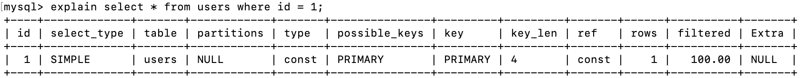

# 后端技术基础详解 #

# 开篇词 #

## 开篇词 | 掌握软件开发技术的第一性原理 ##

第一性原理——建立技术体系的起点。

软件的基础原理、软件的设计原理、架构的核心原理。

# 软件的基础原理 #

## 01 | 程序运行原理：程序是如合运行又是如合崩溃的？ ##

### 程序是如合运行起来的 ###

程序是静态的。

要想让程序处理数据，完成计算任务，必须把程序从外部设备加载到内存中，并在操作系统的管理调度下交给CPU去执行，去运行起来，才能真正发挥软件的作用，程序运行起来以后，被称作进程。

进程除了包含可执行的程序代码，还包括进程在运行期使用的内存堆空间、栈空间、供操作系统管理用的数据结构。

程序运行时如果需要创建数组

## 02 | 数据结构原理：Hash表的时间复杂度为什么是O（1）？ ##

Hash表的时间复杂度为什么是O（1）？

Hash表，需要从数组讲起

## 数组 ##

数组是最常用的数据结构，创建数组必须要从内存一块**连续**的空间，并且数组中必须存放**相同**的数据类型。

随机快速读写是数组的一个重要特性，但是要随机放问数据，必须知道数据在数组中的下表。如果我们只知道数据的值，想要在数组中找到这个值，我们就只能遍历整个数组，时间复杂度位O(N)。

## 链表 ##

不同于数组必须要连续的内存空间，链表可以使用零散的内存空间存储数据。不过因为链表在内存中的数据不是连续的，所以链表中的每个数据元素都必须包含一个指向下一个数据元素的内存地址指针。如下图，链表的每个元素包含两部分。一部分是数据，一部分是指向下一个原申诉的地址指针。最后一个元素指向null，表示链表到此为止。

## 03 | Java虚拟机原理：JVM为什么被称为机器（machine）？ ##

## 04 | 网络编程原理：一个字符的互联网之旅 ##

DNS -> CDN -> IP -> HTTP -> TCP

### DNS ###

构成互联网Internet的最基本的网络协议就是互联网协议InternetProtocol，简称IP协议。IP协议里面最重要的部分是IP地址，各种计算机设备之间能够互相通信。IP地址就是互联网的地址标识。

### CDN ###

如果用户请求的数据是静态

CDN是内容分发网络Content Delivery Network的缩写。

如果用户请求的数据是静态资源，域名解析的时候就会解析为淘宝CDM的IP地址，请求先被CDN处理，如果CDN中有需要的静态文件，就直接返回，如果没有，CDN会将请求发送到淘宝的数据中心，CDN从淘宝数据中心获得静态文件后，一方面缓存缓存在自己的服务器上，一方面将数据返回给用户的App。

如果请求的数据是动态的，请求的域名可能是search.taobao.com这样的二级域名，就会直接被DNS解析为淘宝的数据中心的服务器IP地址，App请求发送到数据中心处理。

### HTTP ###

HTTP是一个应用层协议，

1. 应用层的通信协议，我们通信的数据是如何编码，既能使网络传输过去的数据携带必要的信息
2. 通信的双方都能正确识别这些信息（双方英雄程序需要约定一个数据编码协议）
3. 网络底层通信协议，即如何为网络上需要通信的两个节点建立连接完成数据传输，目前互联网应用中最主要的就是TCP协议

在TCP传输层协议层面

1. 保证建立通信双方的稳定通信连接，将一方的数据以bit流的方式源源不断地发送到另一方
2. 

HTTP请求头

1. GET：请求头
2. POST：请求头+body部分 Content-length body

HTTP响应头

200，302，4xx，5xx 相应body HTML或JSON字符

### TCP ###

### LB（负载均衡 ###）

搜索请求到达数据中心的时候

1. 首先到达的饿是搜索服务器集群的负载均衡服务器。
2. DNS解析出来的是负载均衡服务器的IP地址。
3. 由负载均衡服务器将请求分发到搜索服务器集群中的某台服务器上。

负载均衡服务器的实现手段->通常使用Linux内核支持的链路层负载均衡。

直接路由模式，在负载均衡服务器的Linux操作系统内核拿到数据包后，直接修改数据帧的mac地址，将其修改为搜索服务器集群中某个服务器的mac地址，然后将数据重新发送回服务器集群所在的局域网，这个数据帧就会被某个真实的搜索服务器接收到。

负载均衡服务器和集群内的搜索服务器配置相同的虚拟IP地址。在网络通信的IP层面，负载均衡服务器变更mac地址的操作是透明的，不影响TCP/Ip的通信连接。所以真实的搜索服务器处理完搜索请求，发送应答相应的时候，就会直接发送回请求的App手机，不会再经过负载均衡服务器。

### 小结 ###

## 05 | 文件系统原理：如何用1分钟遍历100TB的文件？ ##

## 06 | 数据库原理：为什么PrepareStatement性能更好更安全？ ##

1. 通过Statement直接提交SQL
2. 先通过PrepareStatement预编译SQL，然后设置可变参数再提交执行

	statement.executeUpdate("UPDATE Users SET stateus = 2 WHERE userID=233");

	PreparedStatement updateUser = con.prepareStatement("UPDATE Users SET stateus = ? WHERE userID = ?"); 
	updateUser.setInt(1, 2); 
	updateUser.setInt(2,233); 
	updateUser.executeUpdate();

### 数据库架构与SQL执行过程 ###

关系数据库RDBMS有很多种，但是关系数据库的架构基本差不多，包括支持SQL语言的Hadoop大数据从仓库。一个SQL提交到数据库，经过连接器将SQL语句交给语法分析器，生成一个抽象语法树AST；AST经过语义分析与优化器，进行语义优化，使计算过程和需要获取的中间数据尽可能少，然后得到数据库执行计划；执行计划提交给具体的执行引擎进行计算，将结果通过连接器再返回给应用程序。

这些连接一旦建立，不管是否有SQL执行，都会消耗一定的数据库内存资源，所以对于一个大规模互联网集群了来说，如果启动了很多应用程序实例，这些程序每个都会和数据库建立若干个连接，即使不提交SQL到数据库执行，也就会对数据库产生很大的压力。

连接器收到SQL以后，会将SQL交给语法分析器进行处理，语法分析器工作比较简单机械，就是根据SQL语法规则生成对应的抽象语法树。

如果SQL语句中存在语法错误，那么在生成语法树的时候就会报错。

	mysql> explain select * from users whee id = 1;
	
	ERROR 1064 (42000): You have an error in your SQL syntax; check the manual that corresponds to your MySQL server version for the right syntax to use near 'id = 1' at line 1

因为语法错误是在构建抽象语法树的时候发现的，上面例子中，虽然语法分析器不能知道whee是一个语法拼写错误，因为这个whee可能是表名users的别名，但是语法分析器在构建语法树到了id=1这里的时候就出错了，所以返回的报错信息可以提示，在“id=1”附近有语法错误。

语法分析器生成的抽象语法树并不仅仅可以用来做语法校验，它是下一步处理的基础。语义分析与优化器会对抽象语法树进一步做语义优化，也就是在保证SQL语义不变的前提下，进行语义等价转换，使最后的计算量和中间过程数据量尽可能小。

	select f.id from orders f where f.user_id = (select id from users); 

等价于

	select f.id from orders f join users u on f.user_id = u.id;

SQL语义分析与优化器就是将各种复杂嵌套的SQL进行语义等价转化，得到有限几种关系代数计算结构，并历用索引等信息进一步进行优化。

语义分析与优化器最后会输出一个执行计划，由执行引擎完成数据查询或者更新。MySQL执行的计划：

执行引擎是可替换的，直摇能够执行这个执行计划就可以了。所以MySQL有多种执行引擎（也叫存储殷勤）可以选择，缺省的是InnoDB，此外还有MyISAM、Memory等，我们可以在创建表的时候指定存储引擎。大数据仓库Hive也是这样的架构，Hive输出的执行计划可以在Hadoop上执行。

### 使用PrepareStatement执行SQL的好处 ###

1. PrepareStatement会预先提交带占位符的SQL到数据库进行预处理，提前生成执行计划，当给定占位符参数，真正执行SQL的时候，执行引擎可以直接执行，效率会更好一点。
2. PrepareStatement可以防止SQL注入攻击。

	select * from users where username = 'Frank';
	
	用户输入 
	'Frank';drop table users;--
	
	最后生成 
	select * from users where username = 'Frank';drop table users;--';
	
通过Statement提交SQL，会被当作两条SQL执行，一条是正常的select查询SQL，一条是删除users的SQL。

但PrepareStatement会提前进行语义分析，就不会被当作两条SQL处理，避免SQL注入。

	select * from users where username = ?;

### 数据库文件存储原理 ###

数据库通过索引进行查询加快查询速度 => 为什么索引能加快查询速度

数据库索引使用B+树，B+树是一种N叉排序树，树的每个节点包含N个数据，这些数据按顺序排好，两个数据之间是一个指向子节点的指针，而子节点的数据则在这两个数据大小之间。

B+树的节点存储在磁盘上，每个节点存储1000多个数据，这样树的深度只要4层，就可存储数亿的数据。如果将树的根节点缓存在内存中，则最多只需要三次磁盘访问就可以检索倒需要的索引数据。

B+树加快了索引的检索速度。

数据库索引有两种

1. 聚簇索引，聚簇索引的数据库记录和索引存储在一起，在叶子节点中，索引1和记录行r1存储在一起，查找到索引就是查找到数据库记录。像MySQL数据库的主键就是聚簇索引，主键ID和所在记录行存储在一起。MySQL的数据库文件实际上是以主键作为中间节点，行记录作为叶子节点的一颗B+树。
2. 非聚簇索引，非聚簇索引在叶子节点记录就不是数据行记录，而是聚簇索引，也就是主键。

通过B+树在叶子节点中找到非聚簇索引a，和索引a在一起存储的时主键1，再根据主键1通过主键（聚簇）索引就可以找到对应的记录r1，这种通过非聚簇索引找到主键索引，再通过主键索引找到行记录的过程也被称作回表。

数据库可以支持事务，一个事务对多条记录进行更新，要么全部更新，要么全部不更新，不能部分更新。数据库实现事务主要就是依靠事务日志文件。在进行事务操作时，事务日志文件会记录更新前的数据记录，然后再更新数据库中的记录，如果全部记录都更新成功，那么事务正常结束，如果过程中某条记录更新失败，那么整个事务全部回滚，已经更新的记录根据事务日志中记录的数据进行恢复，这样全部数据都恢复倒事务提交前的状态，仍然保持数据一致性。

MySQL数据库还有binlog日志文件，记录全部的数据更新操作记录，只要有binlog就可以完整复现数据库的历史变更，实现主从数据库的主从复制，构建高性能、高可用的数据库系统。

### 小结 ###

1. 掌握数据库的架构原理与执行过程
2. 数据库文件的存储原理与索引的实现方式
3. 数据库事务与数据库复制的基本原理

在开发工作中针对各种数据库问题去思考背后原理

### 思考题 ###

索引可以提高数据库的查询性能，那么是不是尽量多的使用索引呢？如果不是，为什么？你还了解哪些改善数据库放问性能的技巧方法？

您好，老师： 回答上述问题 1.创建多的索引，会占用更多磁盘空间。如果有一张很大的表，索引文件的大小可能达到操作系统允许的最大文件限制； 2.对于DML操作的时候，索引会降低他们的速度。因为MySQL不仅要把搞定的数据写入数据文件，而且它还要把这些改动写入索引文件; 改善数据库性能： 1.索引优化，选择合适的索引列，选择在where、group by、order by、on 从句中出现的列作为索引项，对于离散度不大的列没有必要创建索引。 2.索引字段越小越好。 3.SQL语句的优化、数据表结构的优化。 &nbsp;&nbsp;&nbsp;&nbsp;3.1：选择可存数据最小的数据类型，选择最合适的字段类型，进行数据的存储; &nbsp;&nbsp;&nbsp;&nbsp;3.2：数据量很大的一张表，应该考虑水平分表或垂直分表； &nbsp;&nbsp;&nbsp;&nbsp;3.3：尽量不要使用text字段，如果非要用，那么应考虑将它存放另一张表中； 4.数据库配置的优化： &nbsp;&nbsp;&nbsp;&nbsp;4.1：连接数的配置，因为大量的连接，不进行操作，那样也会占用内存。 &nbsp;&nbsp;&nbsp;&nbsp;4.2：查询缓存的配置，但在MySQL 8.0就删除了此功能。 5.硬件的配置; &nbsp;额外加说一下，常见性能的问题： 1.条件字段函数的操作，给索引字段做了函数计算，就会破坏索引值，因此优化器就放弃了走树搜索能够; 2.隐式类型转换，比如数据库字段是varchar类型，创建的索引，但是使用的时候传入的是int类型，那么会走全表扫面; 3.隐式字符编码转换，如果join 两表的时候，两表的字符集不同，也不能用上索引； 

## 07 | 编程语言原理：面向对象编程是编程的终极形态？ ##

