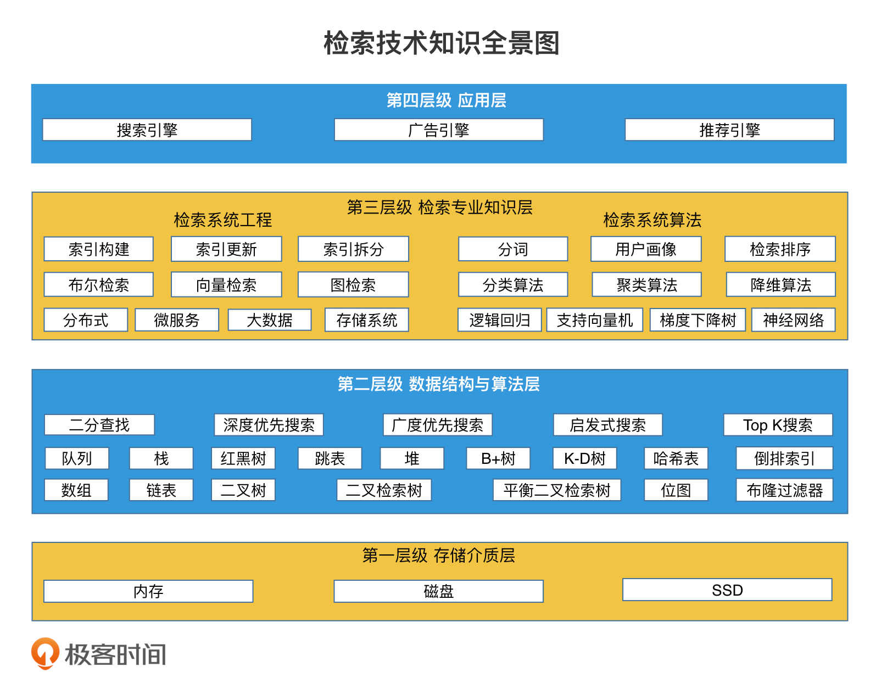

# 检索技术核心20讲 #

课前必学

## 开篇词 | 学会检索，快人一步 ##

### 为什么要学习检索技术？ ###

其实都是在海量的信息中，快速筛选出我们需要的内容或服务，而这都和检索技术紧密相关。

检索技术：它是更底层的通用技术，它研究的是如何将我们所需的数据高效地取出来。

了解和使用合适的检索技术，往往能有效提升整个程序的执行效率。

### 为什么检索技术难学？ ###

* 现代信息检索
* 信息检索导论

### 专栏是如何设计的？ ###

通过这个专栏系统地梳理检索技术的知识，去除冗杂的知识旁支，聚焦于最通用、最核心的检索技术，帮助更多有学习热情、有工作需求的工程师找到学习检索的方法，快速入门、积累经验，解决实际工作中的检索问题。

1. 聚焦核心知识，帮你全面了解检索技术。
2. 注重实用性，帮你解决实际工作中的问题。
3. 破除“高门槛”，帮你提高学习效率。

整个专栏的核心内容分成三大部分：基础技术篇、进阶实战篇和系统案例篇。

1. 在基础技术篇，核心的数据结构和检索算法作为入门，开启整个专栏的讲解。如果你经验尚浅，那这部分内容可以帮助你打好扎实的基础；如果你有一些实战经验，那这部分内容能让你站在检索技术的角度，重新审视之前熟悉的数据结构和算法，帮助你构建自己的检索知识体系。
2. 在进阶实战篇，我会结合工业界的实际应用场景，更深入地介绍一些高级检索技术，总结一些架构设计的思想，让你能学习到许多工业界的实用且有技术深度的解决方案。如果能深入理解并掌握这部分内容，我相信你会成为各种行业的优秀工程师。
3. 在系统案例篇，我会对当前热门的各个方向进行系统分析，比如，存储系统、搜索引擎、广告系统、推荐系统等。从中，你不仅能学到这些行业中是如何应用检索技术的，还可以了解不同行业中检索技术的共同点和不同点。

从“检索技术是什么”，到学会“利用检索技术解决实际问题”，并且更深入理解“为什么这么用”。

### 精选留言 ###

#### 1. ####

如何搭建公司的搜索引擎系统，希望做到业务数据不受到搜索引擎服务的影响，同时搜索引擎能比较实时提供查询统计功能。

作者回复: 这个具体要看你们的“实时查询统计”的需求到底是怎么样的。如果是简单的一些固定统计，那么elastic search就可以提供；但如果是偏OLAP的灵活分析查询需求，那其实Druid和clickhouse是更合适的选择。
ps:Druid和clickhouse都是基于lsm树实现的。lsm树在进阶实战篇和系统案例篇中我都会介绍

## 导读 | 三步走策略，轻松搞定检索！ ##

1. 存储介质层。因为检索效率的高低和数据存储的方式是紧密联系的，所以，存储介质的特性是我们需要学习的基础知识。
2. 数据结构与算法层。提到“效率”，自然就离不开数据结构和算法。在遇到实际业务的时候，我们要知道如何利用每个数据结构和算法的特点，来提高检索效率。所以，这块内容我们必须要学得很扎实。
3. 检索专业知识层。如果我们想实现工业界中的检索引擎，需要掌握这些检索技术。我把它们划分为两部分，分别是工程架构和算法策略。这些内容是我们解决常见业务问题的必备知识。
4. 应用层。检索技术在互联网中有许多应用场景，其中最常见的，有搜索引擎、广告引擎、以及推荐引擎。这些业务系统有相似的工程架构和算法部分，也分别有自己独特的业务处理环节。学习它们的实践方法，我们可以更全面、更深入地掌握检索技术。

### 第一步：夯实基础 ###

### 第二步：在实践中将技术落地 ###

### 第三步：搭配高效学习攻略 ###

#### 1. 多思考、多提问，善用“理解记忆法” ####

解记忆的方式进行学习

在学习每个知识点的时候，你可以一直问自己几个问题，比如

1. “这个知识点要解决什么问题？”
2. “如果不用这个方法还有其他的解决方案吗？”
3. “使用这个方法有副作用或者限制吗？”。

#### 2. 建立自己的知识体系 ####

如何建立自己的知识体系？对比和拆解。

* 在学习一个新知识点的时候，我们可以把它和之前学过的知识点对比，看看它们之间的相同点和不同点，为新、旧知识之间建立联系。
* 那如果这个新知识点是一个比较复杂的知识点，我们可以试着把它拆解成多个小知识点，拆解之后，我们依然可以用对比的方法，让这些小知识点和旧知识建立联系。

#### 3. 有耐心、反复学、多交流 ####

想要真正掌握一项技能，反复学习是非常重要的。尤其是在新知识点比较多的时候，反复学习就更为重要了。

在反复学习的过程中，你需要多看、多听、多思考、多对比。一方面，这能帮助你加强对检索知识的理解；另一方面，在重复学习的过程中，你也能更好地将前后的知识进行梳理，从而将新知识点融入自己的知识体系中。你还可以多和同事、同行交流、讨论，弥补自己的知识盲点，做到全面地理解知识。

### 重点回顾 ###

1. 分4个层级来学习检索技术，分别是存储介质层、数据结构和算法层、检索专业知识层、以及应用层。这里面的内容很多，要熟练掌握不是一件容易的事情。因此，我们需要有科学、高效的学习方法，以及清晰的学习路径。总结来说就是“三步走策略”：夯实基础、在实践中将技术落地，最后搭配高效的学习攻略。

### 课堂讨论 ###

### 精选留言 ###

#### 1.  ####

sql里的select查询算不算检索呢

数据库中用到了大量的检索技术。比如哈希索引，全文索引，b+树索引等。
一条select语句的检索效率如何，和数据的存储结构以及使用的索引方式密切相关。

#### 2.  ####

老师 推荐系统属不属于检索的一部分

作者回复: 在我之前画的“检索技术全景图”中，推荐系统就是非常重要的一个落地应用。
在海量的文章中，如果无法快速检索，那么想推荐出符合你口味的文章就像大海捞针。
我在系统案例篇里就会专门写推荐系统。

#### 3.  ####

向量检索目前工业界的采用的方案是根据数据量来的吗？另外分布式向量检索这个在工业界是否是个尚未开垦的荒地？

作者回复: 不算尚未开垦，不过也不算成熟。许多团队都在摸索。我们是自研的；而在业界主要是两大类方向:一种是将faiss改造为支持分布式；另一种是在es上做插件扩展。

#### 4. ####

会聊聊 elasticsearch 或者 lucene 吗

作者回复: 不会具体说elasticsearch和Lucene的使用，但是会告诉你，它们底层的检索技术是怎么实现的。

#### 5. ####

-_- 请问“双buffer”是什么

作者回复: 一种索引更新技术。进阶篇会讲到。工业界中很常用

#### 6. ####

作者回复: 电商平台中，其实既有搜索，又有广告，又有推荐。这些检索技术我在专栏中都有提及。相信你都了解了以后，会对电商平台中的检索技术有更全面的认知。
至于各大电商网站的架构对比，核心框架不会相差太多，但各家都会根据自己的特点做相应的调整。

#### 7.  ####

NoSQL 中的 LSM 树

#### 8.  ####

作者回复: 真实系统的确是非常复杂的。所以系统架构做的事情就是把复杂的大系统拆解成多个简单小系统。而每个小系统就容易实现得多。
由于篇幅有限，这个专栏不会详细介绍一个系统的每个细节，但是会把整体框架和核心知识点和你分享。

基础技术篇

## 01 | 线性结构检索：从数组和链表的原理初窥检索本质 ##

从字面上来理解，检索其实就是将我们所需要的信息，从存储数据的地方高效取出的一种技术。所以，检索效率和数据存储的方式是紧密联系的。。具体来说，就是不同的存储方式，会导致不同的检索效率。那么，研究数据结构的存储特点对检索效率的影响就很有必要了。

### 数组和链表有哪些存储特点？ ###

数组和链表分别代表了连续空间和不连续空间的最基础的存储方式，它们是线性表（Linear List）的典型代表。其他所有的数据结构，比如栈、队列、二叉树、B+ 树等，都不外乎是这两者的结合和变化。以栈为例，它本质就是一个限制了读写位置的数组，特点是只允许后进先出。

我们只需要从最基础的数组和链表入手，结合实际应用中遇到的问题去思考解决方案，就能逐步地学习和了解更多的数据结构和检索技术。

### 如何使用二分查找提升数组的检索效率？ ###

## 02 | 非线性结构检索：数据频繁变化的情况下，如何高效检索？ ##

* 有层次的文件组织肯定比散乱平铺的文件更容易找到
* 在数据频繁更新的场景中，连续存储的有序数组并不是最合适的存储方案。因为数组为了保持有序必须不停地重建和排序，系统检索性能就会急剧下降。但是，非连续存储的有序链表倒是具有高效插入新数据的能力。

### 结构是如何进行二分查找的？ ###

链表并不具备“随机访问”的特点，所以二分查找无法生效。

当链表想要访问中间的元素时，必须从链表头开始，沿着指针一步一步遍历，需要遍历一半的节点才能到达中间节点，时间代价是 O(n/2)。而有序数组由于可以“随机访问”，因此只需要 O(1) 的时间代价就可以访问到中间节点了。

尽管有序数组和二叉检索树，在数据结构形态上看起来差异很大，但是在提高检索效率上，它们的核心原理都是一致的。

* 将数据有序化，并且根据数据存储的特点进行不同的组织。对于连续存储空间的数组而言，由于它具有“随机访问”的特性，因此直接存储即可；对于非连续存储空间的有序链表而言，由于它不具备“随机访问”的特性，因此，需要将它改造为可以快速访问到中间节点的树状结构。
* 在进行检索的时候，它们都是通过二分查找的思想从中间节点开始查起。如果不命中，会快速缩小一半的查询空间。这样不停迭代的查询方式，让检索的时间代价能达到 O(log n) 这个级别。

### 二叉检索树的检索空间平衡方案 ###

最根本的原因是，这样的结构造成了检索空间不平衡。在当前节点不满足查询条件的时候，它无法把“一半的数据”过滤掉，而是只能过滤掉当前检索的这个节点。因此无法达到“快速减小查询范围”的目的。

AVL 树（平衡二叉树）和红黑树，其实它们本质上都是二叉检索树，但它们都在保证左右子树差距不要太大上做了特殊的处理，保证了检索效率，让二叉检索树可以被广泛地使用。比如，我们常见的 C++ 中的 Set 和 Map 等数据结构，底层就是用红黑树实现的。

### 跳表是如何进行二分查找的？ ###

除了二叉检索树，有序链表还有其他快速访问中间节点的改造方案吗？我们知道，链表之所以访问中间节点的效率低，就是因为每个节点只存储了下一个节点的指针，要沿着这个指针遍历每个后续节点才能到达中间节点。那如果我们在节点上增加一个指针，指向更远的节点，比如说跳过后一个节点，直接指向后面第二个节点，那么沿着这个指针遍历，是不是遍历速度就翻倍了呢？

这当然是可以实现的。我们可以为链表的某些节点增加更多的指针。这些指针都指向不同距离的后续节点。这样一来，链表就具备了更高效的检索能力。这样的数据结构就是跳表（Skip List）。

你会发现，不同步长的指针，在链表中的分布是非常均匀的，这使得整个链表具有非常平衡的检索结构。

### 表的检索空间平衡方案 ###

1. 我们需要确认新加入的节点需要具有几层的指针。通过随机函数来生成层数，比如说，我们可以写一个函数 RandomLevel()，以 (1/2)^n 的概率决定是否生成第 n 层。
2. 在确认了新节点的层数 n 以后，接下来，我们需要将新节点和前后的节点连接起来，也就是为每一层的指针建立前后连接关系。其实每一层的指针链接，你都可以看作是一个独立的单链表的修改，因此我们只需要用单链表插入节点的方式完成指针连接即可。

相比于复杂的平衡二叉检索树，如红黑树，跳表用一种更简单的方式实现了检索空间的平衡。并且，由于跳表保持了链表顺序遍历的能力，在需要遍历功能的场景中，跳表会比红黑树用起来更方便。

### 重点回顾 ###

1. 对于数据频繁变化的应用场景，有序数组并不是最适合的解决方案。
	* 采用非连续存储的数据结构来灵活调整
	* 要采取合理的组织方式，让这些非连续存储的数据结构能够使用二分查找算法。
2. 数据组织的方式有两种
	* 二叉检索树，一个平衡的二叉检索树使用二分查找的检索效率是 O(log n)，但如果我们不做额外的平衡控制的话，二叉检索树的检索性能最差会退化到 O(n)，也就和单链表一样了。所以，AVL 树和红黑树这样平衡性更强的二叉检索树，在实际工作中应用更多。
	* 跳表，跳表也具备二分查找的能力，理想跳表的检索效率是 O(log n)。为了保证跳表的检索空间平衡，跳表为每个节点随机生成层级，这样的实现方式比 AVL 树和红黑树更简单。
	* 无论是二叉检索树还是跳表，它们都是通过将数据进行合理组织，然后尽可能地平衡划分检索空间，使得我们能采用二分查找的思路快速地缩减查找范围，达到 O(log n) 的检索效率。

### 课堂讨论 ###

二叉检索树和跳表都能做到 O(log n) 的查询时间代价，还拥有灵活的调整能力，并且调整代价也是 O(log n)（包括了寻找插入位置的时间代价）。而有序数组的查询时间代价也是 O(log n)，调整代价是 O(n)，那这是不是意味着二叉检索树或者跳表可以用来替代有序数组呢？有序数组自己的优势又是什么呢？

有序数组有自身的优势，数组可以随机访问，知道下标的前提下，直接访问。

### 精选留言 ###

## 03 | 哈希检索：如何根据用户ID快速查询用户信息？ ##

## 04 | 状态检索：如何快速判断一个用户是否存在？ ##

