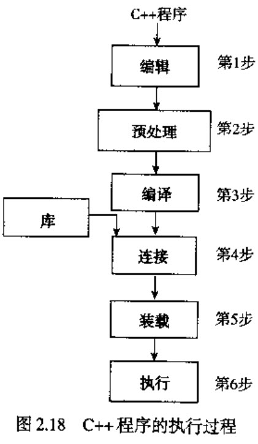

# 第二章 C++基础 #

## 2.1 C++程序基础 ##

## 2.2 数据类型 ##

1.简单数据类型
2.结构类型
3.指针类型

### 2.2.1 简单数据类型 ###

1.整型

2.浮点型

3.枚举型

### 2.2.2 浮点数据类型 ###
float：C++中float型数据
double：C++中double型数据用于

### 2.2.3 字符串数据类型 ###
字符串是由0个活多个字符组成的字符序列。

## 2.3 算术运算符及其优先级 ##

### 2.3.1 运算符优先级 ###

## 2.4 表达式 ##
cout << "Hello there.";
cout << endl << "My name is Goofy."

Hello there.
My name is Goofy.

## 2.8 预处理指令 ##
	
	#include <headerFileName>

### 2.8.1 cin和cout与名字空间 ###

	#include <iostream>
	using namespace std;
### 2.8.2 在程序中使用string数据类型 ###

	#include <string>

## 2.9 程序的风格和形式 ##
预处理指令和程序

### 2.9.1 main函数 ###

### 2.9.2 语法 ###

### 2.9.3 空格符的使用 ###

### 2.9.4 分号、大括号和逗号 ###

### 2.9.5 语义规则 ###

### 2.9.6 形式和风格 ###

### 2.9.7 说明文档 ###

## 2.10 其他赋值语句 ##

## 2.11 程序范例：长度转换 ##