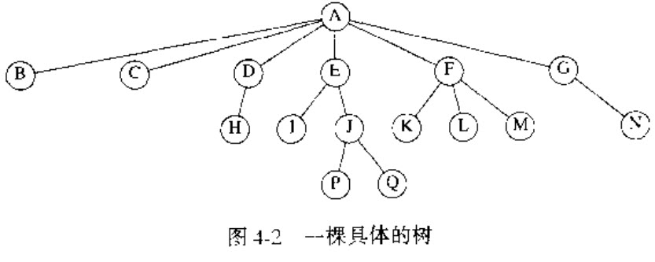

# 数据结构与算法分析：C语言描述 #

目录

# 第1章 引论 #

## 1.1 本书讨论的内容 ##

## 1.2 数学知识复习 ##

### 1.2.1 指数 ###

## 1.3 递归简论 ##

# 第2章 算法分析 #

# 第3章 表、栈和队列 #

## 3.1 抽象数据类型 ##

抽象数据类型（abstract data type,ADT）是一些操作的集合：抽象数据类型是数学的抽象：在ADT的定义中根本没涉及如何实现操作的集合，这可以看作模块化设计的扩充。

对诸如表、集合、图和它们的操作一起可以看作是抽象数据类型。对于集合ADT，可以有诸如并（union）、交（intersection）、测定大小（size）以及取余（complerment）等操作。

## 3.2 表ADT ##

* PrintList和MakeEmpty
* Find
* Insert和Delete
* FindKth

### 3.2.1 表的简单数组实现 ###

对表的所有操作都可以通过使用数组来实现。虽然数组是动态指定的，但是还是需要对表的大小的最大值进行估计。通常需要估计得大一些，从而会浪费大量得空间。

数据 插入和删除得花费是昂贵的O(N)d

### 3.2.2 链表 ###

为了执行PrintList(L)或Find(L, Key)，我们只要姜一个指针传递道该表的第一个元素，然后用Next指针穿越该表即可。

链表由一系列不必在内存中相连的结构组成。每一个结构均含有表元素和指向包含该元素后继元的结构的指针。我们称之为Next指针。最后一个单元的Next指针指向NULL；该值由C定义并且不能与其他指针混淆。

ANSI C 规定NULL为零

插入命令需要使用一次malloc调用从系统得到一个新单元并在后面执行两次指针调整。

### 3.2.3 程序设计细节 ###

表头（header）或哑结点（dummy node）。

### 3.2.4 常见的错误 ###

1. 初始化变量失败。

2. 何时使用或何时不使用malloc来获取一个新的单元。声明指向一个结构的指针并不创建该结构，而只是给出足够的空间容纳结构可能会使用的地址，创建尚未被声明过的记录的唯一方法是使用malloc库函数——malloc使系统创建一个新的结构并返回指向该结构的指针。

“memory access violation”或“segmentation violation”通常意味着有指针变量包含了伪地址。

1. p未定义，不可能指向内存的有效部分；p是NULL，则指向是非法的
2. 何时使用或何时不使用malloc来获取一个新的单元

在链表中进行一次删除之后，再将该单元释放通常是一个好的想法，特别时当存在大量的插入和删除掺杂再一起而内存会出现问题的时候。对于要被放弃的单元，应该需要一个临时的变量，因为在撤除指针的工作结束后，将不能再引用它。

	malloc(sizeof(PtrToNode)),但是它不给结构体分配足够的空间，只给指针分配一个空间

### 3.2.5 双链表 ###

1. 开销的是一个附加的链，增加了空间的需求，同时也使得插入和删除的开销增加一倍，因为有更多的指针需要定位。
2. 删除操作，因为不再被迫使用一个指向前驱元的指针来放问一个关键字。

### 3.2.6 循环链表 ###

让最后的单元反过来直指第一个单元。

### 3.2.7 例子 ###

#### 多项式ADT ####

#### 基础排序 ####

#### 多重表 ####

## 3.3 栈ADT ##

### 3.3.1 栈模型 ###

栈（stact）是限制插入和删除只能在一个位置上进行的表。

对栈的基本操作有Push（进栈）和Pop（出栈），前者相当于插入，后者则是删除最后插入的元素。栈有时又叫做LIFO（后进先出）表

创建一个空栈，我们只要建立一个头结点；MakeEmpty设置Next指针指向NULL。Push是作为向链表前端进行插入而实现的。其中，表的前端作为栈顶。Top的实施是通过考查表在第一个位置上的元素而完成的。最后Pop是通过删除表的前端的元素而实现的。

### 3.3.2 栈的实现 ###

栈的链表实现

栈的第一种实现方法是使用单链表。通过表顶端插入来实现Push，通过删除表顶端元素来实现Pop。Top操作只是考查表顶端元素并返回它的值。

### 3.3.3 应用 ###

## 3.4 队列ADT ##

队列（queue）也是表，使用队列时插入在一端进行而删除则在另一端进行。

### 3.4.1 队列模型 ###

队列的基本操作是Enqueue（入队），它是在表的末端（叫做队尾（rear））插入一个元素，还有Dequeue（出队），它是删除（或返回）在表的开头（叫做对头（front））

### 3.4.2 队列的数组实现 ###

### 3.4.3 队列的应用 ###

# 第4章 树 #

时间复杂度：O(log N)

二叉查找树（binary search tree）

## 4.1 预备知识 ##

每一棵子树的根叫做根r的儿子（child），而r是每一棵子树的根的父亲（parent）。

一棵树是一些节点的集合。这个集合可以是空集；若非空，则一棵树由称作根（root）的节点r以及0个或多个非空的（子）树T1，T2，...，Tk组成，这些子树种每一颗的根都被来自根r的一条有向的边（edge）所连接

节点A是根，节点F有一个父亲A并且有儿子K、L和M。每一个节点可以有任意多个儿子，也可能是零个儿子。没有儿子的节点称为树叶（leaf）；上图中的树叶是B、C、H、I、P、Q、K、L、M和N。具有相同的父亲的节点为兄弟（sibling）；因此，K、L和M都似乎兄弟。

### 4.1.1 树的实现 ###

### 4.1.2 树的遍历及应用 ###

先序遍历

后序遍历

## 4.2 二叉树 ##
二叉树（binary tree）是一棵树，其中每个节点都不能有多余两个的儿子。
### 4.2.1 实现 ###
在声明中，一个节点就是由key(关键字)信息加上两个指向其他节点的指针（Left和Right）组成的结构。
### 4.2.2 表达式树 ###

## 4.3 查找树ADT——二叉查找树 ##

### 4.3.1 MakeEmpty ###

初始化

### 4.3.2 Find ###

### 4.3.3 FindMin和FindMax ###

最小元和最大元的位置。

### 4.3.4 Insert ###

为了将X插入到树T中，可以像用Find那样沿着树查找。如果找到X，则什么也不用做（或做一些“更新”）。否则，将X插入到遍历的路径上的最后一点上。

### 4.3.5 Delete ###

## 第5章 散列 ##

散列表的实现常常叫做散列（hashing）散列是一种用于以常数平均时间执行插入、删除和查找的技术。

### 5.1 一般想法 ###

理想的散列表数据结构只不过是一个包含有关键字的具有固定大小的数组。

我们把表的大小记作TableSize，并将其理解为散列数据结构的一部分而不仅仅是浮动于全局的某个变量。每个关键字都被映射到从0到TableSize-1这个范围中的某个数，并且被放到适当的单元中（散列函数）。

* 理想情况下它应该运算简单并且应该保证任何两个不同的关键字映射到不同的单元。
* 但这是不可能的，因为单元的数目是有限的，而关键字实际上是用不完的。因此我们要寻找一个散列函数，该函数要在单元之间均匀分配关键字。

### 5.2 散列函数 ###

* 整数，保证表的大小是素数
* 字符串
	* 把字符串中的字符的ASCII码值加起来
	* 

解决的冲突的两种方法：

1. 分离链接法
2. 开放定址法

### 5.3 分离链接法 ###

分离链接法，将散列到同一个只的所有元素保留到一个表中，为方便起见，这些表都有表头。如果空间很紧，则更可取的方法是避免使用这些表头。

### 5.4 开放定址法 ###

#### 5.4.1 线性探测法 ####

## 第6章 优先队列（堆） ##

## 第7章 排序 ##

## 第8章 不相交集ADT ##

## 第9章 图论算法 ##

## 第10章 算法设计技巧 ##

## 第11章 摊还分析 ##

## 第12章 高级数据结构及其实现 ##

