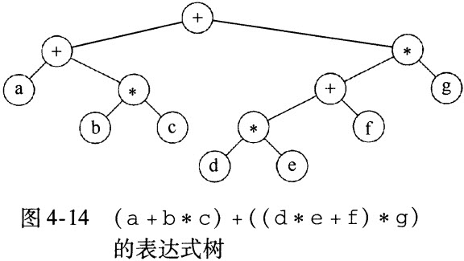

# 数据结构与算法分析 Java语言 #

第一部分 基础知识

# 第1章 导论 #

## 1.1 本书讨论内容 ##

## 1.2 数学知识复习 ##

## 1.3 递归简论 ##

## 1.4 实现泛型构件pre-Java5 ##

泛型机制（generic mechanism）

### 1.4.1 使用Object表示泛型 ###

### 1.4.2 基本类型的包装 ###

### 1.4.3 使用接口类型表示泛型 ###

只有在使用Object类中已有的那些方法能够表示所执行的操作的时候，才能使用Object作为泛型类型来工作。

### 1.4.4 数组类型的兼容性 ###

## 1.5 利用Java5泛型特性实现泛型构件 ##

### 1.5.1 简单的泛型类和接口 ###

### 1.5.2 自动装箱/拆箱 ###

### 1.5.3 菱形运算符 ###

### 1.5.4 带有限制的通配符 ###

## 1.6 函数对象 ##

## 小结 ##

## 练习 ##

# 第2章 算法分析 #

## 2.1 数学基础 ##

## 2.2 模型 ##

## 2.3 要分析的问题 ##

# 第3章 表、栈和队列 #

# 第4章 树 #

二叉查找树

* 看到树时如合用于实现几个流行的操作系统中的问及那系统的。
* 看到树如合能够用来计算算术表达式的值。
* 指出如合利用树支持以O（log N）平均时间进行的各种搜索操作，以及如合细化以得到最坏情况时间界O（log N）。我们还将讨论当数据被存放在磁盘上时如合来实现这些操作。
* 讨论并使用TreeSet类和TreeMap类

## 4.1 预备知识 ##

树（tree）有几种方式定义。定义树的一种自然的方式是递归的方式。一棵树是一些节点的集合。这个集合可以是空集；若不是空集，则树由称作根（root）的节点r以及0个或多个非空的（子）树

* 每一棵子树的根叫做根r的儿子（child）
* r是每一棵子树的根的父亲
* 没有儿子的节点称为树叶（leaf）
* 具有相同父亲的节点为兄弟（siblings）

* 从节点n1到nk的路径（path）定义为节点n1，n1，n1
* 对任意节点ni,ni的深度（depth）为从根到ni的唯一的路径的长。
* ni的高（height）是从ni到一片树叶的最长路径的长

### 4.1.1 树的实现 ###

	class TreeNode
	{
		Object element;
		TreeNode firstChild;
		TreeNode nextSibling;
	}

firstChild（第一个儿子）的链
nextSibling（下一兄弟）的链

### 4.1.2 树的遍历及应用 ###

递归方法listAll。

	private void listAll(int depth){
		printName(depth);
		if (isDirecotry())
			for each file c in this directory(for each child)
				c.listAll(depth + 1);
	}
	public void listAll() {
		listAll(0);
	}

先序遍历、后序遍历。

## 4.2 二叉树 ##

二叉树（binary tree）是一棵树，其中每个节点都不能有多于两个的儿子。

### 4.2.1 实现 ###

一个二叉树节点最多有两个子节点，所以保存直接链接到他们的链。树节点的声明在结构上类似于双链表的声明，在生命中，节点就是由element（元素）的信息加上其他节点的引用（left和right）组成的结构。

	class BinaryNode
	{
		Object element;
		BinaryNode left; //Left child
		BinaryNode right; Right child
	}

在画链表时使用矩形框画出二叉树，但是，树一般画成圆圈并用一些直线连接起来，因为它们实际上就是图（graph）

二叉树的主要用处之一是在编译器的设计领域。

### 4.2.2 例子：表达式树 ###

表达式树的树叶是操作数（operand），如常数或变量名，而其他的节点为操作符（operator）。

中序遍历
a+b*c+d*e+f*g
后序遍历
abc*+de*f*g++
先序遍历
++a*bc*+*defg

#### 构造表达式树 ####

TODO 

## 4.3 查找树ADT——二叉查找树 ##

### 4.3.1 contains方法 ###

使二叉树成为二叉查找树的性质是，对于树中的每个节点X，它的左子树中所有的项的值小于X中的项，而它的右子树中所有的项的值大于X中的项。

### 4.3.2 findMin方法和findMax方法 ###

## 4.4 AVL树 ##

AVL（Adelson-Velskii和Landis）树是带有平衡条件（balance condition）的二叉查找树。保证树的深度须是0。

一颗AVL树是其每个节点的左子树和右子树的高度最多差1的二叉查找树（空树的高度定义为-1）。

插入完成之前恢复平衡的性质，这可以通过对树进行简单的修正来做到的，称为旋转（rotation）

4.4.1 单旋转

4.4.2 双旋转	

## 4.5 伸展树 ##

## 4.6 再探树的遍历 ##

## 4.7 B树 ##

## 4.8 标准库中的集合与映射 ##

Collection API提供了两个附加容器Set和Map。

### 4.8.1 关于Set接口 ###

Set接口代表不允许重复元的Collection。

	Set<String> s = new TreeSet<>(new CaseInsensitiveCompare());
	s.add("Hello");
	s.add("Hello");
	System.out.println("The size is: " + s.size());

### 4.8.2 关于Map接口 ###

Map是一个接口，代表由关键字以及他们的值组成的一些项的集合。关键字必须是唯一的，但是若干关键字可以映射到一些相同的值。

### 4.8.3 TreeSet类和TreeMap类的实现 ###

TreeSet和TreeMap支持基本的add、removeh和contains操作以对数最坏情形时间完成。因此，基本的实现方法就是平衡二叉查找树。

一般不使用AVL树，而是经常使用一些自顶向下的红黑树。

实现TreeSet和TreeMap的一个重要的问题是提供对迭代器类的支持。

# 第5章 散列 #

## 5.1 一般想法 ##

