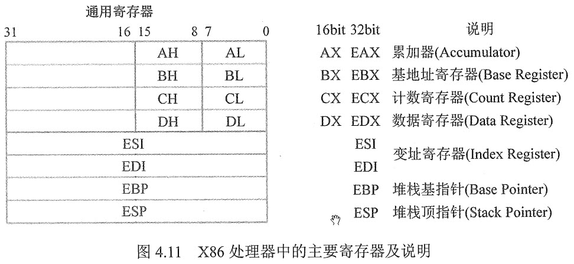

# wang #

## 第1章 计算机系统概述 ##

### 1.1 计算机发展历程 ###

#### 1.1.1 计算机硬件的发展 ####

### 1.4 本章小结 ###


## 第3章 存储系统 ##

在虚拟存储器中，页面是设置得大一些好还是设置小一些好？

### 3.1 存储器概述 ###

#### 3.1.1 存储器的分类 ####

**1. 按在计算机中的作用（层次）分类**

**2. 按存储介质分类**


**3. 按存取方式分类**

1. 随机存储器（RAM）。
2. 只读存储器（ROM）。
3. 串行访问存储器。

**4. 按信息的可保存性分类**

#### 3.1.2 存储器的性能指标 ####

存储器有3个主要性能指标，即存储容量、单位成本和存储速度。

1. 存储容量
2. 单位成本
3. 存储速度：数据传输率 = 数据的宽度/存储周期
	1. 存取时间
	2. 存取周期
	3. 主存宽带

### 3.2 存储器的层次化结构 ###

#### 3.2.1 多级存储系统 ####

多级存储器结构 => 解决存储系统大容量、高速度和低成本3个相互制约的矛盾

实际上，存储系统层次结构主要体现在“Cache-主存”层次和“主存-辅存”层次：
	* 前者主要解决CPU和主存速度不匹配的问题
	* 后者解决存储系统的容量问题

### 3.3 半导体随机存储器 ###

#### 3.3.1 SRAM和DRAM ####

**1. SRAM的工作原理**

通常把存放一个二进制位的物理器件称为存储元，存储器的最基本的构件。

**2. DRAM的工作原理**

DRAM电容上的电荷一般只维持1~2ms，因此即使电源不断电，信息也会自动消失。为此，每隔一定时间必须刷新，通常取2ms，这个时间称为刷新周期。常用的刷新周期方式有3中：其中刷新、分散刷新和异步刷新。

1. 集中刷新：指在一个刷新周期内，利用一段固定的时间，依次对存储器的所有行进行逐一再生，在此期间停止对存储器的读写操作，称为“死时间”，又称访存“死区”。
2. 分散刷新：把对每行的刷新分散到各个工作周期中。
3. 异步刷新：异步刷新是前两种方法的结合

**3. 存储器的读、写周期**

1. RAM的读周期
2. RAM的写周期

### 3.4 主存储器与CPU的连接 ###

#### 3.4.1 连接原理 ####

1. 主存储器通过数据总线、地址总线和控制总线与CPU连接。
2. 数据总线的位数与工作频率的乘积正比于数据传输率。
3. 地址总线的位数决定了可寻址的最大内存空间。
4. 控制总线（读/写）指出总线周期的类型和本次输入/输出操作完成的时刻。

#### 3.4.2 主存容量的扩展 ####

通常采用位扩展法、字扩展法和字节同时扩展法来扩展主存容量。

**1. 位扩展法**

**2. 字扩展法**

**3. 字位同时扩展法**

#### 3.4.3 存储芯片的地址分配和片选 ####

**1. 线选法**

线选法用除片内寻址的高位地址线直接（或经反相器）分别接至存储芯片的片选端，当某地址线信息为“0”时，就选中与之对应的存储芯片。

**2. 译码片选法**

译码片选法用除片内寻址外的高位地址线通过地址译码器芯片产生片选信号。如用8片8K*8位的存储芯片组成64K*8位存储器（地址线为16位，数据线为8位），需要8个片选信号；

#### 3.4.4 存储器与CPU的连接 ####

**1. 合理选择存储芯片**

**2. 地址线的连接**

存储芯片的容量不同，其地址线数也不同，而CPU的地址线数往往比存储芯片的地址线数要多。

**3. 数据线的连接**

CPU的数据线数与存储芯片的数据线数不一定相等，在相等时可直接相连；在不等时必须对存储芯片扩位，使其数据位数与CPU的数据线数相等。

**4. 读/写命令线的连接**

**5. 片选线的连接**

片选线的连接是CPU与存储芯片连接的关键。

### 3.6 高速缓冲存储器 ###

#### 3.6.1 程序访问的局部性原理 ####

程序访问的局部性原理包括时间局部性和空间局部性。

高速缓冲技术就是利用程序访问的局部性原理，把程序中正在使用的部分存放在一个高速的容量较小的Cache中，使CPU的访存操作大多数针对Cache进行，从而大大提高程序的执行速度。

局部性原理

#### 3.6.2 Cache的基本工作原理 ####

Cache位于存储器层次结构的顶层，通常由SRAM构成。

Cache和主存都被划为相等的块（便于Cache和主存之间交互信息），Cache块又称Cache行，每块由若干字节组成，块的长度称为块长（Cache行长）。

#### 3.6.3 Cache和主存的映射方式 ####

Cache行中的信息是主存中某个块的副本，*地址映射*是指把主存地址空间映射到Cache地址空间，即把存放在主存中的信息按照某种规则装入Cache。

**1. 直接映射**

主存中的每一块只能装入Cache中的唯一位置。

**2. 全相联映射**

主存中的每一块可以装入Cache中的任何位置

**3. 组相联映射**

将Cache空间分成大小相同的组，主存的一个数据块可以转入一组内的任何一个位置，即组间采取直接映射，而组内采取全相联映射。

#### 3.6.5 Cache写策略 ####

Cache中的内容是主存块副本，当对Cache中的内容进行更新时，就需选用写操作策略使Cache内容和主存内容保持一致

1. 全写法（write-through）
2. 写回法（write-back）

### 3.7 虚拟存储器 ###

#### 3.7.1 虚拟存储器的基本概念 ####

#### 3.7.2 页式虚拟存储器 ####

#### 3.7.3 加快地址转换：快表（TLB） ####

#### 3.7.4 段式虚拟存储器 ####

#### 3.7.5 段页式虚拟存储器 ####

#### 3.7.6 虚拟存储器与Cache的比较 ####

虚拟存储器与Cache：

**1. 相同之处**

1. 最终目标是为了提高系统性能，两者都有容量、速度、价格的梯度。
2. 都把数据划分为小信息块，并作为基本的传递单位，虚存系统的信息快更大。
3. 都有地址的映射、替换算法、更新策略等问题。
4. 依据程序的局部性原理应用“快速缓存的思想”，将活跃的数据放在相对高速的部件中。

**2. 不同之处**

1. Cache主要解决系统速度，而虚拟存储器却是为了解决主存容量。


### 3.8 本章小结 ###

1. 存储器的层次结构
2. 存取周期和存取时间
3. 在虚拟存取中，页面是设置得大一些好还是设置得小一些好

### 3.9 常见问题和易混淆知识点 ###

## 第4章 指令系统 ##

### 考试内容

1. 指令格式
   1. 指令的基本操作
   2. 定长操作码指令格式
   3. 扩展操作码指令格式
2. 指令的寻址方式
   1. 有效地址的概念
   2. 数据寻址和指令寻址
   3. 常见寻址方式
3. CISC和RISC的基本概念

### 4.1 指令格式

指令（又称机器指令）是指示计算机执行某种操作的命令，是计算机运行的最小功能单位。一台计算机的所有指令的集合构成该机的指令系统，也称指令集。指令系统是计算机的主要属性，位于硬件和软件的交界面上。

#### 4.1.1 指令的基本格式

一条指令就是机器语言的一个语句。一条指令通常包括操作码字段和地址码字段两部分：

* 操作码：指出指令中该指令应该执行什么性质的操作和具有何种功能。操作码是识别指令、了解指令功能及区分操作数地址内容的组成和使用方法等的关键信息。
* 地址码：给出被操作指令的信息（指令或数据）的地址，包括参加运算的一个或多个操作数所在的地址、运算结果的保存地址、程序的转移地址、被调用的子程序的入口地址等。

1. **零地址指令**

   只给出操作码OP，没有显式地址

   * 不需要操作数的指令。
   * 零地址的运算符指令仅用在堆栈计算机中。

2. 一地址指令

   * 只有目的操作数的单操作数指令，按A~1~地址读取操作数，进行OP操作后，结果存回原地址。指令含义：OP(A~1~)->A~1~
   * 隐含约定目的地址的双操作数指令，按指令地址A~1~可读取源操作数，指令可隐含约定另一个操作数由ACC（累加器）提供，运算结果也将存放在ACC中。
     指令含义：（ACC）OP(A~1~)->ACC

3. 二地址指令
   指令含义：（A~1~）OP(A~2~)->A~1~

4. 三地址指令

   指令含义：（A~1~）OP(A~2~)->A~3~

5. 四地址指令

   指令含义：（A~1~）OP(A~2~)->A~3~，A~4~=下一条将要执行指令的地址

#### 4.1.2 定长操作码指令格式

定长操作码指令在指令字的最高位部分分配固定的若干位（定长）表示操作码。一般n位操作码字段的指令系统最大能够表示2^n^条指令。

#### 4.1.3 扩展操作码指令格式

为了在指令字长有限的前提下扔保持比较丰富的指令种类，可采取可变长度操作码，即全部指令的操作码字段的位数不固定，且分散地放在指令字的不同位置上。

通常情况下，对使用频率较高的指令分配较短的操作码，对使用频率较低的指令分配较长的操作码，从而尽可能减少指令译码和分析的时间。

### 4.2 指令的寻址方式

寻址方式是指寻找指令或操作数有效地址的方式，即确定本条指令的数据地址及下一条待执行指令的地址的方法。寻址方式分为指令寻址和数据寻址两大类。

#### 4.2.1 指令寻址和数据寻址

1. **指令寻址**
   * 顺序寻址通过程序计数器（PC）加1（1个指令字长），自动形成下一条指令的地址。
   * 跳跃寻址通过转移类指令实现。所谓跳跃，是指下条指令的地址码不由程序计数器给出，而由本条指令给出下条指令地址的计算方式。跳跃地址分为绝对地址和相对地址。

2. **数据寻址**

   数据寻址是指如何在指令中表示一个操作数的地址，如何用这种表示得到操作数或怎样计算给出操作数的地址。

#### 4.2.2 常见的数据寻址方式

1. **隐含寻址**
  不明显给出操作数的地址，而在指令中隐含操作数的地址。隐含寻址的优点是有利于缩短指令字长；缺点是需增加存储操作数或隐含地址的硬件。

2. **立即（数）寻址**

   地址字段给出的不是操作数的地址，而是操作数本身，又称立即数。数据采用补码形式存放。立即寻址的优点是指令在执行阶段不访问主存，指令执行时间最短；缺点是A的位数限制了立即数的范围。

3. **直接寻址**

   指令中的形式地址A是操作数的真实地址EA，即EA=A。直接寻址的优点是简单，指令在执行阶段仅访问一次主存，不需要专门计算操作数的地址；缺点是A的位数决定了该指令操作数的寻址方式，操作数的地址不易修改。

4. **间接寻址**

   间接寻址是相对直接寻址而言，指令的地址字段给出的形式地址不是操作数的真正地址，而是操作数有效地址所在存储单元的地址，也就是操作数地址的地址，即EA=(A)。间接寻址可以是一次间接寻址，还可以是多次间接寻址。间接寻址的优点是可扩大寻址范围（有效地址EA的位数大于形式地址A的位数），便于编制程序（用间接寻址可方便地完成子程序返回）；缺点是指令在执行阶段要多次访存（一次间接寻址需两次访存，多次间接寻址需根据存储字的最高位确定访存次数）。一般问到扩大寻址范围时，通常指的是寄存器间接寻址。

5. **寄存器寻址**

   寄存器寻址是指在指令字只能给直接给出操作数所在的寄存器编号，即EA=R~i~，其操作数在由R~i~所指的寄存器内。寄存器寻址的优点是指令在执行阶段不访问主存，只访问寄存器，因寄存器数量较少，对应地址码长度较少，使得指令字短且因不用访存，所以执行速度快，支持向量/矩阵运算；缺点是寄存器价格昂贵，计算机中的寄存器个数有限。

6. **寄存器间接寻址**

   寄存器间接寻址是指在寄存器R~i~中给出的不是一个操作数，而是操作数所在主存单元的地址，即EA=(R~i~)。寄存器间接寻址的特点是，一般间接寻址相比速度更快，但指令的执行阶段需要访问主存（因为操作数在主存中）。

7. **相对寻址**

   相对寻址是把程序计数器（PC）的内容加上指令格式中的形式地址A而形成操作数的有效地址，即`EA=(PC)+A`，其中A是相对于当前指令地址的位移量，可正可负，补码表示。相对寻址的优点是操作数的地址不是固定的，它随PC值的变化而变化，且与指令地址之间总是相差一个固定值，因此便于程序浮动。相对寻址广泛应用于转移指令。

   PS.对于转移指令JMP A，当CPU从存储器中取出一字节时，会自动执行（PC）+1->PC。若转移指令的地址为X，且占2B，在取出该指令后，PC的值会增2，即（PC）=X+2，这样在执行完该指令后，会自动跳转到X+2+A的地址继续执行。

8. **基址寻址**

   基址寻址是指将CPU中基址寄存器（BR）的内存加上指令格式中的形式地址A而形成操作数的有效地址，即EA=（BR）+A。其中基址寄存器既可采用专用寄存器，又可采用通用寄存器。基址寄存器是面向操作系统的，其内容由操作系统或管理程序确定，主要用于解决程序逻辑空间与存储器物理空间的无关行。

9. **变址寻址**

   变址寻址是指有效地址EA等于指令字中的形式地址A与变址寄存器IX的内容之和，即EA=(IX)+A，其中IX为变址寄存器（专用），也可用通用寄存器作为变址寄存器。

10. 堆栈寻址

#### 4.2.3 X86汇编指令入门

1. **相关寄存器**

   X86处理器中有8个32位的通用寄存器。为了向后兼容，EAX、EBX、ECX和EDX的高两位字节和低两位字节可以独立使用，E为Extended，表示32位的寄存器。例如，EAX的低两位字节称为AX，而AX的高低字节又可分别作为两个8位寄存器，分别称为AH和AL。寄存器的名称和大小写无关。

   

   2. **寻址模式和内存分配**

      1. 寻址模式

         X86提供了一种灵活的内存寻址方式，以mov指令为例，mov用于在内存和寄存器之间移动数据，它有两个参数：第一个是目的地址，第二个是源地址。

         ```
         mov eax, [ebx]	;将ebx值指示的内存地址中的4字节传送到eax
         mov [var], ebx	;将ebx值传送到var的值指示的内存地址中
         mov eax, [esi-4];将esi-4值指示的内存地址中的4字节传送到eax
         mov [esi+eax], cl;将cl值传送到esi+eax值指示的内存地址中
         ```

         最多利用两个32位寄存器和一个32位的有符号常数相加计算出一个内存地址

      2. 数据类型长度规定

         在汇编语言中声明内存大小时，一般显式地使用DB（字母D表示Data，字母B表示Byte）、DW（字母W表示Word，2Bytes）和DD（第二个字母D表示Double Word，4Bytes）。对于 `mov [ebx], 2`若无特殊标识，则不确定常数2是单字节、双字节还是双字。对于这种情况，X86提供了三个指示规则标记，分别为BYTE PTR、WORD PTR、和DWORD PTR。

         `mov byte ptr [ebx], 2`，单字节

         `mov word ptr [ebx], 2`，双字节

         `mov dword ptr [ebx], 2`，四字节

      3. 常用指令

         汇编指令通常可以分为数据传送指令、逻辑计算指令和控制流指令。

         * <reg>：表示任意寄存器，若其后带有数字，则指定其位数。
         * <mem>：表示内存地址
         * <con>表示8位、16位或32位常数

         1. 数据传送指令

            **mov指令**，不能用于直接从内存复制到内存

            **push指令**

            **pop指令**

         2. 算术和逻辑运算指令

            add/sub指令

            inc/dec指令

            imul指令

            idiv指令

            and/or/xor指令

            not指令

            neg指令

            shl/shr指令

            jmp指令

            jcondition指令

            cmp指令

            call/ret指令

      ### 4.3 CISC和RISC的基本概念

      

      

