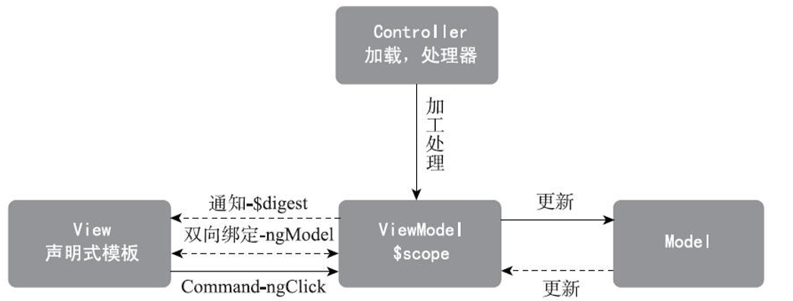

# AngualrJS深度剖析与最佳实践 #

## 第1章 从实战开始 ##

### 1.1 环境准备 ###

1. Node
2. cnpm
3. Java
4. IntelliJ
5. IntelliJ的AngularJS插件
6. Git
7. cygwin
8. 开发智能与API

### 1.2 需求分析与迭代计划 ###

https://github.com/ng-nice/code

1. 系统隐喻
2. 业务目标
3. 需求分析

### 1.3 创建项目 ###

#### 1.3.1 Yeoman ####

	cnpm install -g yo //yeoman
	cnpm install -g generator-gulp-angular@0.8.1 //angualr的项目模版
	cnpm install -g gulp bower
	
	yo gulp-angular@0.8.1

如果以前用过cnpm和npm，那么会出现一些版本不匹配的警告。这些一般不会导致，不过如果要去掉这些警告，那么可以用如下命令清除一些缓存，并重新安装：

	npm cache clean
	cnpm cache clean
	rm -fr node_modules
	cnpm install

#### 1.3.2 FrontJet ####

	cnpm install -g fj

1. 使用FrontJet创建项目

	mkdir ~/dev && cd ~/dev
	fj create BookForum

2. 启动开发服务器
3. 项目结构

### 1.4 实现第一个页面：注册 ###

#### 1.4.1 约定优于配置 ####

将reader称为controller，create称作action，中间还可以有一个id。

	/$controller/:id?/$action，其中的id字段是可以神略的，取决于具体的action。

拿到一个URL，如/reader/1/edit，其中reader是$controller，edit是$action，其模版为edit.html，控制器为edit.js，样式为edit.scss。

#### 1.4.2 定义路由 ####

	app/config.router.js

'use strict';声明此JavaScript为严格模式，以回避一些JavaScript的低级错误。

如果已经有UX（用户体验设计师）或BA（业务分析师）给出的原型图
，俺么建议从设计Model的数据结构开始，这样有助于更深入的理解Angular开发中最显著的特点：模型驱动。

#### 1.4.3 把后端程序跑起来 ####

Grails

#### 1.4.4 连接后端程序 ####

5000端口跑前端程序，在5080端口上跑着后端程序，并且通过FrontJet的反向代理功能把后端也代理到了5000端口下，从而避免了跨域。

#### 1.4.5 添加验证器 ####

数据验证

数据验证包括两个主题：一是定义验证规则，用于验证数据的有效性；二是显示验证结果，要把验证结果的结果用友好的方式显示给用户。

#### 1.4.6 “错误信息提示” ####

#### 14.7 用过滤器生成用户友好的提示信息 ####

#### 1.5.3 实现分页功能 ####

#### 1.5.6 实现“查看详情”功能 ####

### 1.6 实现AOP功能 ###

#### 1.6.1 实现登录功能 ####

传统登录

1. 浏览器访问一个网址。
2. 服务器判断这个网址是否需要登录才能访问。
3. 如果需要，则给浏览器回复一个Redirect头。
4. Redirect的地址是的呢公路也，地址中还带有一个登录成功后的回调地址。
5. 浏览器把登录页显示给用户，用户输入有效的用户名密码之后提交到服务器。
6. 服务器检查用户密码是否有效，如果有效则给浏览器回复Redirect头来跳转到回调地址。

Ajax登录

1. 前端发起一个请求。
2. 服务端判断这个网址是否需要登录才能访问。
3. 如果需要，则给前端发回一个状态嘛401（位认证身份，即：未登录）
4. 前端收到01状态码，则弹出一个对话框，提示用户输入用户名和密码。
5. 用户输入用户名和密码之后提交。
6. 前端发起一个登录请求，并等待登录成功。
7. 登录成功后，前端重新发送刚才被拒绝的请求。

优点：

* 把控制逻辑完全交给前端，后端只提供“纯业务API”就勾勒，这样钱后端的分工非常明确。
* 完全在当前页面中执行，不用多次加载页面用户操作非常顺畅。
* 在Promise机制的支持下，登录过程中对前端的应用逻辑可以是完全透明的（调用API的代码不需要区分中间是否发生过，也不需要对此做任何处理）。

## 第2章 概念介绍 ##

### 2.1 什么是UI ###

* 内容 Model
* 外观 View
* 交互 Controller

对应Angular中的概念，“静态内容”对应模版，“动态内容”对应Scope，交互对应Controller，外观部分略微复杂点：CSS决定样式，过滤器（filter）则决定格式。

### 2.2 模块 ###

所谓模块是指相关的一组编程元素（如类、函数、变量等）组织到同一个发布包。这些编程元素之间紧密协作，隐藏实现细节，只通过公开的接口与其他模块合作。

angular.module('com.ngice.app')：引用惩恶模块，查找一个名叫app的模块并返回其引用，如果模块不存在，则会触发一个异常[$injector:nomod]
angular.module('com.ngince.app', ['common'])：创建一个模块，并且声明这个模块依赖一个名为common 的模块，第二个参数是个数组，所以还可以声明依赖多个模块。

### 2.3 作用域 ###

使用了原型继承的方式，凡是上级scope拥有的属性，都可以从下级scope中读取，但是当需要对这些继承下来的属性进行写入的时候。问题来了：*写入会导致在下级scope上创建一个同名属性，而不是修改上级scope上的属性*。

Controller操作scope，View则展现scope的内容，传统前端程序中大量复杂的DOM操纵逻辑都被转变成scope的操作。

### 2.4 控制器 ###

Angular的控制器（controller）用来对模块（scope）进行操作，包括初始化数据和定义事件响应函数。

	angular.module('com.ngnice.app').controller('UserListCtrl', function() {......})；

其中：angular.module('com.ngnice.app')返回一个现有的module实例，而Controller就是这个module实例上的一个方法，作用是把后面的函数以UserListCtrl为名字，注册到模块中去，以便需要时可以根据名字找到他。

	var scope = $rootScope.$new();
	var ctrl = $controller('UserListCtrl');
	ctrl(scope);

其中的$controller是Angular提供的一个系统的服务，用以查找以前通过module.controller('UserListCtrl', function(){...});注册的控制函数
	
创建一个scope，找到一个控制器，然后用控制器对scope进行初始化，最后把scope绑定到视图，生成Live DOM渲染出来。生成Live DOM时涉及$compile。

### 2.5 视图 ###

Angular中实现的视图的主题是模版。最常见的模版形式当然是HTML，也有通过Jade等中间语言编译为HTML的。模版中包括静态信息和动态信息，静态信息是指直接写死（hard code）在模版中，而动态信息则是对scope中内容的展示。

展示动态信息的方式有两种：

* 绑定表达式：形式如{sername}，绑定表达式可以出现在HTML中的文本部分或节点的属性部分。
* 指令：形式如，事实上任何指令都可以用来展示动态信息，展示的方式取决于指令的内在实现逻辑。

PS不要在方法中返回一个新对象或者数组，否则会出现“10$digest iterations reached”。

Angular中信息对格式化的机制是过滤器（Filter），如：{irthday|date}。

### 2.6 指令 ###

指令（directive），相当于一个自定义的HTML元素，在Angular官方文档中称它为HTML语言的DSL（特定领域语言）扩展。

按照使用场景和作用可以分为两类类型的指令：组件型指令（Component）和装饰型器指令（Decorator）。

组件型指令主要是为了将复杂而庞大的View分离，使得页面的View具有更强的可读性和维护性，实现“高内聚低耦合”和“分离关注点”的有效手段；而装饰器型指令则是为DOM添加行为，使其具有某种能力，如自动聚焦（autoFocus）、双向绑定，可点击（ngClick）、条件显示/隐藏(ngShow/ngHide)等能力，同时它也是链接Model和View之间的桥梁，保持View和Model的同步。在Angular中内置的大多数指令，是属于装饰期型指令，他们负责收集和创建$watch，然后利用Angular的“脏检查机制”保持View的同步。

#### 2.6.1 组件型指令 ####

组件型指令是一个小型的、自封装的和内聚的一个中体，它包含业务所需要显示的视图以及交互的逻辑。

组件型指令应该是封装满足封装的自治性、内聚性的，它不应该直接引用当前页面的DOM结构

scope有三种取值：不指定（undefined）/false、true和一个哈希对象。

PS.拆除两个指令的直接目的不是为了复用，而是分离View，促进代码结构的优化。

	//声明一个指令
	angular.module('com.ngnice.app').directive('jobCategory', function() {
		return {
			//可以用作HTML元素，也可以用作HTML属性
			restrict: 'EA',
			//使用独立作用域
			scope: {
				configure: '='
			},
			//指定模板
			templateUrl: 'components/configure/tree.html',
			//声明指令的控制器
			controller: function JobCategoryCtrl($scope) {
				...
			}
		}
	}

指令中return，称之为“指令定义对象”。

restrict属性用来表示这个指令的应用放肆，取值可以是E（元素）、A（属性）、C（类名）、M（注释）

scope有三种取值：不指定（undefined）/false、true或一个哈希对象。

不指定或为false时，表示这个指令不需要新作用域。直接访问现有作用域上的属性或方法，也可以不访问作用域。如果同一节点上有新作用域或独立作用域指令，则直接法师用它，否则直接使用父级作用域。

#### 2.6.2 装饰器型指令 ####

	angular.module("com.ngince.app').directive('twTitle', 	function(){
			return {
				//用作属性
				restrict: 'A',
				link: function(scope, element, attrs){
					...
				}
			}
		}
	}

### 2.7 过滤器 ###

filter

	angular.module('com.ngnice.app').filter('myFilter', function(){
	    /* 这里可以用参数进行依赖注入 */
	    return function(input) {
	
	        var result;
	        //TODO：把input变换成result
	        return result;
	    };
	});

非常适合复用。

	filter出了可以用在绑定表达式之外，可以用在指令中通过值绑定的属性，如<li ng-repeat="item in items|filter: 'a'">....</li>

### 2.8 路由 ###

前端“路由”(router)的概念和后端的路由是一样的，也就是根据URL找到view-controller组合的机制。Angular的路由库合并在核心库中，现在，路由库从Angular核心库中剥离出来。官方的路由库称为ngRoute，由于其过于简陋，比较常用的是一个第三方路由库：angular-ui-router。

ngRoute的写法是：

	$routeProvider.when("/url", {
		templateUrl: 'path/to/template.html',
		controller: 'SomeCrl'
	});

angular-ui-router

	$stateProvider.state('name', {
		url: '/url',
		templateUrl: 'path/to/template.html',
		controller: 'SomeCrl'
	})

原理：监听$locationChangeSuccess事件，将在每次URL（包括#后面的hash部分）发生变化时触发。将根据$routeProvider/$stateProvider中注册的路由表中的URL部分查询其路由对象。
	
	{
		url: '/url',
		templateUrl: 'path/to/template.html',
		controller: 'SomeCtrl'
	}

* 创建一个scope对象。
* 加载模板，借助浏览器的能力把它解析为静态DOM。
* 使用Controller对scope进行初始化，添加属性和方法。
* 使用$compile服务把刚才生成的DOM和scope关联起来，变成一个Live DOM。
* 用这个Live DOM替换成ng-view/ui-view中的所有内容

### 2.9 服务 ###

服务是对公共代码的抽象，比如，如果在多个控制器中都出现了相似的代码，那么把它们提取出来，封装成一个服务，将更加遵循DRY原则（即：不要重复）

* 常量（Constant）：用于声明不会被修改的值。
* 变量（Value）：用于声明会被修改的值。
* 服务（Service）：声明一个类，等待Angular把它new出来，然后保存这个实例，供它到处注入。
* 工厂（Factory）：跟“服务”不同，不会被new出来，Angular会调用这个函数，获得返回值，然后保存这个返回值，供他到处注入。
* 供应商（Provider）：更加灵活，对规格进行配置，以便获得定制化的产品

除了Constant外，所有类型的服务，背后都是通过Provider实现的，可以看作让Provider更容易写的语法糖。一个明显的佐证是：当使用一个未定义的服务时，Angular给你的错误提示是它对应的Provier未找到，比如我们使用一个未定义的服务：test，那么Angular给出的提示是：Unknown provider：testProvider<-test。

#### 2.9.1 服务 ####

	angular.module('com.xjsaber.angular').service('greeting', function() {
		this.sayHello = function(name) {
			return 'Hello, ' + name;
		};
	});

等价于：

	angular.module('com.xjsaber.angular').provider('greeting', function() {
		this.$get = function() {
			var Greeting = function(){
				this.sayHello = function(name){
					return 'Hello,' + name;
				};
			};
			return new Greeting();
		}
	};

使用时：

	angualr.module('com.xjsaber.angular').controller('SomeCtrl', functon($scope, greeting) {
		$scope.message = greeting.sayHello('world');
	});

#### 2.9.2 工厂 ####

	angular.module('com.xjsaber.angular').factory('greeting', function() {
		return 'Hello, world';
	});

等价于：

	angular.module('com.xjsaber.angular').provider('greeting', function() {
		this.$get = function(){
			var greeting = function(){
				return 'Hellom world';
			}
			return greeting();
		}
	});

使用时：

	angualr.module('com.xjsaber.angular').controller('someCtrl', functon($scope, greeting) {
		$scope.message = greeting;
	});

在Angular源码中，实现的是这样的：

	function factory(name, factoryFn) {
		return provider(name, {$get: factoryFn});}
		function service(name, construcotr) {
			return $injectort.instantiate(constructor);
		}
	}

Angular提供多种形式的服务：

1. 需要全局的可配置参数？用Provider。
2. 是纯数据，没有行为？用Value。
3. 只new一次，不用参数？用Service。
4. 拿到类，自己new出实例？用Factory。
5. 拿到函数，自己调用？用Factory。

更加敏捷的方法：

1. 纯数据时，先用Value；当发现需要添加行为时，改写为Service；或当发现需要通过计算给出结果时，改写为Factory；当发现需要进行全局配置时，改写为Provider。

|类型|Factory|Service|Value|Constant|Provider|
|--|--|--|--|--|
|可以依赖其他服务|是|是|否|否|是|
|使用类型友好的注入|否|是|是|是|否|
|在config阶段可用|否|否|否|是|是|
|可用于创建函数/原生对象|是|否|是|是|是|

* 可以依赖其他服务：由于Value和Constant的特殊声明形式，显然没有进行依赖注入的时机。
* 使用类型友好的注入：由于Factory可以根据逻辑返回不同的数据类型，所以我们无法推断其结果是什么类型，也就是对类型不够友好。Provider由于其灵活性比Factory更高，因此在类型友好性上和Factory是一样的。
* 在config阶段可用：只有Constant和Provider类型在config阶段可用，其他都是Provider实例化之后的结果，所以只有config阶段完成后才可用。

可用于创建函数/原生对象：由于Service是new出来的，所以其结果必然是类实例，也就无法直接返回一个可供调用的函数或数字等原生对象。

### 2.10 承诺 ###

Promise全称是Futures and promises（未来与承若）

流行的库叫做Q（https://github.com/kriskowal/q）。而Angular的$q就是从它引入的。

**1. 生活中的一个例子**

Promise解决的是异步编程的问题。

**2. 回调地狱和Promise**

Promise在任何时刻都处于以下三种状态之一：未完成（pending）、已完成（resolved）和拒绝（rejected）三个状态。以CommonJS Promise/A标准为例，Promise对象上的then方法负责添加针对已完成和拒绝状态下的处理函数。then方法会返回一个Promise对象，以便于形成Promise管道，这种返回Promise对象的方式能够让开发人员把异步操作串联起来，如then(resolvedHandler，rejectedHandler)。resolvedHandler回调函数在Promise对象进入完成状态时会触发，并传递结果；rejectedHandler函数会在拒绝状态下调用。

	async1().then(async2).then(async3).catch(showError);

**3. Angular中的Promise**

Promise，最简单的是$timeout的实现。

	function timeout(fn, delay, invokeApply) {
		//创建一个延期请求
		var deferred = $q.defer(),
			promise = deferred.promise,
			skipApply = (isDefined(invokeApply) && !invokeApply),
			timeoutId;
			timeoutId = $browser.defer(function(){
				try {
					//成功，将触发then的第一个回调函数
					deferred.resolve(fn());
				} catch(e) {
					//失败，将触发then的第二个回调函数或catch的回调函数
					deferred.reject(e);
					$exceptionHandler(e);
				} finally{
					delete deferreds[promise.$$timeoutId];
				}
				if (!skipApply)$rootScope.$apply();
			}, delay);
			promise.$$timeoutId = timeoutId;
			deferreds[timeoutId] = deferred;
			//返回承诺
			reutrn promise;
	}
	timeout.cancel = function(promise){
		if(promise && promise.$$timeoutId in deferreds){
			deferreds[promise.$$timeoutId].reject('canceled');
			delete deferreds[promise.$$timetoutId];
			return $browser.defer.cancel(promise.$$timeoutId);
		}
		return false;
	}

### 2.11 消息 ###

消息（message）机制非常有用，特别是消息冒泡机制，让我们不用额外的代码可以实现“职责链”模式。

* $broadcast(name, args):向当前scope及其所有下级scope递归广播名为name的消息，并带上args参数。
* $emit(name, args):向当前scope及其所有直线上级scope发送名为name的消息，并带上args参数。
* $on(name. listener):监听本scope收到的消息，listener的形式为：function(event, args){}, event参数的结构和DOM中的event类似。

当rootScope上调用$broadcast广播一个消息时，任何一个scope（包括rootScope）上通过$on注册的listener都将收到这个消息。当scope1上调用$broatcast广播一个消息时，scope1/scope1.1/scope1.2将依次收到这个消息。当我们在rootScope上调用$emit上传一个消息时，rootScope将收到这个消息。当我们在scope1.1上调用$emit上传一个消息时，scope1.1/scope1/rootScope将依次收到这个消息。

当通过$emit上传一个消息时，将使用冒泡机制，比如，假设我们在scope1.1调用$emit，我们在scope1上注册一个listener

	scope1.$on('name', funcction(event)) {
		event.stopPropagation();
	}

scope1.1和scope1都将正常收到这个消息，但rootScope就接收不到这个消息了。

这个stopPropagation函数将阻止冒泡，也就是说scope1.1和scope1都将正常收到这个消息，但srootScope就接收到这个消息了。

当一个前套结构具有树形的业务含义时，优先使用消息机制来通讯。或者从另一个角度，符合“职责链”模式的适用场景时，消息机制比较合适。反之，应该使用普通的回调函数。

### 2.12 单元测试 ###

#### 2.12.1 MOCK的使用方式 ####

Mock一个普通对象不需要进行特别处理。比如，如果一个测试函数需要访问scope中的一个变量：name，但不用访问$watch等scope的特有函数，那么传入一个普通的哈希对象{name: 'someName'}即可，并不需要new出scope来。

* 网络的不稳定性
* 网络响应的速度会拖慢整体速度。
* 网络的异步性

Angular对网络和定时器等进行封装，变成了$http、$timeout、$interval等服务。

#### 2.12.2 测试工具与断言库 ####

Test Runner

Karma

jasmine

### 2.13 端到端测试 ###

protractor

端到端测试（e2e test）， 也称为场景测试。

* 用户打开http://xxx地址。
* 在搜索框中输入了abc。
* 然后点击其后的搜索按钮。

1. 去看 HomePage.js
2. 去看 demoSpec.js

## 第3章 背后的原理 ##

### 3.1 Angular中的MVVM模式 ###

$scope对象可以看做是被Controller函数装饰的ViewModel。而Controller则是装饰、加工处理这个ViewModel的JavaScript函数。

MVVM模式是Model-View-ViewModel（模型-视图-视图模型）模式的简称，MVVM模式利用框架内置的双向绑定技术对MVP（Model-View-Presenter）模式变型，引入了专门的ViewModel（视图模型）来“粘合”View和Model，让View和Model进一步分离和解耦。

* 低耦合：View可以独立于Model变化和修改，同一个ViewModel可以被多个View复用；并且可以做到View和Model的变化互不影响。
* 可重用性：可以把一些视图的逻辑放在ViewModel，让多个View复用。
* 独立开发：开发人员可以专注于业务逻辑和数据的开放（ViewModel），界面设计人员可以专注于UI（View）的设计
* 可测试性：清晰的View分层，使得针对表现层业务逻辑的测试更容易，更简单。

* View：专注于界面的显示和渲染，在Angular中则是包含一堆声明式Directive的视图模板。
* ViewModel：它是View和Model的粘合体，负责View和Model的交互与协作，它负责给View提供显示的数据，以及供View操作Model的途径。在Angular中$scope对象充当了这个ViewModel的角色，ViewModel上有两种不同来源的数据：一种是展示信息的业务数据，另一种是描述交互的派生数据，如：表格上的复选框，如果点击“全选”则会选中所有列表中的复选框，在这里就需要一个类似“isSelectAll”的派生数据被放置在ViewModel上。
* Model：它是与业务逻辑相关的数据封装载体，也就是领域对象。Model不应该包含任何与界面显示有关的逻辑。在Web页面中，大部分Model都是来自Ajax的服务端返回数据或者全局配置对象。Angular中的Service正是封装和处理这些与Model相关的业务逻辑的最佳方式，这些领域对象可以被Controller或其他Service复用。
* Controller：这并不是MVVM模式中的核心元素，但它负责ViewModel对象的初始化。它将调用一个或者多个Service来获取领域对象，并把结果放在ViewModel对象上。这样，应用界面在启动加载时候，可以达到一种最初的可用状态。它还可以在ViewModel上加入用于描述交互的行为函数，如用于响应ng-click事件的"addItemTOShopCar();"等

View不能直接与Mode交互，而是通过$scope这个ViewModel来实现与Model的交互。

**1. 绝不要先设计你的页面，然后用DOM操作去改变它。**

jQuery: 首先设计页面DOM结构，然后再利用jQuery来改变DOM结构或者实现动态交互效果。对于负责交互逻辑的项目，JavaScript代码会变得越来越臃肿，让交互逻辑分散到各处。

Angular：拥有或者需要怎么样的Model数据，然后设计交互数据和交互逻辑，最后采取实现视图，并用$scope来粘合他们。

**2. 指令不是封装jQuery代码的“天堂”**

封装到Angular的指令中

$scope.$apply()来通知angular你的ViewModel已经改编了，需要启动“脏检查机制”来更新你的改变的View。

#### 3.2 Angular启动过程 ####

**3. Angular启动过程**

1. 浏览器下载HTML/CSS/JavaScript等

下载HTML文件，开启了辅助线程下载所关联到的其他文件。

2. 浏览器开始构建DOM树

在下载文件的同时，浏览器就会开始构建DOM树。

3. jQuery初始化

引入脚本中有一个是jQuery（或内嵌在Angular.js中的jQLite），它的启动代码会给自己挂接上document对象的DOMContentLoaded事件，通过调用jQuery.ready(callback)把一个回调函数注册到这个事件。但是这个回调函数的代码还要等一会才会执行，在此之前，还有更多的脚本需要加载。

	angular.element('selector') === $('selector')

4. Angular初始化

1. 按名字创建一个模块，所谓的模块就是一个对象，它是其他Angular对象的注册表。
2. 在这个模块中注册各种Angular对象，如Controller、Service、Directive。常见的myModule.controller('xxx', ...)其实就是$controllerProvider.register的快捷方式；myModule.service('xxx',...)就是$provier.service的快捷方式。

在这个模块中注册“config回调函数”，它将在模块刚刚被初始化时执行。
在这个模块中注册“run回调函数”，它将在模块初始化完毕时执行。

5. jQuery启动

等到页面及其直接引用的js文件都下载完毕时，DOM也构建完毕了。

6. Angular启动

Angular及其子模块（module），也包括程序和第三方模块。

各种Angular模块的初始化过程。

各种Angular模块的初始化过程大致相同

Angular的自动启动方式，只会启用第一个ng-app的module。对于多个ng-app启动方式，必须采用手动angular-bootstrap方式来启动。

7. 加载子模块

在Angular把模块和DOM节点关联起来之前，这些DOM是“死”的，它们和数据模型之间还没有建立任何关联，因此无法反应数据模型的变动。前面都是准备工作，到了这一步才会开始把它们变成“活”的——具有双向绑定功能，能展示数据，能响应事件等等。

在这个阶段，Angular会首先创建一个注入器（injector），并且把它关联到所在节点上。我们在前面注册那一堆Angular对象，都需要通过注入器才能被其他代码使用。接下来，会对当前节点所关联的模块，以及它所依赖的模块进行初始化。这时候，前面注册的所有“config回调函数”都会被顺序执行。

注意，前面注册的大多数的对象都尚未就绪，因此不能使用。在config回调函数能够使用的只有注册的常量（Constant）对象和Provider类。这个阶段也是程序中唯一可以直接访问Provider类对服务进行配置的地方。比如路由服务的Provider就是在这个阶段进行初始化，但是只负责记录一个URL到“模板/控制器”组的映射表，供后面的步骤使用。

8. 启动子模块

模块加载完毕之后，会执行所有的“run回调函数”，在这个阶段，各种Angular对象都可以使用了，包括各种Service、Factory等。接下来，路由模块会获得控制权，使用$location服务解析当前页面的URL，然后根据这个URl查找相应的“模板/控制器”对，来准备渲染一个页面。

9. 渲染页面

路由模块会先创建一个Scope对象，并且加载模板，加载完毕后吧它的额内容传给$compile对象。$compile会先把它解析成一个静态DOM树，然后逐个扫描这棵DOM树中的指令，通过这些指令把Scope对象和DOM树关联起来，包括渲染内容的函数和进行事件处理的函数。最后用它替换一个特定的指令所在的节点，在angular-ui-router中则是带有ui-view的节点。

10. 数据绑定与摘要循环

Angular会给每一个Scope成员变量求出一个摘要值（能够唯一标识一个变量），并在保存在一个变量中。当调用Scope对象的$digest/$apply方法的时候，会重新算一遍摘要值，只要数据变化

当调用Scope对象的$digest/$apply方法的时候，会重新算一遍摘要值，只要数据变化变化，就会更新界面。

### 3.3 依赖注入 ###

依赖注入的英文呢是Dependency Injection，简称DI。

#### 3.3.1 什么是依赖注入 ####

**1. 自己创建它**

需要一系列参数，可能还需要这样、那样的初始化操作，甚至可能还需要创建它的相关的对象，相关对象的相关的对象。

这种方法无法适应复杂的对象，随着对象的复杂化，自己动手丰衣足食已经不再是好的选择。

**2. 使用者从全局注册表查阅它**

对象的实现者自己负责创建对象，然后对象注册到某个全局注册表，需要它的时候，就去注册表根据名字或者其他特征（比如强类型语言中的类名）查询：obj=globalRegistry.get(objectId)。

全局变量是单元测试的魔鬼，因为会让各个“单元”互相耦合在一起，那将是单元测试的噩梦。

**3. 衣来伸手，饭来张口**

在函数的参数中声明。目前Angular所采用的反射光hi是函数的参数形式，和一种特殊的Annotation形式来防止代码压缩过程破坏参数名。而Angular2.0中会使用新的语言特性强化Annotation的方式。

#### 3.3.2 如何在JavaScript中实现DI ####

	// giveMe函数声明了一个叫config的参数，希望容器根据这个名字找到同名对象，并且注入进来
	var giveMe = function(config){
	    //经过注入后，此处config的内容为{delay: 1}
	    //跟registry中保存的是同一个实例
	};
	//注册表，这里保存了可注入对象，包括一个名为config的对象
	var registry = {
	    config: {
	        delay: 1
	    }
	}
	// 注入函数
	var inject = function(func, thisForFunc){
		// 获取func的源码，这样我们才能知道func需要什么参数
	    var sourceCode = func.toString();
		// 用正则表达式解析源码
	    var matcher = sourceCode.match(); //正则表达式有些复杂，省略
		// 从matcher中解析出各个参数的名称，解析过程省略
	    var objects = [];
		// 准备调用func时用的参数表
	    for (var i = 0; i < objectIds.length; i++){
	        var objectName = objectIds[i];
			// 根据对象名称查阅出相应的对象
	        var object = registry[objectName];
			// 放到数组中准备作为参数传过去
	        objects.push(object);
	    }
		// 通过apply调用func函数，并且把参数表传过去
	    func.apply(thisForFunc || func, objects);
	};

使用时调用inject(giveMe)或inject(giveMe, anotherThis)即可。

#### 3.3.3 Angular中的DI ####

在Angular中，所有编程元素都需要通过某种方式注册进去，比如myModule.service('serviceName', function() ...)实际上就是把后面的这个函数加入到一个容器中，并且命名为serviceName。

Angular全面实现了延迟初始化（当这个对象没有被别人需要的时候，是不会被创建的——提高性能有一定的帮助，加快了启动速度）。

#### 3.3.4 DI与minify ####

minify

ngAnnotate(原名ngMin)，找到代码中的controller等定义，然后把它修改为annotation的形式。比较完善的Angular工具链，在build过程中，都会先调用ngAnnotate工具，然后再进行minify。

### 3.4 赃检查机制 ###

“脏检查”是Angular中的核心机制之一，实现双向绑定、MVVM模式的重要基础。

Angular将双向绑定转换为一堆watch表达式，然后递归检查这些watch表达式的结果是否变了，如果变了，则执行相应的watcher函数。等到Model的值不再变化，也就不会再有watcher函数被触发，一个完整的digest循环就结束了。这时，浏览器就会重新渲染DOM来体现model的改变。

#### 3.4.1 浏览器事件循环和Angular的MVW ####

JavaScript是靠事件循环工作的。浏览器中存在一个事件循环池，它被设计成一个无限循环以保持执行过程的可用，等待事件（例如layout、paint、用户点击事件、交互控件的键盘事件等）并执行它们。

来自浏览者或者键盘等外设的事件，都会放入事件队列中，然后会依次被单线程的Event Loop（事件循环）分派给相应的事件回调处理，最后浏览器更新DOM状态。

Angular中在View上声明的事件指令，如：ngClick、ngChange等，会将浏览器的事件转发给$scope这个ViewModel的响应函数。等待响应函数中改变Model，紧接着就会触发“脏检查机制”刷新View。

$rootScope对象是Angular中所有$scope对象的祖先。所有的$scope都是直接或者间接利用$rootScope提供的$new方法创建的。它们都从$rootScope中继承了$new、$watch、$watchGroup、$watchCollection、$digest、$destory、$eval、$evalAsync、$apply、$on、$emit、$broadcast等方法，并且有$id、$parent这两个属性。

#### 3.4.2 Angular中的$watch函数 ####

大部分指令都会依赖watcher函数来监听Model的改变，以更新View的显示，它是Angular中“脏检查机制”的核心之一。

	$watch: function(watchExp, listener, objectEquality){
        var scope = this,
        get = compileToFn(watchExp, 'watch'),
        array = scope.$$watchers,
        watcher = {
            // 监听函数
            fn : listener,
            // 上次的值
            last: initWatchVal,
            // 获取监听表达式的值
            get: get,
            // 监听表达式
            exp: watchExp,
            // 是否需要深度比对
            eq: !! objectEquality
        };
        lastDirtyWatch = null;

        if (!array){
            array = scope.$$watchers = [];
        }
        array.unshift(watcher);
        return function deregisterWatch() {
            arrayRemove(array, watcher);
            lastDirtyWarch = null;
        }
    }

每一个watcher对象都包括：监听函数fn、上次变化的值（刚开始为初始值）last、获取监听表达式值的方法get、监听表达式exp，以及是否需要使用深度比对eq。

watch表达式很灵活：可以是一个函数，可以是$scope上的一个属性名，也可以是一个字符串形式的表达式。$scope上的属性名或表达式，最终仍会被$parse服务解析为响应的获取属性值的函数。

$watch函数会返回一个反注册函数，一旦调用它，就可以移除刚才注册的watcher。

Angular默认是不会使用angular.equals()函数进行深度比较，因为使用===比较会更快，所以，它对数组或者Object进行比较时检查是引用。这就导致内容完全相同的两个表达式被判定会不同。如果需要进行深度比较，第三个可选参数objectEquality，需要显式设置为ture，如$watch('someExp', function() {...}, true)。

Angular还提供了$watchGroup、$watchCollection方法来监听数组或者是一组属性。

#### 3.4.3 Angular的$digest函数 ####

当接受View的事件指令所转发的事件时，就会切换到Angular的上下文环境，来响应这类事件，$digest循环就会触发。

$digest循环发生包括两个while循环，它们分别是：处理$evalAsync的异步运算队列，处理$watch的watchers队列。

当$digest循环发生的时候，会遍历当前$scope及其所有子$scope上已注册的所有watchers函数。

遍历一遍所有watcher函数称为一轮脏检查。执行完一轮脏检查，如果任何一个watcher所监听的值改变过，那么就会重新再进行一轮脏检查，直到所有的watcher函数都报告其监听的值不再变了。

从第一轮脏检查到结果变得稳定，这个过程就是一个完整的$digest循环。当$digest循环结束时，才把模型的变化结果更新到DOM中去。这样可以合并多个更新，防止频繁的DOM操作。

PS.在$digest循环结束之前，如果超过10轮“脏数据机制”，就会抛出一个异常，以防止脏检查无限循环下去。

每一个进入Angular的上下文环境，都会执行一次$digest循环。对于ngModel监听的表单交互空间来说，每输入一个字符，就会触发一次循环来检查watcher函数，以便及时更新View。

#### 3.4.4 Angular中的$apply ####

$digest是一个内部函数，正常的应用代码中是不应该直接调用它的。要想主动触发它，就要调用scope.$apply函数，它是触发Angular“脏检查机制”的常用公开接口。

设置$$phase为$apply阶段，并利用$scope.$eval方法来执行传入的Angular表达式，更新Model或者是ViewModel的值；然而不管执行是成功还是失败，它被try、catch、finally包裹了，都会进入Angular的$digest方法中。

Angular只能管理它所已知的行为触发方法。

## 3.5 指令的生命周期 ##

指令（Directive）是Angular中提出的新概念，它为HTML提供了DSL（特定领域语言）的扩展语法。

指令是Angular中学习难度最大的概念之一。在Angular中，一个指令从开始解析到生效，一共会经历Inject、Compile、Controller加载、pre-link、post-link这几个主要阶段。

	angular.module('com.xjsaber.angular').direcrive('directiveLife', function($log){
		
	})

### 3.5.1 Injecting ###

在Angular第一次使用这个指令之前，会先调用注入函数来获取它依赖的服务。这个过程，最多就会发生一次，是在首次解析这个指令的时候。

Injecting function directiveLife这个必报中是所有directiveLife指令共享的作用域，设置Directive的默认配置等信息。

Angular中所有的Service也是全局共享。可以尝试将这类配置信息抽取到一个Constant中，然后在指令中注入该Contant，还可以在Angular的config阶段对默认配置信息做定制。

单个Directive注册，以名称和directiveFactory两个对象为参数；另一种，则是以Object对象key/value为参数注册多个Directive：这里key为Directive的名称，value为directiveFactory。

把指令的定义变量hasDirectives[name]的值初始化为一个空数组。这意味着Angular是可以声明多个同名Directive的，按照注册和解析顺序，以及标注的优先级来逐个执行。事实上，Anuglar对input元素的重写，就是利用这种机制完成的。

### 3.5.2 compile和link过程 ###

Angular接下来就会调用指令的compile函数，这个函数是会在每一个指令被实例化时执行一次。它的传入参数有两个，原始的DOM元素节点和它所包含的Attribute的信息。

需要注意是的是在这里传入的DOM节点只是初始声明的节点，还没有被link过。所以在这里虽然我们可以检查DOM的信息，或者将被执行的表达式字符串，但我们无法访问指令的$scope对象，也无法获得表达式的确定值。

## 3.6 Angular的$parse、$eval和$observe、$watch ##

### 3.6.1 $parse和$eval ###

解析/计算Angular表达式的值。

$parse是一个独立服务，可以在任意地方注入后使用，返回一个函数，需要显式地把表达式求值的上下文传给这个函数；而$eval则是scope对象上的API，已经隐式地指定了表达式的求值上下文为所在的scope对象，传入参数之后会返回计算结果。

	$eval: function(expr, locals) {
		return $parse(expr)(this, locals);
	}

$eval是为了让$parse在scope中更方便使用而设计的语法糖。

### 3.6.2 $observe和$watch ###

$observe和$watch这两个函数都可以用来监听值的变化，但是有显著的不同。

$observe是用来监听DOM中属性值变化的，而$watch则是用来监听scope中属性值变化的。

	$observe: function(key, fn){
		$observers = (attrs.$$observers || (attrs.&&observers = {})),
		listeners = (($$observers[key]||($$observers[key] = []));
		listeners.push(fn);
		$rootSCope.$evalAsync(function() {
			if (!listeners.$$inter) {
				fn(attrs[key]);
			}
		});
	}

### 3.6.3 使用场景 ###

关于独立scope声明中的“@”、“&”、“=”，三种形式。

## 3.7 REST ##

### 3.7.1 REST的六大要点 ###

# 第4章 最佳实践 #

## 4.1 调整开发写作流程 ##

## 4.2 前后端分离部署 ##

Nginx

	http {
		...
		server {
			listen 80;
			server_name your.domain.name;
			location / {
				root /var/www/yourDocRoot/;
				index index.html index.htm;
			}
			location /api/ {
				proxy_set_header Host $http_host;
				proxy_pass http://another.domain.name:8080/api/;
			}
		}
	}

cookie path机制，即让http://localhost/api和http://localhost/api2的cookie不能互相访问，如果把/api/的请求转发到/api2/下，由于cookie path不互通，提供proxy_cookie_path来解决问题。

## 4.3 样式中心页 ##

## 4.4 CSS的扩展语言与架构 ##

## 4.5 HTML的表意性 ##

## 4.6 table，天使还是魔鬼 ##

## 4.7 测试什么？怎么测 ##

对Filter和Service进行覆盖式测试。

### 4.7.1 准备工作 ###

### 4.7.2 如何测试Controller ###

Controller的作用是对Scope进行初始化：赋予数据，赋予行为。

### 4.7.3 如何测试Service ###

### 4.7.4 如何测试Filter ###

	//获取uppercase过滤器
	var uppercaseFilter = $filter('uppercase');//对于只需要注入一个Filter时，则也可以直接Inject uppercaseFilter服务
	//用abc作为参数调用uppercaseFilter函数，应该得到ABC
	expect(uppercaseFilter('abc').toEqual('ABC'));

### 4.7.5 如何测试组件型指令 ###

### 4.7.6 如何测试装饰器型指令 ###

### 4.7.7 如何测试网络请求 ###

### 4.7.8 如何测试setTimeout类功能 ###

### 4.7.9 如何Mock Service ###

## 4.8 如何设计友好的REST API ##

### 4.8.1 URI ###

### 4.8.2 资源拆分 ###

### 4.8.3 资源命名 ###

### 4.8.6 综合案例：分页API ###

其实位置+条数

### 4.10.2 其他指令中的watchers函数 ###

### 4.10.3 慎用$watch和及时销毁 ###

$scope.$watch函数函数的返回值就是用于释放这个watcher的函数。

### 4.10.4 one-time绑定 ###

### 4.10.5 滚屏加载 ###

### 4.10.6 其他 ###

## 4.11 总是用ng-model作为输出 ##

## 4.12 用打包代替动态加载 ##

## 4.13 引入Angular-hint ##

### 4.13.1 通过batarang插件使用angular-hint ###

* angular-hint-controllers:包含全局controller的警告、以及controller命名等最佳实践。
* angular-hint-directives：包含指令的attribute、tag命名方式，以及更多的Angular指令最佳实践。
* angular-hint-dom：他对于Angular controller中使用DOM处理，发出强烈的警告。
* angular-hint-events：标记出事件表达式中值为undefined的变量。
* angular-hint-interpolation：关于{{}}表达式最佳实践和使用。
* angular-hint-modules：标记出未使用的module，以及未声明的module，多处ng-app声明更多关于module的最佳实践。
* angular

### 4.13.2 手动集成angular-hint ###

### 4.13.3 Module hints ###

### 4.13.4 Controller hints ###

### 4.13.5 Directive hints ###

# 第5章 Angular开发技巧 #

## 5.1 $timeout的妙用 ##

## 5.2 ngTemplate寄宿方式 ##

Directive的template或templateUrl；可以选择将HTML模板放在真实的Web容器中寄宿。

## 5.3 在非独立作用域指令中实现scope绑定 ##

## 5.4 表单验证错误信息显示 ##

	<form name="form" class="css-form" novalidate>
		...
			E-mail:
				<input type="email" ng-model="user.email" name="uEmail" required />  
				<error-info field="form.uEmail"></error-info>
		...
	</form>

在error-info指令中，可以根据field属性的值显示不同的内容。

# homework 完成 #

## 5.5 Angular中的AOP机制 ##

$http中的拦截器（interceptors）和装饰器（$provide.decorator）是Angular中两类常见的AOP切入点。前者以管道式主席那个策略实现，而后者则通过运行时的动态代理实现。

### 5.5.1 拦截器案例 ###

	$provide.factory('myHttpInterceptor', function($q){
		return {

		}
	})

* Ajax请求Request之前切入。
* Ajax请求Request错误时切入。
* Ajax请求响应成功时切入。
* Ajax请求响应失败时切入。

### 5.5.2 拦截器源码分析 ###

### 5.5.3 Angular中的装饰器 ###

### 5.5.4 Angular装饰器源码分析 ###

$provide服务是Angular内部用于创建所有Provider服务的服务对象。

## 5.6 Ajax请求和响应数据的转换 ##

### 5.6.1 兼容老式API ###

#### 1. 部分Ajax调用request设置 ####

# 第7章 编码规范 #

## 7.1 目录结构 ##

### 7.1.1 按照类型优先、业务功能其次的组织方式 ###

## 7.2 模块组织 ##

### 7.2.1 命名 ###

### 7.2.2 Module声明 ###

### 7.2.3 依赖声明 ###

### 7.2.4 Module组件声明 ###

## 7.3 控制器 ##

### 7.3.1 命名 ###

### 7.3.2 ControllerAs vm声明 ###

### 7.3.3 初始化数据 ###

将页面中的ng-init初始化数据方式，移到Controller代码中，对于默认配置甚至应该推到服务中。

### 7.3.4 DOM操作 ###

### 7.3.5 依赖的声明 ###

### 7.3.6 精简控制器逻辑 ###

$scope上，应该仅仅添加与视图相关的行为和数据。

### 7.3.7 禁止用$rootScope传递数据 ###

禁止利用$rootScope来传递和共享数据。

$emit，$broadcast，$on等发送通知

通知所有下级$scope，$broadcast；通知所有上级$scope，$emit

可以利用Factory等服务的“单例”特性，为它们注入一个共享对象来传递数据，还可以通过共同的上级scope来传递数据。

### 7.3.8 格式化显示逻辑 ###

对与需要将原始数据转换为特定的用户格式，如货币、时间、过滤、数字格式化，应该将这部分逻辑抽取成一个Filter。

### 7.3.9 Resolve ###

Resolve是一个对象，它的Key

## 7.4 服务 ##

### 7.4.1 命名 ###

### 7.4.2 代码复用 ###

Serivce是复用代码逻辑的组件，所以建议将控制器、指令中的业务逻辑封装到Service中去。但要注意：不能将$scope这类参数传递到Service中去，可将需要传入的对象封装为参数对象，且应该只传递所需要的数据。

Serivce具有单例的特性。

### 7.4.3 使用场景 ###

* 对于项目的配置信息，可以选择Constant
* Factory
* Service

### 7.4.4 Service ###

返回Promise对象，使用时统一通过then（success，error）或catch（error）方式

对于同步函数，通过$q.when()将其封装为Promise形式，实现AOP。

### 7.4.5 缓存不变数据 ###

通过$http或者$resource等方式从后端获取的数据，如果在SPA的生命周期内不会发生变化，就应该将其缓存起来，就应该将其缓存起来，减少服务器的负荷。

	$http.post('/url', {
		id: 1,
		name: "greengerong"
	}, {
		..
		cache: true
		...
	})

### 7.4.6 RESTful ###

$resource是在$http基础上为RESTful API专门封装的服务，对资源的CRUD操作提供了统一的调用接口。

## 7.5 过滤器 ##

### 7.5.1 命名 ###

转换为一个名为[filterName]Filter的服务。

### 7.5.2 重用已有Filter ###

如果在其他非View的地方，如Controller、Service等需要复用已有Filter的逻辑，那么可以使用[filtername]Filter的方式注入该Filter服务以重用它的逻辑；

### 7.5.3 禁止复杂的Filter ###

Filter在每次View渲染的时候，都会被重新执行，所以尽可能的简化过滤器的逻辑，不要在Filter中写大量低效率的复杂逻辑，否则会拖慢整个应用。

## 7.6 指令 ##

## 7.9 其他 ##

### 7.9.1 内置$服务代替原生服务 ###

* $timeout替代setTimeout
* $Interval替代setInterval
* $window替代window
* $document替代document
* $resource或$http替代$.ajax
* angular.element替代$

### 7.9.2 Promise解决回调地狱 ###

$q服务提供了when方法把变量封装为Promise，提供了all方法来合并多个Promise对象。

### 7.9.3 减少$watch ###

在大量表哥数据需要显示的情况下，大多数字段只需要一次绑定就够了，这种情况下，可以尝试使用Angular1.3引入的one-time绑定语法：{{:item}}

### 7.9.4 TDD ###

# 第8章 工具 #

## 8.4 Swagger ##

### 8.4.1 前后端分离 ###

### 8.4.2 Swagger ###

### 8.4.3 契约测试 ###

## 8.5 TSD ##

## 8.6 Postman ##

# 第9章 杂项知识 #

## 9.1 Angular2.0 ##

## 9.2 SEO ##

## 9.3 IE兼容性 ##

## 9.6 国际化 ##

angular-translate

## 9.7 动画 ##

### 9.7.1 CSS动画 ###

### 9.7.2 JavaScript动画 ###

## 9.8 手机版开发 ##

### 9.8.1 Hybird应用 ###

* 避免强制指定宽度、高度的像素数，而是用百分比或者让它根据内容自动确定大小。
* 使用流式布局，让它在必要时自动拆行，而不是变得过小。
* 使用响应式布局，利用媒体查询功能在小分辨率自动改变一些参数，如边距、位置等。

### 9.8.2 Ionic ###

# 附录A #

## A.1.2 前端公共知识 ##

认知与设计——理解UI设计准则

简约至上：交互式设计四策略

## A.1.3 MDN ##

## A.1.4 CSS ##

精通CSS-高级Web标准解决方案

## A.1.5 Sass语法 ##

## A.1.7 Javascript进阶 ##

* JavaScript语言精粹
* 编写可维护的JavaScript
* 基于MVC的JavaScript Web富应用开发
* 高性能的JavaScript
* DOM启蒙

## A.1.8 REST ##

REST实战

## A.1.9 编程风格与习惯 ##

* 代码简洁之道
* 重构：改善既有代码的设计
* 高效程序员的45个习惯

## A.2 Css&Sass ##

### A.2.1 选择器类型 ###

### A.2.4 盒子模型 ###

margin，border，padding，width/height

### A.2.5 元素布局模式 ###

* 块元素：如div，它会尝试占据父元素的一整行。如果指定了它的宽度，那么他的显示宽度会改变，但是仍然会占据整行，没有内容的部分则会保持空白。
* 行内元素：如span，没有宽度和高度的概念，也没办法给他们指定宽度和高度。
* 行内块元素：如img，可以指定宽度和高度，在布局时只会占据这个“宽度*高度”的空间。可以和文字混排。

### A.2.6 定位 ###

### A.2.7 浮动 ###

浮动影响的是行内元素。

### A.2.8 继承规则 ###

### A.2.9 响应式布局 ###

### A.2.10 使用技巧 ###

#### 1. 块元素水平居中 ####

	width: margin-left: auto; margin-right: auto;

#### 2. 元素垂直居中 ####

	display: table-cell;
	vertical-align: middle

#### 3. 超长内容自动显示省略号 ####

	span {
		text-overflow: ellipsis; /*溢出的文本变成省略号*/
		overflow: hidden; /*不显示溢出的部分*/
		width: 10em; /*最多10字符宽*/
		display: inline-block; /*显示为行内块才能指定宽度*/
	}

#### 4. 用:not代替层叠规则做特例处理 ####

### A.2.11 原则：如何设计可维护的CSS框架 ###

1. 恰当命名
2. 避免特例处理
3. 避免使用style属性
4. 避免强制指定元素的宽度、高度

### A.2.12 常见的坑 ###

#### 1. 非块元素不允许包含块元素 ####

比如

#### 2. 指定width：100%后父元素出现滚动条 ####

当前元素具有padding、border或margin导致的。

# 后记 #

提问的智慧