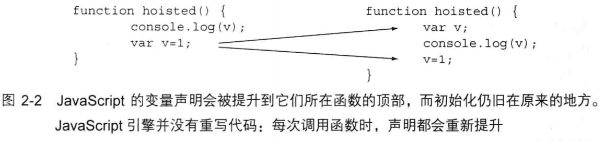

# 第2章 温故JavaScript #

## 2.1 变量作用域 ##

	var book, shopping_cart,
		apa = "Hello world!",
		purchase_book = true,
		tell_friends = true,
		give_5_star_rating_on_amazon = true,
		leave_mean_comment = false;

JavaScript 1.7、 1.8 、1.9+和块作用域

JavaScript1.7引入了let，它是一种全新的块作用域（block scope）构造器。
	
	let (prisoner = 'I am in prison!') { //“I am in prison！”
		console.log( prisoner );
	}
	console.log( prisoner ); //输出“Error：prisoner is not defined”

## 2.2 变量提升 ##
在JavaScript中，当变量被声明时，声明会被提升到它所在函数的顶部，并被赋予undefined值。这就使得在函数的任意位置声明的变量存在于整个函数中，尽管在赋值之前，它的值一直为undefined，如

y因为变量声明总是被提升到函数作用域的顶部，所以在函数的顶部声明变量总是最好的做法，更好的是使用单个var语句。

	var regular_joe = 'regular_joe is assigned';
		function prison() {
	    //输出“undefined”。regular_joe的声明被提升到函数的顶部，
	    //在查找全局作用域的regular_joe之前，会先检查这一被提升的声明。
	    console.log(regular_joe); 
	    var regular_joe;
	}
	prison()

## 2.3 高级变量提升和执行环境对象 ##
当JavaScript引擎在进入作用域时，会对代码分两轮处理。第一轮，初始化变量；第二轮，执行代码。
在第一轮，JavaScript引擎分析代码，并做了已下3件事情。
（1）声明并初始化函数参数
（2）声明局部变量，包括将匿名函数赋给一个局部变量，并不初始化他们。
（3）声明并初始化函数参数
