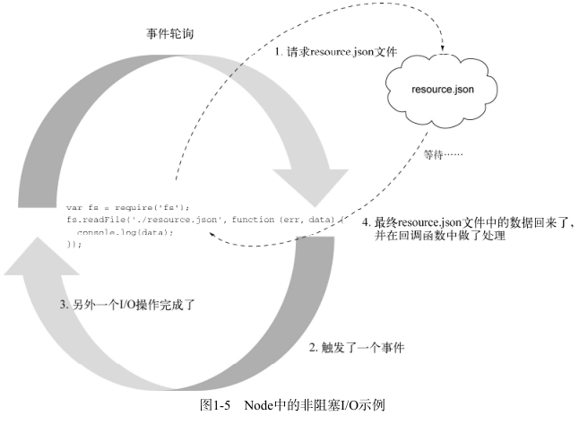

# chapter1 欢迎进入Node.js世界 #

## 1.1 构建于JavaScript之上 ##

## 1.2 异步和事件触发：浏览器 ##
Node为服务端JavaScript提供了一个事件驱动的、异步的平台。事件驱动（用事件轮询）和非阻塞的I/O处理（用异步I/O）

## 1.3 异步和事件触发： 服务器 ##

	$result = mysql_query("SELECT * FROM myTable");
	print_r($result);
在数据库查询完成之前程序不会继续执行。

这段代码做了些I/O操作，并且在所有数据回来之前，这个进程会被阻塞。

如果程序在I/O上阻塞了，当有更多请求过来时，服务器会怎么处理呢？在这种情景中通常会用多线程的方式。一种常见的实现是给每个连接分配一个线程，并为那些连接设置一个线程池。

## 1.4 DIRT 程序 ##
Node所针对的应用程序有一个专门的简称：DIRT。它表示数据密集型实时（data-intensive real-time）程序。

## 1.5 默认 DIRT ##
Node从构建开始就有一个事件驱动和异步的模型。JavaScript从来没有过标准的I/O库，那是服务端语言的常见配置。对于JavaScript而言，这总是由“宿主”环境决定的。JavaScript最常见的宿主环境，也是大多数开发人员所用的，就是浏览器，它是事件驱动和异步的。

Node重新实现了宿主中那些常用的对象，尽量让浏览器和服务器保持一致，比如：

* 计时器API（比如 setTimeout ）
* 控制台API（比如 console.log ）
* 
其中包括用于HTTP、TLS、HTTPS、文件系统（POSIX）、数据报（UDP）和NET（TCP）的模块。

### 1.5.1 简单的异步程序 ###
	$.post('/resource.json', function(data) {
		console.log(data);
	});
要在Node里做一个跟这个差不多的例子，不过这次是用文件系统（fs）从硬盘中加载resource.json。

### 1.5.2 Hello World HTTP服务器 ###
Node常被用来构建服务器。下面是个简单的HTTP服务器实现，它会用“Hello World”响应所有请求：

	var http = require('http');
	http.createServer(function (req, res){
		res.writeHead(200, {'Content-Type': 'text/plain'});
		res.end('Hello World\n');
	}).listen(3000);
	console.log('Server running at http://localhost:3000');

### 1.5.3 流数据 ###
可以把数据流看成特殊的数组，只不过数组中的数据分散在空间上，而数据流中的数据*分散在时间上*的。通过将数据一块一块地传送，开发人员可以每收到一块数据就开始处理，而不用等所有数据都到全了再做处理。
	stream.on("data", function (chunk) {
	    console.log(chunk);
	});
	stream.on("end", function () {
	    console.log("finished");
	});
只要有新的数据块准备好，就会激发data事件，当所有数据块都加载完之后，会激发一个end事件。

可读和可写数据流可以连接起来形成管道，就像shell脚本中用的|（管道）操作符一样。这是一种高效的数据处理方式，只要有数据准备好就可以处理，不用等着读取完整个资源再把它写出去。

## 1.6 小结 ##
Node是：

* 构建在JavaScript之上的；
* 事件触发和异步的；
* 传为数据密集型实时程序设计的。
