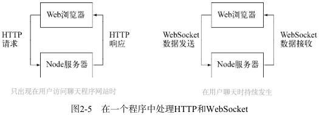
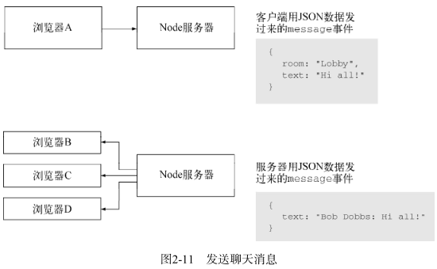

# chapter2 构建有多个房间的聊天室程序 #

## 2.1 程序概览 ##
表明了Node如何同时处理传统的HTTP数据（比如静态文件）和实时数据（聊天消息）

## 2.2 程序需求及初始设置 ##
为了提供静态文件，需要使用Node内置的 http 模块。但通过HTTP提供文件时，通常不能只
是发送文件中的内容，还应该有所发送文件的类型。也就是说要用正确的MIME类型设置HTTP
头的 Content-Type 。

### 2.2.1 提供HTTP和WebSocket服务 ###

### 2.2.2 创建程序的文件结构 ###
lib子目录，用来放一些服务端逻辑

public子目录，用来放客户端文件，在public子目录下，创建一个javascripts子目录和stylesheets目录。

### 2.2.3 指明依赖项 ###
package.json文件用于描述你的应用程序，它包含一些JSON表达式，并遵循CommonJS包描述标准。在package.json文件中可以定义很多事情，但最
重要的是程序的名称、版本号、对程序的描述，以及程序的依赖项。

### 2.2.4 安装依赖项 ###
Node包管理器（npm，https://github.com/isaacs/npm）是Node自带的工具。它用一行命令就能从package.json文件中读出依赖项，把它们都装好。

## 2.3 提供HTML、CSS和客户端JavaScript ##
聊天程序需要具备三个基本功能：

* 给用户的Web浏览器提供静态文件；
* 在服务器端处理与聊天相关的消息；
* 在用户的Web浏览器中处理与聊天相关的消息。
### 2.3.1 创建静态文件服务器 ###
创建静态文件服务器既要用到Node内置的功能，也要用到第三方的mime附加模块来确定文件的MIME类型。

#### 1.发送文件数据及错误响应 ####
问内存（RAM）要比访问文件系统快得多，所以Node程序通常会把常用的数据缓存到内
存里。我们的聊天程序就要把静态文件缓存到内存中，只有第一次访问的时候才会从文件系统中
读取。下一个辅助函数会确定文件是否缓存了，如果是，就返回它。如果文件还没被缓存，它会
从硬盘中读取并返回它。如果文件不存在，则返回一个HTTP 404错误作为响应。

## 2.4 用 Socket.IO 处理与聊天相关的消息 ##
Socket.IO为Node及客户端JavaScript提供了基于WebSocket以及其他传输方式的封装，它提供了一个抽象层。如果浏览器没有实现WebSocket，Socket.IO会自动启用一个备选方案，而对外提供的API还是一样的。

* 简要介绍下Socket.IO，并确定要在服务器端实用的Socket.IO功能；
* 添加代码设置Socket.IO服务器；
* 添加代码处理各种聊天程序的事件。
Socket.IO提供了开箱即用的虚拟通道

Socket.IO还是事件发射器（Event Emitter）的好例子。事件发射器本质上是组织异步逻辑的一种很方便的设计模式。

### 2.4.1 设置Socket.IO服务器 ###
server.js。第一行加载一个定制的Node模块，它提供的逻辑是用来处理基于Socket.IO的服务端

#### 确立连接逻辑 ####

### 2.4.2 处理程序场景及事件 ###

#### 1.分配昵称 ####
要添加的第一个辅助函数是assignGuestName，用来处理新用户的昵称。
#### 2.进入聊天室 ####
要添加到chat_server.js中的第二个辅助函数是joinRoom。

3.处理昵称变更请求

4.发送聊天消息
用户昵称没问题了，现在需要加个函数处理用户发过来的聊天消息。

5.创建房间

## 2.5 在程序的用户界面上使用客户端JavaScript ##
在服务端分发浏览器发来的消息的Socket.IO逻辑已经加上了，现在该添加跟服务器通信所需要的客户端JavaScript了。

客户端JavaScript需要实现以下功能：
* 向服务器发送用户的消息和昵称/房间变更请求；
* 显示其他用户的消息，以及可用房间的列表。

### 2.5.1 将消息和昵称/房间变更请求给服务器 ###
要添加的第一段客户端JavaScript代码是一个JavaScript原型对象，用来处理聊天命令、发送消息、请求变更房间或昵称。

在public/javascripts目录下创建一个chat.js文件，把下面的代码放进去。

## 2.6 小结 ##
