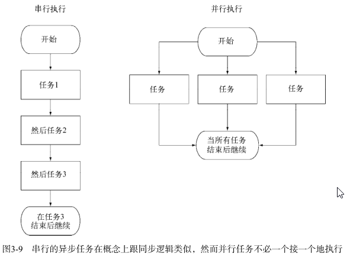

# chapter3 Node编程基础 #

## 3.1 Node功能的组织和重用 ##

### 3.1.1 创建模块 ###
典型的模块是一个包含exports对象属性定义的文件，这些属性可以是任意类型的数据，比如：字符串、对象和函数。

### 3.2.1 用回调处理一次性事件 ###
回调是一个函数，它被当作参数传给异步函数，它描述了异步操作完成之后要做什么。
template.html

### 3.2.2 用事件发射器处理重复性事件 ###

	socket.on("data", handleData);

#### 1. 事件发射器示例 ####
echo服务器就是个处理重复性事件的简单例子。当你给它发送数据时，它会把那个数据发回来。

	var net = require("net");
	
	var server = net.createServer(function(socket){
		socket.on("data", function(data){
			socket.write(data);
		});
	});	
	server.listen(8888);

#### 2.响应只应该发生一次的事件 ####
监听器可以被定义成持续不断地响应事件。

用 once 方法响应单次事件

#### 3. 创建事件发射器：一个PUB/SUB的例子 ####

#### 4. 扩展事件监听器：文件监视器 ####
如果你想在事件发射器的基础上构建程序，可以创建一个新的JavaScript类的继承事件发射器。

	function Watcher(watchDir, processedDir) {
		this.watchDir = watchDir;
		this.processedDir = processdDir;
	}

### 3.2.3 异步开发的难题 ###
事件轮询的条件、程序变量，以及其他随着程序逻辑执行而发生变化的资源。
	
	function asyncFunction(callbaack) {
		setTimeout(ballback, 200);
	}
	var color = "blue";

	(function(color) { 
		asyncFunction(function() {
			console.log("The color is " + color)'
		})
	})(color);
	color = "green";

## 3.3 异步逻辑的顺序化 ##
在异步程序的执行过程中，有些任务可能会随时发生，跟程序中的其他部分在做什么没有关系。

### 3.3.1 什么时候使用串行流程控制 ###
可以使用回调让几个异步任务按顺序执行，单如果任务很多，必须组织一下，否则过多的回调嵌套会把代码搞得很乱。
	
	setTimeout(function(){
		console.log("first");
		setTimeout(function(){
			console.log("next");
			setTimeout(function(){
				console.log("last");
			}, 100);
		}, 500);
	}, 1000);

你也可以用Nimble这样的流程控制工具执行这些任务。Nimble用起来简单直接，并且
它的代码量很小（经过缩小化和压缩后只有837个字节）。下面这个命令是用来安装Nimble的：

	var flow = require("nimble");
	
	flow.series([
		function(callback){
			setTimeout (function(){
				console.log("first");
				callback();
			}, 1000);
		},
		function(callback){
			setTimeout (function(){
				console.log("next");
				callback();
			}, 500);
		},
		function(callback){
			setTimeout (function(){
				console.log("last");
				callback();
			}, 100);
		}
		]);

### 3.3.2 实现串行化流程控制 ###

### 3.3.3 实现并行化流程控制 ###
让异步并行执行，仍然是要把任务放到数组中，但任务的存放顺序无关紧要。

### 3.3.4 利用社区里的工具 ###

## 3.4 小结 ##

