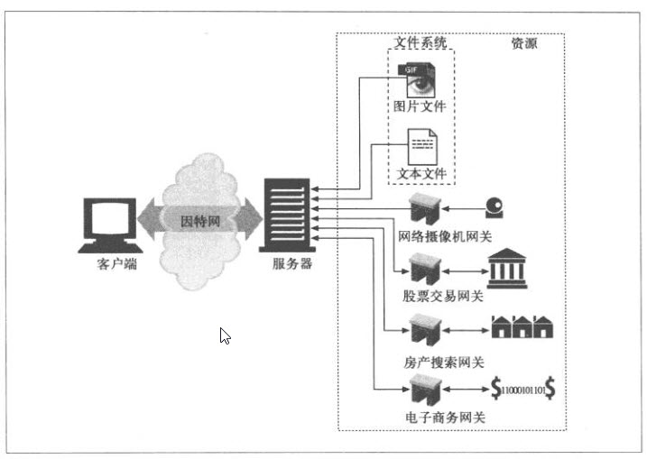
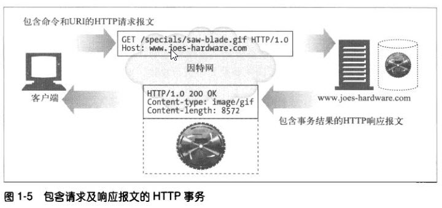

# 第1章 HTTP概述 #

## 1.1 HTTP——因特网的多媒体信使 ##
HTTP使用的是可靠的数据传输协议。

## 1.2 Web客户端和服务器 ##
Web内容都是存储在Web服务器上的。Web服务器所使用的是HTTP协议，因此进程会被称为HTTP服务器。

## 1.3 资源 ##
Web服务器是Web资源（Web resource）的宿主。Web资源是Web内容的源头。最简单的Web资源就是Web服务器文件系统中的静态文件。

图1-2 所有能够提供Web内容的东西都是Web资源

### 1.3.1 媒体类型 ###
Web服务器会为所有HTTP对象数据附加一个MIME类型。当Web浏览器从服务器中取回一个对象时，会去查看相关的MIME类型，看看它是否知道应该如何处理这个对象。

MIME类型是一种文本标记，表示一种主要的对象类型和一个特定的子类型，中间由一条斜杠来分隔。

### 1.3.2 URI ###
服务器资源名被称为 统一资源标识符（Uniform Resource Identifier， URI）。

### 1.3.3 URL ###
统一资源定位符（URL）是资源标识符最常见的形式。

* URL的第一部分被称为方案（scheme），说明访问资源所使用的协议类型。这通常就是HTTP协议（http://）。
* 第二部分给出了服务器的因特网地址（比如，www.joes-hardware.com）。
* 其余部分指定了Web服务器上的某个资源（比如，/specials/saw-blade.gif）。

### 1.3.4 URN ###
URI的第二种形式就是统一资源名（URN）。

## 1.4 事物 ##
一个HTTP事务由一条（从客户端发往服务器的）请求命令和一个（从服务器发回客户端的）响应结果组成。

### 1.4.1 方法 ###
HTTP支持几种不同的请求命令，这些命令被称为HTTP方法（HTTP method）。

|:-----|-----:|
| HTTP方法 | 描述 |
| GET | 从服务器向客户端发送命名资源 |
| PUT | 将来自客户端的数据存储到一个命名的服务器资源中去 |
| DELETE | 从服务器中删除命名资源 |
| POST | 将客户端数据发送到一个服务器网关应用程序 |
| HEAD | 仅发送命名资源响应中的HTTP首部 |

### 1.4.2 状态吗 ###
每条HTTP响应报文返回时都会携带一个状态码。状态码是一个三位数字的代码，告知客户端请求是否成功，或者是否需要采取其他动作。

表1-3 一些常见的HTTP状态码
|:-----|-----:|
| HTTP状态码 | 描述 |
| 200 | OK。文档正确返回 |
| 302 | Redirect(重定向)。到其他地方去获取资源 |
| 404 | Not Found(没找到)。无法找到这个资源 |

### 第2章 URL与资源 ###

### 第3章 HTTP报文 ###

### 第4章 连接管理 ###

## 第二部分 HTTP结构 ##

### 第5章 Web服务器 ###

### 第6章 代理 ###

### 第7章 缓存 ###

### 第8章 集成点：网关、隧道及中继 ###

### 第9章 Web机器人 ###

### 第10章 HTTP-NG ###

## 第三部分 识别、认证与安全 ##

### 第11章 客户端识别与cookie机制 ###

### 第12章 基本认证机制 ###

### 第13章 摘要认证 ###

### 第14章 安全HTTP ###

## 第四部分 实体、编码和国际化 ##

### 第15章 实体和编码 ###

### 第16章 国际化 ###

### 第17章 内容协商与转码 ###

## 第五部分 内容发布与分发 ##

### 第18章 Web主机托管 ###

### 第19章 发布系统 ###

### 第20章 重定向与负载均衡 ###

### 第21章 日志记录与使用情况跟踪 ###

