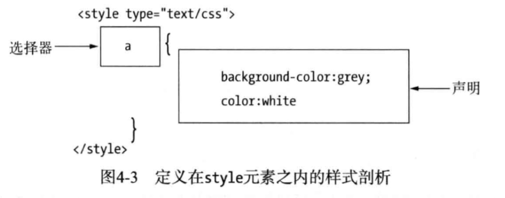

# 第4章 初探CSS #
CSS（层叠样式表）用来规定HTML文档的呈现形式（外观和格式编排）。

## 4.1 定义和应用样式 ##
CSS样式由一条或多条以分号隔开的样式声明组成。每条声明包含着一个CSS属性和该属性的值，二者以冒号分隔。

代码清单4-1 一条简单的CSS样式
	
	background-color: grey; color:white
	background-color 属性
	grey 值
	background-color: grey 声明

### 4.1.1 了解本章所用的CSS属性 ###
| 属性        | 说明|
| ------------- |:-------------:|
| background-color | 设置元素的背景颜色|
| border    	   | 设定围绕元素的边框|
| color | 设置元素的前景颜色|
| font-size| 设置元素文字的字号|
| height| 设置元素高度 |
| padding| 设定元素内容与边框之间的间距|
| text-decoration| 设置元素文字的装饰效果，如本章用的下划线|
| width| 设置元素的宽度|

### 4.1.2 使用元素内嵌样式 ###

### 4.1.3 使用文档内嵌样式 ###
用style元素（而不是style属性）定义文档内嵌样式，通过CSS选择器指示浏览器应用样式。

代码清单4-3 使用style元素
	
	

代码清单4-4 使用style元素内定义多条样式
	
	

### 4.1.4 使用外部样式表 ###

#### 1.从其他样式表中导入样式 ####
可以用@import语句将样式从一个样式表导入另一个样式表。

	@import "style.css";
	span {
		border: medium black dashed;
		padding: 10px;
	}
	一个样式表中想要导入多少别的样式表都行，为每个样式表使用一条@import语句即可。

#### 2.声明样式表的字符编码 ####
在CSS样式表中出现在@import语句之前的只有@charset语句。后者用于声明样式表使用的字符编码。
## 4.2 样式的层叠和继承 ##

### 4.2.1 浏览器样式 ###

### 4.2.2 用户样式 ###

### 4.2.3 样式如何层叠 ###
（1）元素内嵌
（2）文档内嵌
（3）外部样式
（4）用户样式
（5）浏览器样式

### 4.2.4 用重要样式调整层叠次序 ###
把样式属性值标记为重要（important），可以改变正常的层叠次序。

### 4.2.5 根据具体成都和定义次序解决同级样式冲突 ###
如果有两条定义于同一层次的样式都能应用于同一个元素，而且它们都包含着浏览器要查看的CSS属性值，这时就需要另加砝码助天平上持平的双方一决高下。

样式的具体成都通过统计三类特征得出：

1. 样式的选择器中id值的数目； a
2. 选择器中其他属性和伪类的数目； b
3. 选择器中元素名和为元素的数目。 c

[代码样式](code/4_14.html)

评定具体程度时按a-b-c的形式，生成一个数字，如果对某个样式算出的a值最大，那么它就是具体程度最高的那个。只有a值相等时浏览器才会比较b值，此时b值较大的样式具体程度更高。只有a值和b值都分别相等时浏览器才会考虑c值。如：1-0-0这个得分比0-5-5这个得分代表的具体程度更高。

### 4.2.6 继承 ###
与元素外观（文字颜色、字体等）相关的样式会呗继承；与元素再页面上的布局相关的样式不会被继承。再样式中使用inherit这个特别设立的值可以强行实施继承。

## 4.3 CSS中的颜色 ##

## 4.4 CSS中的长度 ##
width属性（元素的宽度）和font-size属性（元素内容的字号）

### 4.4.1 绝对长度 ###
in 英寸 cm 厘米 mm毫米 pt磅 pc pica

### 4.4.2 相对长度 ###
em 与元素字号挂钩 ex 与元素字体的“x高度”挂钩 rem 与根元素的字号挂钩 CSS像素（假定显示设备的分辨率与96dpi） % 另一属性的值的百分比

#### 1. 与字号挂钩的相对单位 ####

	height: 2em
意思是p元素在屏幕上显示出来的高度应为字号的两倍。

rem单位根据html元素（文档的根元素）的字号而定

#### 2. 像素单位的问题 ####
主流平台把1像素视为1英寸的1/96。CSS像素原本是个相对单位，但在实际使用中却变成了绝对定位，因此不是很灵活，em单位更加灵活

#### 3. 百分比单位 ####
可以把一个度量单位表示为其他属性值的百分比，这正是%单位的用途。

PS 
1. 并非所有属性都能使用这个单位。
2. 二是对于能用百分比单位的属性，百分比挂钩的其他属性各不相同。

#### 4. 未获广泛支持的CSS属性 ####

#### 5.用算式作值 ####

## 4.5 其他CSS单位 ##

### 4.5.1 使用CSS角度 ###
角度 deg（度） grad（百分度） rad（弧度） turn（圆周）
### 4.5.2 使用CSS时间 ###
时间 s，ms

## 4.6 测试CSS特性的支持情况 ##

## 4.7 有用的CSS工具 ##

### 4.7.1 浏览器样式报告 ###

### 4.7.2 用SelectorGadget生成选择器 ###

### 4.7.3 用LESS改进CSS ###

### 4.7.4 使用CSS框架 ###

## 4.8 小结 ##

