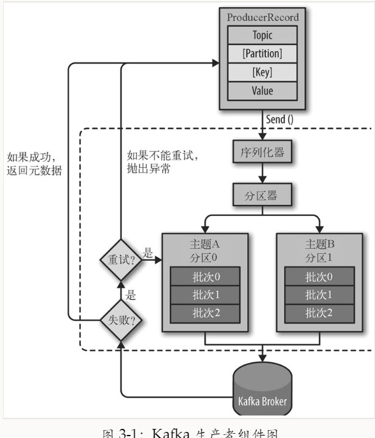

# Kafka权威指南 #

## 第1章 初识Kafka ##

### 1.1 发布与订阅消息系统 ###

发布与订阅系统一般会有一个broker，也就是发布消息的中心点。

#### 1.1.1 如何开始 ####

#### 1.1.2 独立的队列系统 ####

### 1.2 Kafka登场 ###

分布式提交日志

#### 1.2.1 消息和批次 ####

#### 1.2.2 模式 ####

#### 1.2.3 主题和分区 ####

Kafka的消息通过主题进行分类。主题可以被分位若干个分区

#### 1.2.4 生产者和消费者 ####

#### 1.2.5 broker和集群 ####

### 1.3 为什么选择kafka ###

#### 1.3.1 多个生产者 ####

#### 1.3.2 多个消费者 ####

#### 1.3.3 基于磁盘的数据存储 ####

#### 1.3.4 伸缩性 ####

#### 1.3.5 高性能 ####

### 1.4 数据生态系统 ###

## 第2章 安装Kafka ##

### 2.1 要事先行 ###

#### 2.1.1 选择操作系统 ####

#### 2.1.2 安装Java ####

#### 2.1.3 安装Zookeeper ####

### 2.2 安装Kafka Broker ###

### 2.3 broker配置 ###

#### 2.3.1 常规配置 ####

**1. broker.id**

**2. port**

**3. zookeeper.connect**

#### 2.3.2 主题的默认配置 ####

### 2.4 硬件选择 ###

#### 2.4.1 磁盘吞吐量 ####

#### 2.4.2 磁盘容量 ####

#### 2.4.3 内存 ####

#### 2.4.4 网络 ####

#### 2.4.5 CPU ####

### 2.5 云端的Kafka ###

### 2.6 Kafka集群 ###

#### 2.6.1 需要多少个broker ####

一个Kafka集群需要多少个broker取决的因素。

1. 需要多少磁盘空间来保留数据
2. 集群处理请求的能力。

如果单个broker的网络接口在高峰时段可以达到80%的使用量，并且有两个消费者，那么消费者就无法保持峰值，除非有两个broker。如果集群启用了复制功能，则要把这个额外的消费者考虑在内。因磁盘吞吐量低和系统内存不足造成的性能问题，也可以通过扩展多个broker来解决。

#### 2.6.2 broker配置 ####

## 第3章 Kafka生产者——向Kafka写入数据 ##

### 3.1 生成者概览 ###

记录用户的活动（用于审计和分析）、记录度量指标、保存日志消息、记录智能家电的信息、与其他应用程序进行异步通信、缓冲即将写入到数据库的数据

创建一个ProducerRecord对象开始，ProducerRecord对象需要包含目标主题和要发送的内容。指定键和分区。在发送ProducerRecord对象时，生产者要先把键和值对象序列化成字节数组。

数据被传给分区器。如果之前在ProducerRecord对象里指定了分区，那么分区器就不会再做任何事情，直接把指定的分区返回。如果没有指定分区，那么分区器会根据ProducerRecord对象的键来选择一个分区。

### 3.2 创建Kafka生产者 ###

**bootstrap.servers**

指定broker的地址清单，地址的格式为host:port

**key.serializer**

broker希望接收到的消息的键和值都是字节数组。生产者接口允许使用参数化类型，因此可以把Java对象作为键和值发送给broker。

key.serializer必须被设置为一个实现了org.apache.kafka.comcom.serialization.Serializer接口的类。

ByteArraySerializer（很少做）、StringSerializer和IntegerSerializer

**value.serializer**

*发送并忘记（fire-and-forget）*

不关心是否正常到达

*同步发送*

send()方法发送消息，返回一个Future对象。调用get()方法进行等待。

*异步发送*

调用send()方法，并指定一个回调函数，服务器在返回响应时调用该函数。

### 3.3 发送消息到Kafka ###

1. 生产者的send()方法将ProducerRecord对象作为参数。
2. 发送ProducerRecord对象。消息先是被放进缓冲区，然后使用单独的线程发送到服务器端。send()方法会返回一个包含RecordMetadata的Future对象。
3. SerialazationException（说明序列化消息失败）、BufferExhaustedException或TimeoutException（说明缓冲区已满），又或者是InterupException（说明发送线程被中断）

#### 3.3.1 同步发送消息 ####

1. producer.send()方法先返回一个Future对象，

### 3.4 生产者的配置 ###

#### 1. acks ####

acks参数指定了必需要有多少个分区副本收到消息，生产者才会认为消息写入是成功的。这个参数对消息丢失的可能性有重要影响。

* acks = 0，生产者在成功写入消息之前不会等待任何来自服务器的响应。生产者不需要等待服务器的响应，
* acks = 1，只要集群的首领节点收到消息，生产者就会收到一个来自服务器的成功响应。
* acks = all，只有当所有参与复制的节点全部收到消息时，生产者才会收到一个来自服务器的成功响应。

#### 2. buffer.memory ####

#### 3. compression.type ####

#### 4. retries ####

#### 5. batch.size ####

#### 6. linger.ms ####

#### 7. client.id ####

可以时任意的字符串。

#### 8. max.in.flight.requests.per.connection ####

#### 9. timeout.ms、request.timeout.ms和metadata.fetch.timeout.ms ####

* timeout：指定了broker等待同步副本返回消息的确认的时间，与asks的配置相匹配
* request.timeout.ms：生产者在发送数据时等待服务器返回响应的时间
* metadata.fetch.timeout.ms：指定了生产者在获取元数据（比如目标分区的首领是谁）时等待服务器返回响应的时间。

#### 10. max.block.ms ####

send()方法、partitionsFor()方法获取元数据时生产者的阻塞时间。

当生产者的发送缓冲区已满或者没有可用的元数据时，这些方法就会阻塞。在阻塞时间达到max.blokc.ms时，生产者会抛出超时异常。

#### 11. max.request.size ####

该参数用于控制生产者发送的请求大小（指能发送的单个消息的最大值，也可以指单个请求里所有消息总的大小）

生产者和消费者配置最好可以匹配，避免生产者发送的消息被broker拒绝。

#### 12. receive.buffer.bytes和send.buffer.bytes ####

这两个参数分别指定了TCP socket接收和发送数据包的缓冲区大小。如果被设为-1，就使用操作系统的默认值

如果生产者或消费者与broker处于不同的数据中心，那么可以适当增大这些值，因为跨数据中心的网络一般都有比较高的延迟和比较低的带宽。

### 3.5 序列化器 ###

创建一个生产者对象必须指定序列化器。

#### 3.5.1 自定义序列化器 ####

强烈建议使用通用的序列化框架

#### 3.5.2 使用Avro序列化 ####

