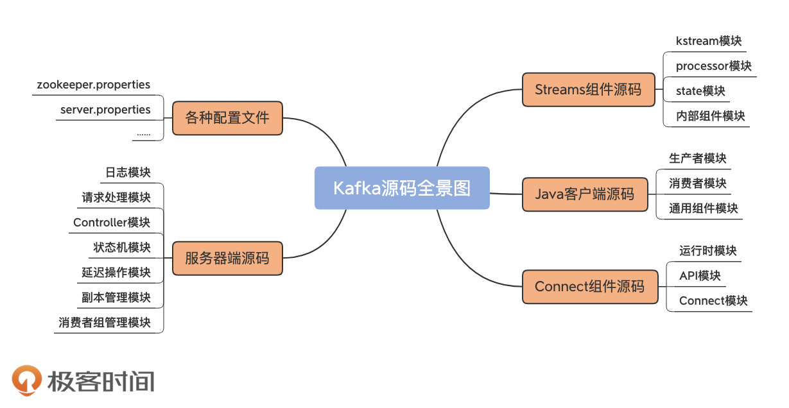
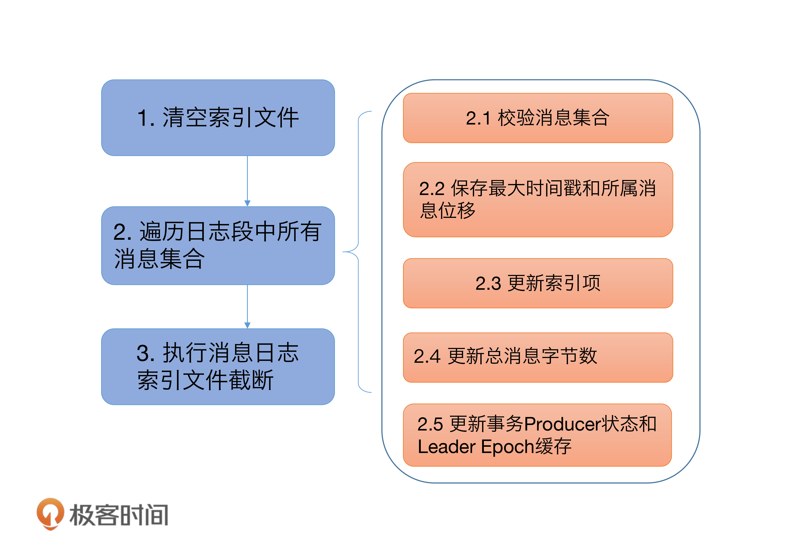
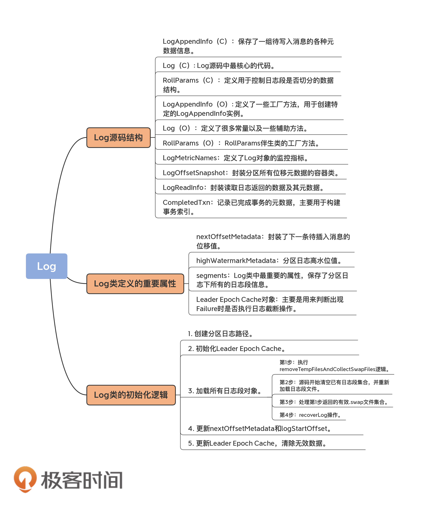

# Kafka核心源码解读 #

#### 课前必学  ####

## 开篇词 | 阅读源码，逐渐成了职业进阶道路上的“必选项” ##

### 为什么要读源码？ ###

* 棘手的问题都要借助源码才能解决
* *阅读源码正在从“加分项”向“必选项”转变，掌握优秀的框架代码实现从 NICE-TO-DO 变成了 MUST-DO。*
	1. 可以帮助你更深刻地理解内部设计原理，提升你的系统架构能力和代码功力。借鉴其优秀的设计理念，提升你在其他框架上的系统架构能力。Kafka 有许多很棒的设计理念和特性，在文档中并未得到充分的阐述。
	2. 可以帮你快速定位问题并制定调优方案，减少解决问题的时间成本。提前避“坑”。
	3. 你还能参加 Kafka 开源社区，成为一名代码贡献者（Contributor）。

### 如何用最短的时间掌握最核心的源码？ ###

* 自上而下
* 自下而上

将两者结合的方法其实是最高效的，即先弄明白最细小单位组件的用途，然后再把它们拼接组合起来，掌握组件组合之后的功能。

#### 具体的做法 ####

1. 确认最小单位的组件，看Kafka源码中的包结构，比如 controller、log、server 等
2. 了解了单个组件的源码结构后，可以试着切换成自上而下的方法，即从一个大的功能点入手，再逐步深入到各个底层组件的源码。

从功能上讲，Kafka 源码分为四大模块:

1. 服务器端源码：实现 Kafka 架构和各类优秀特性的基础。(精华)
2. Java 客户端源码：定义了与 Broker 端的交互机制，以及通用的 Broker 端组件支撑代码。
3. Connect 源码：用于实现 Kafka 与外部系统的高性能数据传输。
4. Streams 源码：用于实现实时的流处理功能。

## 导读 | 构建Kafka工程和源码阅读环境、Scala语言热身 ##

### 环境准备 ###

* Oracle Java 8
* Gradle 6.3
* Scala 2.13
* IDEA + Scala 插件
* Git

### 构建Kafka工程 ###

1. 下载Kafka源代码

 * bin目录
 * clients目录
 * config目录
 * connect目录
 * core目录
 * streams目录

### 搭建源码阅读环境 ###

### Scala语言热身 ###

### 总结 ###

### 课后讨论 ###

熟悉 Kafka 的话，你一定听说过 kafka-console-producer.sh 脚本。我前面提到过，该脚本位于工程的 bin 目录下，你能找到它对应的 Java 类是哪个文件吗？这个搜索过程能够给你一些寻找 Kafka 所需类文件的好思路，你不妨去试试看。

## 重磅加餐 | 带你快速入门Scala语言 ##

### Java函数式编程 ###

### 定义变量和函数 ###

日志模块

## 01 | 时间段：保存消息文件的对象是怎么实现的？ ##

*管是学习任何消息引擎，弄明白消息建模方式都是首要的问题。*

Kafka 底层日志文件为什么是 00000000000000012345.log 的命名

### Kafka日志结构概览 ###

### 日志段代码解析 ###

### 日志段类声明 ###

LogSegment的定义：

	class LogSegment private[log] (val log: FileRecords,
	                               val lazyOffsetIndex: LazyIndex[OffsetIndex],
	                               val lazyTimeIndex: LazyIndex[TimeIndex],
	                               val txnIndex: TransactionIndex,
	                               val baseOffset: Long,
	                               val indexIntervalBytes: Int,
	                               val rollJitterMs: Long,
	  val time: Time) extends Logging { … }

一个日志段包含*消息日志文件、位移索引文件、时间戳索引文件、已中止事务索引文件*等

### append方法 ###

ppend 方法接收 4 个参数，分别表示待写入消息批次中消息的*最大位移值、最大时间戳、最大时间戳对应消息的位移以及真正要写入的消息集合*。

#### 第一步： ####

#### 第二步： ####

#### 第三步： ####

#### 第四步： ####

#### 第五步： ####

### read 方法 ###

### recover 方法 ###

用于恢复日志段——Broker 在启动时会从磁盘上加载所有日志段信息到内存中，并创建相应的 LogSegment 对象实例。

recover 开始时，代码依次调用索引对象的 reset 方法清空所有的索引文件，之后会开始遍历日志段中的所有消息集合或消息批次（RecordBatch）。对于读取到的每个消息集合，日志段必须要确保它们是合法的，这主要体现在两个方面：

1. 该集合中的消息必须要符合 Kafka 定义的二进制格式；
2. 该集合中最后一条消息的位移值不能越界，即它与日志段起始位移的差值必须是一个正整数值。

### 总结 ###

Kafka 日志段源码进行了重点的分析，包括日志段的 append 方法、read 方法和 recover 方法。

1. append 方法：
2. read 方法：
3. recover 方法：会读取日志段文件，然后重建索引文件。这个操作在执行过程中要读取日志段文件。因此，如果环境上有很多日志段文件，你又发现 Broker 重启很慢，那你现在就知道了，这是因为 Kafka 在执行 recover 的过程中需要读取大量的磁盘文件导致的。你看，这就是我们读取源码的收获。

### 课后讨论 ###

如果你查看日志段源码的话，你会发现，还有一个比较重要的方法我没有提到，那就是 truncateTo 方法，这个方法会将日志段中的数据强制截断到指定的位移处。该方法只有 20 几行代码，我希望你可以自己去阅读下，然后思考这样一个问题：如果指定的位移值特别特别大，以至于超过了日志段本身保存的最大位移值，该方法对执行效果是怎么样的？

## 02 | 日志（上）：日志究竟是如何加载日志段的？ ##

日志是日志段的容器，里面定义了很多管理日志段的操作。

既然 Log 源码要管理日志段对象，那么它就必须先把所有日志段对象加载到内存里面。这个过程是怎么实现的呢？今天，我就带你学习下日志加载日志段的过程。

### Log源码结构 ###

#### 1. LogAppendInfo ####

#### 2. Log ####

#### 3. RollParams ####

### Log Class & Object ###

### 总结 ###

1. Log文件的源码结构：
2. 加载日志段机制：

### 课后讨论 ###

Log 源码中有个 maybeIncrementHighWatermark 方法，你能说说它的实现原理吗？

## 03 | 日志（下）：彻底搞懂Log对象的常见操作 ##

## 04 | 索引（上）：改进的二分查找算法在Kafka索引的应用 ##

## 05 | 索引（下）：位移索引和时间戳索引的区别是什么？ ##

