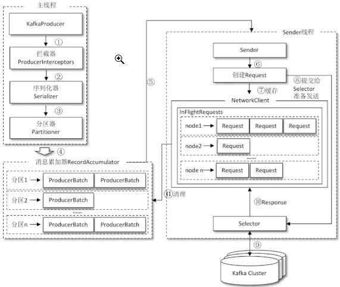
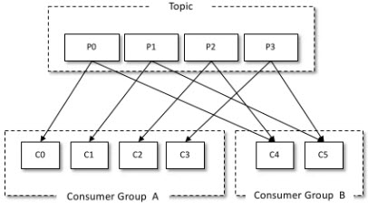

# 图解Kafka之实战指南 #

## 初识Kafka ##

消息系统：

存储系统

流式处理平台

### 基础概念 ###

offset是消息在分区中的唯一标识，Kafka通过它来保证消息在分区的顺序性，不过offset并不跨越分区，也就是说，Kafka保证的是分区有序而不是主题有序。

## Kafka入门 ##

### 安装与配置 ###

jps命令只是用来确认Kafka服务的进程已经正常启动。是否能够正确对外提供服务，还需要通过发送和消费消息进行验证。

### 生产与消费 ###

### 服务端参数配置 ###

## 3 生产者客户端开发 ##

#### 客户端开发 ####

1. 配置生产者客户端参数及创建相应的生产者实例。
2. 构建待发送的消息。
3. 发送消息
4. 关闭生产者实例。

#### 必要的参数配置 ####

* bootstrap.servers
* key.serializer和value.serializer

KafkaProducer是线程安全的，可以在多个线程中共享单个KafkaProducer实例，也可以将KafkaProducer实例进行池化来供其他线程调用。

### 消息的发送 ###

	public ProducerRecord(String topic, Integer partition, Long timestamp, 
	                      K key, V value, Iterable<Header> headers)
	public ProducerRecord(String topic, Integer partition, Long timestamp,
	                      K key, V value)
	public ProducerRecord(String topic, Integer partition, K key, V value, 
	                      Iterable<Header> headers)
	public ProducerRecord(String topic, Integer partition, K key, V value)
	public ProducerRecord(String topic, K key, V value)
	public ProducerRecord(String topic, V value)

针对不同的消息，需要构建不同的ProducerRecord对象，在实际应用中创建ProducerRecord对象是一个非常频繁的动作。

send方法本身就是异步的，但在执行send()后直接链式调用get方法来阻塞等待Kafka的响应。

RecordMetadata对象，在RecordMetadata对象里包含了消息的一些元数据信息，比如当前消息的主题、分区号、分区中的偏移量（offset）、时间戳等。

Future表示一个任务的生命周期，并提供了相应的方法来判断任务是否已经完成或取消，以及获取任务的结果和取消任务等。

KafkaProducer中一般会发生两种类型的异常：可重试的异常和不可重试的异常。常见的可重试异常有：NetworkException、LeaderNoteAvaiableException、UnknownTopicOrParitionException、NotEnoughReplicasException、NotCoordinatorException。

	producer.send(record1, callback1);
	producer.send(record2, callback2);

对于同一个分区而言，如果消息record1于record2之前先发送，那么KafkaProducer就可以保证对应的callback1在callback2之前调用。也就是说，回调函数的调用可以保证分区有序。

## 4 序列化-分区器-拦截器 ##

### 序列化 ###

org.apache.kafka.common.serialization.Serializer 接口，此接口有3个方法：

	public void configure(Map<String, ?> configs, boolean isKey)
	public byte[] serialize(String topic, T data)
	public void close()

close()一般是一个空方法，如果实现了此方法，则必须确保方法的幂等性，因为这个方法很可能会被Kafkaproducer调用多次。

**StringSerializer** 

1. configure()方法，这个方法是在KafkaProducer实例的时候调用的，主要用来确定编码类型，不过一般客户端对于key.serializer.encoding、value.serializer.encoding和serializer.encoding这几个参数都不会配置。

### 分区器 ###

消息在通过send()方法发往broker的过程中，经过拦截器（Interceptor）、序列化器（Serializer）和分区器（Partitioner）的一系列作用之后才能被真正地发往broker。

如果消息ProducerRecord中没有指定partition字段，那么就需要依赖分区器，根据key这个字段来计算partition的值。分区器的作用就是为消息分配分区。

	public int partition(String topic, Object key, byte[] keyBytes, Object value, byte[] valueBytes, Cluster cluster);
	public void close();

partition()方法用来计算分区号，返回值为int类型。partition() 方法中的参数分别表示主题、键、序列化后的键、值、序列化后的值，以及集群的元数据信息，通过这些信息可以实现功能丰富的分区器。close() 方法在关闭分区器的时候用来回收一些资源。

在默认分区器 DefaultPartitioner 的实现中，close() 是空方法，而在 partition() 方法中定义了主要的分区分配逻辑。如果 key 不为 null，那么默认的分区器会对 key 进行哈希（采用 MurmurHash2 算法，具备高运算性能及低碰撞率），最终根据得到的哈希值来计算分区号，拥有相同 key 的消息会被写入同一个分区。如果 key 为 null，那么消息将会以轮询的方式发往主题内的各个可用分区。

### 生产者拦截器 ###

两种拦截器：生产者拦截器和消费者拦截器

org.apache.kafka.clients.producer. ProducerInterceptor

	public ProducerRecord<K, V> onSend(ProducerRecord<K, V> record);
	public void onAcknowledgement(RecordMetadata metadata, Exception exception);
	public void close();

KafkaProducer在将消息序列化和计算分区之前调用生产者拦截器的onSend()方法来对消息进行相应的定制化操作 

生产者拦截器的onAcknowledgement()方法，优先于用户设定的Callback之前执行，这个方法运行在Producer的I/O线程中，所以这个方法中实现的代码逻辑越简单越好，否则会影响消息的发送速度。

指定单个拦截器，还可以指定多个拦截器形成拦截链。

## 5. 生产者客户端原理分析 ##

### 整体架构 ###

整个生产者客户端由两个线程协调运行，这两个线程分别为主线程和Sender线程（发送线程）。在主线程中由KafkaProducer创建消息，然后通过可能的拦截器、序列化器和分区器的作用缓存到消息累加器（RecordAccumulator，也称为消息收集器）中。Sender线程负责从RecordAccumulator中获取消息并将发送到Kafka中。

RecordAccumulator主要用来缓存消息以便Sender线程可以批量发送，进而减少网络传输的资源消耗以提升性能。RecordAccumulator缓存的大小可以通过生产者客户端参数buffer.memory配置，默认值未33554432B，即32MB。

主线程中发送过来的消息都会被追加到RecordAccumulator的某个双端队列（Deque）中，在RecordAccumulator的内部为每个分区都维护了一个双端队列

### 元数据的更新 ###

InFlightRequests获得leastLoadedNode，即所有Node中负载最小的那一个。这里的负载最小是通过每个Node在InFlightRequests中还未确认的请求决定的，未确定的请求越多则人为负载越大。

	ProducerRecord<String, String> record = new ProducerRecord<>(topic, "Hello, Kafka!");

KafkaProducr要将此消息追加到指定主题的某个分区所对应的leader副本之前：

1. 需要知道主题的分区数量，然后经过计算得出（或者直接指定）目标分区
2. KafkaProducer需要知道目标分区的leader副本所在的broker节点的地址、端口等信息才能建立连接
3. 最终才能发送到Kafka

元数据是指Kafka集群的元数据，这些元数据具体记录了集群中有哪些主题，哪些主题有哪些分区，每个分区的leader副本分配在哪个节点上，follower副本分配在哪些节点上，哪些副本在AR、ISR等集合中，集群中有哪些节点，控制器节点又是哪一个等信息。

## 6. 重要的生产者参数 ##

1. acks
2. max.request.size
3. retries和retry.backoff.ms
4. compression.type
5. connections.max.idle.ms
6. linger.ms
7. receive.buffer.bytes
8. send.buffer.bytes
9. request.timeout.ms

## 7 消费者与消费组 ## 

KafkaConsumer来订阅主题，并从订阅的主题中拉取消息。不过在使用KafkaConsumer消费消息之前需要先了解消费者和消费组的概念。

消费者（Consumer）负责订阅Kafka主题中的主题（Topic），并且从订阅的主题上拉取消息。与其他一些消息中间件不同的是：在Kafka的消息理念中还有一层消费组（Consumer Group）的概念，每个消费者都有一个对应的消费组。当消息发布到主题后，只会被投递给订阅它的每个消费组的一个消费者。

* 如果所有的消费者都隶属于同一个消费组，那么所有的消息都会被均衡地投递给每一个消费者，即每条消息只会被一个消费者处理，这就相当于点对点模式的应用。
* 如果所有的消费者都隶属于不同的消费组，那么所有的消息都会被广播给所有的消费者，即每条消息都会被所有消费者处理，这就相当于发布/订阅模式的应用

消费组是一个逻辑上的概念，旗下的消费者归为一类，每一个消费者只隶属于一个消费组。每一个消费组都会有一个固定的名称，消费者在进行消费前需要指定其所属消费组的名称，这个可以通过消费者客户端参数group.id来配置，默认值为空字符串。

消费者并非逻辑上的概念，是实际的实用实例，可以是一个线程，也可以是一个进程。同一个消费组内的消费者既可以在部署在同一台机器上，也可以部署在不同的机器上。

## 8. 消费者客户端开发 ##

一个正常的消费逻辑需要具备以下几个步骤：

1. 配置消费者客户端参数及创建相应的消费者实例。
2. 订阅主题
3. 拉取消息并消费
4. 提交消费位移
5. 关闭消费者实例

### 必要的参数配置 ###

* bootstrap.servers
* group.id
* key.deserializer和value.deserializer

## 9. 反序列化 ##

* public void configure(Map<String, ?>configs, boolean isKey); 用来配置当前类。
* public byte[] deserialize(String topic, byte[] data); 用来执行
* public void close():用来关闭当前序列化器

无特殊需求，不建议使用自定义的序列化器或反序列化器。增加生产者与消费者之间的耦合度，在系统升级换代的时候很容易出错。

Avro、JSON、Thrift、ProtoBuf 或 Protostuff 等通用的序列化工具来包装

## 10. 消息消费 ##

Kafka中的消息是基于拉模式的。消息的消费一般有两种模式：推模式和拉模式。推模式是服务端主动将消息推送给消费者，而拉模式是消费者主动向服务端发起请求来拉取消息。

Kafka中的消息消费是一个不断轮询的过程，消费者所要做的就是重复地调用poll()方法，而poill()返回的是所订阅的主题（分区）上的一组消息。

	public ComsumerRecords<K, V> poll(final Duration timeout)

poll(Duration)方法可以根据Duration中的ofMillis()、ofSenconds()、ofMinutes()、ofHours()等多种不同的方法指定不同的时间单位，灵活性更强。

消费者消费到的每条消息的类型为ConsumerRecord，这个和生产者发送的消息类型ProducerRecord相对应，不过ConsumerRecord中的内容更加丰富。

	public class ConsumerRecord<K, V> {
	    private final String topic; //主题的名称
	    private final int partition; //分区的编号
	    private final long offset; //分区的偏移量
	    private final long timestamp;
	    private final TimestampType timestampType;
	    private final int serializedKeySize;
	    private final int serializedValueSize;
	    private final Headers headers;
	    private final K key;
	    private final V value;
	    private volatile Long checksum;
		    //省略若干方法
	}

poll()方法的返回值类型是ConsumerRecords。

ConsumerRecords类中并没提供与partitions()类似的topics()方法来查看拉去的消息集中所包含的主题列表，如果要按照主题维度来进行消费，那么只能根据消费者订阅主题时的列表来进行逻辑处理了。

## 11. 位移提交 ##

对于Kafka的分区而言，它的每条消息都有唯一的offset，用来表示消息在分区中对应的位置。

## 12. 指定位移消费 ##

offset的概念，消费者使用offset来表示消费到分区中某个消息所在的位置。

对于消息在分区中的位置，将offset称为“偏移量”；对于消费者消费到的位置，将offset称为“位移”，有时候也称为“消费位移”

## 13. 再均衡器-拦截器 ##

## 14. 消费者多线程实现 ##

## 15. 重要的消费者参数 ##

1. fetch.min.bytes
2. fetch.max.bytes
3. fetch.max.wait.ms

## 16. 创建主题 ##

### 主题与分区 ###

主题和分区是Kafka的两个核心概念。主题作为消息的归类

### 主题的管理 ###

#### 创建主题 ####

kafka-topic.sh

	<dependency>
	    <groupId>org.apache.kafka</groupId>
	    <artifactId>kafka_2.11</artifactId>
	    <version>2.0.0</version>
	</dependency>

## 17. 分区副本的分配 ##

## 18. 查看、修改和删除主题 ##

## 19. 配置管理 ##

kafka-config.sh脚本呢是专门用来对配置进行操作的，指在运行状态下修改原有的配置，如此可以达到动态变更的目的。

kafka-config.sh脚本包含变更配置alter和查看配置describe这两种指令类型。

|entity-type 的释义|	entity-name 的释义|
|--|--|
|主题类型的配置，取值为 topics|指定主题的名称|
|broker 类型的配置，取值为 brokers|	指定 brokerId 值，即 broker 中 broker.id 参数配置的值|
|客户端类型的配置，取值为 clients|	指定 clientId 值，即 KafkaProducer 或 KafkaConsumer 的 client.id 参数配置的值|
|用户类型的配置，取值为 users|指定用户名|

## 20. 初始KafkaAdminClient ##

### 基本使用 ###

使用TopicCommand创建了一个主题，实质上与使用kafka-config.sh脚本的方式无异。

org.apache.kafka.clients.admin.KafkaAdminClient 来作为替代方案。KafkaAdminClient不仅可以用来管理broker、配置和ACL（Access Control List），还可以用来管理主题。

KafkaAdminClient 继承了 org.apache.kafka.clients.admin.AdminClient 抽象类，并提供了多种方法。

* 创建主题：CreateTopicsResult createTopics(Collection newTopics)。
* 删除主题：DeleteTopicsResult deleteTopics(Collection topics)。
* 列出所有可用的主题：ListTopicsResult listTopics()。
* 查看主题的信息：DescribeTopicsResult describeTopics(Collection topicNames)。
* 查询配置信息：DescribeConfigsResult describeConfigs(Collection resources)。
* 修改配置信息：AlterConfigsResult alterConfigs(Map<ConfigResource, Config> configs)。
* 增加分区：CreatePartitionsResult createPartitions(Map<String, NewPartitions> newPartitions)。

	NewTopic newTopic = new NewTopic(TOPIC, 4, (short)1);

用来设定所要创建的主题的具体信息，包含创建主题时需要的主题名称、分区数和副本因子等。

NewTopic中的成员变量如下：

	private final String name;	//主题名称
	private final int numPartitions; 	//分区数
	private final short replicationFactor; 	//副本因子
	private final Map<Integer, List<Integer>> replicasAssignments; 	//分配方案
	private Map<String, String> configs = null; 	//配置

----

	CreateTopicsResult result = client.
        createTopics(Collections.singleton(newTopic));

1. 客户端根据方法的调用创建相应的协议请求，比如创建主题的createTopics方法，其内部就是发送CreateTopicRequest请求。
2. 客户端将请求发送至服务端。
3. 服务端处理相应的请求并返回响应，比如这个与CreateTopicRequest请求对应的就是CreateTopicResponse
4. 客户端接收相应的响应并进行解析处理。和协议相关的请求和相应的类基本都在org.apache.kafka.common.requests包下，AbstractRequest和AbstractResponse是这些请求和响应类的两个基本父类。

返回值是CreateTopicsResult类型，CreatTopicsResult中的方法主要是针对成员变量futures的操作，futures的类型Map<String, KafkaFuiture> 

### 主题合法性验证 ###

Kafka生产环境中的auto.create.topics.enable参数会被设置为false。

Kafka broker 端有一个这样的参数：create.topic.policy.class.name，默认值为 null，它提供了一个入口用来验证主题创建的合法性。使用方式很简单，只需要自定义实现 org.apache.kafka.server.policy.CreateTopicPolicy 接口，比如下面示例中的 PolicyDemo。然后在 broker 端的配置文件 config/server.properties 中配置参数 create.topic.policy.class. name 的值为 org.apache.kafka.server.policy.PolicyDemo，最后启动服务。

## 21. 优先副本的选举 ##

## 27 常用管理工具 ##

## 34. Kafka与Spark Streaming的整合 ##

## 35. Kafka与Structured Streaming的整合 ##

## 36 写在最后 ##

